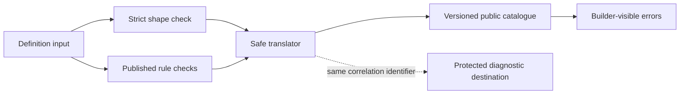

# Definition validation error author guide

[Contract index](README.md) · [Data-contract specification](../docs/specification/appendices/data-contracts.md#definition-validation-errors) · [Issue #13](https://github.com/Abzum-NZ/Abzum-Vortex/issues/13)

This guide explains how a definition validator returns useful errors without exposing raw definition content or protected diagnostics. The catalogue and translator are generic platform contracts. They do not know which applications, modules, record types, fields, workflows, connections, or example fixtures are installed. The snake-case documents below are exercised through the test-only fixture schema; [issue #15](https://github.com/Abzum-NZ/Abzum-Vortex/issues/15) owns the complete production authored-source schema and conversion into canonical contracts.

## Public flow



The public response contains only:

- catalogue version;
- stable error code;
- catalogue-owned plain message and guidance;
- correlation identifier;
- optional safe location made from definition kind and builder-visible keys supplied by the caller.

It never copies a schema message, submitted value, display label, raw object path, internal identifier, stack, query, credential, or protected diagnostic.

## Translating strict schema failures

Pass the original `ZodError` to `translateDefinitionSchemaError`. Supply the correlation identifier, a safe root location, and only the explicit raw-path-to-safe-location mappings the builder is allowed to see. An unmapped raw path resolves to the safe document root; the translator never guesses a builder key from a raw path.

If a strict schema uses `invalid_type` for both absent and wrong-typed values, list known required source paths in `requiredPaths`. The translator then emits `definition_required_value` for those paths without parsing Zod's human-readable message. Other `invalid_type` issues become `definition_invalid_value`.

## Translating rule failures

The validator owned by [issue #15](https://github.com/Abzum-NZ/Abzum-Vortex/issues/15) emits `DefinitionRuleFailure` values. Each value contains only a namespaced internal rule code, one closed failure family, and an optional already-safe location. Pass the values to `translateDefinitionRuleFailures`; do not create public messages in a rule runner.

Several internal rules may produce the same public error at the same safe location. The translator removes those duplicates and orders the remaining errors deterministically by location and catalogue order.

## Author example

This complete source document has one deliberate error: it omits the required `allowed_hosts` value.

```json
{
  "schema_version": "2.0.0",
  "kind": "connection_type",
  "root_id": "example_connection",
  "key": "example.connection",
  "version": "1.0.0",
  "revision": 1,
  "state": "published",
  "content_fingerprint": "fixture:example.connection:1.0.0",
  "body": {
    "name": "Example connection",
    "purpose": "Submit a typed request to an approved example provider.",
    "provider": "Example provider",
    "authentication": {
      "kind": "signed_secret",
      "secret_fields": ["signing_secret"],
      "algorithm": "hmac_sha256"
    },
    "allow_redirects": false,
    "shapes": [
      { "key": "request", "fields": [{ "key": "value", "type": "text", "required": true }] },
      { "key": "receipt", "fields": [{ "key": "accepted", "type": "boolean", "required": true }] }
    ],
    "operations": [
      {
        "key": "submit",
        "method": "POST",
        "path": "/submit",
        "input": "request",
        "output": "receipt",
        "timeout_seconds": 10,
        "max_attempts": 2,
        "maximum_response_bytes": 1000000
      }
    ],
    "incoming_messages": []
  }
}
```

After the caller maps the schema location to an authorised builder-visible location, the public result is:

```json
{
  "catalogueVersion": "1.0.0",
  "correlationId": "00000000-0000-4000-8000-000000000013",
  "errors": [
    {
      "catalogueVersion": "1.0.0",
      "code": "definition_required_value",
      "message": "A required value is missing.",
      "guidance": "Provide the required value and validate the definition again.",
      "correlationId": "00000000-0000-4000-8000-000000000013",
      "location": {
        "documentKind": "connection_type",
        "documentKey": "example.connection",
        "segments": [{ "kind": "setting", "key": "allowed_hosts" }]
      }
    }
  ]
}
```

The corrected document adds the required value and passes the strict test-only fixture-source schema:

```json
{
  "schema_version": "2.0.0",
  "kind": "connection_type",
  "root_id": "example_connection",
  "key": "example.connection",
  "version": "1.0.0",
  "revision": 1,
  "state": "published",
  "content_fingerprint": "fixture:example.connection:1.0.0",
  "body": {
    "name": "Example connection",
    "purpose": "Submit a typed request to an approved example provider.",
    "provider": "Example provider",
    "authentication": {
      "kind": "signed_secret",
      "secret_fields": ["signing_secret"],
      "algorithm": "hmac_sha256"
    },
    "allowed_hosts": ["api.example.test"],
    "allow_redirects": false,
    "shapes": [
      { "key": "request", "fields": [{ "key": "value", "type": "text", "required": true }] },
      { "key": "receipt", "fields": [{ "key": "accepted", "type": "boolean", "required": true }] }
    ],
    "operations": [
      {
        "key": "submit",
        "method": "POST",
        "path": "/submit",
        "input": "request",
        "output": "receipt",
        "timeout_seconds": 10,
        "max_attempts": 2,
        "maximum_response_bytes": 1000000
      }
    ],
    "incoming_messages": []
  }
}
```

The example key is illustrative caller data. It is not a built-in definition name and the translator never supplies it.

## Adding or changing an error

1. Confirm the failure cannot use an existing public code without losing useful author guidance.
2. Add the code, catalogue entry, order, message, and guidance together in `validation-errors.ts`.
3. Add the matching closed rule-failure family only when a rule runner must emit it.
4. Add representative, adversarial, order, duplicate, and information-exposure tests.
5. Treat changed public wording or meaning as a versioned contract change; never silently rewrite an existing catalogue version.

Do not include a submitted value or a resource-specific noun in catalogue text. The safe location tells an authorised builder where to look; the protected diagnostic destination keeps deeper evidence under the same correlation identifier for authorised support.

## Failure behaviour

An unknown future schema issue and a malformed rule handoff return `definition_validation_failed`. A protected diagnostic destination may receive the raw failure, but an unavailable or throwing destination cannot change the public result. Translation itself has no database, browser, Supabase, Kestra, or network dependency.
