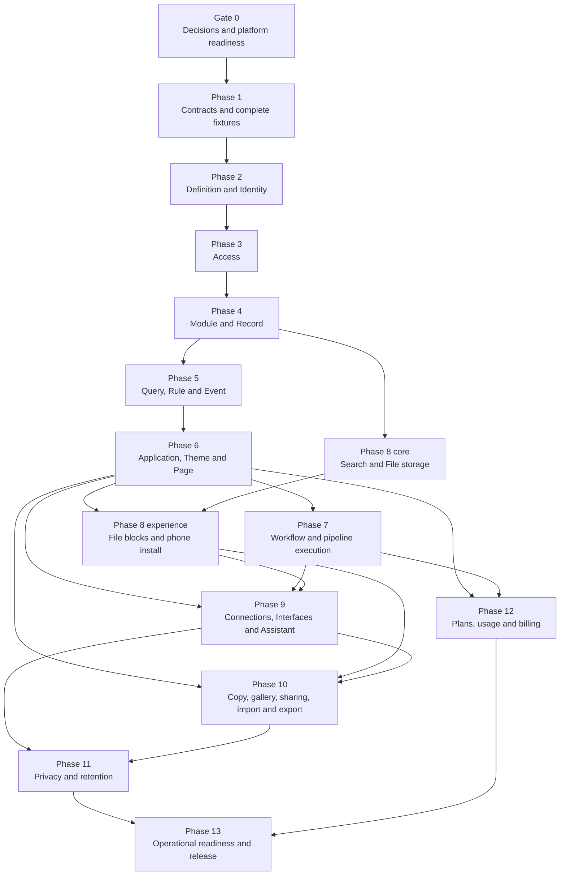

# Abzum Vortex revised build plan

**Status:** Review draft 2.0

**Date:** 1 September 2026

**Governing specification:** [Abzum Vortex platform specification](../specification/README.md)

**Delivery board:** [Vortex GitHub Project](https://github.com/orgs/Abzum-NZ/projects/2/views/1)

This plan replaces the sequencing of the earlier [Build Plan](https://claude.ai/code/artifact/58852ead-2acc-4ca6-a693-6cb03705bcef). It keeps the useful ownership boundaries while correcting missing dependencies, an impossible background-worker assumption, incomplete fixtures, and an oversized final phase.

No phase may treat an open blocking choice in the [decision register](../specification/appendices/decisions.md) as settled.

## Planning rules

1. A phase starts only when its required earlier outcomes are working, not merely when their issues exist.
2. Every work item links its governing [specification section](../specification/README.md), [data contract](../specification/appendices/data-contracts.md), and any still-open business choice that can change its outcome.
3. Visible work includes desktop and phone evidence under [quality and acceptance](../specification/20-quality-and-acceptance.md).
4. Organisation separation, privacy, migrations, recovery, and observability are part of the feature—not later cleanup.
5. A phase exit is a tested user or platform outcome, not a count of merged files.
6. Work may run in parallel only where the dependency diagram permits it.

## Dependency map

Operations, accessibility, security, documentation, and automated checks are continuous workstreams. Phase 13 proves the complete operating system rather than introducing them for the first time.

## Gate 0 — Decisions and platform readiness

**Outcome:** The project has one authoritative review draft, permanent requirements for settled choices, a clear register of only open choices, complete source fixtures, and a delivery path that can safely begin contracts.

Required work:

- Decide remaining foundation choices [D02–D10](../specification/appendices/decisions.md#foundation-decisions--decide-before-phase-1); the global identity and organisation-account model is already part of the specification.
- Decide the pre-merge database check in [D20](../specification/appendices/decisions.md#d20-pre-merge-database-testing).
- Keep cluster location out of the product-level sharing choices: one shared-record gateway uses a local adapter or the signed Vortex Federation API.
- Publish Specification 2.0 and update its version history.
- Rewrite the [CRM and Sales Hub fixtures](../specification/appendices/worked-examples.md), including the three missing platform modules, actions, connection types, interface, theme, roles, workflows, and pipeline.
- Reconcile the repository README with [delivery and testing](../specification/18-delivery-and-testing.md).
- Complete or explicitly rescope [M0 issue #132](https://github.com/Abzum-NZ/Abzum-Vortex/issues/132) and [M0 issue #139](https://github.com/Abzum-NZ/Abzum-Vortex/issues/139).
- Update [Phase 1 epic #9](https://github.com/Abzum-NZ/Abzum-Vortex/issues/9) so every active M0 gate is a native dependency.
- Assign the existing Priority values to active work, add a real Bugs filter, add roadmap dates when scheduling begins, use native blocked-by links, and add epic completion criteria on the [GitHub Project](https://github.com/orgs/Abzum-NZ/projects/2/views/1).

Exit proof:

- No blocking foundation decision remains open.
- Every fixture reference resolves in a machine-readable dependency check.
- The documented and configured branch checks agree.
- Phase 1 contains only current work and can be moved to Ready.

## Phase 1 — Contracts and complete fixtures

**Current project epic:** [#9](https://github.com/Abzum-NZ/Abzum-Vortex/issues/9)

**Outcome:** Every later service imports one versioned contract package and validates the complete worked examples without a database.

Build:

- Shared identifier, error, actor, organisation context, revision, dependency and version-range contracts.
- Root and contained-component contracts from [composition and publication](../specification/03-composition-and-publication.md).
- All [data contracts](../specification/appendices/data-contracts.md), including the 22 field types, permissions, queries, events, workflow callbacks, files, connections, interfaces, federation envelopes, privacy, billing and cache versions.
- Contract validator with stable error codes and exact component paths.
- Complete [worked-example fixtures](../specification/appendices/worked-examples.md).
- Types, lint, unit tests, contract tests and build checks that run without a database.

Exit proof:

- Both complete examples validate with no unresolved reference.
- Invalid examples cover every closed list, missing required value, unknown value, incompatible reference and cross-root version failure.
- No service-specific package invents a second form of a shared contract.

## Phase 2 — Definition and Identity

**Current project epic:** [#18](https://github.com/Abzum-NZ/Abzum-Vortex/issues/18)

**Needs:** Phase 1.

**Outcome:** A person can sign in, choose an organisation, and authorised builders can draft, validate, publish and restore root definitions.

Build:

- One environment-wide [Vortex Identity Authority](../specification/02-people-organisations-and-sign-in.md#identity-across-clusters), plus cluster-local organisation-account records, invitations, sessions and organisation launcher.
- Neutral bootstrap sign-in with one global identity and a separate account in every organisation the person belongs to.
- Definition draft concurrency, validation, immutable revision publication, dependency graph and restore.
- Platform bootstrap definitions required before the Page service exists.
- Organisation and environment context established at the start of every database transaction.

Exit proof:

- One identity can safely switch between its separate accounts in two organisations, including when those accounts are stored in different test clusters.
- Both clusters verify the same signed identity token locally while refusing an account or role that exists only in the other cluster.
- A stale draft cannot overwrite a later edit.
- Publishing is atomic and a restored version becomes a new draft.
- Definition and identity tables pass their database separation tests.

## Phase 3 — Access

**Current project epic:** [#31](https://github.com/Abzum-NZ/Abzum-Vortex/issues/31)

**Needs:** Phase 2 and decisions [D03](../specification/appendices/decisions.md#d03-permission-wildcards), [D17](../specification/appendices/decisions.md#d17-access-change-speed), [D23](../specification/appendices/decisions.md#d23-groups-and-teams) and [D24](../specification/appendices/decisions.md#d24-individual-record-sharing).

**Outcome:** One permission vocabulary and test catalogue protects database rows and every server surface.

Build:

- Permission, role, assignment, team/group and application-access contracts.
- Canonical PostgreSQL allow/refuse function for row operations.
- Server Access library for files, caches, search, connections, workflows, interfaces and assistant tools.
- Access-version ownership and revocation path.
- Field-level response filtering where specified.
- Source-authoritative grant evaluation that can be called through the same local or federated shared-record gateway contract.
- Split database and end-to-end [organisation separation suite](../specification/20-quality-and-acceptance.md#organisation-separation-suite).

Exit proof:

- Every database case fails through the request role and succeeds through the matching owner control operation.
- File, cache, subscription and server tests run through real product boundaries, not a table-owner fiction.
- Removing access has the selected measured effect time.

## Phase 4 — Module and Record

**Current project epic:** [#42](https://github.com/Abzum-NZ/Abzum-Vortex/issues/42)

**Needs:** Phase 3 and decisions [D06–D10](../specification/appendices/decisions.md#d06-attachment-type-policy).

**Outcome:** Builders can install modules and people can safely create, change, delete and restore records with all field and relationship rules enforced.

Build:

- Module dependency, install, upgrade and removal planning.
- Storage generation through ordered [database changes](../specification/18-delivery-and-testing.md#database-changes).
- All 22 field types, relationships, calculations, totals and application bindings.
- Record save sequence, concurrency numbers, reference sequences, uniqueness, ownership and data versions.
- Soft deletion, restoration, permanent-removal handoff and bounded bulk operations.
- Migration workflow for incompatible field changes; no arbitrary in-place retype.

Exit proof:

- CRM records pass create/change/conflict/delete/restore tests.
- Required-link, cascade, uniqueness and multi-currency choices behave exactly as decided.
- A failed save produces no record change, activity entry or event.

## Phase 5 — Query, Rule and Event

**Current project epic:** [#53](https://github.com/Abzum-NZ/Abzum-Vortex/issues/53)

**Needs:** Phase 4 and [D11](../specification/appendices/decisions.md#d11-event-dispatch-runtime).

**Outcome:** Every surface can use one safe query contract; immediate rules run during saves; committed events reach consumers in record order.

Build:

- Filter, sort, grouping, total, pagination and saved-view contracts.
- Safe database query compilation with no dropped predicates.
- Client and server rule evaluation with server authority.
- Transactional event outbox, [Supabase Queue](https://supabase.com/docs/guides/queues), webhook wake-up, sequence barrier, retry, failed-event handling and recovery call.
- Search/file data-version hooks needed by later phases.

Exit proof:

- Lists, summaries and exports agree on access and filter meaning.
- Unsafe filters refuse rather than broaden.
- Duplicate delivery is safe and a later record event never discards or overtakes an earlier blocked event.
- Normal event handoff and recovery timing meet [D11](../specification/appendices/decisions.md#d11-event-dispatch-runtime).

## Phase 6 — Application, Theme and Page

**Current project epic:** [#63](https://github.com/Abzum-NZ/Abzum-Vortex/issues/63)

**Needs:** Phase 5 and decisions [D02](../specification/appendices/decisions.md#d02-publication-boundaries), [D04](../specification/appendices/decisions.md#d04-public-field-approval) and [D05](../specification/appendices/decisions.md#d05-calendar-duration).

**Outcome:** Builders can compose and publish complete applications that people can use on desktop and phone.

Build:

- Module bindings, application roles, options, navigation and application resolution.
- Theme definition, inheritance and legibility checking.
- Six page types, four list arrangements, registered blocks, twelve-column responsive layout and page states.
- Forms, guided-form drafts, action buttons and public pages.
- Complete process-pipeline definition, transition gates and visible stage controls. Timed execution comes in Phase 7.
- Platform Sign-in and Organisation Portal application definitions.

Exit proof:

- Complete Sales Hub application publishes as one root revision.
- Every fixture page passes desktop, phone, keyboard, validation, empty, refused, conflict and failure checks that apply.
- Direct addresses cannot bypass page and action permissions.

## Phase 7 — Workflow and pipeline execution

**Current project epic:** [#75](https://github.com/Abzum-NZ/Abzum-Vortex/issues/75)

**Needs:** Phases 5 and 6, plus decisions [D11–D13](../specification/appendices/decisions.md#d11-event-dispatch-runtime).

**Outcome:** Durable workflows and pipeline time targets execute through [Kestra](https://kestra.io/docs) while Vortex remains authoritative for business data and access.

Build:

- Workflow triggers, base steps, branching, bounded repeats, waits, asks, notifications, schedules, cancellation and run history.
- Versioned signed callback contract and duplicate-safe step results.
- [Kestra](https://kestra.io/docs) flow generation, execution start, callback, state reconciliation and operator visibility.
- Pipeline stage-time targets, events and escalation workflows.
- Model-assisted step only if [D13](../specification/appendices/decisions.md#d13-model-assisted-workflow-step) selects it; provider execution waits for Phase 9.

Exit proof:

- The qualification and deal-won workflows survive retry, callback duplication, web deployment and [Kestra](https://kestra.io/docs) restart.
- Every completed, waiting, cancelled and failed run is explainable from Vortex and reconciles to [Kestra](https://kestra.io/docs).
- Phase 7 uses the Phase 6 action, form, page and pipeline contracts rather than inventing replacements.

## Phase 8 — Search and File

**Current project epic:** [#87](https://github.com/Abzum-NZ/Abzum-Vortex/issues/87)

**Needs:** Phase 4 for core storage; Phase 5 for derived updates and purge queues; Phase 6 for blocks, pages, theme and install experience; Phase 7 for scheduled removal and notification work.

**Outcome:** People can find permitted records and safely upload, preview, download, restore and remove files.

Build in two streams:

- **Core after Phase 4:** search documents, ranking, access recheck, file metadata, private storage, upload/download grants, detection, scanning, quarantine and lifecycle.
- **Experience after Phases 5–7:** page blocks, attachment controls, previews, live search freshness, phone installation, usage notices, scheduled purge and recovery.

Exit proof:

- Search and file paths pass their end-to-end organisation-separation cases.
- Sensitive fields never enter general search or file-derived search.
- Attachment configuration uses one decided contract.
- Deletion, retention, legal hold and restore paths are integrated, not deferred.

## Phase 9 — Connections, Interfaces and Assistant

**Current project epic:** [#98](https://github.com/Abzum-NZ/Abzum-Vortex/issues/98)

**Needs:** Phases 6–8 and decisions [D13](../specification/appendices/decisions.md#d13-model-assisted-workflow-step) and [D14](../specification/appendices/decisions.md#d14-assistant-provider-and-data-policy).

**Outcome:** Approved systems, model providers, and registered Vortex clusters can interact through narrow, versioned, monitored operations.

Build:

- Connection types and instances, OAuth lifecycle, secret rotation, outgoing operations, incoming verification, network-address safety, shared retry budgets and health.
- Versioned interface operations, authentication, duplicate protection, rate limits, compatibility ranges and deprecation.
- [Federation transport and cluster trust issue #157](https://github.com/Abzum-NZ/Abzum-Vortex/issues/157): Vortex cluster directory, signed manifests, request-signing and verification library, replay protection, and version negotiation used by the [federation runtime](../specification/17-runtime-storage-and-caching.md#vortex-federation-between-clusters).
- Assistant policy, tools, context access, prompt-injection boundaries, structured output, confirmations, transcripts, usage and model-assisted workflow execution if selected.

Exit proof:

- Connection addresses cannot reach unapproved private infrastructure.
- Incoming and interface writes are safe under replay.
- Assistant tools cannot exceed the person's direct access or obey instructions found in records.
- Deprecated interface versions cannot be removed while a protected dependency remains.
- [Issue #157](https://github.com/Abzum-NZ/Abzum-Vortex/issues/157) proves signed two-cluster transport, replay refusal, compatible rolling versions, key rotation, route shutdown, and bounded outage before record-sharing operations use it.

## Phase 10 — Copy, gallery, sharing, import and export

**Rehomes part of current epic:** [#109](https://github.com/Abzum-NZ/Abzum-Vortex/issues/109)

**Needs:** Phases 6, 8 and 9, plus [D19](../specification/appendices/decisions.md#d19-cross-organisation-copy-policy). The sharing architecture and business policy are settled in the specification.

**Outcome:** Definitions move without source records, record files move through explicit import/export formats, and approved recipients can use narrowly shared live records without copying them, with the same product behaviour inside one cluster and across clusters.

Build:

- Signed definition package manifest, dependency preview, identifier remapping, incomplete-draft handling and reviewed gallery.
- Clear Organisation Portal separation between installing definitions and sharing live records.
- Access-owned sharing grants with one explicit scope, one recipient application, one or more recipient application roles, action/field allowlists, export defaulting off, required expiry, and source-authoritative revocation.
- Published, version-pinned saved sharing conditions with declared parameters; no inline grant filters and no silent widening after publication.
- Protected source approval and recipient acceptance over the same complete proposal fingerprint for every cross-organisation grant.
- [Cross-cluster execution issue #156](https://github.com/Abzum-NZ/Abzum-Vortex/issues/156): one shared-record gateway with a local adapter and signed remote adapter; source-authoritative query, action, file, revocation, and audit behaviour.
- Signed duplicate-safe cross-cluster proposal, acceptance, activation receipt, revocation notice, and status reconciliation.
- Protected exact sharing-code or invitation-link recipient discovery, and linked source/recipient usage allocation without double counting.
- Ordinary list, detail, search-result, report, dashboard-block, action, and approved-export components backed by the shared-record gateway, with visible source ownership and source-unavailable states.
- Source-executed shared search, reports, and exports with no recipient index, materialised report result, persistent record/file copy, workflow payload, or cross-request shared-data cache.
- Source-owned file access, activity, privacy, same-cluster tests, and two-cluster tests.
- Record import mapping, dry run, duplicate policy, bounded background execution and result report.
- Access-checked expiring record export.
- Complete encrypted organisation archive and controlled restore as a separate operator operation.

Exit proof:

- Cross-organisation copy removes or remaps organisation-specific state.
- Installing a definition never grants record access, and a record grant never copies or installs a definition.
- Direct approval-record edits cannot activate grants; every grant proves source approval and recipient acceptance over one fingerprint; a changed condition, role, field, action, export choice, region, or expiry requires both approvals again.
- Source revocation takes effect on the next request; sensitive fields, inline conditions, live re-sharing, recipient indexing, materialised shared reports, persistent remote copies, and unapproved export are refused.
- Shared lists, details, search, reports, dashboard blocks, actions, files, and approved exports have the same permission and result meaning through local and remote adapters while clearly showing source ownership.
- The same fixture grant passes through both local and remote adapters with the same fields, actions, activity meaning, and stable refusal codes.
- A lost cross-cluster message reconciles safely; an altered, replayed, expired, incorrectly addressed, or version-incompatible request fails closed.
- Exact sharing-code or signed-link discovery reveals only the approved organisation name and region; one shared request creates linked source/recipient usage without charging one category twice.
- An approved export is generated at the source, leaves no recipient-cluster copy, includes only approved fields, and presents the non-recallable-download responsibility before transfer.
- Import dry run matches execution.
- Complete archive restore proves definitions, roles, records, files, workflow state and privacy-removal replay.

## Phase 11 — Privacy and retention

**Rehomes part of current epic:** [#109](https://github.com/Abzum-NZ/Abzum-Vortex/issues/109)

**Needs:** Every service that stores personal or derived content, plus [D15](../specification/appendices/decisions.md#d15-personal-data-erasure-scope).

**Outcome:** The platform can inventory, find, export, restrict, retain, hold and erase personal data across every active and restored copy.

Build:

- Data inventory and personal-data discovery.
- Retention policy preview, scheduling, resumable removal and non-content receipts.
- Legal holds and approvals.
- Person-data export and erasure across records, files, search, events, workflows, assistant, activity details, exports, caches and configured connected systems.
- Removal-receipt replay during restore.

Exit proof:

- A seeded person's data is found and handled across every listed category.
- A legal hold prevents removal without increasing read access.
- A restore test does not resurrect permanently removed content.

## Phase 12 — Plans, usage and billing

**Rehomes part of current epic:** [#109](https://github.com/Abzum-NZ/Abzum-Vortex/issues/109)

**Needs:** Identity plus usage-producing services and [D16](../specification/appendices/decisions.md#d16-billing-and-limit-enforcement).

**Outcome:** Plans, usage, entitlements and [Stripe](https://docs.stripe.com/) billing agree under retries, out-of-order events, payment failure, plan change and limit crossing.

Build:

- Versioned plans and entitlements.
- Duplicate-safe usage ledger and reconciliation.
- [Stripe](https://docs.stripe.com/) checkout/customer portal boundary and signed event processing.
- Trial, active, past-due, grace, cancellation and suspension behaviour.
- Warnings, limit decisions, downgrade preview, seat counting and export preservation.

Exit proof:

- Replayed and out-of-order billing events produce one correct state.
- Plan downgrade does not silently remove customer data.
- Every usage number can be reconciled to immutable events and corrections.

## Phase 13 — Operational readiness and release

**Rehomes part of current epic:** [#109](https://github.com/Abzum-NZ/Abzum-Vortex/issues/109)

**Needs:** Phases 1–12 and decisions [D21](../specification/appendices/decisions.md#d21-recovery-objectives) and [D22](../specification/appendices/decisions.md#d22-performance-budgets).

**Outcome:** The complete platform can be deployed, observed, supported, recovered and released against measured promises.

Build and prove:

- Measures, alerts, incident records and tested runbooks from [operations](../specification/19-operations-backup-and-recovery.md).
- Independent encrypted backup, scheduled restore, workflow reconciliation, file integrity and privacy-removal replay.
- Secret inventory and rotation drills.
- Full separation, accessibility, performance, load, failure and recovery acceptance.
- Production release checklist, change record, support boundary and customer communication path.

Exit proof:

- Recovery meets the decided objectives.
- No blocking decision, unresolved reference, critical alert, untested migration or failed acceptance case remains.
- The release candidate is traceable from specification and decision through issue, code, migration, evidence, deployment and runbook.

## Project-board changes required

The current [GitHub Project](https://github.com/orgs/Abzum-NZ/projects/2/views/1) should be updated as follows:

1. Add a Gate 0 specification-reconciliation epic and make [Phase 1 #9](https://github.com/Abzum-NZ/Abzum-Vortex/issues/9) depend on it and every unfinished M0 prerequisite.
2. Use native GitHub blocked-by relationships; body text may explain but not replace them.
3. Add completion criteria to every phase epic.
4. Split current Phase 10 into Phases 10–13 above and rehome its child issues.
5. Make [Phase 7 #75](https://github.com/Abzum-NZ/Abzum-Vortex/issues/75) depend on [Phase 6 #63](https://github.com/Abzum-NZ/Abzum-Vortex/issues/63).
6. Give [Phase 8 #87](https://github.com/Abzum-NZ/Abzum-Vortex/issues/87) separate core and experience dependencies.
7. Assign the existing Priority values before relying on the Prioritized backlog view; filter the Bugs view; populate roadmap dates only after scheduling; use Iteration only when work is actually planned.
8. Update or supersede outdated [bootstrap issue #1](https://github.com/Abzum-NZ/Abzum-Vortex/issues/1), clarify [continuous-integration issue #17](https://github.com/Abzum-NZ/Abzum-Vortex/issues/17), close or rescope [#132](https://github.com/Abzum-NZ/Abzum-Vortex/issues/132), and update [#139](https://github.com/Abzum-NZ/Abzum-Vortex/issues/139) from its recorded decisions.

Project mutations should follow the approved [foundation decisions](../specification/appendices/decisions.md#foundation-decisions--decide-before-phase-1) so issue wording does not get rewritten twice.
