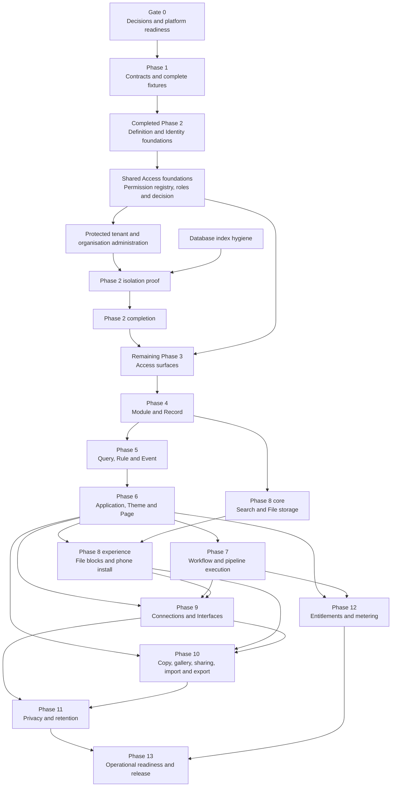

# Abzum Vortex revised build plan

**Agent coordination — 10 September 2026:** GPT-6 Astra owns BA review, correction
of task/specification/build-plan handoffs and independent testing. The coordinator
dispatches reviewed work and maintains progress; Claude Fable 5.1 owns complex
architecture and Claude Opus 5/Sonnet 5 implement assigned work. Follow the [coordination rules](agent-coordination.md)
and [historical engine handoff](claude-engine-handoff.md). This changes engineering
ownership, not product requirements, dependencies or completed review evidence.

The [Access consumer handoff](access-consumer-handoffs.md) keeps activation/invitation invocation with the real IAM workflow and application lifecycle composition with the Application engine. Earlier Access work must not fabricate their missing evidence or depend back on those consumers. The governed IAM journey remains required by #267/#254; the first Phase 4–6 proof #327 may use delivered protected assignment operations.

The [7 September whole-platform architecture review](architecture-review-2026-09-07.md) reconciles configurable read/write data flows, managed-flow controls, per-node execution identity and truthful partial outcomes. [Delivery ownership](frontend-rule-designer.md) places the new headless [scoped execution-identity task](https://github.com/Abzum-NZ/Abzum-Vortex/issues/322) before flow execution. These are planned capabilities, not delivered runtimes.

**Status:** Approved build plan 2.23

**Current delivery order: engines before designer.** Follow the [engine-first application delivery plan](engine-first-application-delivery.md): define complete applications in files, validate/publish/install them, and prove their real browser pages, data, permissions and configured flows before implementing the App Designer. Preserve the existing HTML prototype but defer further expansion. Runtime rendering and registered components are engine work, not dependent on a visual editor. Later designer and MCP authoring reuse the same protected definition operations and runtime; task numbers or phase labels do not override these corrected dependencies.

**Date:** 7 September 2026

**Governing specification:** [Abzum Vortex platform specification](../specification/README.md)

**Delivery board:** [Vortex GitHub Project](https://github.com/orgs/Abzum-NZ/projects/2/views/1)

This plan replaces the sequencing of the earlier [Build Plan](https://claude.ai/code/artifact/58852ead-2acc-4ca6-a693-6cb03705bcef). It keeps the useful ownership boundaries while correcting missing dependencies, an impossible background-worker assumption, incomplete fixtures, and an oversized final phase.

The [decision register](../specification/appendices/decisions.md) is clear. One Frontend Rule Designer, flow variables, reusable custom forms and collect-first atomic submission are settled in the [permanent specification](../specification/appendices/frontend-rule-designer.md). Its [delivery map](frontend-rule-designer.md) updates the existing condition, rule, form, installation and workflow tasks without creating another engine or moving UI ahead of Access dependencies. Groups and optional per-role PIM remain settled. Vortex assigns the minimum valid next module or application release version after structural comparison, and the builder confirms or cancels publication. A new unresolved business choice must be recorded before implementation assumes an answer.

The [flow-first App Builder extension](frontend-rule-designer.md#flow-first-page-actions-and-mcp-authoring) makes action buttons, form submission and record gestures use application-owned Frontend Flows, including editable Save form defaults and presentation-only flows. Pages carry composition/bindings; existing protected services still execute business operations. The same capabilities support MCP app authoring. This is planned functionality, not delivered UI, and does not move the designer ahead of its Access and contract prerequisites.

## Current delivery checkpoint — 6 September 2026

[Permission registry #32](https://github.com/Abzum-NZ/Abzum-Vortex/issues/32) is complete after independent full-task review and the exact hosted Testing receipt through D2. [Roles and Groups #33](https://github.com/Abzum-NZ/Abzum-Vortex/issues/33) is complete after A–E implementation, independent full-task review, normal PR delivery and exact hosted Testing verification; [invitation evidence](../evidence/issue-33-invitation-access/README.md#hosted-testing-follow-up--6-september-2026) records the delivered revision and coverage. Historical slice detail remains in the linked evidence and normative contracts; the current Phase 3 section lists only completed outcomes and remaining work.

The [central access decision #34](https://github.com/Abzum-NZ/Abzum-Vortex/issues/34) is now complete and decides what each account may do from these exact live facts. [Organisation administration #30](https://github.com/Abzum-NZ/Abzum-Vortex/issues/30) has no user hold and its shared Access prerequisites are satisfied. Installed IAM journeys remain [#64](https://github.com/Abzum-NZ/Abzum-Vortex/issues/64) and [#267](https://github.com/Abzum-NZ/Abzum-Vortex/issues/267).

The consolidated [central access decision implementation plan](issue-34-access-decision.md) records #34's completed scope, reviewable slices, complete-path evaluation and downstream policy ownership. Missing target policies refuse; they are not pulled into the permission foundation or treated as already implemented. [#305](https://github.com/Abzum-NZ/Abzum-Vortex/issues/305) is complete after [exact hosted Testing verification](../evidence/issue-305-request-lock-order.md#hosted-testing--6-september-2026): the organisation reader and supported account writer use consistent ordering, proved with the actual writer.

All four #34 slices now pass independent whole-task review and local verification:
current direct/Group access, privileged activation, delegated management and the
verified application handoff. [Final implementation evidence](../evidence/issue-34-access-decision.md)
records [PR #309](https://github.com/Abzum-NZ/Abzum-Vortex/pull/309)'s normal Testing merge.
The complete exact hosted receipt for that combined revision is verified: 42
migrations, the normal 39-suite SQL gate, all 20 concurrency proofs and all five
schemas. #34 is complete. The earlier [current-permission receipt](../evidence/issue-34-permission-eligibility.md)
remains separate historical evidence.

The [protected administration implementation plan](issue-30-protected-administration.md)
consolidates #30 into reviewable slices. It reuses delivered stewardship and the
same Access decision; it does not wait for all of #40, add a second permission
engine or claim the later IAM application is already usable. Preparation is
complete; #34's exact hosted completion now clears implementation to start.

## Architecture review

The [corrected dependency and coverage map](architecture-review.md) is part of this plan. It identifies contract gaps, the Fluid adaptation boundary, the ordinary HR example and the separation between early service proofs and later complete-application evidence. New contract work is #249/#250; HR is #251; reusable foundations are #252/#253; complete integration is #254; full archive/restore is #255.

## Version history

Version 2.23 (7 September 2026) makes complete file-defined application execution precede App Designer work. Runtime block registration, draft/publication and application installation no longer depend on their visual-editor consumer; see the [engine-first task ownership](engine-first-application-delivery.md).

| Version | Status   | Date             | Summary                                                                                                                                                                                                                                                                                                                                                                                                                                                                                                                                                               |
| ------- | -------- | ---------------- | --------------------------------------------------------------------------------------------------------------------------------------------------------------------------------------------------------------------------------------------------------------------------------------------------------------------------------------------------------------------------------------------------------------------------------------------------------------------------------------------------------------------------------------------------------------------- |
| 2.19    | Approved | 5 September 2026 | Corrected hosted database verification provenance: the protected exact commit owns one Local/hosted proof and schema manifest through a fixed bootstrap; receipt version 2 records actual completed coverage, and older partial receipts cannot approve Production.                                                                                                                                                                                                                                                                                                   |
| 2.18    | Approved | 5 September 2026 | Defined #276's verified confirmation mapping and complete session/context compatibility proof before #34/#40 enforce protected-action recency; a token refresh, legacy strength label or pending PIM approval supplies no new confirmation.                                                                                                                                                                                                                                                                                                                           |
| 2.17    | Approved | 5 September 2026 | Added #283 Groups compatibility before remaining #33 assignments; #33/#34/#40 must include protected role policies, eligibility and individual activation, with #276 authentication evidence and later #72/#267 IAM journeys. No PIM scheduler, second evaluator or early grant UI.                                                                                                                                                                                                                                                                                   |
| 2.16    | Approved | 5 September 2026 | Added the ordinary IAM application as the only role-grant journey: #72 owns definitions/views, #267 completes generic workflow approvals after #76/#81. Early Access/Identity operations remain private prerequisites, not a temporary granting portal.                                                                                                                                                                                                                                                                                                               |
| 2.15    | Approved | 5 September 2026 | One organisation-managed role and permission catalogue; application registration supplies templates without automatic access; explicit review of expanded grants; shared Access foundations must precede organisation-local administration, correcting the earlier phase-order assumption.                                                                                                                                                                                                                                                                            |
| 2.14    | Approved | 5 September 2026 | Page/shell/binding contract completion, workflow-only HR example, corrected task dependencies and cross-cutting foundations.                                                                                                                                                                                                                                                                                                                                                                                                                                          |
| 2.13    | Approved | 5 September 2026 | Completed organisation selection and request context #27: a minimum safe launcher, address-scoped tab selection, browser-supplied identifier only, atomic Identity/Access scope resolution, trusted Identity Authority binding, live Access-version validation, capability-injected protected repositories with no caller-context transaction bypass, pooled transaction cleanup, 725 pgTAP assertions and seven real concurrency proofs. Protected tenant/organisation operations #30 are now dependency-unblocked; the separation suite #29 remains blocked on #30. |
| 2.12    | Approved | 5 September 2026 | Made hosted runtime provisioning and proof explicit: migrations leave the restricted login passwordless; each environment receives a separate operator-generated password and exact transaction-pooler URL through its Vercel-synchronised Doppler target; forbidden owner, migration, general database and Kestra variables are checked; the intended deployment must then pass a real protected journey.                                                                                                                                                            |
| 2.11    | Approved | 5 September 2026 | Settled Identity sessions #26 on the official server-only Supabase/Next.js pattern: request-specific clients, Proxy `getClaims()` refresh, strict `HttpOnly` hosted/loopback cookie profiles, staged writes, non-mutating cluster projection reads, closed temporary failures, realistic refresh/revocation guarantees and no Vortex session store.                                                                                                                                                                                                                   |
| 2.10    | Approved | 5 September 2026 | Completed Access-version foundation #224 with private per-organisation storage, exact trusted reads, same-transaction invitation/account lifecycle invalidation, closed evidence, safe boundaries, 672 pgTAP assertions and six real concurrency proofs. Identity sessions #26 are the only remaining prerequisite before request context #27.                                                                                                                                                                                                                        |
| 2.9     | Approved | 4 September 2026 | Completed organisation accounts #24 with minimal cluster-local identity projections, separate account lifecycle, fingerprint-only invitations, exact verified-email acceptance, deterministic concurrency proof, private database entry points and no provider-profile, role, Team or application-domain persistence. Identity sessions #26 and Access version #224 are now the independent dependency-unblocked work.                                                                                                                                                |
| 2.8     | Approved | 4 September 2026 | Completed Identity Authority #25 with operated Local and hosted Testing proofs, exact protected deployment provenance, isolated Mailtrap Email Testing evidence, a least-privilege proof subprocess, secret/log safeguards and no Production request or change. Organisation accounts #24 are now the next dependency-unblocked Phase 2 work.                                                                                                                                                                                                                         |
| 2.7     | Approved | 4 September 2026 | Aligned confirmation and recovery with Supabase's supported hosted email flow: provider verification, exact allowlisted callbacks, immediate fragment removal, minimum request-local credentials and no durable session before #26. Confirmed isolated Testing Mailtrap SMTP and assigned Production email-prefetch protection to #171.                                                                                                                                                                                                                               |
| 2.6     | Approved | 4 September 2026 | Added bounded immutable Definition history and safe authored-source restore: revision keyset pagination, exact metadata, strict provenance, release/source/identity integrity checks, no identity allocation, deterministic concurrency proofs and no duplicate history or cache.                                                                                                                                                                                                                                                                                     |
| 2.5     | Approved | 4 September 2026 | Added the strict server-only Definition consumer-read operation: explicit current-or-exact selection, one consistent current read, exact dependency pinning, safe output projection, release-integrity proof and no cache.                                                                                                                                                                                                                                                                                                                                            |
| 2.4     | Approved | 4 September 2026 | Added the Access-owned version foundation to Phase 2 sequencing; clarified stable Auth domains, protected Testing automation, application-free Phase 2 request context, restore evidence and Activity ownership; and reconciled the plan with the native GitHub dependency graph.                                                                                                                                                                                                                                                                                     |

## Planning rules

The user-reported [Testing sign-in performance repair #347](https://github.com/Abzum-NZ/Abzum-Vortex/issues/347)
is verified on Testing. Its [measured result](testing-sign-in-performance.md#verified-testing-result--8-september-2026)
records sign-in's server response falling from 7.0 to 2.8 seconds and organisation
requests from a 5.6-second warm baseline to 146–725 milliseconds after moving
compute beside the Sydney database, with authentication and permissions unchanged.
Resume the available definition-first engine work; no designer or infrastructure
expansion is introduced by this task.

The [App Designer HTML prototype](app-designer-html-prototype.md) precedes production App Designer UI implementation, but both follow the [complete file-defined application proof](definition-first-application-proof.md). Preserve the existing prototype without expanding it during engine delivery. [Record visibility #36](https://github.com/Abzum-NZ/Abzum-Vortex/issues/36) and [Access administration #40](https://github.com/Abzum-NZ/Abzum-Vortex/issues/40) are Done with their exact hosted evidence recorded in the [visibility receipt](../evidence/issue-36-record-visibility.md) and [administration receipt](../evidence/issue-40-access-administration.md). Current Phase 3 engine work is [row enforcement #35](https://github.com/Abzum-NZ/Abzum-Vortex/issues/35): the earlier local SQL candidate is set aside after a rejected tool action and is not recovered; the assigned developer implements #35 fresh from current source, keeping the published-graph traversal bound and cycle refusal without a fixed application-size permission cap, followed by final SQL integration and delivery. The completed [#40](https://github.com/Abzum-NZ/Abzum-Vortex/issues/40) evidence supersedes the earlier local-only administration checkpoint. The eventual designer and MCP authoring use the same protected definition operations and proven runtime.

1. A phase starts only when its required earlier outcomes are working, not merely when their issues exist.
2. Every work item links its governing [specification section](../specification/README.md), [data contract](../specification/appendices/data-contracts.md), and any still-open business choice that can change its outcome.
3. Visible work includes desktop and phone evidence under [quality and acceptance](../specification/20-quality-and-acceptance.md).
4. Organisation separation, privacy, migrations, recovery, and observability are part of the feature—not later cleanup.
5. A phase exit is a tested user or platform outcome, not a count of merged files.
6. Work may run in parallel only where the dependency diagram permits it.
7. Before an issue closes, review the specification, data contracts, build plan, traceability and delivery maps, dependent GitHub issues, and native project dependencies. Update every affected source in the same change, or record explicitly that it was reviewed and needed no change.
8. Every core contract and engine feature must pass the [platform-primitives-only admission test](../specification/appendices/core-contract-boundary.md#admission-test). Business domains and Abzum operations are built as ordinary Vortex applications.
9. Work summaries use a bordered table with Completed, Coming up, Pending User Decision and Overall Progress sections. Link every GitHub task, name the current phase, and describe functionality and why it is needed. Overall Progress is the percentage of all tracked project items marked Done, including epics and other tracked work, with its completed/total count; do not substitute a non-epic-only figure or a product-readiness estimate. Recalculate from the board and make identified missing work visible there.
10. After a migration-bearing change merges to `testing`, verify one exact current-Testing receipt for that revision before merging another migration-bearing pull request. This is an evidence rule, not a numeric migration quota, and it does not schedule Production promotion.

## Dependency map

Operations, accessibility, security, documentation, and automated checks are continuous workstreams. Phase 13 proves the complete operating system rather than introducing them for the first time.

### Current dependency tiers

A concise sequencing reference; issues remain the source of exact scope, and no
automated check treats this table as a second executable source. Tiers describe
integration order, not broad start gates. #249/#250 headless work and the pure
#58 graph foundation proceed when their own prerequisites are ready. Later
workflow, file, connection and MCP engines likewise do not wait for #327.

| Tier | Unlocked by | Work |
| --- | --- | --- |
| 1 — Access enforcement | Completed #34/#36/#40 | [#35](https://github.com/Abzum-NZ/Abzum-Vortex/issues/35), then [#37](https://github.com/Abzum-NZ/Abzum-Vortex/issues/37); [#30](https://github.com/Abzum-NZ/Abzum-Vortex/issues/30) and [#41](https://github.com/Abzum-NZ/Abzum-Vortex/issues/41) independently |
| 2 — Module and record engines | Tier 1 row/field enforcement | [#43](https://github.com/Abzum-NZ/Abzum-Vortex/issues/43)/[#45](https://github.com/Abzum-NZ/Abzum-Vortex/issues/45) with the co-delivered [#64](https://github.com/Abzum-NZ/Abzum-Vortex/issues/64) installation-permission slice, then [#47](https://github.com/Abzum-NZ/Abzum-Vortex/issues/47) and [#54](https://github.com/Abzum-NZ/Abzum-Vortex/issues/54) |
| 3 — Application runtime | Each engine's own dependencies; Tier 2 for protected data integration | Required [#58](https://github.com/Abzum-NZ/Abzum-Vortex/issues/58), [#67](https://github.com/Abzum-NZ/Abzum-Vortex/issues/67), [#68](https://github.com/Abzum-NZ/Abzum-Vortex/issues/68), [#73](https://github.com/Abzum-NZ/Abzum-Vortex/issues/73) work and completed Access prerequisites feed full [#64](https://github.com/Abzum-NZ/Abzum-Vortex/issues/64); #66 and headless #249/#250 work proceed on their own dependencies |
| 4 — Runtime consumers and first definition-led proof | Full #64 and each consumer's other dependencies | [#69](https://github.com/Abzum-NZ/Abzum-Vortex/issues/69) and [#71](https://github.com/Abzum-NZ/Abzum-Vortex/issues/71) follow #64; [#74](https://github.com/Abzum-NZ/Abzum-Vortex/issues/74) feeds [#327](https://github.com/Abzum-NZ/Abzum-Vortex/issues/327), alongside its #43/#45/#47/#54/#64 prerequisites |
| 5 — Designer and cross-phase acceptance | #327 plus each owning task's actual prerequisites | Designer [#323](https://github.com/Abzum-NZ/Abzum-Vortex/issues/323)/[#65](https://github.com/Abzum-NZ/Abzum-Vortex/issues/65) follow #327; [#254](https://github.com/Abzum-NZ/Abzum-Vortex/issues/254) integrates later owning-engine, IAM, sharing/federation, Designer and [MCP #200](https://github.com/Abzum-NZ/Abzum-Vortex/issues/200) evidence |

## Gate 0 — Decisions and platform readiness

**Status:** Complete in [#151](https://github.com/Abzum-NZ/Abzum-Vortex/issues/151) on 2 September 2026.

**Outcome:** The project has one authoritative approved specification, permanent requirements for settled choices, a clear register, a dependency-complete fixture baseline, and a delivery path that can safely begin contracts.

Required work:

- Verify the settled tenant, definition-version, access, field, workflow, protected data-handling, entitlement, delivery, recovery, and performance requirements against the [data contracts](../specification/appendices/data-contracts.md).
- Keep cluster location out of the product-level sharing choices: one shared-record gateway uses a local adapter or the signed Vortex Federation API.
- Publish Specification 2.0 and update its version history.
- Maintain the dependency-complete [CRM and Service Desk fixture baseline](../specification/appendices/worked-examples.md), including every module, action, connection type, interface, theme, role, workflow, pipeline, page, query, and cross-application scenario. [#15](https://github.com/Abzum-NZ/Abzum-Vortex/issues/15) makes every non-defaultable author choice explicit and proves deterministic, lossless conversion to the canonical contracts before Phase 2 begins.
- Define and validate the [record-table allocation](../specification/17-runtime-storage-and-caching.md#record-table-allocation): one table per compatible record-type storage lineage, explicit organisation/application row scope, stable physical tokens, and collision cases covering same-named applications in different organisations.
- Reconcile the repository README with [delivery and testing](../specification/18-delivery-and-testing.md).
- The completed backup [issue #132](https://github.com/Abzum-NZ/Abzum-Vortex/issues/132) and Supabase migration and database-test foundation [issue #139](https://github.com/Abzum-NZ/Abzum-Vortex/issues/139) are closed. The database scope and request-role guarantees [issue #28](https://github.com/Abzum-NZ/Abzum-Vortex/issues/28) now begin the service-schema path.
- Update [Phase 1 epic #9](https://github.com/Abzum-NZ/Abzum-Vortex/issues/9) so every active M0 gate is a native dependency.
- Assign the existing Priority values to active work, add a real Bugs filter, add roadmap dates when scheduling begins, use native blocked-by links, and add epic completion criteria on the [GitHub Project](https://github.com/orgs/Abzum-NZ/projects/2/views/1).

Exit proof:

- No blocking foundation decision remains open.
- Every fixture reference resolves in a machine-readable dependency check.
- The documented and configured branch checks agree.
- Phase 1 contains only current work and can be moved to Ready.

## Phase 1 — Contracts and complete fixtures

**Current project epic:** [#9](https://github.com/Abzum-NZ/Abzum-Vortex/issues/9)

**Outcome:** Every later service imports one versioned contract package and validates the complete worked examples without a database.

Build:

- Keep the one deployable Next.js composition root and Vercel Root Directory at `apps/web`, following the official Turborepo deployable-application convention; include the workspace files it depends on, run the root `pnpm verify` gate, publish `.next`, and keep shared packages as separate workspace members.
- Shared identifier, error, actor, organisation context, revision, dependency and version-range contracts.
- Independently versioned module and application contracts plus their contained-component contracts from [composition and publication](../specification/03-composition-and-publication.md).
- All core [data contracts](../specification/appendices/data-contracts.md), including the 22 field types, permissions, queries, events, workflow execution references and protected operations, files, connections, interfaces, federation envelopes, protected removal, entitlements, metering and cache versions.
- The formal [core contract boundary](../specification/appendices/core-contract-boundary.md), a documented platform invariant for every privileged contract, and source guards that reject example-specific semantics in core code.
- Generic contract validator with the versioned safe-error catalogue from [the data contracts](../specification/appendices/data-contracts.md#definition-validation-errors), stable codes, caller-mapped builder-visible locations, deterministic ordering, and protected diagnostics. Runtime validation contains no installed definition or fixture name.
- Pure [module/application version-impact comparison](../specification/appendices/version-impact-policy.md), including stable-identity matching, exact content fingerprints, a governed field-by-field policy, Vortex assignment of the minimum valid next release version, and stale-safe builder confirmation or cancellation.
- Storage-catalog and scope contracts that distinguish definition identity, storage lineage, organisation ownership, and application-contained ownership without creating per-installation tables.
- Complete [worked-example fixtures](../specification/appendices/worked-examples.md).
- A capability-complete production authored-source schema and lossless conversion for all 13 example definition documents; no compiler-invented label, permission, layout, public exposure, data shape or business behaviour. Publication consumes immutable prior history and already-published dependencies, binds every compiled artifact/dependency to its kind, key, root, exact version, canonical content and resolution snapshot, and never accepts or retargets existing dependant state.
- Types, lint, unit tests, contract tests and build checks that run without a database.

Exit proof:

- Both complete examples validate with no unresolved reference.
- Every non-defaultable authored choice is explicit, and semantic coverage proves source-to-canonical conversion loses or invents nothing.
- Resolution identity is globally unique across roots and source-derived component owners; changing both a sibling identifier and its claimed owner still refuses compilation, while transformed names, labels, triggers, conditions and dynamic maps never claim a sibling's provenance.
- Edit/save refuses incompatible module-local condition operands, action values, and locally resolvable totals. Publication checks application actions and workflows against their exact bound module versions; calculation, total, record-link and organisation-account result types remain distinct. Totals name an exact source relationship, resolve their field and filter in that relationship's source record, and require the relationship to target the total-owning record. Each aggregate validator has one honest registry owner and a closed emitted-code list.
- Published versions equal the version-impact result, unchanged publication is refused, and every dependency matches its complete immutable kind/key/root/version/content/resolution evidence under the requesting definition's exact snapshot.
- Record-scoped pages, blocks, queries, actions and replacements share one record target; public pages and interfaces prove their complete query, field, permission, action subject and action effect surface is public-safe.
- Every workflow trigger matches its owning action, message, inline recurrence, interface or exact parent-workflow contract; trigger consumers, link assignments, file operations, and every fixed or form-declared node output are typed, duplicate-protected where required, record-targeted where applicable, and tested as producer/consumer pairs.
- Every record type resolves to exactly one collision-free storage mapping; two same-named CRM applications in different organisations remain isolated, while CRM and Service Desk can read the same organisation-shared Company and Contact records.
- Invalid examples cover every closed list, missing required value, unknown value, incompatible reference and cross-root version failure.
- Schema failures and validation-rule failures produce the same safe public result; adversarial diagnostics never enter that result and no example-specific name appears in the translator or catalogue.
- First publication is exactly `1.0.0`, unchanged content cannot publish, and patch/minor/major fixtures prove deterministic reasons, minimum version assignment, history integrity, and stale-confirmation refusal.
- No service-specific package invents a second form of a shared contract, and no core package recognises an example application or ordinary business domain by name.
- The final Phase 1 revision passes `pnpm verify` from a clean checkout and is recorded moving through the protected feature-to-Testing-to-Production Vercel path.

## Phase 2 — Definition and Identity

**Current project epic:** [#18](https://github.com/Abzum-NZ/Abzum-Vortex/issues/18)

**Needs:** Phase 1.

**Foundation order:** migration and database-test delivery [#139](https://github.com/Abzum-NZ/Abzum-Vortex/issues/139), database guarantees [#28](https://github.com/Abzum-NZ/Abzum-Vortex/issues/28), private tenant/organisation storage invariants [#23](https://github.com/Abzum-NZ/Abzum-Vortex/issues/23), Definition storage [#19](https://github.com/Abzum-NZ/Abzum-Vortex/issues/19), history and restore [#21](https://github.com/Abzum-NZ/Abzum-Vortex/issues/21), consumer reads [#22](https://github.com/Abzum-NZ/Abzum-Vortex/issues/22), the Identity Authority with Local and hosted Testing proofs [#25](https://github.com/Abzum-NZ/Abzum-Vortex/issues/25), cluster-local identity projections, organisation accounts and invitations [#24](https://github.com/Abzum-NZ/Abzum-Vortex/issues/24), the Access-version foundation [#224](https://github.com/Abzum-NZ/Abzum-Vortex/issues/224), Identity sessions [#26](https://github.com/Abzum-NZ/Abzum-Vortex/issues/26), and organisation selection/request context [#27](https://github.com/Abzum-NZ/Abzum-Vortex/issues/27) are complete. Membership alone does not authorise administration. Advance the shared [permission registry #32](https://github.com/Abzum-NZ/Abzum-Vortex/issues/32), [roles and assignments #33](https://github.com/Abzum-NZ/Abzum-Vortex/issues/33) and [central access decision #34](https://github.com/Abzum-NZ/Abzum-Vortex/issues/34) from their actual completed prerequisites before exposing organisation-local operations in [#30](https://github.com/Abzum-NZ/Abzum-Vortex/issues/30). Do not make those foundations depend on this whole epic and thereby create a cycle. The separation suite [#29](https://github.com/Abzum-NZ/Abzum-Vortex/issues/29) follows #30 and [#235](https://github.com/Abzum-NZ/Abzum-Vortex/issues/235). Phase 2 remains open until its full administration and isolation outcomes are proved; this dependency correction does not remove them.

**Phase exit and follow-ups:** the adviser cleanup in [#235](https://github.com/Abzum-NZ/Abzum-Vortex/issues/235) is Phase 2 exit hygiene and should land before the final #29 proof so the hosted performance-adviser result is clean. The corrected exact-commit verification gate [#266](https://github.com/Abzum-NZ/Abzum-Vortex/issues/266) must produce a complete hosted Testing receipt before #235 or the final #29 evidence relies on hosted database delivery. The bounded-publication work in [#257](https://github.com/Abzum-NZ/Abzum-Vortex/issues/257) is an independent, non-gating scale follow-up and does not block closing the Phase 2 epic.

The [#266](https://github.com/Abzum-NZ/Abzum-Vortex/issues/266) bootstrap and bounded pooled-session/expiry-setup proof repairs now have a successful hosted Testing receipt for exact `facc9dc4f81111e2f319de218555a2186235126c`: 30 SQL suites / 1,508 assertions, all 14 selected concurrency proofs and all five selected schemas completed. Root inspected the stored schema-2 receipt and matched its hashes to the exact Git revision. [Promotion PR #300](https://github.com/Abzum-NZ/Abzum-Vortex/pull/300) uses that candidate only; newer [activation PR #299](https://github.com/Abzum-NZ/Abzum-Vortex/pull/299) requires its own expanded hosted gate before promotion. Neither partial earlier runs nor an older receipt prove newer work. See the [dated receipt evidence](../evidence/issue-266/README.md#successful-exact-revision-hosted-receipt--6-september-2026).

**Outcome:** A person can sign in, choose an organisation, tenant administrators can manage a safe organisation hierarchy, and authorised builders can draft, validate, publish and restore modules and applications independently.

Build:

- One environment-wide [Vortex Identity Authority](../specification/02-people-organisations-and-sign-in.md#identity-across-clusters), plus a minimal identity projection in each cluster, private tenant/organisation structural storage, tenant-administrator assignments, cluster-local organisation accounts, invitations, sessions and organisation launcher.
- Store one same-tenant adjacency-list parent per organisation. Permanent scope keys, tenant-scoped short-name uniqueness, tenant-row serialisation, recursive cycle refusal, deferred final-state lifecycle validation, forced row security, and absent direct runtime/Data API grants are database invariants owned by #23. No duplicate hierarchy representation or implicit lifecycle cascade is added.
- Add tenant-administrator assignments, system-only initial provisioning, protected hierarchy/lifecycle commands, runtime localisation settings, safe read models, expected-revision command concurrency, duplicate protection, and typed audit-ready operation evidence in #30. Tenant governance uses separate explicit tenant authority; organisation-account, invitation and settings operations require the shared central decision and exact organisation-role permissions in the resolved #27 context. Neither membership nor tenant-administrator status substitutes for organisation permission. Creates have no prior revision; mutations of existing resources require the expected revision. Generic persisted Activity remains owned by #252/#115.
- Supabase Auth with a managed P-256 `ES256` signing key and locally verifiable short-lived identity tokens. The Identity service accepts the required standard Supabase claims, then returns only the closed verified-identity result, including the permanent identity identifier and current verified primary email. It uses no custom access-token hook and never turns provider roles or metadata into Vortex authority.
- Neutral registration, email confirmation, sign-in and password-recovery journeys under the official `apps/web` Next.js App Router. Templates use Supabase's supported verification URL, which redirects only to exact allowlisted callbacks with a browser-only implicit session fragment. The callback removes the fragment before validation or submission. Confirmation submits only the access token for `getUser`; recovery uses its access/refresh pair only in a non-persisting request-local client to replace the password. Confirmation and recovery persist no durable Vortex browser session; #26 replaces the completed sign-in journey's deliberate credential discard with server-only cookies, refresh and ongoing session state.
- New and replacement passwords require at least 8 characters including a letter and a number; sign-in continues to defer existing-password validity to the Identity Authority.
- Exact Local, Testing and Production owned site and redirect allowlists with no wildcard, provider-generated alias, or customer-controlled redirect. Testing remains under Vercel Deployment Protection; operated tests send the automation-bypass value only in Vercel's documented request header.
- Local email confirmation and recovery are captured in Mailpit. Testing uses a Mailtrap Email Testing inbox through Supabase custom SMTP so confirmation and recovery can be proven without delivering to a person; its dedicated test-only address and read-only capture token are isolated in Doppler `ops_stg`, outside the Vercel-synchronised application configuration. Production sender-domain, SMTP provisioning, delivery proof and protection against email-link prefetch scanners remain Phase 13 work under #171.
- Record the current managed P-256 `ES256` Testing key and public-only JWKS, and prove old/new overlap with generated-key tests. Do not churn a live hosted key solely for Phase 2 evidence; the operated standby, activation, overlap, retention and revocation drill belongs to Phase 13 [#171](https://github.com/Abzum-NZ/Abzum-Vortex/issues/171).
- Identity Authority [#25](https://github.com/Abzum-NZ/Abzum-Vortex/issues/25) owns token verification. Organisation accounts [#24](https://github.com/Abzum-NZ/Abzum-Vortex/issues/24) persist only the identity identifier; invitation acceptance compares the current verified email request-locally and never copies it into the identity projection or account. Sessions [#26](https://github.com/Abzum-NZ/Abzum-Vortex/issues/26) consume the same verified result and own durable cookies, refresh, sign-out and revocation.
- Identity sessions use one request-specific `@supabase/ssr` server client and no browser Auth client. Next.js Proxy performs only provider-supported `getClaims()` refresh and optimistic verification, overwrites its private request-state marker and prevents a protected resolver from retrying refresh after Proxy failure. Each protected server operation re-verifies the current access token and reads cluster eligibility without mutation. Hosted cookies are host-only, secure and `HttpOnly`; HTTP loopback uses a separate non-prefixed cookie family. Conclusive invalid/expired state is cleared at the fixed cookie-writable cleanup route. Supabase remains the only durable session store.
- The supported Local Next.js command binds only to `127.0.0.1`, and session handling requires the actual request host/protocol to match the configured Local site. Local session proof connects to the Supabase CLI database only through its exact loopback endpoint as the restricted `vortex_runtime` login. Its fixed disposable seed credential is Local-only. Testing and Production retain their mandatory environment-specific Supavisor runtime login, transaction port and verified TLS profile.
- Hosted migrations leave `vortex_runtime` passwordless. Before protected traffic, an operator assigns a separate high-entropy password to the exact environment role and stores that database credential only inside the complete restricted transaction-pooler URL in that environment's Vercel-synchronised Doppler root config. The config also retains the required public Supabase, site, certificate, environment and authority settings. Testing evidence refuses missing values and any project-owner, migration, general `DATABASE_*` or Kestra credential in the Vercel target, verifies the exact sync and deployed commit, then proves one real protected identity journey. Production repeats this separately under its Production gate.
- Organisation invitations remain separate from accounts, store only a SHA-256 fingerprint of a securely generated 32-byte secret, create no placeholder account, and carry no role or Group assignment in Phase 2. Acceptance locks the invitation, requires the current exact verified email, creates at most one account, and returns the same account only for an exact replay by the accepting identity. Administrative invitation and account-lifecycle helpers are not granted to request roles before Access and protected administration compose authorisation.
- The completed Access foundation [#224](https://github.com/Abzum-NZ/Abzum-Vortex/issues/224) stores one private positive counter per organisation. Invitation activation/reactivation and authorised account lifecycle changes compose their Identity mutation and Access increment in one database transaction. Request context reads only the exact live value through the trusted pre-context operation. Identity records never store the counter, and later Access work reuses the same operation.
- Supabase exclusively owns `auth.*`; repository migrations never create or repair Supabase Auth tables.
- Independent module and application draft concurrency, release versions, validation, immutable revision publication, dependency graph and restore. Themes, pages, workflows, interfaces and application roles remain contained in the application; organisation roles remain live access data.
- Database-allocated permanent component identities and append-only alias history derived from the same parsed-source catalogue as compilation. Nested identities use a stable parent-owner scope so parent-key changes preserve child identity while current key-based scopes continue to resolve authored references.
- Derive every saved sharing-condition revision from its permanent condition UUID and complete immutable Module history. Unchanged content retains its revision; changed content and reintroduction after an absent release increment it. A caller alias, mutable counter, grant or consumer never chooses or advances the revision.
- Prepare publication without writing: resolve exact requirements exactly and allowed ranges to the highest compatible stable same-organisation Module release, resolve connection types and platform themes from the immutable platform catalogue, reject missing/ambiguous/substituted/cyclic evidence, and return one safe exact confirmation.
- Publish through one locked transaction that rechecks the draft, current pointer, permanent identities, condition revisions, exact dependency evidence, compilation, validation, minimum version assignment and the 10,000-release per-root bound; append the canonical compilation output, its exact resolution snapshot and one-for-one manifest as one immutable release, then advance only that root's discovery pointer. A later alias or concurrently published dependency cannot change that release's evidence, and no existing consumer is retargeted.
- Deliver [#22](https://github.com/Abzum-NZ/Abzum-Vortex/issues/22): one server-only Definition-service read accepts a kind-matched permanent root and explicit `current` or exact release revision. Its one consistent current read follows only that root pointer; its exact read follows no pointer. Before returning the fixed safe canonical-content projection, it verifies immutable release and exact manifest evidence, including exact platform-catalogue entries. It implements no cache, Data API or consumer-specific behavior.
- Deliver [#21](https://github.com/Abzum-NZ/Abzum-Vortex/issues/21): one strict server-only history path returns bounded newest-first metadata pages and exact entries, while restore verifies and copies one immutable release's stored authored source into the expected draft revision. Restore records all-or-none exact-source provenance, derives current identity requirements without allocating identities or aliases, changes no release, pointer or consumer, and adds no duplicate history, activity or cache store.
- No starter Module or Application root is seeded in Phase 2. Representative definitions remain test-only until an owning platform feature specifies a required platform definition.
- One closed request context established for each protected transaction through a non-owning request role. The Phase 2 launcher supplies only the selected organisation identifier; Identity and Access atomically resolve the verified authority, exact active account scope and current Access version, initialise context, enter the request role and run protected work in one transaction. This organisation-only context has no application identifier; an absent application never grants application-wide scope. Phase 3 [Central Access #34](https://github.com/Abzum-NZ/Abzum-Vortex/issues/34) extends the same boundary with optional exact application selection and active-registration verification before context initialization, not a second context store. Vercel uses the Supabase transaction pooler with prepared statements disabled; Kestra keeps a separately credentialed session-pooler path for migrations and database verification.
- The official Supabase CLI project, ordered migration history, local pgTAP/lint gate, and Kestra Testing/Production delivery path exist before a service schema is introduced. Kestra runs the same committed pgTAP files through a pinned in-image `pg_prove` harness, so operated verification does not require the host Docker socket.

Exit proof:

- One identity can safely switch between its separate accounts in two organisations without transferring profile, role or cached state between those accounts.
- The launcher returns only approved display labels and organisation addresses; zero, one and several active-account cases are distinct, and temporary failure is not shown as an empty account list.
- Forged, foreign, inactive and unknown organisation addresses are indistinguishable. Two browser tabs can select different organisations without shared mutable selection state, and every protected operation re-resolves live account state and Access version.
- A pending invitation creates no account; wrong-email, revoked, expired and inactive-scope acceptance fail safely; two concurrent correct acceptances create exactly one account and one lifecycle transition.
- Provider email, profile, phone, MFA state, sign-in history, session data and Access version are absent from the cluster identity projection, while suspending that projection removes all local launcher entries without changing another cluster.
- One successful sign-in commits a server-only cookie session only after token verification and active cluster projection; refresh and local sign-out preserve browser isolation, temporary outages do not destroy otherwise usable credentials, and the safe identity-session result contains no organisation or application authority.
- Two independently configured verifier instances accept the same Testing identity token, produce the same identity identifier and verified primary email, and refuse a token from another environment. This proof does not require or claim a second physical Testing cluster.
- A stale draft cannot overwrite a later edit.
- Publishing is atomic. Restoring an exact immutable source creates one later draft with complete provenance, while stale restore changes nothing and ordinary save clears restore-only provenance.
- History pagination remains stable when a later release is appended, and exact metadata lookup returns only the named release. Restore-versus-restore, restore-versus-save and restore-versus-publication two-session proofs have one deterministic outcome without changing immutable history or existing consumer bindings.
- A current Definition read changes only when its named root publishes a later release; an earlier exact read remains unchanged. Unknown, foreign, wrong-kind, unpublished and unknown-exact selections are indistinguishable, malformed or public request contexts refuse before content returns, and integrity or exact-dependency failures refuse safely.
- Two-session proofs show that one of two stale saves wins, one of two publications from the same draft wins, and an Application prepared against a compatible `1.x` Module remains pinned to that exact release while `2.0.0` publishes concurrently.
- Definition and identity tables pass their database separation tests.
- The delivery engine is bootstrapped from one exact reviewed commit, produces successful Testing evidence after that commit merges to `testing`, and returns Coolify to the same revision on protected `main` before ordinary automatic delivery begins.
- Tenant administrators can create and move organisations without gaining record access, and cross-tenant or cyclic hierarchy moves are refused.

## Phase 3 — Access

**Current project epic:** [#31](https://github.com/Abzum-NZ/Abzum-Vortex/issues/31).

**At phase exit:** One permission vocabulary and current Access decision protects organisation operations, records and the capability projections used by later interfaces.

**Governing requirements:** [Access and permissions](../specification/04-access-and-permissions.md), [permission and role contracts](../specification/appendices/data-contracts.md#permission-and-role-contracts), [Groups and privileged access](../specification/appendices/groups-and-privileged-access.md), and [the IAM application boundary](../specification/appendices/iam-application.md). These remain normative. Completed implementation detail belongs in the linked plans and evidence, not a second list of work to repeat.

### Completed foundations

- [Permission registry #32](https://github.com/Abzum-NZ/Abzum-Vortex/issues/32) supplies exact organisation-managed application/module permission availability and immutable source evidence.
- [Roles and Groups #33](https://github.com/Abzum-NZ/Abzum-Vortex/issues/33) delivered private roles, Groups, memberships, standing/eligible assignments, individual activations and delegation, their revision-checked writers, permanent stewardship and invitation-access integration. [Final invitation and hosted evidence](../evidence/issue-33-invitation-access/README.md#hosted-testing-follow-up--6-september-2026) completes the task; earlier local-only checkpoints are historical.
- [Central Access #34](issue-34-access-decision.md) delivered the sole current permission/delegation decision and resolved-transaction server adapter, including application selection and verified authentication requirements. [Final hosted evidence](../evidence/issue-34-access-decision.md) is complete. Missing required row, field, sharing or public policy still refuses the final operation.

These foundations do not themselves expose an IAM granting endpoint or a usable administration application. Preserve their current invariants; do not rebuild their storage or add another evaluator.

### Current checkpoint and actual order

[Activity foundation #252](issue-252-activity-foundation.md) is complete: independently reviewed, merged into Testing through [PR #310](https://github.com/Abzum-NZ/Abzum-Vortex/pull/310), and matched to its successful [exact hosted receipt](../evidence/issue-252-activity-foundation.md#hosted-delivery--6-september-2026). The shared private append boundary records successful changes atomically and supports content-free refusal after rollback. [#115](https://github.com/Abzum-NZ/Abzum-Vortex/issues/115) owns later permitted views and full service coverage. Its dependent [record visibility #36](https://github.com/Abzum-NZ/Abzum-Vortex/issues/36) and [Access administration #40](https://github.com/Abzum-NZ/Abzum-Vortex/issues/40) are Done; their exact hosted results are recorded in the [visibility evidence](../evidence/issue-36-record-visibility.md) and [administration evidence](../evidence/issue-40-access-administration.md). Earlier checkpoint and source-merge detail in those records is historical context, not current open work.

Use each task's actual prerequisites, not a blanket Phase 2 isolation gate. [Organisation administration #30](issue-30-protected-administration.md) separately consumes the completed #33/#34 foundations; it has no user hold and does not wait for all of #40. The complete Phase 2 isolation result remains required for the full phase exit, but does not prevent independently testable Access foundations.

The shared-condition, permission-scope preservation, Group membership reads and protected Group creation/rename checkpoints merged normally into Testing through [PR #313](https://github.com/Abzum-NZ/Abzum-Vortex/pull/313) and [PR #314](https://github.com/Abzum-NZ/Abzum-Vortex/pull/314). Application-owned saved-condition compilation and the narrowly scoped [invitation correction #315](https://github.com/Abzum-NZ/Abzum-Vortex/issues/315) followed in [PR #316](https://github.com/Abzum-NZ/Abzum-Vortex/pull/316). Registered permission browsing and private PostgreSQL condition parity are delivered through [PR #317](https://github.com/Abzum-NZ/Abzum-Vortex/pull/317) and [PR #319](https://github.com/Abzum-NZ/Abzum-Vortex/pull/319); the historical slices are retained in the completed [#36](https://github.com/Abzum-NZ/Abzum-Vortex/issues/36) and [#40](https://github.com/Abzum-NZ/Abzum-Vortex/issues/40) evidence.

The explicit person/current-account parameter correction, separate local-role/template reads and [assignment-revocation audit correction #318](https://github.com/Abzum-NZ/Abzum-Vortex/issues/318) merged as reviewed source in [PR #320](https://github.com/Abzum-NZ/Abzum-Vortex/pull/320). The completed [#315](https://github.com/Abzum-NZ/Abzum-Vortex/issues/315) and [#318](https://github.com/Abzum-NZ/Abzum-Vortex/issues/318) hosted Testing verification is at [eaef6ce34e46cdc977705068c77822b96e0d5bd8](https://github.com/Abzum-NZ/Abzum-Vortex/commit/eaef6ce34e46cdc977705068c77822b96e0d5bd8): the exact migration and regression hashes are unchanged, with 60 SQL files, 2,649 assertions, 25 concurrency proofs and six lint checks passing. Their [invitation audit-time evidence](../evidence/issue-315-invitation-audit-time.md) and [assignment-revocation audit-time evidence](../evidence/issue-318-assignment-revocation-audit-time.md) record the final hosted sections. The repair preserves real expiry, revisions and stewardship; it adds no clock investigation or infrastructure work and does not reopen approved [#33](https://github.com/Abzum-NZ/Abzum-Vortex/issues/33).

The [record/row decision #35](https://github.com/Abzum-NZ/Abzum-Vortex/issues/35) is complete. [Field protection and local sharing #37](https://github.com/Abzum-NZ/Abzum-Vortex/issues/37) is also Done with exact hosted Testing evidence through [PR #398](https://github.com/Abzum-NZ/Abzum-Vortex/pull/398). Their neutral-adapter proofs do not claim generated-storage or installed-page integration; those remain with their consuming tasks. Use the live issue evidence rather than rebuilding earlier checkpoints.

The native V2 compiler and the stored V1 permission handoff merged into Testing in [PR #341](https://github.com/Abzum-NZ/Abzum-Vortex/pull/341), with independent review, clean-source verification and verified hosted Testing evidence. Native change assessment in [PR #342](https://github.com/Abzum-NZ/Abzum-Vortex/pull/342) also has verified [hosted comparison evidence](../evidence/issue-249-native-version-impact.md). [Native draft and identity storage](issue-249-native-draft-storage.md) merged in [PR #343](https://github.com/Abzum-NZ/Abzum-Vortex/pull/343), with [verified hosted Testing evidence](../evidence/issue-249-native-draft-storage.md) for the exact merged revision: 67 migrations, all 25 selected concurrency checks and all six lint schemas. The coordinated [publication and readback slice](issue-249-native-publication.md) merged normally in [PR #344](https://github.com/Abzum-NZ/Abzum-Vortex/pull/344). The later selected-shell and exact V1/V2 published-page handoff in [#38](https://github.com/Abzum-NZ/Abzum-Vortex/issues/38) is now complete, with [successful exact hosted evidence](../evidence/issue-38-native-page-handoff.md#successful-hosted-verification) covering the delivered publication chain. Remaining [placement compatibility and conversion work](issue-249-placement-compatibility.md) in [#249](https://github.com/Abzum-NZ/Abzum-Vortex/issues/249) does not reopen that completed Page engine. Installed runtime use belongs to [#64](https://github.com/Abzum-NZ/Abzum-Vortex/issues/64), not the App Designer.

| Work                                                                                         | What it delivers                                                                                                                        | Order                                                                                                                                                                                                                                                                                                                                                 |
| -------------------------------------------------------------------------------------------- | --------------------------------------------------------------------------------------------------------------------------------------- | ----------------------------------------------------------------------------------------------------------------------------------------------------------------------------------------------------------------------------------------------------------------------------------------------------------------------------------------------------- |
| [Ownership and visibility #36](https://github.com/Abzum-NZ/Abzum-Vortex/issues/36)           | Done: explicit ownership, Group, local-share, relationship and saved-condition narrowing on neutral records                             | Completed after #252 and #34                                                                                                                                                                                                                                                                                                                          |
| [Row-policy composition #35](https://github.com/Abzum-NZ/Abzum-Vortex/issues/35)             | Combined action permission and row restriction through actual non-owner database roles                                                  | Done: complete neutral record-policy decision and proof; generated storage integration remains #45                                                                                                                                     |
| [Field and action restrictions #37](https://github.com/Abzum-NZ/Abzum-Vortex/issues/37)      | Readable/changeable fields and action inputs cannot exceed current permitted scope; local sharing cannot grant fields the grantor lacks | Done: database field/sharing proof delivered through PR #385/#398; generated consumers remain separate                                                                                                                                                                                                                           |
| [Protected Access administration #40](https://github.com/Abzum-NZ/Abzum-Vortex/issues/40)    | Done: authority-checked invocation and safe read models over existing role, Group and assignment operations                             | Completed after #252 and catalogue/fact/decision foundations                                                                                                                                                                                                                                                                                          |
| [Assignment-revocation correction #318](https://github.com/Abzum-NZ/Abzum-Vortex/issues/318) | Done: a valid access removal is not rejected by an earlier audit-time observation                                                       | Completed after #33; final hosted Testing evidence is recorded                                                                                                                                                                                                                                                                                        |
| [Page and capability projection #38](https://github.com/Abzum-NZ/Abzum-Vortex/issues/38)     | Only permitted pages, shared layouts, nested content and controls appear in the shared interface description                            | Done: exact V1/V2 stored handoff and shared-layout projection passed independent review and [complete hosted Testing verification](../evidence/issue-38-native-page-handoff.md#successful-hosted-verification). [#64](https://github.com/Abzum-NZ/Abzum-Vortex/issues/64) owns installed runtime use; conversion/designer work is not a prerequisite. |
| [Permission-aware caching #39](https://github.com/Abzum-NZ/Abzum-Vortex/issues/39)           | Any cached result preserves exact organisation/account scope, current authority and expiry                                              | Phase 5: after [query #54](https://github.com/Abzum-NZ/Abzum-Vortex/issues/54), before live refresh [#56](https://github.com/Abzum-NZ/Abzum-Vortex/issues/56); no Phase 3 cache framework, counter or fixed 60-second policy                                                                                                                          |
| [Access activity integration #41](https://github.com/Abzum-NZ/Abzum-Vortex/issues/41) | Permission changes and refused operations use the shared content-free history | [Reviewed implementation plan](issue-41-access-activity.md) retains existing completed events; fresh refusal integration uses current applicable tool authorization and normal migration/review checks. No rejected payload is recovered or replayed; completed native prerequisites do not override a tool restriction. |

The shared condition foundation in #36 precedes [the later condition builder #57](https://github.com/Abzum-NZ/Abzum-Vortex/issues/57); neither task creates a second condition language. [Headless entitlement policy #118](https://github.com/Abzum-NZ/Abzum-Vortex/issues/118) precedes its first resource-limited consumer, without turning commercial billing into core functionality.

### Later integration ownership

- [Generated storage #45](https://github.com/Abzum-NZ/Abzum-Vortex/issues/45) installs the proven row policies on Definition-derived physical tables. Phase 3 uses controlled neutral tables; it does not depend on Phase 4 storage.
- [Application lifecycle #64](https://github.com/Abzum-NZ/Abzum-Vortex/issues/64) owns protected registration, withdrawal, reactivation and management-application binding, reusing #40's governance-first transaction pattern and the existing private Access writer.
- [Administration definitions/views #72](https://github.com/Abzum-NZ/Abzum-Vortex/issues/72) and [governed IAM #267](https://github.com/Abzum-NZ/Abzum-Vortex/issues/267) supply the ordinary application journey. Grant invocation needs the actual verified workflow/human-response boundary from [#76](https://github.com/Abzum-NZ/Abzum-Vortex/issues/76) and [#81](https://github.com/Abzum-NZ/Abzum-Vortex/issues/81); editable approvals never establish authority.
- File, workflow, search, public-interface, live UI and [MCP #200](https://github.com/Abzum-NZ/Abzum-Vortex/issues/200) owners reuse the same policies when their executors arrive. Cross-organisation sharing and federation remain [#153](https://github.com/Abzum-NZ/Abzum-Vortex/issues/153) and [#156](https://github.com/Abzum-NZ/Abzum-Vortex/issues/156); unsupported routes refuse.

### Implementation and exit rules

Keep one current Access version and one central decision. Reuse the existing governance-first transaction and revision checks for mutations, current authentication/delegation and permanent-steward safeguards. Broadened or restored authority needs explicit acceptance; source loss, expiry and revocation remove authority on the next request. Owner-only helpers stay private and no application receives owner credentials.

Follow the [proportionate-implementation rule](../specification/appendices/core-contract-boundary.md#keep-the-implementation-proportionate): no new counters, histories, approval stores or retry frameworks without a concrete uncovered failure. Timestamps remain audit observations, not a second authority-ordering mechanism.

Prove allowed and refused cases using actual non-owner database roles and the owning protected operations. Verify both organisation directions, same-organisation application separation, expiry and competing changes. Local and hosted evidence must cover the exact delivered scope. Private storage, pure projections and controlled adapters do not claim a completed application, remote transport or screen. The full phase exit includes the [organisation separation suite](../specification/20-quality-and-acceptance.md#organisation-separation-suite) at each layer that actually exists.

## Phase 4 — Module and Record

**Current project epic:** [#42](https://github.com/Abzum-NZ/Abzum-Vortex/issues/42)

**Needs:** Phase 3.

This is a phase-exit dependency, not a hold on independent field-definition and
value-preparation work. Follow the [Record field plan](issue-44-record-field-values.md)
for [#44](https://github.com/Abzum-NZ/Abzum-Vortex/issues/44), then co-deliver the
real [module lifecycle #43](https://github.com/Abzum-NZ/Abzum-Vortex/issues/43) and
[storage #45](https://github.com/Abzum-NZ/Abzum-Vortex/issues/45) path. Protected
save/read integration still requires the actual row/field Access engines.
Do not close the field task on validation alone or call a module installed before
its real storage and registrations are ready. [Query #54](https://github.com/Abzum-NZ/Abzum-Vortex/issues/54)
then executes against that installed storage; see [engine-first delivery](engine-first-application-delivery.md).

**Current status — reported truthfully:** Phase 4 is engine slices proven locally
— field values, calculations, the storage provisioner, the exact
active-installation read and the shared before-save interpreter — with no
complete protected data path until #35/#37 enforcement, the generated storage
adapters, binding activation and the protected save/query land. No local pooler
expansion is scheduled; intentional publication caps remain deferred.

**Outcome:** Builders can install modules and people can safely create, change, delete and restore records with all field and relationship rules enforced.

Build:

- Module dependency, install, upgrade and removal planning.
- Storage generation through ordered [database changes](../specification/18-delivery-and-testing.md#database-changes).
- All 22 field types, relationships, closed calculations and typed totals through resolved module definitions.
- Record save sequence, concurrency numbers, reference sequences, uniqueness, ownership and data versions.
- Soft deletion, restoration and permanent-removal handoff. Background bulk execution is #114; generated module/list/detail/form UI #52 belongs to Phase 6, not this phase.
- Migration workflow for incompatible field changes; no arbitrary in-place retype.

Exit proof:

- Representative fixture records pass create/change/conflict/delete/restore tests without shipping fixture-specific behaviour.
- Parent deletion is refused for unresolved required links except explicit dependent-child soft-delete; soft-deleted unique values remain reserved; mixed-currency totals refuse; and incompatible field changes follow add/migrate/switch/retire.
- A failed save produces no record change, success activity entry or business event. Safe refusal evidence may be recorded outside the rolled-back mutation.

## Phase 5 — Query, Rule and Event

**Current project epic:** [#53](https://github.com/Abzum-NZ/Abzum-Vortex/issues/53)

**Needs:** Phase 4.

**Outcome:** Every surface can use one safe query contract; configured immediate flows coordinate queries, protected operations and input, while transactional rules validate saves and committed events reach consumers in record order.

Build:

- Filter, sort, grouping, total, pagination and saved-view contracts.
- Safe database query compilation with no dropped predicates.
- One shared typed node catalogue with pure preview, interactive/component orchestration and transactional rule contexts. Configured flows can read, transform, write and read again; protected operation nodes commit individually, while collect-first can use one atomic operation. Preview stays effect-free. A committed node can accept a durable intent; later failure cannot undo it.
- [Module-exposed queries #54](https://github.com/Abzum-NZ/Abzum-Vortex/issues/54) and [scoped node execution identities #322](https://github.com/Abzum-NZ/Abzum-Vortex/issues/322) consume early headless [#250](https://github.com/Abzum-NZ/Abzum-Vortex/issues/250) before [flow execution #58](https://github.com/Abzum-NZ/Abzum-Vortex/issues/58). No reverse dependency on designer UI or second Access evaluator.
- [Permission-aware caching #39](https://github.com/Abzum-NZ/Abzum-Vortex/issues/39) follows [module-exposed queries #54](https://github.com/Abzum-NZ/Abzum-Vortex/issues/54) and precedes [live refresh #56](https://github.com/Abzum-NZ/Abzum-Vortex/issues/56). It introduces no dormant Phase 3 cache framework, counter or fixed 60-second policy.
- Transactional event outbox, [Supabase Queue](https://supabase.com/docs/guides/queues), webhook wake-up, sequence barrier, retry, failed-event handling and recovery call.
- Private Supabase Realtime Broadcast channels that send content-free invalidations and force an authorised reload.
- Search/file data-version hooks needed by later phases.

Exit proof:

- Lists, summaries and exports agree on access and filter meaning.
- Unsafe filters refuse rather than broaden.
- Configured read/write flows preserve viewer-safe results, per-node current/specified/System authority, current revisions and exact duplicate receipts. Cancellation preserves earlier commits; pure renders and self-caused invalidation do not repeat effects.
- A refused or rolled-back save starts no background work; a committed save remains successful when Kestra is unavailable and its durable start fact stays pending for #77's duplicate-safe hand-off.
- Duplicate delivery is safe and a later record event never discards or overtakes an earlier blocked event.
- Database-webhook wake-up and operational scheduled recovery deliver from the durable queue through a controlled registered consumer without duplicated effects. #77 integrates the real Workflow service later.

## Phase 6 — Application, Theme and Page

Before adapting Fluid UI source, complete the [implementation handoff](../specification/07-applications-pages-and-themes.md#page-builder-implementation-handoff) in [#65](https://github.com/Abzum-NZ/Abzum-Vortex/issues/65). Keep the approved generic architecture and HR scope; record the file-by-file integration map and interface review. Contract corrections may proceed independently while UI dependencies remain incomplete.

**Current project epic:** [#63](https://github.com/Abzum-NZ/Abzum-Vortex/issues/63)

**Needs:** Phase 5, page/shell contracts #249 and typed operation/data bindings #250.

**Outcome:** Builders can compose and publish complete applications that people can use on desktop and phone.

**Engine-first split:** [application runtime #64](issue-64-application-runtime.md), [registered blocks #66](issue-66-registered-block-runtime.md), [draft/publication #73](issue-73-definition-publication.md) and their data/form/flow dependencies run before visual authoring. [App Designer #65](issue-65-app-designer.md), module editor #52 and the remaining prototype come after the [complete file-defined runtime proof](engine-first-application-delivery.md). Later-numbered workflow/connection engines may therefore precede the designer. Phase epics summarize scope; they must not introduce a backwards dependency from an engine onto this unfinished designer.

Build:

- Version-pinned module and connection bindings, exact one-for-one resolved-dependency manifests, application roles, navigation and application resolution. Publication requires each declared version requirement to accept its resolved version and each connection binding to supply the exact caller-snapshot artifact and operation catalogue.
- Application-contained theme settings, platform-theme binding, inheritance and legibility checking.
- Adapt Fluid through the [Vortex page-builder adapter](../specification/appendices/page-builder-contracts.md), after #249/#250 complete contracts and their immutable-release migration tests.
- Six page types, four list arrangements, reusable shells/named slots, nested registered blocks, typed settings, flexible responsive layout and page states.
- Generic data-module editing and generated default pages #52, plus the normal editable HR application fixture #251. Approvals are ordinary workflows; no HR-specific code.
- [Next.js client-side navigation and scoped loading](../specification/07-applications-pages-and-themes.md#core-ui-continuity-and-motion): persistent application shell, route and block loading boundaries, on-demand code and data, component-level refresh, restrained state transitions, and equivalent reduced-motion behaviour. Use Motion for React for coordinated presence and layout changes, CSS transitions for simple control feedback, the six central semantic tokens, interruptible state-driven motion, and lazy-loaded Motion features; do not depend on experimental Next.js View Transitions.
- Forms, guided-form drafts, action buttons and public pages.
- The shared Frontend Rule Designer opens from component Action/Data inspectors. App-owned defaults are editable nodes; managed-flow internals are protected with permitted public parameters/extensions. Component load/refresh and interactive forms consume the same runtime, with explicit partial outcomes and no copied execution grants.
- A permission-filtered [semantic interface map](../specification/07-applications-pages-and-themes.md#semantic-interface-map) for navigation, pages, queries, forms, drafts, choices, files, actions, Studio and administration. Web components bind to these stable semantic controls so Phase 9 can expose the same capabilities without describing the DOM or rebuilding application behaviour.
- Process-pipeline definitions and presentation contracts. Real guarded transitions, entry/exit work and timed execution come in Phase 7; unavailable controls are not working-looking placeholders.
- The protected sign-in and recovery shell, plus locked Tenant Administration, Organisation Administration and [IAM application](../specification/appendices/iam-application.md) definitions built with the same application/page primitives as customer applications. IAM owns all role-grant journeys; the other apps link to it. #72 validates its complete definitions and supplies available views, but may not claim working approvals or expose a direct-grant workaround before #267 completes the generic workflow journey after #76/#81.

Exit proof:

- CRM, Service Desk and HR fixture definitions compile/publish with exact module dependencies. The first usable Phase 4–6 file-defined runtime proof [#327](https://github.com/Abzum-NZ/Abzum-Vortex/issues/327) precedes designer work. [#254](https://github.com/Abzum-NZ/Abzum-Vortex/issues/254) owns later workflow, connection/interface, sharing/federation, IAM-journey, Designer and MCP evidence; those engines progress on their own dependencies. [#251](https://github.com/Abzum-NZ/Abzum-Vortex/issues/251) retains the later editable HR builder proof. Neither a compiled fixture nor a partial Phase 6 screenshot substitutes for #327's installed runtime acceptance.
- Every fixture page passes desktop, phone, keyboard, validation, empty, refused, conflict and failure checks that apply.
- Internal navigation never performs a routine full document reload; slow routes and blocks show immediate local feedback, and refreshing data updates only affected components and dependent totals without losing unrelated state.
- A delayed response or unfinished animation for an obsolete record, page, or access state never flashes or replaces the current authorised state; no feature defines its own motion timing or spring.
- Direct addresses cannot bypass page and action permissions.
- The published semantic map contains every meaningful discoverable interface control, omits view-refused controls, and marks a discoverable-unavailable control as non-invocable without exposing its permission key. It uses stable identifiers rather than labels, selectors or coordinates. Form-draft revisions prevent a later browser or future MCP client from overwriting newer input.

## Phase 7 — Workflow and pipeline execution

The [IAM grant journey #267](https://github.com/Abzum-NZ/Abzum-Vortex/issues/267) consumes #72's validated application definitions and the generic workflow/human-input outcomes #76/#81. It completes user-linked access requests, approvals, effective assignment, stale-authority checks and retry/removal evidence. Do not move Workflow upstream of early Identity/Access foundations or mark IAM role granting complete with only Phase 6 views.

**Current project epic:** [#75](https://github.com/Abzum-NZ/Abzum-Vortex/issues/75)

**Needs:** Phases 5 and 6.

**Outcome:** Durable workflows and pipeline time targets execute with [Kestra](https://kestra.io/docs) authoritative for execution status while Vortex remains authoritative for application records and access.

**Foundation order:** Development, Testing, and Production use one operated Kestra instance; the plan does not require separate instances or assume that a new Development credential has been provisioned. Application-execution flows use environment-scoped namespaces. Target-specific flow identities, webhook keys, Doppler configurations, credentials and approval gates provide logical separation rather than strong process isolation. Reviewed delivery flows may remain in the shared `vortex.operations` namespace with fixed flow and environment authority; the Production gate may narrowly read the credential-free Testing receipt required by the [delivery specification](../specification/18-delivery-and-testing.md#supabase-development-and-verification), but that receipt is neither a credential nor approval. Named operators may restart or redeploy the shared instance when needed. Core workflow delivery validates generated application flows and runtime compatibility against the selected existing pinned Kestra and state-store combination. [#198](https://github.com/Abzum-NZ/Abzum-Vortex/issues/198) governs a future version or state-database upgrade, including its backup and restore evidence; it is not a prerequisite for using the current pinned runtime. An actual compatibility failure remains blocking evidence rather than being waived. Production delivery retains its named operator checkpoint and evidence checks; standing user authority permits the operator to complete the checkpoint without another product-approval question. #198 stays deferred until a concrete compatibility, support, security or operational need, or planned maintenance. [Hosted verification repair #266](https://github.com/Abzum-NZ/Abzum-Vortex/issues/266) proceeds independently: review found its same-version runner replacement does not require [#271](https://github.com/Abzum-NZ/Abzum-Vortex/issues/271), which returns to deferred maintenance. Verify the live image, unchanged state/storage and previous-image rollback before rollout; complete the selected commit's full database/security/concurrency gate before promotion.

Build:

- Workflow triggers and the governed 24-node catalogue: flow control, bounded queries and loops, record actions, generic human-input waits, files, and named connection operations.
- Comments, tags, tasks, calendar entries, notifications, documents and ordinary approvals remain application records and actions. External delivery uses named connection operations instead of privileged business nodes.
- Refusal of arbitrary SQL, JavaScript, shell, unrestricted expressions, arbitrary network/file operations, and builder-supplied executable nodes.
- Private application-install/upgrade registration that generates only exact published typed flows, prepares them inactive in the shared Kestra instance, verifies all fingerprints, and then activates one Vortex installation revision. Registration identities use permanent environment, organisation, installation, application, workflow, and revision values; retries converge and never select by label.
- Versioned signed protected-operation contract and duplicate-safe application side effects.
- Post-commit event/start-intent hand-off from authoritative Vortex action and save paths. Preview never starts work; a rejected transaction produces no run; an outage leaves committed work pending. Initial acceptance and scheduled wake-ups require the current active installation; dispatch keeps the accepted exact revision across normal upgrade while rechecking current permission and withdrawal.
- [Kestra](https://kestra.io/docs) flow generation, execution start, authoritative status reads, outage display, older-version support for in-flight runs, uninstall blocking of new starts, and operator correlation.
- Pipeline stage-time targets, events and escalation workflows.

Exit proof:

- Available record-only/human-input workflows survive retry, callback duplication, web deployment and [Kestra](https://kestra.io/docs) restart. External message delivery #82 waits for #100; complete business flows are proven in #254.
- Publishing alone changes no Kestra flow or live installation. A failed first registration is not ready, a failed upgrade leaves the old version active, and retrying or running two installation attempts creates no duplicate flow or partial live version.
- A committed save or authorised no-change button produces one durable start intent and at most one workflow run. A record-free start remains unavailable until #250 and the Workflow work deliver a separately declared protected Workflow operation with explicit versioned descriptor, trigger, typed-input, and execution-reference contracts.
- Every completed, waiting, cancelled and failed run displays Kestra's current state; Vortex's last-known snapshot is labelled unavailable rather than presented as current during an outage.
- Phase 7 uses the Phase 6 action, form, page and pipeline contracts rather than inventing replacements.

## Phase 8 — Search and File

**Current project epic:** [#87](https://github.com/Abzum-NZ/Abzum-Vortex/issues/87)

**Needs:** Phase 4 for core storage; Phase 5 for derived updates and purge queues; Phase 6 for blocks, pages, theme and install experience; Phase 7 for scheduled removal and application-defined message delivery.

**Outcome:** People can find permitted records and safely upload, preview, download, restore and remove files.

Build in two streams:

- **Core after Phase 4:** search documents, ranking, access recheck, file metadata, private Supabase Storage buckets, restricted resumable uploads, authenticated private download/preview streams, detection, scanning, quarantine and lifecycle.
- **Experience after Phases 5–7:** page blocks, attachment controls, previews, live search freshness, phone installation, generic capacity notices, scheduled purge and recovery.

Exit proof:

- Search and file paths pass their end-to-end organisation-separation cases.
- Sensitive fields never enter general search or file-derived search.
- Attachment configuration uses one decided contract.
- File deletion/recovery and current legal-hold eligibility #253 are integrated before purge #94. Phase 11 #117 extends policy administration and all-store removal; it is not a prerequisite that makes Phase 8 depend on itself through Phase 10.

## Phase 9 — Connections and Interfaces

**Current project epic:** [#98](https://github.com/Abzum-NZ/Abzum-Vortex/issues/98)

**Needs:** Phases 6–8.

**Outcome:** Approved systems and registered Vortex clusters can interact through narrow, versioned, monitored operations, and an authorised external MCP client can use the same governed capabilities as its person's web interface.

Build:

- Connection types and instances, OAuth lifecycle, secret rotation, outgoing operations, incoming verification, network-address safety, shared retry budgets and health.
- Versioned interface operations, authentication, duplicate protection, rate limits, compatibility ranges and deprecation.
- One governed remote [MCP surface](../specification/12-connections-and-interfaces.md#governed-mcp-access), delivered by [issue #200](https://github.com/Abzum-NZ/Abzum-Vortex/issues/200), using revision `2026-07-28`, Streamable HTTP, mandatory `server/discover`, per-request revision, client-information and capability metadata, pagination and safe change notification. The HTTP adapter separately validates the required protocol-version, method, applicable name and declared-parameter headers against the body, refuses invalid origins or header mismatches, accepts modern MCP messages only by negotiated `POST`, exposes no modern `GET`, and remains stateless. Use the Supabase Auth OAuth 2.1 server for discovery, authorization code with PKCE, refresh rotation and administrator pre-registration; keep deprecated dynamic registration disabled and bind audience-restricted tokens to separate live Vortex organisation-account/application/capability grants.
- A small generic resource and tool set projected from the Phase 6 semantic interface map. It covers context and navigation, query controls, form and guided-form drafts, validation and submission, files, named actions, Studio and administration without generating one tool per button or exposing a schema-free data bypass.
- Optional, explicit live-interface pairing for semantic navigation, form updates and actions. Pairing is visible, expiring and revocable, carries expected state revisions, and never exposes browser cookies, DOM handles, selectors, coordinates or unrestricted browser control.
- One execution path: web and MCP call the same access, validation and platform services and produce the same records, events, activity meaning, duplicate behaviour and safe errors. Vortex hosts no model, assistant, sampling request or autonomous agent loop.
- [Federation transport and cluster trust issue #157](https://github.com/Abzum-NZ/Abzum-Vortex/issues/157): Vortex cluster directory, signed manifests, request-signing and verification library, replay protection, and version negotiation used by the [federation runtime](../specification/17-runtime-storage-and-caching.md#vortex-federation-between-clusters).

Exit proof:

- Connection addresses cannot reach unapproved private infrastructure.
- Incoming and interface writes are safe under replay.
- Deprecated interface versions cannot be removed while a protected dependency remains.
- Automated parity evidence proves the same identity and organisation account sees and can use the same permitted capability inventory through web and MCP, while refused fields and controls are absent from both.
- Form, file, action, Studio and administration scenarios produce the same outcome through web and MCP; revocation applies on the next request and stale paired-interface revisions are refused.
- Authorization tests refuse invalid-issuer, expired, revoked, wrong-audience, wrong-client and pass-through tokens. A separate access test refuses operations outside the live Vortex grant/current account and proves extra standard identity scopes grant nothing. Every request declares its revision, client information and capabilities in `_meta`; `server/discover` reports the supported set; unsupported or legacy connection-scoped revisions fail safely. Transport tests refuse an invalid `Origin` and missing or mismatched required headers with the defined safe error, verify required `POST` content negotiation and prove the modern endpoint is stateless and has no `GET` behaviour.
- [Issue #157](https://github.com/Abzum-NZ/Abzum-Vortex/issues/157) proves signed two-cluster transport, replay refusal, compatible rolling versions, key rotation, route shutdown, and bounded outage before record-sharing operations use it.

## Phase 10 — Copy, gallery, sharing, import and export

**Current project epic:** [#109](https://github.com/Abzum-NZ/Abzum-Vortex/issues/109)

**Needs:** Phases 6, 8 and 9. The sharing and copy policies are settled in the specification.

**Outcome:** Definitions move without source records, record files move through explicit import/export formats, and approved recipients can use narrowly shared live records without copying them, with the same product behaviour inside one cluster and across clusters.

Build:

- Signed definition package manifest, dependency preview, identifier remapping, incomplete-draft handling and reviewed gallery. Installation and explicit upgrade invoke Phase 7's private exact-version workflow registration before one complete Vortex installation revision becomes ready; copying alone remains an inert draft.
- Clear Organisation Administration application separation between installing definitions and sharing live records.
- Access-owned sharing grants with one explicit scope, one recipient application, one or more recipient application roles, action/field allowlists, export defaulting off, required expiry, and source-authoritative revocation.
- Inter-application collaborative grants that keep the source record authoritative while allowing only named fields and published shareable actions; the CRM and Service Desk fixture proves a limited case presentation with controlled changes and no copied summary record.
- Published, version-pinned saved sharing conditions with declared parameters; no inline grant filters and no silent widening after publication.
- Protected source consent and recipient consent over the same complete proposal fingerprint for every cross-organisation grant.
- [Cross-cluster execution issue #156](https://github.com/Abzum-NZ/Abzum-Vortex/issues/156): one shared-record gateway with a local adapter and signed remote adapter; source-authoritative query, action, file, revocation, and audit behaviour.
- Signed duplicate-safe cross-cluster proposal, consent, activation receipt, revocation notice, and status reconciliation.
- Protected exact sharing-code or invitation-link recipient discovery, and linked source/recipient metering allocation without double counting.
- Ordinary list, detail, search-result, report, dashboard-block, action, and approved-export components backed by the shared-record gateway, with visible source ownership and source-unavailable states.
- Source-executed shared search, reports, and exports with no recipient index, materialised report result, persistent record/file copy, workflow payload, or cross-request shared-data cache.
- Source-owned file access, activity, protected data handling, same-cluster tests, and two-cluster tests.
- Record import mapping, dry run, duplicate policy, bounded background execution and result report.
- Access-checked expiring record export.
- Complete encrypted organisation archive and controlled restore as a separate operator operation.

Exit proof:

- Cross-organisation copy removes or remaps organisation-specific state.
- An application package with workflows is not ready until every exact flow is verified. Registration retry converges, upgrade failure leaves the current version active, rollback is explicit, and uninstall prevents new acceptance while retaining explicit outcomes for accepted work and preserving in-flight and historical evidence.
- Installing a definition never grants record access, and a record grant never copies or installs a definition.
- Ordinary record edits cannot activate grants; every grant proves source and recipient consent over one fingerprint; a changed condition, role, field, action, export choice, region, or expiry requires both consents again.
- Source revocation takes effect on the next request; sensitive fields, inline conditions, live re-sharing, recipient indexing, materialised shared reports, persistent remote copies, and unapproved export are refused.
- Revoking the fixture's case grant removes already rendered values on the next access check and prevents browser history, client cache, subscriptions, or offline state from retaining access.
- Shared lists, details, search, reports, dashboard blocks, actions, files, and approved exports have the same permission and result meaning through local and remote adapters while clearly showing source ownership.
- The same fixture grant passes through both local and remote adapters with the same fields, actions, activity meaning, and stable refusal codes.
- A lost cross-cluster message reconciles safely; an altered, replayed, expired, incorrectly addressed, or version-incompatible request fails closed.
- Exact sharing-code or signed-link discovery reveals only the approved organisation name and region; one shared request creates linked source/recipient metering without counting one category twice.
- An approved export is generated at the source, leaves no recipient-cluster copy, includes only approved fields, and presents the non-recallable-download responsibility before transfer.
- Import dry run matches execution.
- Full organisation archive/restore is explicitly delivered by #255 after #117 in Phase 11, then exercised by #170. Spreadsheet import/export here does not substitute for it.

## Phase 11 — Privacy and retention

**Project epic:** [#164](https://github.com/Abzum-NZ/Abzum-Vortex/issues/164)

**Needs:** Every service that stores personal or derived content.

**Outcome:** The platform can inventory, find, export, restrict, retain, hold and erase personal data across every active and restored copy.

Build:

- Data inventory and personal-data discovery.
- Retention policy preview, scheduling, resumable removal and non-content receipts.
- Legal holds and protected operation authorisation.
- Organisation-scoped person-data export and erasure across records, files, search, events, workflows, activity details, exports, caches and configured connected systems; global identity closure coordinates every organisation account.
- Removal-receipt replay during restore.
- Complete organisation archive/isolated restore #255 after policy and hold handling, distinct from provider PITR and tabular import.

Exit proof:

- A seeded person's data is found and handled across every listed category.
- A legal hold prevents removal without increasing read access.
- A restore test does not resurrect permanently removed content.

## Phase 12 — Entitlements and metering

**Project epic:** [#165](https://github.com/Abzum-NZ/Abzum-Vortex/issues/165)

**Needs:** Identity plus the first resource-consuming services. Headless enforcement #118 is implemented earlier after Access; this phase completes metering and integration.

**Outcome:** Arbitrary platform services make one versioned allow/refuse entitlement decision and record duplicate-safe, tenant-scoped metering without understanding commercial products or payment state.

Build:

- Versioned entitlement policy assignments and protected administration operations.
- One generic check/decision boundary with tenant scope, optional organisation attribution, capability key, quantity, unit, policy revision and safe refusal code.
- Reservation, commit and release behaviour for scarce concurrent resources where a simple decision would race.
- Duplicate-safe immutable metering events, read models and reconciliation.
- Generic accessible banner presentation in the Phase 6 design system; application-authored notices remain ordinary application records.

Exit proof:

- Replayed entitlement or metering requests do not double-reserve or double-count.
- Removing an entitlement refuses new consumption without deleting existing application data or granting record access.
- Every reported quantity can be reconciled to immutable metering events and explicit corrections.
- No core schema, table, service or task contains product, price, subscription, invoice, payment-provider or active-person charging semantics.

## Phase 13 — Operational readiness and release

**Project epic:** [#166](https://github.com/Abzum-NZ/Abzum-Vortex/issues/166)

**Needs:** Phases 1–12.

**Outcome:** The complete platform can be deployed, observed, supported, recovered and released against measured promises.

Build and prove:

- Measures, alerts, incident records and tested runbooks from [operations](../specification/19-operations-backup-and-recovery.md).
- Continuous seven-day Supabase point-in-time recovery plus hourly encrypted logical backups in the existing Cloudflare R2 backup account under a separate Vortex bucket or prefix, with a 48-hour requested expiry, hourly cleanup, lifecycle backstop, scheduled restore, workflow reconciliation, file integrity and privacy-removal replay.
- SSL enforcement, exposed-schema review and platform adviser review. Supabase CIDR restrictions are deferred until both Kestra and Vercel have stable outbound IP ranges; DNS names cannot be allowlisted.
- No read replica in the first release; measured demand must create and justify future work.
- Secret inventory and rotation drills, including a managed Supabase Auth signing-key rehearsal that publishes a standby key, waits at least 20 minutes before activation, verifies old and new tokens during overlap, retains the previous key for at least one hour and 15 minutes, then revokes it without exposing private material.
- Production Auth SMTP provisioning with a verified sender, Doppler-held credentials, delivery monitoring, rate-limit review, rotation and confirmation/recovery proof before customer use.
- Full separation, accessibility, measured performance, load, failure and recovery acceptance. Performance findings create work but never block a release by themselves.
- The complete web/MCP parity matrix from [quality and acceptance](../specification/20-quality-and-acceptance.md#mcp-parity-acceptance), including permission removal and live-interface pairing, against the release candidate.
- Production release checklist, change record, support boundary and customer communication path.

Exit proof:

- Restore evidence meets the one-hour recovery-point and eight-hour recovery-time objectives.
- No blocking decision, unresolved reference, critical alert, untested migration or failed acceptance case remains.
- Full application and web/MCP proof #254 passes against real executors, including the HR workflow example.
- The release candidate is traceable from specification and decision through issue, code, migration, evidence, deployment and runbook.

## Project-board operating structure

The [GitHub Project](https://github.com/orgs/Abzum-NZ/projects/2/views/1) follows these implemented rules:

1. Gate 0 [#151](https://github.com/Abzum-NZ/Abzum-Vortex/issues/151), repository boundaries [#10](https://github.com/Abzum-NZ/Abzum-Vortex/issues/10), identifier/reference contracts [#11](https://github.com/Abzum-NZ/Abzum-Vortex/issues/11), the original contract delivery [#12](https://github.com/Abzum-NZ/Abzum-Vortex/issues/12), safe validation errors [#13](https://github.com/Abzum-NZ/Abzum-Vortex/issues/13), version impact [#14](https://github.com/Abzum-NZ/Abzum-Vortex/issues/14), authored-definition compilation and validation ownership [#15](https://github.com/Abzum-NZ/Abzum-Vortex/issues/15), complete fixtures [#16](https://github.com/Abzum-NZ/Abzum-Vortex/issues/16), the P0 platform-primitives correction [#186](https://github.com/Abzum-NZ/Abzum-Vortex/issues/186), and final delivery evidence [#17](https://github.com/Abzum-NZ/Abzum-Vortex/issues/17) are complete. The Phase 1 epic [#9](https://github.com/Abzum-NZ/Abzum-Vortex/issues/9) is closed.
2. Native GitHub blocked-by relationships govern sequencing; body text explains but does not replace them.
3. Every phase epic has an outcome and completion evidence.
4. Phases 11–13 use epics [#164](https://github.com/Abzum-NZ/Abzum-Vortex/issues/164), [#165](https://github.com/Abzum-NZ/Abzum-Vortex/issues/165), and [#166](https://github.com/Abzum-NZ/Abzum-Vortex/issues/166). Activity/protected data handling/retention, entitlements/metering, and operations issues belong to those epics rather than Phase 10. Commercial applications do not block the generic platform roadmap.
5. Extension-point use belongs to Phase 4 and standard-page replacement belongs to Phase 6; they are no longer deferred to distribution work.
6. Priority is explicit on every project issue: `P0 — Critical`, `P1 — Next`, `P2 — Planned`, or `P3 — Later`. The [Bugs view](https://github.com/orgs/Abzum-NZ/projects/2/views/4) filters `is:issue is:open label:bug`. The [In review view](https://github.com/orgs/Abzum-NZ/projects/2/views/5) filters `status:"In review"` and includes review-ready PRs as well as issues. The [Roadmap](https://github.com/orgs/Abzum-NZ/projects/2/views/3) is a saved phase table, filtered by `label:epic`, manually ordered from Phase 1 to Phase 13 with Status, Sub-issues progress and Priority. Expand a phase to see its tasks. Dates and Iteration remain unset until genuinely scheduled; do not invent delivery dates to fill a timeline.
7. Phase 1 foundations are complete and Phase 2 remains active. Request-context [#27](https://github.com/Abzum-NZ/Abzum-Vortex/issues/27) is complete. Shared Access foundations [#32](https://github.com/Abzum-NZ/Abzum-Vortex/issues/32), [#33](https://github.com/Abzum-NZ/Abzum-Vortex/issues/33) and [#34](https://github.com/Abzum-NZ/Abzum-Vortex/issues/34) precede organisation-local administration in [#30](https://github.com/Abzum-NZ/Abzum-Vortex/issues/30); [#29](https://github.com/Abzum-NZ/Abzum-Vortex/issues/29) then proves the full delivered Phase 2 isolation boundary after [#235](https://github.com/Abzum-NZ/Abzum-Vortex/issues/235). Never implement a temporary tenant-authority permission shortcut to retain an earlier issue order.
8. Every later board change follows the current specification and keeps the decision register limited to genuinely open business choices.

### Post-delivery correction track

- [#258](https://github.com/Abzum-NZ/Abzum-Vortex/issues/258) corrects literal/reference confusion in completed contract code; it precedes [#249](https://github.com/Abzum-NZ/Abzum-Vortex/issues/249). These are headless contract corrections, not permission to jump straight into a live UI engine.
- [#249](https://github.com/Abzum-NZ/Abzum-Vortex/issues/249) must preserve guided-form content per step under one page shell. Prove exact step-to-content ownership, required slots per step, cross-step identity/dependency validation and lossless V1 conversion before accepting the new representation; a single common page tree is insufficient. Compiler, persistence and adapter slices must all preserve that mapping.
- [#257](https://github.com/Abzum-NZ/Abzum-Vortex/issues/257) removes the publication lifetime cap using bounded history/dependency reads. Its prerequisites [#19](https://github.com/Abzum-NZ/Abzum-Vortex/issues/19) and [#14](https://github.com/Abzum-NZ/Abzum-Vortex/issues/14) are complete. Coordinate its start after [#249](https://github.com/Abzum-NZ/Abzum-Vortex/issues/249)'s shared publication/persistence version selectors are stable and merged; do not wait for the later conversion, adapter or UI work. Existing bounded history reads, source restore and permanent identity/alias storage are reused. This is backlog sequencing, not a user hold or a Phase 2 exit prerequisite.
- The historical Phase 1 delivery remains closed. Post-delivery page-contract defects are tracked under Phase 6's contract-readiness work; the Bugs view exposes them immediately.
- Native parent/sub-issue membership follows delivery ownership, not a task's old number. [#52](https://github.com/Abzum-NZ/Abzum-Vortex/issues/52) and [#169](https://github.com/Abzum-NZ/Abzum-Vortex/issues/169) belong to Phase 6; [#118](https://github.com/Abzum-NZ/Abzum-Vortex/issues/118) belongs to Phase 3. New correction and foundation tasks are attached to their owning epics.
- Cancelled business/assistant tasks remain available in issue history but are not children counted as delivered work in current phase completion. Sub-issue percentages are task counts, not percentage estimates of engineering effort or claims of a finished end-to-end application.
- Set an item to In review when its proposed work is ready for review. Mark Done only when that item's acceptance and applicable delivery evidence are complete. Filing a review PR does not make its implementation issues Done.

[Completed-work review and exclusions](completed-work-review.md).

The [#258 correction evidence](../evidence/issue-258/README.md) records literal/reference regression coverage. Richer page-setting declarations remain in #249; full current-control type checking is retained.
