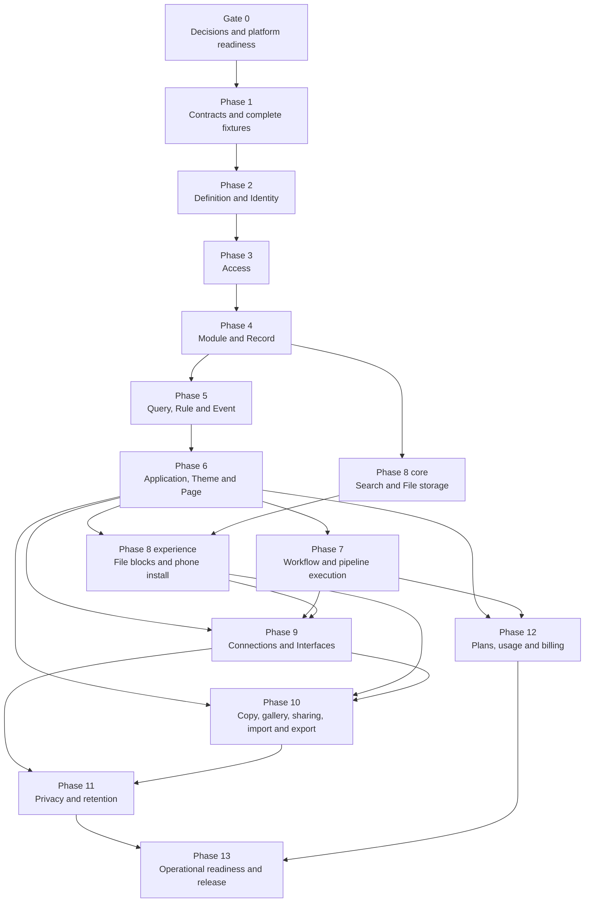

# Abzum Vortex revised build plan

**Status:** Approved build plan 2.0

**Date:** 1 September 2026

**Governing specification:** [Abzum Vortex platform specification](../specification/README.md)

**Delivery board:** [Vortex GitHub Project](https://github.com/orgs/Abzum-NZ/projects/2/views/1)

This plan replaces the sequencing of the earlier [Build Plan](https://claude.ai/code/artifact/58852ead-2acc-4ca6-a693-6cb03705bcef). It keeps the useful ownership boundaries while correcting missing dependencies, an impossible background-worker assumption, incomplete fixtures, and an oversized final phase.

The [decision register](../specification/appendices/decisions.md) is clear. Vortex assigns the minimum valid next module or application release version after structural comparison, and the builder confirms or cancels publication. A new unresolved business choice must be recorded before implementation assumes an answer.

## Planning rules

1. A phase starts only when its required earlier outcomes are working, not merely when their issues exist.
2. Every work item links its governing [specification section](../specification/README.md), [data contract](../specification/appendices/data-contracts.md), and any still-open business choice that can change its outcome.
3. Visible work includes desktop and phone evidence under [quality and acceptance](../specification/20-quality-and-acceptance.md).
4. Organisation separation, privacy, migrations, recovery, and observability are part of the feature—not later cleanup.
5. A phase exit is a tested user or platform outcome, not a count of merged files.
6. Work may run in parallel only where the dependency diagram permits it.
7. Before an issue closes, review the specification, data contracts, build plan, traceability and delivery maps, dependent GitHub issues, and native project dependencies. Update every affected source in the same change, or record explicitly that it was reviewed and needed no change.

## Dependency map

Operations, accessibility, security, documentation, and automated checks are continuous workstreams. Phase 13 proves the complete operating system rather than introducing them for the first time.

## Gate 0 — Decisions and platform readiness

**Status:** Complete in [#151](https://github.com/Abzum-NZ/Abzum-Vortex/issues/151) on 2 September 2026.

**Outcome:** The project has one authoritative approved specification, permanent requirements for settled choices, a clear register, complete source fixtures, and a delivery path that can safely begin contracts.

Required work:

- Verify the settled tenant, definition-version, access, field, workflow, privacy, billing, delivery, recovery, and performance requirements against the [data contracts](../specification/appendices/data-contracts.md).
- Keep cluster location out of the product-level sharing choices: one shared-record gateway uses a local adapter or the signed Vortex Federation API.
- Publish Specification 2.0 and update its version history.
- Write and validate the complete [CRM and Service Desk fixture set](../specification/appendices/worked-examples.md), including every module, action, connection type, interface, theme, role, workflow, pipeline, page, query, and cross-application scenario before Phase 1 engine code.
- Define and validate the [record-table allocation](../specification/17-runtime-storage-and-caching.md#record-table-allocation): one table per compatible record-type storage lineage, explicit organisation/application row scope, stable physical tokens, and collision cases covering same-named applications in different organisations.
- Reconcile the repository README with [delivery and testing](../specification/18-delivery-and-testing.md).
- Close the completed backup [issue #132](https://github.com/Abzum-NZ/Abzum-Vortex/issues/132) and move migration/access-rule operation [issue #139](https://github.com/Abzum-NZ/Abzum-Vortex/issues/139) to the start of Phase 2, before the first database migration.
- Update [Phase 1 epic #9](https://github.com/Abzum-NZ/Abzum-Vortex/issues/9) so every active M0 gate is a native dependency.
- Assign the existing Priority values to active work, add a real Bugs filter, add roadmap dates when scheduling begins, use native blocked-by links, and add epic completion criteria on the [GitHub Project](https://github.com/orgs/Abzum-NZ/projects/2/views/1).

Exit proof:

- No blocking foundation decision remains open.
- Every fixture reference resolves in a machine-readable dependency check.
- The documented and configured branch checks agree.
- Phase 1 contains only current work and can be moved to Ready.

## Phase 1 — Contracts and complete fixtures

**Current project epic:** [#9](https://github.com/Abzum-NZ/Abzum-Vortex/issues/9)

**Outcome:** Every later service imports one versioned contract package and validates the complete worked examples without a database.

Build:

- Keep the one deployable Next.js composition root at `apps/web`, following the official Turborepo deployable-application convention; shared packages remain separate workspace members.
- Shared identifier, error, actor, organisation context, revision, dependency and version-range contracts.
- Independently versioned module and application contracts plus their contained-component contracts from [composition and publication](../specification/03-composition-and-publication.md).
- All [data contracts](../specification/appendices/data-contracts.md), including the 22 field types, permissions, queries, events, workflow execution references and protected operations, files, connections, interfaces, federation envelopes, privacy, billing and cache versions.
- Generic contract validator with the versioned safe-error catalogue from [the data contracts](../specification/appendices/data-contracts.md#definition-validation-errors), stable codes, caller-mapped builder-visible locations, deterministic ordering, and protected diagnostics. Runtime validation contains no installed definition or fixture name.
- Module/application version-impact comparison, including Vortex assignment of the minimum valid next release version and builder confirmation or cancellation.
- Storage-catalog and scope contracts that distinguish definition identity, storage lineage, organisation ownership, and application-contained ownership without creating per-installation tables.
- Complete [worked-example fixtures](../specification/appendices/worked-examples.md).
- Types, lint, unit tests, contract tests and build checks that run without a database.

Exit proof:

- Both complete examples validate with no unresolved reference.
- Every record type resolves to exactly one collision-free storage mapping; two same-named CRM applications in different organisations remain isolated, while CRM and Service Desk can read the same organisation-shared Company and Contact records.
- Invalid examples cover every closed list, missing required value, unknown value, incompatible reference and cross-root version failure.
- Schema failures and validation-rule failures produce the same safe public result; adversarial diagnostics never enter that result and no example-specific name appears in the translator or catalogue.
- No service-specific package invents a second form of a shared contract.

## Phase 2 — Definition and Identity

**Current project epic:** [#18](https://github.com/Abzum-NZ/Abzum-Vortex/issues/18)

**Needs:** Phase 1.

**Outcome:** A person can sign in, choose an organisation, tenant administrators can manage a safe organisation hierarchy, and authorised builders can draft, validate, publish and restore modules and applications independently.

Build:

- One environment-wide [Vortex Identity Authority](../specification/02-people-organisations-and-sign-in.md#identity-across-clusters), plus tenants, tenant-administrator assignments, acyclic organisation hierarchy, cluster-local organisation accounts, invitations, sessions and organisation launcher.
- Supabase Auth with asymmetric signing keys and locally verifiable short-lived identity tokens; organisation authority remains live cluster data rather than token claims.
- Neutral bootstrap sign-in with one global identity and a separate account in every organisation the person belongs to.
- Independent module and application draft concurrency, release versions, validation, immutable revision publication, dependency graph and restore. Themes, pages, workflows, interfaces and application roles remain contained in the application; organisation roles remain live access data.
- Platform bootstrap definitions required before the Page service exists.
- Organisation and environment context established at the start of every database transaction.

Exit proof:

- One identity can safely switch between its separate accounts in two organisations, including when those accounts are stored in different test clusters.
- Both clusters verify the same signed identity token locally while refusing an account or role that exists only in the other cluster.
- A stale draft cannot overwrite a later edit.
- Publishing is atomic and a restored version becomes a new draft.
- Definition and identity tables pass their database separation tests.
- Tenant administrators can create and move organisations without gaining record access, and cross-tenant or cyclic hierarchy moves are refused.

## Phase 3 — Access

**Current project epic:** [#31](https://github.com/Abzum-NZ/Abzum-Vortex/issues/31)

**Needs:** Phase 2.

**Outcome:** One permission vocabulary and test catalogue protects database rows and every server surface.

Build:

- Permission, role, assignment, team/group and application-access contracts.
- Canonical PostgreSQL allow/refuse function for row operations.
- Server Access library for files, caches, search, connections, workflows and interfaces.
- Controlled non-administrative trailing wildcards expanded and fingerprinted at role publication.
- Multiple team memberships per organisation account and within-organisation direct record sharing to an account or team with field allowlists.
- Access-version ownership and revocation path.
- Field-level response filtering where specified.
- Source-authoritative grant evaluation that can be called through the same local or federated shared-record gateway contract.
- Split database and end-to-end [organisation separation suite](../specification/20-quality-and-acceptance.md#organisation-separation-suite).

Exit proof:

- Every database case fails through the request role and succeeds through the matching owner control operation.
- File, cache, subscription and server tests run through real product boundaries, not a table-owner fiction.
- Removing a role, membership, share, or account changes access on the next request.

## Phase 4 — Module and Record

**Current project epic:** [#42](https://github.com/Abzum-NZ/Abzum-Vortex/issues/42)

**Needs:** Phase 3.

**Outcome:** Builders can install modules and people can safely create, change, delete and restore records with all field and relationship rules enforced.

Build:

- Module dependency, install, upgrade and removal planning.
- Storage generation through ordered [database changes](../specification/18-delivery-and-testing.md#database-changes).
- All 22 field types, relationships, calculations, totals and application bindings.
- Record save sequence, concurrency numbers, reference sequences, uniqueness, ownership and data versions.
- Soft deletion, restoration, permanent-removal handoff and bounded bulk operations.
- Migration workflow for incompatible field changes; no arbitrary in-place retype.

Exit proof:

- CRM records pass create/change/conflict/delete/restore tests.
- Parent deletion is refused for unresolved required links except explicit dependent-child soft-delete; soft-deleted unique values remain reserved; mixed-currency totals refuse; and incompatible field changes follow add/migrate/switch/retire.
- A failed save produces no record change, activity entry or event.

## Phase 5 — Query, Rule and Event

**Current project epic:** [#53](https://github.com/Abzum-NZ/Abzum-Vortex/issues/53)

**Needs:** Phase 4.

**Outcome:** Every surface can use one safe query contract; immediate rules run during saves; committed events reach consumers in record order.

Build:

- Filter, sort, grouping, total, pagination and saved-view contracts.
- Safe database query compilation with no dropped predicates.
- Client and server rule evaluation with server authority.
- Transactional event outbox, [Supabase Queue](https://supabase.com/docs/guides/queues), webhook wake-up, sequence barrier, retry, failed-event handling and recovery call.
- Private Supabase Realtime Broadcast channels that send content-free invalidations and force an authorised reload.
- Search/file data-version hooks needed by later phases.

Exit proof:

- Lists, summaries and exports agree on access and filter meaning.
- Unsafe filters refuse rather than broaden.
- Duplicate delivery is safe and a later record event never discards or overtakes an earlier blocked event.
- Database-webhook wake-up and scheduled Kestra recovery both deliver from the durable queue without duplication.

## Phase 6 — Application, Theme and Page

**Current project epic:** [#63](https://github.com/Abzum-NZ/Abzum-Vortex/issues/63)

**Needs:** Phase 5.

**Outcome:** Builders can compose and publish complete applications that people can use on desktop and phone.

Build:

- Module bindings, application roles, options, navigation and application resolution.
- Application-contained theme settings, platform-theme binding, inheritance and legibility checking.
- Six page types, four list arrangements, registered blocks, twelve-column responsive layout and page states.
- [Next.js client-side navigation and scoped loading](../specification/07-applications-pages-and-themes.md#core-ui-continuity-and-motion): persistent application shell, route and block loading boundaries, on-demand code and data, component-level refresh, restrained state transitions, and equivalent reduced-motion behaviour. Use Motion for React for coordinated presence and layout changes, CSS transitions for simple control feedback, the six central semantic tokens, interruptible state-driven motion, and lazy-loaded Motion features; do not depend on experimental Next.js View Transitions.
- Forms, guided-form drafts, action buttons and public pages.
- Complete process-pipeline definition, transition gates and visible stage controls. Timed execution comes in Phase 7.
- Platform Sign-in, Tenant Portal, and Organisation Portal application definitions.

Exit proof:

- Complete CRM and Service Desk applications each publish as one root revision with exact module-version bindings.
- Every fixture page passes desktop, phone, keyboard, validation, empty, refused, conflict and failure checks that apply.
- Internal navigation never performs a routine full document reload; slow routes and blocks show immediate local feedback, and refreshing data updates only affected components and dependent totals without losing unrelated state.
- A delayed response or unfinished animation for an obsolete record, page, or access state never flashes or replaces the current authorised state; no feature defines its own motion timing or spring.
- Direct addresses cannot bypass page and action permissions.

## Phase 7 — Workflow and pipeline execution

**Current project epic:** [#75](https://github.com/Abzum-NZ/Abzum-Vortex/issues/75)

**Needs:** Phases 5 and 6.

**Outcome:** Durable workflows and pipeline time targets execute with [Kestra](https://kestra.io/docs) authoritative for execution status while Vortex remains authoritative for business data and access.

Build:

- Workflow triggers and the governed node catalogue: flow control, bounded queries/loops, record actions, asks/approvals, notifications, email, documents/files, and named connection operations.
- Refusal of arbitrary SQL, JavaScript, shell, unrestricted expressions, arbitrary network/file operations, and builder-supplied executable nodes.
- Versioned signed protected-operation contract and duplicate-safe business side effects.
- [Kestra](https://kestra.io/docs) flow generation, execution start, authoritative status reads, outage display, and operator correlation.
- Pipeline stage-time targets, events and escalation workflows.

Exit proof:

- The qualification and deal-won workflows survive retry, callback duplication, web deployment and [Kestra](https://kestra.io/docs) restart.
- Every completed, waiting, cancelled and failed run displays Kestra's current state; Vortex's last-known snapshot is labelled unavailable rather than presented as current during an outage.
- Phase 7 uses the Phase 6 action, form, page and pipeline contracts rather than inventing replacements.

## Phase 8 — Search and File

**Current project epic:** [#87](https://github.com/Abzum-NZ/Abzum-Vortex/issues/87)

**Needs:** Phase 4 for core storage; Phase 5 for derived updates and purge queues; Phase 6 for blocks, pages, theme and install experience; Phase 7 for scheduled removal and notification work.

**Outcome:** People can find permitted records and safely upload, preview, download, restore and remove files.

Build in two streams:

- **Core after Phase 4:** search documents, ranking, access recheck, file metadata, private Supabase Storage buckets, signed and resumable transfers, upload/download grants, detection, scanning, quarantine and lifecycle.
- **Experience after Phases 5–7:** page blocks, attachment controls, previews, live search freshness, phone installation, usage notices, scheduled purge and recovery.

Exit proof:

- Search and file paths pass their end-to-end organisation-separation cases.
- Sensitive fields never enter general search or file-derived search.
- Attachment configuration uses one decided contract.
- Deletion, retention, legal hold and restore paths are integrated, not deferred.

## Phase 9 — Connections and Interfaces

**Current project epic:** [#98](https://github.com/Abzum-NZ/Abzum-Vortex/issues/98)

**Needs:** Phases 6–8.

**Outcome:** Approved systems and registered Vortex clusters can interact through narrow, versioned, monitored operations.

Build:

- Connection types and instances, OAuth lifecycle, secret rotation, outgoing operations, incoming verification, network-address safety, shared retry budgets and health.
- Versioned interface operations, authentication, duplicate protection, rate limits, compatibility ranges and deprecation.
- [Federation transport and cluster trust issue #157](https://github.com/Abzum-NZ/Abzum-Vortex/issues/157): Vortex cluster directory, signed manifests, request-signing and verification library, replay protection, and version negotiation used by the [federation runtime](../specification/17-runtime-storage-and-caching.md#vortex-federation-between-clusters).

Exit proof:

- Connection addresses cannot reach unapproved private infrastructure.
- Incoming and interface writes are safe under replay.
- Deprecated interface versions cannot be removed while a protected dependency remains.
- [Issue #157](https://github.com/Abzum-NZ/Abzum-Vortex/issues/157) proves signed two-cluster transport, replay refusal, compatible rolling versions, key rotation, route shutdown, and bounded outage before record-sharing operations use it.

## Phase 10 — Copy, gallery, sharing, import and export

**Current project epic:** [#109](https://github.com/Abzum-NZ/Abzum-Vortex/issues/109)

**Needs:** Phases 6, 8 and 9. The sharing and copy policies are settled in the specification.

**Outcome:** Definitions move without source records, record files move through explicit import/export formats, and approved recipients can use narrowly shared live records without copying them, with the same product behaviour inside one cluster and across clusters.

Build:

- Signed definition package manifest, dependency preview, identifier remapping, incomplete-draft handling and reviewed gallery.
- Clear Organisation Portal separation between installing definitions and sharing live records.
- Access-owned sharing grants with one explicit scope, one recipient application, one or more recipient application roles, action/field allowlists, export defaulting off, required expiry, and source-authoritative revocation.
- Inter-application collaborative grants that keep the source record authoritative while allowing only named fields and published shareable actions; the CRM and Service Desk fixture proves a limited case presentation with controlled changes and no copied summary record.
- Published, version-pinned saved sharing conditions with declared parameters; no inline grant filters and no silent widening after publication.
- Protected source approval and recipient acceptance over the same complete proposal fingerprint for every cross-organisation grant.
- [Cross-cluster execution issue #156](https://github.com/Abzum-NZ/Abzum-Vortex/issues/156): one shared-record gateway with a local adapter and signed remote adapter; source-authoritative query, action, file, revocation, and audit behaviour.
- Signed duplicate-safe cross-cluster proposal, acceptance, activation receipt, revocation notice, and status reconciliation.
- Protected exact sharing-code or invitation-link recipient discovery, and linked source/recipient usage allocation without double counting.
- Ordinary list, detail, search-result, report, dashboard-block, action, and approved-export components backed by the shared-record gateway, with visible source ownership and source-unavailable states.
- Source-executed shared search, reports, and exports with no recipient index, materialised report result, persistent record/file copy, workflow payload, or cross-request shared-data cache.
- Source-owned file access, activity, privacy, same-cluster tests, and two-cluster tests.
- Record import mapping, dry run, duplicate policy, bounded background execution and result report.
- Access-checked expiring record export.
- Complete encrypted organisation archive and controlled restore as a separate operator operation.

Exit proof:

- Cross-organisation copy removes or remaps organisation-specific state.
- Installing a definition never grants record access, and a record grant never copies or installs a definition.
- Direct approval-record edits cannot activate grants; every grant proves source approval and recipient acceptance over one fingerprint; a changed condition, role, field, action, export choice, region, or expiry requires both approvals again.
- Source revocation takes effect on the next request; sensitive fields, inline conditions, live re-sharing, recipient indexing, materialised shared reports, persistent remote copies, and unapproved export are refused.
- Revoking the fixture's case grant removes already rendered values on the next access check and prevents browser history, client cache, subscriptions, or offline state from retaining access.
- Shared lists, details, search, reports, dashboard blocks, actions, files, and approved exports have the same permission and result meaning through local and remote adapters while clearly showing source ownership.
- The same fixture grant passes through both local and remote adapters with the same fields, actions, activity meaning, and stable refusal codes.
- A lost cross-cluster message reconciles safely; an altered, replayed, expired, incorrectly addressed, or version-incompatible request fails closed.
- Exact sharing-code or signed-link discovery reveals only the approved organisation name and region; one shared request creates linked source/recipient usage without charging one category twice.
- An approved export is generated at the source, leaves no recipient-cluster copy, includes only approved fields, and presents the non-recallable-download responsibility before transfer.
- Import dry run matches execution.
- Complete archive restore proves definitions, roles, records, files, workflow state and privacy-removal replay.

## Phase 11 — Privacy and retention

**Project epic:** [#164](https://github.com/Abzum-NZ/Abzum-Vortex/issues/164)

**Needs:** Every service that stores personal or derived content.

**Outcome:** The platform can inventory, find, export, restrict, retain, hold and erase personal data across every active and restored copy.

Build:

- Data inventory and personal-data discovery.
- Retention policy preview, scheduling, resumable removal and non-content receipts.
- Legal holds and approvals.
- Organisation-scoped person-data export and erasure across records, files, search, events, workflows, activity details, exports, caches and configured connected systems; global identity closure coordinates every organisation account.
- Removal-receipt replay during restore.

Exit proof:

- A seeded person's data is found and handled across every listed category.
- A legal hold prevents removal without increasing read access.
- A restore test does not resurrect permanently removed content.

## Phase 12 — Plans, usage and billing

**Project epic:** [#165](https://github.com/Abzum-NZ/Abzum-Vortex/issues/165)

**Needs:** Identity plus usage-producing services.

**Outcome:** Tenant plans, organisation-attributed usage, entitlements, announcements, and [Stripe](https://docs.stripe.com/) billing agree under retries, out-of-order events, payment failure, plan change and limit crossing.

Build:

- Tenant-owned versioned plans and entitlements with organisation usage roll-up.
- Duplicate-safe usage ledger and reconciliation.
- [Stripe](https://docs.stripe.com/) checkout/customer portal boundary and signed event processing.
- Trial, active, past-due, grace, cancellation and suspension behaviour.
- Warnings, plan-defined grace, refusal of new consumption after grace, downgrade preview, active-human seat counting, and authorised read/export preservation.
- Accessible platform, tenant, organisation, and application announcement banners with audience, schedule, severity and dismissibility.

Exit proof:

- Replayed and out-of-order billing events produce one correct state.
- Plan downgrade does not silently remove customer data.
- Every usage number can be reconciled to immutable events and corrections.

## Phase 13 — Operational readiness and release

**Project epic:** [#166](https://github.com/Abzum-NZ/Abzum-Vortex/issues/166)

**Needs:** Phases 1–12.

**Outcome:** The complete platform can be deployed, observed, supported, recovered and released against measured promises.

Build and prove:

- Measures, alerts, incident records and tested runbooks from [operations](../specification/19-operations-backup-and-recovery.md).
- Continuous seven-day Supabase point-in-time recovery plus hourly encrypted logical backups in the existing Cloudflare R2 backup account under a separate Vortex bucket or prefix, with a 48-hour requested expiry, hourly cleanup, lifecycle backstop, scheduled restore, workflow reconciliation, file integrity and privacy-removal replay.
- SSL enforcement, exposed-schema review and platform adviser review. Supabase CIDR restrictions are deferred until both Kestra and Vercel have stable outbound IP ranges; DNS names cannot be allowlisted.
- No read replica in the first release; measured demand must create and justify future work.
- Secret inventory and rotation drills.
- Full separation, accessibility, measured performance, load, failure and recovery acceptance. Performance findings create work but never block a release by themselves.
- Production release checklist, change record, support boundary and customer communication path.

Exit proof:

- Restore evidence meets the one-hour recovery-point and eight-hour recovery-time objectives.
- No blocking decision, unresolved reference, critical alert, untested migration or failed acceptance case remains.
- The release candidate is traceable from specification and decision through issue, code, migration, evidence, deployment and runbook.

## Project-board operating structure

The [GitHub Project](https://github.com/orgs/Abzum-NZ/projects/2/views/1) follows these implemented rules:

1. Gate 0 [#151](https://github.com/Abzum-NZ/Abzum-Vortex/issues/151), repository boundaries [#10](https://github.com/Abzum-NZ/Abzum-Vortex/issues/10), identifier/reference contracts [#11](https://github.com/Abzum-NZ/Abzum-Vortex/issues/11), complete domain contracts [#12](https://github.com/Abzum-NZ/Abzum-Vortex/issues/12), safe validation errors [#13](https://github.com/Abzum-NZ/Abzum-Vortex/issues/13), and complete fixtures [#16](https://github.com/Abzum-NZ/Abzum-Vortex/issues/16) are complete. Version impact [#14](https://github.com/Abzum-NZ/Abzum-Vortex/issues/14) and validation ownership [#15](https://github.com/Abzum-NZ/Abzum-Vortex/issues/15) remain the next Ready items and may run in parallel; final Vercel gate evidence [#17](https://github.com/Abzum-NZ/Abzum-Vortex/issues/17) follows both.
2. Native GitHub blocked-by relationships govern sequencing; body text explains but does not replace them.
3. Every phase epic has an outcome and completion evidence.
4. Phases 11–13 use epics [#164](https://github.com/Abzum-NZ/Abzum-Vortex/issues/164), [#165](https://github.com/Abzum-NZ/Abzum-Vortex/issues/165), and [#166](https://github.com/Abzum-NZ/Abzum-Vortex/issues/166). Activity/privacy/retention, plans/billing, and operations issues belong to those epics rather than Phase 10.
5. Extension-point use belongs to Phase 4 and standard-page replacement belongs to Phase 6; they are no longer deferred to distribution work.
6. Priority is explicit on every project issue: `P0 — Critical`, `P1 — Next`, `P2 — Planned`, or `P3 — Later`. The Bugs view filters `label:bug`; roadmap dates and Iteration remain empty until work is genuinely scheduled.
7. Completed backup [issue #132](https://github.com/Abzum-NZ/Abzum-Vortex/issues/132) is closed. Migration and access-rule operation [issue #139](https://github.com/Abzum-NZ/Abzum-Vortex/issues/139) is a Phase 2 prerequisite blocked by Phase 1.
8. Every later board change follows the current specification and keeps the decision register limited to genuinely open business choices.
