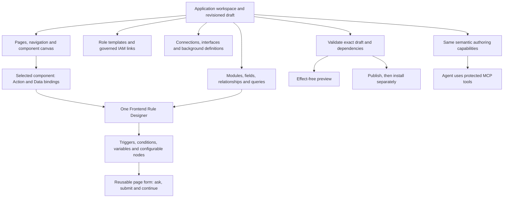

# App Designer HTML prototype

Task: [#323](https://github.com/Abzum-NZ/Abzum-Vortex/issues/323). Retained design checkpoint; further work is deferred until the [engine-first application proof](engine-first-application-delivery.md). The full prototype is not yet complete.

**Blocked by:** [complete definition-first application proof #327](https://github.com/Abzum-NZ/Abzum-Vortex/issues/327).

[Build plan](README.md) · [Application specification](../specification/07-applications-pages-and-themes.md) · [Fluid reuse map](fluid-integration-map.md) · [Frontend Rule Designer](../specification/appendices/frontend-rule-designer.md)

## Outcome and timing

Before implementing the App Designer interface, deliver a clickable HTML prototype that lets a builder understand and try the complete application-authoring journey. This is a design deliverable, not a working Vortex installation, database, workflow engine or MCP server. Mark demonstrations and simulated outcomes visibly. Do not deploy prototype code as the production builder.

Current implementation priority remains [record visibility #36](https://github.com/Abzum-NZ/Abzum-Vortex/issues/36) and [access administration #40](https://github.com/Abzum-NZ/Abzum-Vortex/issues/40), then [consistent data-access enforcement #35](https://github.com/Abzum-NZ/Abzum-Vortex/issues/35), followed by the genuine engine dependencies. Do not expand this prototype in parallel now: first prove a complete file-defined application can be installed and used. Preserve the approved layout for later designer work. This prototype never blocks headless application lifecycle, [page composition #249](https://github.com/Abzum-NZ/Abzum-Vortex/issues/249), [bindings #250](https://github.com/Abzum-NZ/Abzum-Vortex/issues/250), runtime rendering or [flow execution #58](https://github.com/Abzum-NZ/Abzum-Vortex/issues/58).

## Canvas-first layout — user direction, 7 September 2026

Use the supplied Fluid shell-editor layout as the visual reference, not its example application's business content. The far-left navigation always represents the whole application: Application, Modules, Pages, Navigation, Frontend flows, Background workflows, Roles & access, Connections and Appearance. Counts reflect the current draft. A separate contextual panel beside it contains a searchable component palette for pages or node palette for flows. The central area is the working canvas; the right panel configures the selected component, node or definition. Keep the current organisation, application and draft revision visible.

Dragging a component from the palette adds it to the page. Dragging a flow node adds it at the drop position; nodes can be repositioned and connected through labelled input/output ports. Conditions expose distinct branch outputs. Click-to-add, click-to-connect, keyboard positioning and semantic agent operations must perform the same draft changes. Connections, not visual position or source-array order, describe flow routes. Managed internal graphs are not disclosed. The dark editor chrome is separate from the theme of the application being designed.

The [self-contained prototype](../prototypes/app-designer/index.html) is disposable design evidence. Its canvas mechanics are not the production editor adapter or flow engine; the selected [React Flow integration](../specification/appendices/frontend-rule-designer.md) remains owned by the existing implementation tasks.

## What to build

1. **One application workspace.** Keep the selected organisation, application and draft status visible. Provide a clear outline of modules, pages, navigation, frontend flows, background workflows, roles/access, connections/interfaces and appearance. Start with a useful working surface rather than an introductory dashboard. Use progressive disclosure: a builder sees relevant settings for the selected item, not all platform concepts at once.
2. **Data and composition journey.** Demonstrate creating an application, adding more than one module, defining fields and a relationship, selecting an exposed query and adding a page. Show the difference between organisation-shared data and application-contained data in plain language. Keep module and application release versions distinct. Example content is replaceable prototype data, never business-specific engine logic.
3. **Page workspace.** Reuse the inspected Fluid experience where appropriate: searchable component palette, page/structure outline, canvas and contextual inspector. Demonstrate adding, reordering and configuring a records table, form and action button. Supply keyboard alternatives to drag operations and responsive preview. Use a single selection model so the outline, canvas and inspector stay in agreement.
4. **Flows alongside pages.** Selecting a component exposes Action and Data bindings. Create or choose a flow without losing the page context. Show editable Save form and Query/Return defaults as nodes in the one Frontend Rule Designer. Demonstrate a condition, a typed flow variable, a Show form pause/resume, an explicit write and a Start background workflow node. Conditions reuse the same interaction pattern as list filters. The table example can read, transform, explicitly write, read again and return rows; preview itself performs no effects.
5. **Understandable authority and results.** Show per-node Current user, Specified user and scoped System choices, with separate permission to configure and permission to execute. Demonstrate a managed-flow lock with editable public settings and no private internals. Show validation failures, missing execution authority, stale draft conflict and truthful draft/committed/partial/background-pending states. A cancelled input form cannot undo an earlier explicitly committed operation. Role assignments link to the ordinary IAM journey; the builder does not grant access by editing role-template records.
6. **Preview and release journey.** Demonstrate exact-draft preview, a dependency/validation summary, publication, then separate installation/upgrade readiness. Missing dependencies or authority remain visible and unresolved; a simulated success must never imply a real application was published or installed.
7. **Complete agent-authoring coverage.** For every meaningful editing or release step, document the equivalent permission-checked semantic MCP operation, its inputs, current draft revision and result. Include discovering available capabilities; creating and editing modules, fields and relationships; composing pages/slots/navigation; configuring queries, filters, variables, node graphs and bindings; roles/templates; connections/interfaces without exposing secrets; validation, preview, publish and installation. Identify owning implementation tasks, not invented delivered tool names. UI controls and tools must use the same protected operations, not independent mutation paths, screen coordinates or Puck internals.

## Acceptance criteria

- [ ] Deliver an HTML prototype with linked local assets or a self-contained HTML file, a clear entry point and a short walkthrough. Keep it separate from shipping runtime code.
- [ ] A person can follow the create → data → page → flow → validate → preview → release walkthrough without unexplained dead ends. Unsupported live capabilities are identified as simulated, not silently successful.
- [ ] Show the page/table/form/button-to-flow relationship directly in the inspector and a visible flow diagram. Returning from flow editing preserves the selected component and draft.
- [ ] Demonstrate empty, validation-error, stale-conflict, unavailable-authority, loading and successful draft states, plus a managed-flow restriction and an interactive form continuation.
- [ ] Keyboard/focus, desktop/tablet/phone layout, readable labels and reduced-motion behavior are checked. Capture screenshots of the major working surfaces and record the walkthrough evidence.
- [ ] A capability matrix covers the whole application journey through UI and semantic MCP operations. A mock operation inspector is labelled as a demonstration; actual authenticated MCP transport and full parity proof remain [#200](https://github.com/Abzum-NZ/Abzum-Vortex/issues/200).
- [ ] An independent Sol reviewer checks the actual prototype against this task and the current specification, including generic-core boundaries, missing authoring capabilities and misleading simulated results. Incorporate actionable findings before calling the prototype complete.
- [ ] Update the [Fluid integration map](fluid-integration-map.md), [App Builder #64](https://github.com/Abzum-NZ/Abzum-Vortex/issues/64), [canvas #65](https://github.com/Abzum-NZ/Abzum-Vortex/issues/65), [bindings #250](https://github.com/Abzum-NZ/Abzum-Vortex/issues/250) and [MCP #200](https://github.com/Abzum-NZ/Abzum-Vortex/issues/200) with any concrete implementation gaps found; do not add a second designer or permission engine.

## Composition

The prototype demonstrates this experience. The existing service owners and dependency plan implement it later; no mock adapter becomes an authority boundary.
