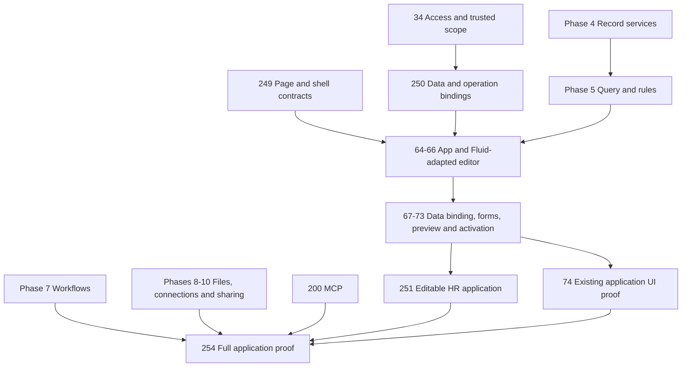

# Architecture review and corrected delivery order

[Build plan](README.md) · [Specification](../specification/README.md) · [GitHub Project](https://github.com/orgs/Abzum-NZ/projects/2/views/1) · [Page contracts](../specification/appendices/page-builder-contracts.md)

## Review boundary

Reviewed the repository-wide specification/task coverage and the dependency graph, with a focused static review of page/source contracts, definition compilation and Fluid's editor/persistence/composition paths. The initial GitHub inventory contained 143 issues, including 109 open issues; all 109 native blocked-by lists were retrieved. This is not a claim that every runtime line has been security-audited or that unimplemented engines work.

The inspected documentation baseline is Testing commit `f84fc46915f3d1f200d426b37360fe2ea321571b`. The active local Vortex checkout was older and was not used as the authority for current implementation findings. This review changes documentation and task planning only; it does not modify the active parent-thread implementation, Fluid source, database, deployment or secrets.

## Findings and owners

### Specification 2.15 follow-up: organisation-managed access

The later organisation-role review corrected an implicit dependency missed by the earlier phase map: #27 proves membership, while #30 also needs actual organisation management permissions. Shared #32/#33/#34 foundations therefore advance from completed #22/#28/#224 and #24/#27 before #30, then #29 completes the Phase 2 administration/isolation outcome. This does not remove any Phase 2 requirement or introduce a tenant-capability shortcut for organisation operations.

All live role registrations, assignments and delegation are organisation-managed. Application templates are immutable published content; activation registers them without assigning access. One custom role may select exact scoped permissions across applications. Use rights and bounded assignment authority are separate, with explicit stewardship and no privilege expansion through application updates or reciprocal delegation. The [platform administration catalogue](../specification/appendices/platform-permission-catalogue.md) fixes the initial genuine platform permission identities without adding a business domain.

The early #34 core is generic, not an administration-only evaluator. Every operation declares its required target policies; unavailable implementations refuse rather than treating permission eligibility as final record authority. Its existing row, ownership/condition, field/action, caller, sharing and consent obligations remain explicitly owned by #35/#36/#37/#104/#107/#153/#154/#156. #36 delivers the early condition-to-row restriction foundation; #57 reuses it for later rule/UI work, avoiding a reverse dependency on Phase 5. The exact retained acceptance text is recorded in those GitHub tasks before narrowing the early foundation's completion claim.

### Earlier review findings

| Finding | Required correction | Delivery owner |
|---|---|---|
| Tenant governance requires the active organisation context it must create or restore | Distinguish server-resolved tenant-administrator operations from organisation-local account/data operations; preserve #27's checks | [#30](https://github.com/Abzum-NZ/Abzum-Vortex/issues/30) |
| Page contract is flat while the canvas promises nesting and shells | Add canonical declared slots, nested placement identity and shell ownership; preserve old releases | [#249](https://github.com/Abzum-NZ/Abzum-Vortex/issues/249) |
| Literal settings accept JSON without useful property constraints | Registry-driven recursive types, defaults, safe rich text/assets, arrays/groups and typed references | [#249](https://github.com/Abzum-NZ/Abzum-Vortex/issues/249), [#66](https://github.com/Abzum-NZ/Abzum-Vortex/issues/66) |
| Record pages reject legitimate related-record panels | Explicit subject/relationship/query/row contexts, each authorised | [#250](https://github.com/Abzum-NZ/Abzum-Vortex/issues/250), [#67](https://github.com/Abzum-NZ/Abzum-Vortex/issues/67) |
| Forms and administration lack a sufficiently explicit operation binding | One typed input/validation/revision/confirmation/result contract before UI; no arbitrary RPC | [#250](https://github.com/Abzum-NZ/Abzum-Vortex/issues/250), [#102](https://github.com/Abzum-NZ/Abzum-Vortex/issues/102) |
| Direct-report access and no-self-approval need trusted actor-relative conditions | Complete declared relationship scopes and server-bound current-account parameters, not UI filters or HR code | [#34](https://github.com/Abzum-NZ/Abzum-Vortex/issues/34), [#57](https://github.com/Abzum-NZ/Abzum-Vortex/issues/57), [#81](https://github.com/Abzum-NZ/Abzum-Vortex/issues/81) |
| Tablet layout, content height and theme tokens do not match promises | Explicit responsive inheritance, flexible layouts and complete safe token contracts | [#249](https://github.com/Abzum-NZ/Abzum-Vortex/issues/249), [#65](https://github.com/Abzum-NZ/Abzum-Vortex/issues/65), [#71](https://github.com/Abzum-NZ/Abzum-Vortex/issues/71) |
| Editor bans useful text/styling, and hides meaningful versions | Permit typed text and token-based styling; show versions in publication/upgrade review | [#64](https://github.com/Abzum-NZ/Abzum-Vortex/issues/64), [#67](https://github.com/Abzum-NZ/Abzum-Vortex/issues/67), [#70](https://github.com/Abzum-NZ/Abzum-Vortex/issues/70) |
| Page routes follow labels; publish is confused with activation | Stable route keys; draft, preview, publish, install/activate and restore are distinct | [#64](https://github.com/Abzum-NZ/Abzum-Vortex/issues/64), [#73](https://github.com/Abzum-NZ/Abzum-Vortex/issues/73) |
| Phase 4 generated UI requires Phase 6, which requires Phase 4 | Move #52 to Phase 6; Phase 4 closes on headless service evidence | [#42](https://github.com/Abzum-NZ/Abzum-Vortex/issues/42), [#52](https://github.com/Abzum-NZ/Abzum-Vortex/issues/52) |
| Phase 6 fixture task requires Phases 7–10 executors | Keep local record/query/form/rendering proof in Phase 6; add final cross-phase proof | [#74](https://github.com/Abzum-NZ/Abzum-Vortex/issues/74), [#254](https://github.com/Abzum-NZ/Abzum-Vortex/issues/254) |
| Guided-form draft storage is duplicated/deferred | Phase 6 owns private drafts; Phase 7 connects workflow waits | [#68](https://github.com/Abzum-NZ/Abzum-Vortex/issues/68), [#83](https://github.com/Abzum-NZ/Abzum-Vortex/issues/83) |
| Workflow run UI task has no deliverables | Explicit generic run projection, controls, outage, access and evidence | [#86](https://github.com/Abzum-NZ/Abzum-Vortex/issues/86) |
| Search engine waits for its own future settings screen | Core after records; settings and blocks consume it later | [#88](https://github.com/Abzum-NZ/Abzum-Vortex/issues/88), [#89](https://github.com/Abzum-NZ/Abzum-Vortex/issues/89) |
| Activity, capacity and deletion eligibility arrive after consumers | Small early foundations, reused rather than duplicated by late phases | [#252](https://github.com/Abzum-NZ/Abzum-Vortex/issues/252), [#118](https://github.com/Abzum-NZ/Abzum-Vortex/issues/118), [#253](https://github.com/Abzum-NZ/Abzum-Vortex/issues/253) |
| Private signed URLs cannot satisfy next-request revocation | Authenticated private file gateway, current checks for download/preview/range; direct upload rechecks at activation | [#93](https://github.com/Abzum-NZ/Abzum-Vortex/issues/93), [#156](https://github.com/Abzum-NZ/Abzum-Vortex/issues/156) |
| File task contradicts scanning, hold and retention policy | Keep quarantine/scanning, use current policy and protected hold eligibility | [#94](https://github.com/Abzum-NZ/Abzum-Vortex/issues/94), [#253](https://github.com/Abzum-NZ/Abzum-Vortex/issues/253) |
| Realtime initial authentication is mistaken for perpetual authority | Verify destination-cluster token support, invalidate/re-authorise on access change, reload through access checks | [#56](https://github.com/Abzum-NZ/Abzum-Vortex/issues/56), [#156](https://github.com/Abzum-NZ/Abzum-Vortex/issues/156) |
| External effect-once guarantee exceeds what a local key proves | Provider idempotency or explicit unknown-outcome reconciliation | [#76](https://github.com/Abzum-NZ/Abzum-Vortex/issues/76), [#100](https://github.com/Abzum-NZ/Abzum-Vortex/issues/100) |
| Performance timings and sequential scans still block builds | Remove performance-only failure criteria; retain integrity/access and structural bounds | [#46](https://github.com/Abzum-NZ/Abzum-Vortex/issues/46), [#58](https://github.com/Abzum-NZ/Abzum-Vortex/issues/58), [#77](https://github.com/Abzum-NZ/Abzum-Vortex/issues/77) |
| Unsafe predicate is dropped; currency totals change shape | Refuse invalid queries; explicit currency grouping only; avoid derived-value access leaks | [#54](https://github.com/Abzum-NZ/Abzum-Vortex/issues/54), [#48](https://github.com/Abzum-NZ/Abzum-Vortex/issues/48) |
| Four-policy template incorrectly includes private service tables | Generated business tables use operation policies; private tables retain narrow owner-function access | [#35](https://github.com/Abzum-NZ/Abzum-Vortex/issues/35) |
| Single-Group/field-nonconfigurable leftovers contradict access spec | Multiple Groups, direct-share scopes and configurable field read/write contracts | [#36](https://github.com/Abzum-NZ/Abzum-Vortex/issues/36), [#37](https://github.com/Abzum-NZ/Abzum-Vortex/issues/37) |
| Extension publication checks installed consumers and can deadlock releases | Publish immutable breaking version; enforce compatibility at consumer adoption; no last-writer field/permission override | [#110](https://github.com/Abzum-NZ/Abzum-Vortex/issues/110), [#111](https://github.com/Abzum-NZ/Abzum-Vortex/issues/111) |
| Full archive/restore has no explicit task and needs later privacy policy | Add separate Phase 11 task, distinct from tabular import and provider backup | [#255](https://github.com/Abzum-NZ/Abzum-Vortex/issues/255), [#170](https://github.com/Abzum-NZ/Abzum-Vortex/issues/170) |

## Complete subject coverage

| Specification area | Review disposition |
|---|---|
| 1 Purpose and core boundary | Retain generic primitives; HR and operational applications are consumers, not core domains. |
| 2 Identity, tenants and organisations | Retain one identity/many separate accounts, tenant hierarchy and provider-owned sessions. Do not disturb current Phase 2 work. |
| 3 Publication and compatibility | Retain immutable releases and explicit consumer adoption; correct page contexts and publish-versus-activate language. |
| 4 Access | Complete actor-relative/relationship scope contracts; correct Groups, fields and private-table handling. |
| 5 Modules, fields and relationships | Retain storage-lineage identity and separate ownership scopes; correct unique-index readiness and mixed-currency task wording. |
| 6 Record lifecycle | Require transactional evidence, concurrency and safe derived values; no HR-specific saves. |
| 7 Applications/pages/themes | Substantial contract completion and Fluid adapter defined in the linked appendix. |
| 8 Forms/actions/rules/events | Typed form bindings, trusted condition parameters and server-authoritative actions; no performance-only gate. |
| 9 Workflows/pipelines | Ordinary approval composition, human-input draft reuse and honest third-party outcome handling. |
| 10 Queries/search/live data | No dropped predicates; related contexts, pre-aggregation access and corrected engine/UI dependencies. |
| 11 Files | Private request-time authorization, scanning and policy-driven purge/hold foundation. |
| 12 Connections/interfaces/MCP | Keep one operation path; move its generic descriptor foundation before UI, retain later protocol/authentication integration. |
| 14 Privacy/retention | Early append/eligibility foundations; later all-store coverage and archive removal replay. |
| 15 Entitlements/metering | Keep only generic capability policy; deliver its headless enforcement before consumption. |
| 16 Copy/share/import/export | Retain definition-versus-record separation and source authority; give full archive an owner. |
| 17 Runtime/storage/cache | Retain sixteen service ownership boundaries and lineage-scoped tables; no per-org schema fan-out; fix files/Realtime integration assumptions. |
| 18 Delivery/testing | Use isolated documentation branch and protected normal workflow; no environment mutation for this review. |
| 19 Operations/recovery | Preserve settled recovery policy; add complete archive dependency to rehearsal, not to early implementation. |
| 20 Quality/acceptance | Separate contract, local integration and cross-phase evidence; no mocks counted as delivered functionality. |
| Contract/version/traceability appendices | Coordinate new representation, compilation/provenance/version impact and immutable readers; extend maps and examples. |
| Decision register | HR scope, workflow approvals and no self-approval are resolved in the permanent example specification; no open business choice from this review. |

## Fluid reuse decision

The [rechecked integration map](fluid-integration-map.md) records the 5 September inspection of the exact board editor, concrete source-to-service wiring, preservation requirements and dependency-led implementation proof.

| Inspected area | Treatment |
|---|---|
| [Fluid editor](http://localhost:3001/builder/edit/projects), source at `C:/Apps/fluid/apps/web/components/builder/puck-editor.tsx` | Adapt canvas, outline, palette and responsive-preview interaction. The reference source belongs to a separate local repository. |
| `C:/Apps/fluid/packages/blocks/src/lib/compose.ts` | Reuse the shell/outlet idea; rewrite traversal around declared typed slots instead of guessing that any array is child content. |
| `C:/Apps/fluid/apps/web/lib/pages.ts` and `apps/web/app/actions.ts` | Replace filesystem persistence, reset-on-read-error and unauthorised mutations with Vortex Definition-service operations. |
| `C:/Apps/fluid/apps/web/lib/apps.ts` | Replace copied navigation/theme cascades with canonical application inheritance. |
| `C:/Apps/fluid/packages/blocks/src/blocks/data.tsx` | Adapt generic rendering; replace sample rows/links with typed Query/Action projections. |
| `C:/Apps/fluid/packages/blocks/src/lib/tabs.ts` | Replace unscoped browser persistence with scoped ephemeral view state; no sensitive HR labels in a generic session-storage key. |
| Local Fluid MCP/demo applications | Do not copy into Vortex core; use the governed Vortex MCP workstream and ordinary example definitions. |

The source snapshot may continue changing independently. Re-check the exact files and licenses when implementation begins. Do not vendor the whole prototype to avoid writing a small adapter.

## Dependency order

- The native graph initially had no cycles. Several **completion descriptions** nevertheless created implicit cycles; those are corrected above.
- #258 is the first independent contract correction and requires no database deployment. #249 follows it and the completed contract foundations, including Definition storage/read/restore #19/#21/#22. It needs a bounded additive Definition-store migration for permanent shell identities and exact platform-block dependency storage, publication and readback. Existing JSONB draft/release tables and immutable V1 rows remain unchanged. Its implementation can proceed independently, but completion requires the normal Local proof and corrected hosted Testing gate #266; it authorises no Production work and does not bypass the explicit hold on #30.
- #250 follows Access #34 and defines common operation/binding semantics before UI. #102 extends it later for interfaces and the complete operation catalogue.
- #249 first freezes V1 behavior, then implements the [exact representation selectors](../specification/appendices/page-builder-contracts.md#exact-representation-selection) across source, compilation, persistence, history and consumers before extending V2 composition. Use existing version columns rather than a parallel registry. Verify the additive migration against a confirmed Local baseline without resetting an existing or shared environment.
- #252 and #118 follow Access and precede their first consuming mutations/limited work.
- #52 moves to Phase 6; #42 must not wait for it.
- #83 consumes #68 drafts; #89 no longer waits for #88; #96 explicitly consumes the renderer.
- #82 external delivery waits for #100 and is excluded from Phase 7 engine exit.
- #255 runs after #117, not as a Phase 10 prerequisite of privacy itself.
- #254 follows the real later engines and gates final acceptance; it must also include #251's completed HR fixture and workflow evidence.
- Parent-thread request-context work is not replaced by the UI roadmap. This review identifies the independent contract track and later ordering, not permission to interrupt active work.

## Avoiding unnecessary machinery

Keep bounded declarative conditions, stable identities, immutable release evidence, protected access, current grant checks and provider-owned auth. Those enforce actual invariants.

Do not add a third publication root, per-app runtime, duplicate form store, duplicate permission engine, hand-maintained agent-specific schema, per-button MCP tool, new HR approval node, filesystem shadow database or unrestricted expression language.

The definition compiler's repeated traversal/provenance and comparison logic is a maintainability risk, not proof that integrity checks should be removed. As #249 extends it, use schema-directed typed traversal and exhaustive tests where practical. Do not start an unrelated compiler rewrite or remove fingerprint/provenance verification solely to reduce line count.

## Completed-work and project follow-up

The [completed-work review](completed-work-review.md) checks delivered foundations at the same immutable Testing baseline, explicitly excluding in-flight [#27](https://github.com/Abzum-NZ/Abzum-Vortex/issues/27). It confirms literal/reference confusion ([#258](https://github.com/Abzum-NZ/Abzum-Vortex/issues/258)) and identifies the publication lifetime cap ([#257](https://github.com/Abzum-NZ/Abzum-Vortex/issues/257)) as unnecessary product restriction. The revised [project views](README.md#project-board-operating-structure) show ordered phase completion, review-ready PRs and unresolved bugs without synthetic dates. The native graph and issue bodies are read back after every correction batch.
