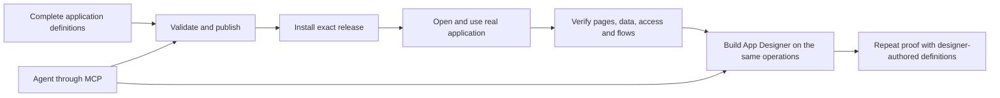

# Engine-first application delivery

[Build plan](README.md) · [Application specification](../specification/07-applications-pages-and-themes.md) · [Designer prototype](app-designer-html-prototype.md)

## Required delivery order

Build the engines before the App Designer. A complete application must be definable in versioned files, validated, published, installed and used in the normal browser runtime without opening a visual editor. The App Designer later creates and changes those same definitions through the same protected operations. A prototype or a static rendering of sample rows does not prove the runtime works.

The existing HTML prototype is retained as design evidence. Further prototype expansion and production designer work are deferred until the definition-first application proof is complete. This is implementation sequencing, not a request for another business approval. Continue Phase 3 access work and the genuine engine dependencies in the meantime.

## What must work without a designer

1. **Complete definitions.** The existing complete application fixture sets include independent module/application versions, record types, fields, relationships, exposed queries, pages, navigation, themes, roles, permissions, frontend flows, background workflows and connection/interface declarations. Validate every reference and dependency. Example-specific names and policies stay in these files, never in the engines.
2. **Publication and installation.** Import or create a draft through the supported definition operations, validate it, publish an immutable release and explicitly install it in the selected organisation. Installation registers the exact definitions and required workflows. Publishing alone changes no live application. Missing engine capabilities or connection configuration are reported honestly rather than replaced with successful mocks.
3. **A usable application runtime.** Open the installed application through its real launcher and routes. Render navigation, pages and registered components from the installed definition. Show permitted records, related data, forms and actions through the owning query/record/access services. This browser runtime is required now; the drag-and-drop editor is not.
4. **Configured behaviour.** Exercise component load/refresh flows, action buttons, conditions, typed variables, record operations and interactive form continuation. Where the packaged application declares background work or connections, prove actual permitted dispatch and results in Testing. Keep preview effect-free and distinguish accepted background work from completed work. Use the existing engines, not page-specific handlers.
5. **Real separation and lifecycle.** Prove two applications, organisation separation, the declared shared-record scenarios and allowed field/edit limits using the existing fixtures. Prove a definition-only change can be validated and deliberately activated without changing core code or unintentionally retargeting an installed release. Include invalid references, refused access and stale edits without inventing a new test framework.
6. **Designer and agent reuse.** Protected, revision-aware definition operations and runtime semantic controls must be usable without private editor state. Later App Designer controls and authenticated MCP tools consume those same operations and artifacts. The full MCP journey remains an explicit delivery requirement; local prototype tools do not satisfy it.

## Completion evidence

The single owner of this complete pre-designer proof is [#327](https://github.com/Abzum-NZ/Abzum-Vortex/issues/327), with its [full acceptance plan](definition-first-application-proof.md). [#64](issue-64-application-runtime.md) supplies the base runtime, not a substitute for this complete proof. [#254](https://github.com/Abzum-NZ/Abzum-Vortex/issues/254) retains later designer/MCP/federation acceptance and therefore cannot block the designer that its own tests require.

- Record exact fixture/definition releases, installation and code revision.
- Demonstrate the installed application in the browser with screenshots and a short user walkthrough, not merely JSON validation or unit-test output.
- Exercise the same protected operations through a non-editor adapter; demonstrate that editing definitions changes the rendered application without engine changes.
- Match successful Testing results to the delivered revision and obtain independent review against the complete application requirements.
- Only after this proof, resume the remaining prototype/design work and wire the App Designer to the proven operations. Re-run the same application scenarios using designer-authored definitions; do not substitute a second application representation.

Task ownership must separate runtime rendering, application lifecycle and reusable block registration from visual-editor integration. No engine task depends on the designer that consumes it. Dependencies are tracked on the existing GitHub board; mixed engine/editor tasks must be clarified rather than marking the entire engine blocked by its own consumer.

| Owner                                                                                                                              | Responsibility                                                                                          |
| ---------------------------------------------------------------------------------------------------------------------------------- | ------------------------------------------------------------------------------------------------------- |
| [#66](issue-66-registered-block-runtime.md)                                                                                        | Registered block implementations and rendering, independent of the designer                             |
| [#73](issue-73-definition-publication.md)                                                                                          | File-authored drafts, validation, publication, preview and restore services                             |
| [#64](issue-64-application-runtime.md)                                                                                             | Explicit installation, runtime navigation and application assembly                                      |
| [#327](definition-first-application-proof.md)                                                                                      | Complete two-application proof, including declared workflows, pipelines, files, sharing and connections |
| [#323](app-designer-html-prototype.md), [#65](issue-65-app-designer.md), [#52](https://github.com/Abzum-NZ/Abzum-Vortex/issues/52) | Prototype completion and visual application/module authoring after the runtime proof                    |

Workflow registration [#76](https://github.com/Abzum-NZ/Abzum-Vortex/issues/76), connection administration [#99](https://github.com/Abzum-NZ/Abzum-Vortex/issues/99), operation catalogue [#102](https://github.com/Abzum-NZ/Abzum-Vortex/issues/102) and sharing [#153](https://github.com/Abzum-NZ/Abzum-Vortex/issues/153) use exact engine dependencies instead of whole phase epics containing later designer work. Existing security and lifecycle requirements are preserved; this changes delivery order, not authorization.
