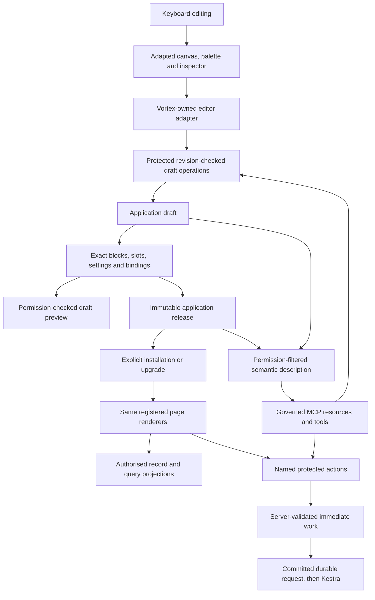

# Fluid builder: reuse and Vortex integration

[Build plan](README.md) · [Architecture review](architecture-review.md#fluid-reuse-decision) · [Page-builder specification](../specification/appendices/page-builder-contracts.md) · [Owning editor task #65](https://github.com/Abzum-NZ/Abzum-Vortex/issues/65)

## What was inspected

On 5 September 2026, the delivery owner opened [the exact running board editor](http://localhost:3001/builder/edit/projects/board) in a separate Edge tab and inspected its page structure and local source. The visible editor has a 46-block palette, outline, application structure, theme and menu panels, a central canvas, property inspector, shell link, preview/publish controls and phone/tablet/desktop previews. No content was edited or published during this inspection. This is a source and interface review, not proof that dragging, keyboard editing, publishing or responsive behaviour has passed Vortex acceptance.

The separate Fluid source (`C:/Apps/fluid`) has base commit `68e3da2bc1224e6f6676c19ae12608fe6ad50345`, but the builder and block files are uncommitted working-tree content. That commit alone does not identify the inspected prototype. Recheck the exact working files, dependencies, assets and licence provenance before copying. No root licence/notice file was found in the inspected source inventory; that is an inventory gap, not a conclusion about ownership or permission.

## Copy the useful interface; replace its operating connections

| Visible capability / source                                                                                                                                   | Treatment                                                                                          | Vortex connection and owner                                                                                                                                                                                                                                                                                                                                                                                                                                                                     |
| ------------------------------------------------------------------------------------------------------------------------------------------------------------- | -------------------------------------------------------------------------------------------------- | ----------------------------------------------------------------------------------------------------------------------------------------------------------------------------------------------------------------------------------------------------------------------------------------------------------------------------------------------------------------------------------------------------------------------------------------------------------------------------------------------- |
| Canvas and inspector (`C:/Apps/fluid/apps/web/components/builder/puck-editor.tsx`)                                                                            | Adapt the interactive layout, selection, undo/redo and inspector presentation.                     | [#65](https://github.com/Abzum-NZ/Abzum-Vortex/issues/65) embeds the editor; [#249](https://github.com/Abzum-NZ/Abzum-Vortex/issues/249) converts between private Puck state and the revisioned Vortex application draft.                                                                                                                                                                                                                                                                       |
| Palette and editor tabs (`C:/Apps/fluid/apps/web/components/builder/builder-tabs.tsx`)                                                                        | Adapt search, categories and panel presentation; replace the hardcoded component/search catalogue. | [#66](https://github.com/Abzum-NZ/Abzum-Vortex/issues/66) supplies the fixed platform block registrations; [#65](https://github.com/Abzum-NZ/Abzum-Vortex/issues/65) derives palette and settings controls from them. Business examples do not define core palette categories or behaviour.                                                                                                                                                                                                     |
| Application structure panel (`C:/Apps/fluid/apps/web/components/builder/structure-tab.tsx`)                                                                   | Adapt tree navigation and creation affordances.                                                    | [#64](https://github.com/Abzum-NZ/Abzum-Vortex/issues/64) owns application structure and lifecycle; [#65](https://github.com/Abzum-NZ/Abzum-Vortex/issues/65) reads the revisioned application draft under Access. All owners have permanent identities; creation uses protected operations.                                                                                                                                                                                                    |
| Shell/outlet composition (`C:/Apps/fluid/packages/blocks/src/lib/compose.ts`) and shell editor (`C:/Apps/fluid/apps/web/components/builder/shell-editor.tsx`) | Retain reusable layouts and editable content regions; rewrite traversal and save extraction.       | [#249](https://github.com/Abzum-NZ/Abzum-Vortex/issues/249) declares every typed slot and ordered placement. Do not infer slots from arrays containing `type`/`props`, derive identities from outlet names, silently append orphaned content, or discard unsupported content during extraction.                                                                                                                                                                                                 |
| Client shell locks (`C:/Apps/fluid/apps/web/components/builder/puck-editor.tsx`)                                                                              | Keep locked-shell visual feedback, not its authority model.                                        | [#65](https://github.com/Abzum-NZ/Abzum-Vortex/issues/65) must refuse forged authoring edits through protected draft operations and central Access ([#34](https://github.com/Abzum-NZ/Abzum-Vortex/issues/34), [#38](https://github.com/Abzum-NZ/Abzum-Vortex/issues/38)). Runtime filtering remains [#69](https://github.com/Abzum-NZ/Abzum-Vortex/issues/69). A removable `_shell` flag is not permission evidence.                                                                           |
| Publish callback and server actions (`C:/Apps/fluid/apps/web/app/actions.ts`)                                                                                 | Rewrite. The prototype saves directly; its Publish label is not Vortex publication.                | Save updates the expected application draft revision; Preview reads that exact draft; Publish creates an immutable application release; Install activates an explicitly selected release. Use Definition [#19](https://github.com/Abzum-NZ/Abzum-Vortex/issues/19), [#21](https://github.com/Abzum-NZ/Abzum-Vortex/issues/21), [#22](https://github.com/Abzum-NZ/Abzum-Vortex/issues/22) and application [#64](https://github.com/Abzum-NZ/Abzum-Vortex/issues/64), with current Access checks. |
| Filesystem page store (`C:/Apps/fluid/apps/web/lib/pages.ts`)                                                                                                 | Discard as a Vortex persistence path.                                                              | No JSON-file writes, seed-on-read-error replacement or silent recovery. Existing Definition storage owns revisions, history, restore and conflict handling.                                                                                                                                                                                                                                                                                                                                     |
| Application theme/menu propagation (`C:/Apps/fluid/apps/web/lib/apps.ts`)                                                                                     | Adapt controls; replace copying theme/navigation into every page or shell.                         | The application owns one inherited theme and navigation definition. [#64](https://github.com/Abzum-NZ/Abzum-Vortex/issues/64) and [#71](https://github.com/Abzum-NZ/Abzum-Vortex/issues/71) edit that owner; affected views refresh gracefully.                                                                                                                                                                                                                                                 |
| Data blocks (`C:/Apps/fluid/packages/blocks/src/blocks/data.tsx`) and board/conversation blocks (`C:/Apps/fluid/packages/blocks/src/blocks/service.tsx`)      | Adapt generic visual renderers; remove demo rows, routes and business defaults from shipping core. | [#250](https://github.com/Abzum-NZ/Abzum-Vortex/issues/250) defines typed bindings; [#67](https://github.com/Abzum-NZ/Abzum-Vortex/issues/67) connects authorised Query/Record projections. Editing a record value is not editing page-definition JSON.                                                                                                                                                                                                                                         |
| Buttons, filters, record links, forms and workflow starts                                                                                                     | Replace demonstration links/click handlers with declared operations.                               | [#250](https://github.com/Abzum-NZ/Abzum-Vortex/issues/250) provides exact subject/input/revision/confirmation bindings. Server actions use current Access; durable work hands off through [#76](https://github.com/Abzum-NZ/Abzum-Vortex/issues/76) and [#77](https://github.com/Abzum-NZ/Abzum-Vortex/issues/77), never direct Kestra credentials.                                                                                                                                            |
| Motion helpers (`C:/Apps/fluid/packages/blocks/src/lib/motion.tsx`) and view tabs (`C:/Apps/fluid/packages/blocks/src/lib/tabs.ts`)                           | Adapt transitions; replace unscoped persistence and global refresh patterns.                       | Preserve the surrounding app shell, focus and unsaved input; refresh only affected regions and respect reduced motion. Private state is scoped to account, organisation, application and revision.                                                                                                                                                                                                                                                                                              |
| Prototype MCP package and demo applications                                                                                                                   | Do not copy into core.                                                                             | [Governed MCP #200](https://github.com/Abzum-NZ/Abzum-Vortex/issues/200) uses semantic controls and the same protected services for navigation, form filling, actions and builder changes, never private editor-adapter state. Examples remain ordinary definitions.                                                                                                                                                                                                                            |

## How the editor is connected

Keep the interactive editor in client components and protected reads/mutations on the server, following [Next.js server/client boundaries](https://nextjs.org/docs/app/getting-started/server-and-client-components). Follow [Puck's declared slot API](https://puckeditor.com/docs/guides/migrations/dropzones-to-slots); its private inline data format remains inside the adapter. Do not replace Vortex's service boundaries with direct database calls from page components.

## Dependency-led delivery and proof

1. Finish [#249](https://github.com/Abzum-NZ/Abzum-Vortex/issues/249): exact composition, compiler, persistence compatibility, conversion and lossless headless adapter. Finish [#250](https://github.com/Abzum-NZ/Abzum-Vortex/issues/250) after its real Access dependency for data/form/action bindings.
2. Deliver [#64](https://github.com/Abzum-NZ/Abzum-Vortex/issues/64) application ownership and lifecycle, then the [#65](https://github.com/Abzum-NZ/Abzum-Vortex/issues/65) canvas and [#66](https://github.com/Abzum-NZ/Abzum-Vortex/issues/66) registered library. Reuse one minimal generic vertical slice first; expand the palette through registered definitions, not a wholesale prototype import.
3. Prove editing, save/reopen, concurrent-edit refusal, shell ownership, distinct guided steps, exact draft preview and immutable publication. No unsupported setting or orphaned content may be silently moved or lost.
4. Connect real data and actions through [#67](https://github.com/Abzum-NZ/Abzum-Vortex/issues/67), [#68](https://github.com/Abzum-NZ/Abzum-Vortex/issues/68) and [#69](https://github.com/Abzum-NZ/Abzum-Vortex/issues/69), testing wrong-account/organisation access, stale revisions and refused operations. A visual placeholder is not evidence that a record or workflow engine works.
5. Capture desktop/tablet/phone screenshots, keyboard/focus evidence, component-scoped refresh and reduced-motion behaviour. Check the same semantic operations through an independent adapter; complete transport parity remains [#200](https://github.com/Abzum-NZ/Abzum-Vortex/issues/200).

## Independent review: additional safeguards

An independent Sol reviewer inspected the prototype source against the current builder tasks. The review agreed with the reuse boundary above and identified these acceptance checks:

- Composition, the structure tree and prototype MCP use different array-shape guesses for slots. Use one schema-declared traversal for all adapters; an empty list property must not become a content slot.
- Validate shell ownership on the server, including root insertions. Reject orphaned content, duplicate identities and unsupported edits visibly; never relocate or discard them during save.
- Shell removal and application deletion need explicit relationship validation. Prototype setters can leave pages attached to missing owners or hide non-main content; do not copy those lifecycle operations.
- Responsive preview buttons do not prove responsive layout behaviour. Test actual breakpoint inheritance, ordering, resizing and declared height capabilities.
- Guided forms need every ordered step's content preserved independently. The prototype's ordinary page outlet map is not an implementation of guided forms.
- The runtime renderer must consume the exact Vortex application release and produce its semantic description from that same artifact, rather than render private Puck data directly.
- Keep data resolution and protected operations server-side. Adapt client-only editor, motion and interaction components without turning all runtime rendering into client code.

The review did not change either repository or exercise saving/publishing. These are implementation requirements, not claims that the future Vortex builder already passes them.

This map satisfies the current analysis request; it does not start the dependent editor implementation, clear its user-facing design checkpoint, or authorise changes in the separate Fluid repository. Kestra maintenance and [held #30](https://github.com/Abzum-NZ/Abzum-Vortex/issues/30) remain outside this work.
