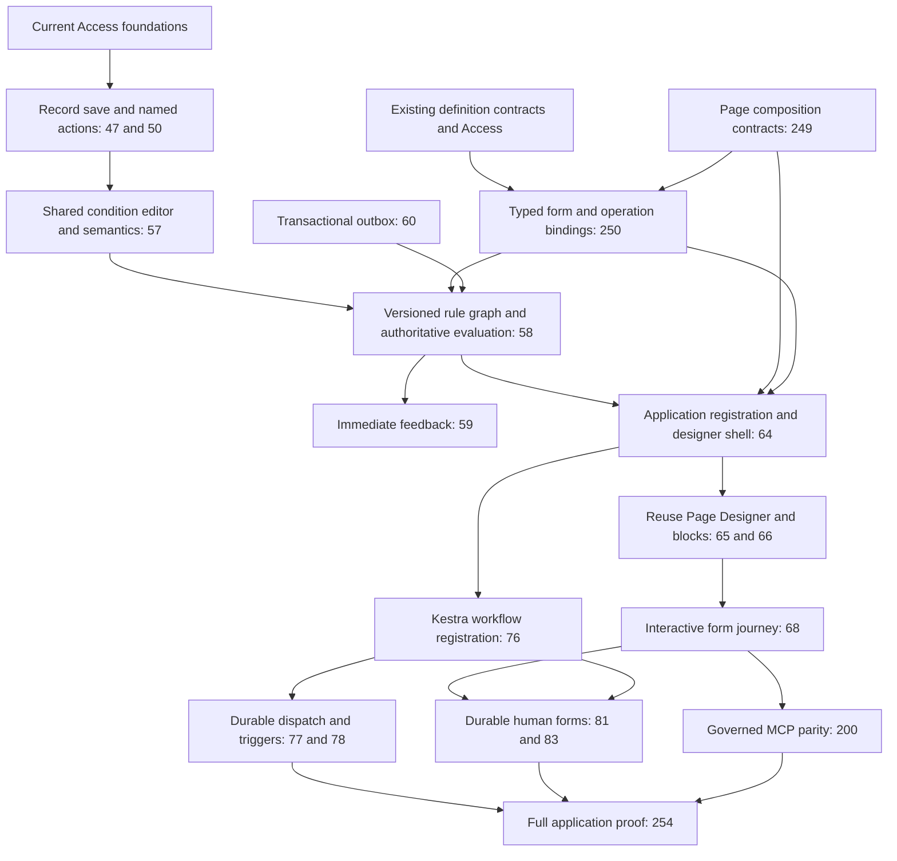

# Frontend Rule Designer delivery plan

[Build plan](README.md) · [Full specification](../specification/appendices/frontend-rule-designer.md) · [GitHub board](https://github.com/orgs/Abzum-NZ/projects/2/views/1)

## Approved outcome and current scope

Build one Frontend Rule Designer with shared conditions, typed flow variables, extensible registered nodes, reusable Page Designer input forms and a protected post-commit Kestra handoff. All required input is collected before one final atomic business submission. Cancel, abandonment, invalid answers or stale authority means no business changes. Private draft persistence is not a business submission and holds no transaction open.

This change is specification and backlog reconciliation only. Existing Access work stays ahead of dependent runtime/UI work. No new task, execution service, package installation, infrastructure upgrade or database migration is created by this planning change. The open authoring choice is resolved. Existing completed contracts remain completed historical milestones; their specific versioned extensions are owned below rather than reopening all of Phase 1.

## Dependency order

This diagram shows this feature's key prerequisites; each issue retains its other real dependencies. The early binding work in [#250](https://github.com/Abzum-NZ/Abzum-Vortex/issues/250) is headless, not Phase 6 UI. Phase 5 consumes its contract without depending on the Page Designer. Phase 6 supplies the installation hook without depending on a Phase 7 executor; Phase 7 completes durable registration through that hook. The existing [#36](https://github.com/Abzum-NZ/Abzum-Vortex/issues/36) condition foundation does not acquire a reverse dependency on the later condition editor.

Existing operation-descriptor work in #250 can proceed independently. Its new Show form slice consumes #249's exact headless identity/composition contract before integration; completion of #250 therefore explicitly depends on #249, never on the later #65 UI. This is a contract prerequisite, not permission to treat #249's unfinished implementation as complete.

## Task ownership and acceptance additions

| Task                                                                                                                                                                  | Build and verify                                                                                                                                                                                                                                                                                                                                                                                                                                                                             |
| --------------------------------------------------------------------------------------------------------------------------------------------------------------------- | -------------------------------------------------------------------------------------------------------------------------------------------------------------------------------------------------------------------------------------------------------------------------------------------------------------------------------------------------------------------------------------------------------------------------------------------------------------------------------------------- |
| [#47 — Save pipeline](https://github.com/Abzum-NZ/Abzum-Vortex/issues/47)                                                                                             | Keep the short protected transaction boundary. A private draft makes no business changes. Final configured bounded effects either all commit or none do; no lock spans human input. Phase 5 adds rule execution through this boundary, not a second save path.                                                                                                                                                                                                                               |
| [#50 — Named actions and declared events](https://github.com/Abzum-NZ/Abzum-Vortex/issues/50)                                                                         | One named action owns final typed inputs and bounded record effects. Direct calls repeat required input/precondition checks. Show form prepares inputs, not separately committed actions. External work remains post-commit.                                                                                                                                                                                                                                                                 |
| [#57 — Shared Conditions Designer](https://github.com/Abzum-NZ/Abzum-Vortex/issues/57)                                                                                | Complete one typed condition language/evaluator and reusable condition UI using React Query Builder's shadcn controls. Add explicit allowed previous/current/input/variable operands where needed. Test every supported operator, invalid/missing/null behaviour, initial truth versus condition transitions, context restrictions, adapter round trips and database parity where applicable. Do not duplicate the early Access evaluator.                                                   |
| [#58 — Rule graphs inside the save](https://github.com/Abzum-NZ/Abzum-Vortex/issues/58)                                                                               | Own versioned rule-graph/node/variable contracts, source/canonical/compiler/manifest/restore coverage and fixtures first. Implement deterministic context-aware execution, branch definite assignment, pure interactive preparation and server re-evaluation of the required path. Final submission uses #47/#50; durable intent uses #60. No external I/O, arbitrary code, recursive effects, partial writes or transaction-spanning form waits. Test old single-effect releases unchanged. |
| [#59 — Immediate feedback](https://github.com/Abzum-NZ/Abzum-Vortex/issues/59)                                                                                        | Recompute current field requirements/visibility and safe validation state. Scope updates to affected controls, discard late responses, and distinguish draft/committed/background-pending outcomes. Preview, field change and message display create no business event or workflow start.                                                                                                                                                                                                    |
| [#250 — Typed bindings](https://github.com/Abzum-NZ/Abzum-Vortex/issues/250)                                                                                          | Own exact Show form/default/response/variable maps, forms without records, final owning-operation bindings and explicit versioned workflow-input/record-free-start descriptors. No execution or UI here. Refuse type/context/output mismatches, forged actor/gate evidence and caller-selected continuation nodes. Reuse #249 form identity/composition rather than a second form schema.                                                                                                    |
| [#64 — App engine and Studio](https://github.com/Abzum-NZ/Abzum-Vortex/issues/64)                                                                                     | Own the Frontend Rule Designer shell/canvas integration using React Flow, shared Conditions Designer, variables panel, node inspector and pure test trace. Register exact rule bindings on installation activation, not publication/render. Test same-name apps, duplicate module imports, unknown nodes, failure/retry/upgrade/rollback/withdrawal. The form designer is supplied by #65/#66 and live interactive execution by #68; do not reverse those dependencies.                      |
| [#65 — Page Designer](https://github.com/Abzum-NZ/Abzum-Vortex/issues/65), [#66 — Registered blocks](https://github.com/Abzum-NZ/Abzum-Vortex/issues/66)              | Expose the existing form editor/renderer to Show form, with reusable response-schema-bound inputs. Preserve exact form identity, labels, types, defaults, responsive layout, focus and keyboard behaviour. No second form builder, prototype business logic or library-private persisted contract.                                                                                                                                                                                           |
| [#68 — Forms and page states](https://github.com/Abzum-NZ/Abzum-Vortex/issues/68)                                                                                     | Own the live finite sequence of input forms using existing private drafts/revisions. Continue maps validated answers; final Submit rechecks the entire required path and executes once. Cancel/abandon/stale/revoked/invalid produces no business changes. Duplicate web/MCP submits are safe; no draft-to-business implicit save. Upgrade requires clear restart; after-commit UI failure cannot report rollback.                                                                           |
| [#73 — Publication and restore](https://github.com/Abzum-NZ/Abzum-Vortex/issues/73)                                                                                   | Include rule graph, variables, form and workflow mappings in exact draft/preview/publication/restore. Preview is simulated. No activation on publish, lossy editor round trip or reinterpretation of old releases.                                                                                                                                                                                                                                                                           |
| [#76 — Durable workflow boundary](https://github.com/Abzum-NZ/Abzum-Vortex/issues/76)                                                                                 | Prepare exact backend workflows for #64 installation activation without an engine restart. Validate selected runtime compatibility through existing tests; no upgrade dependency. Frontend variables become declared input snapshots, not global Kestra variables. Never run field-change or transactional rules in Kestra.                                                                                                                                                                  |
| [#77 — Durable handoff](https://github.com/Abzum-NZ/Abzum-Vortex/issues/77), [#78 — Triggers](https://github.com/Abzum-NZ/Abzum-Vortex/issues/78)                     | Execute only committed typed starts, including explicitly versioned record-free starts. Validate target ownership/input schema/current authority; preserve accepted versions and duplicate protection. No preview/abandoned form start, provider credentials in UI, or silent widening of legacy trigger shapes.                                                                                                                                                                             |
| [#81 — Durable human input](https://github.com/Abzum-NZ/Abzum-Vortex/issues/81), [#83 — Guided draft integration](https://github.com/Abzum-NZ/Abzum-Vortex/issues/83) | Keep request_form as the durable wait for other people or later sessions. Reuse the same Page Designer forms/drafts; do not confuse an unsubmitted interactive journey with a committed waiting workflow or build another store.                                                                                                                                                                                                                                                             |
| [#112 — Package installation](https://github.com/Abzum-NZ/Abzum-Vortex/issues/112)                                                                                    | Reuse #64/#76 registration for bundled frontend rules, forms and backend workflows; incomplete registration preserves the old active application. Definitions contain no live draft/run variables or source records.                                                                                                                                                                                                                                                                         |
| [#200 — MCP parity](https://github.com/Abzum-NZ/Abzum-Vortex/issues/200)                                                                                              | Discover/update/validate/Continue/Cancel/Submit the same permitted form journey and operate the same semantic designer controls. Require current draft revisions, re-evaluate server checks and do not bypass approvals or invent a headless auto-answer. No new per-node tool executor.                                                                                                                                                                                                     |
| [#254 — Full application proof](https://github.com/Abzum-NZ/Abzum-Vortex/issues/254)                                                                                  | Test packaged definitions → rule registration → input forms → all-or-nothing final action → durable start → response, including cancellation, conflicts, access loss and web/MCP equivalence. Keep business labels only in definitions/fixtures.                                                                                                                                                                                                                                             |

## Concrete dependency corrections

- [#250](https://github.com/Abzum-NZ/Abzum-Vortex/issues/250) adds [#249](https://github.com/Abzum-NZ/Abzum-Vortex/issues/249) for the new Show form identity/composition binding, while unrelated descriptor work remains independently executable.

- [#58](https://github.com/Abzum-NZ/Abzum-Vortex/issues/58) explicitly depends on [#47](https://github.com/Abzum-NZ/Abzum-Vortex/issues/47), [#50](https://github.com/Abzum-NZ/Abzum-Vortex/issues/50), [#57](https://github.com/Abzum-NZ/Abzum-Vortex/issues/57), [#60](https://github.com/Abzum-NZ/Abzum-Vortex/issues/60) and headless [#250](https://github.com/Abzum-NZ/Abzum-Vortex/issues/250). This orders the actual final-operation and durable-intent proof, not just the visual editor.
- [#64](https://github.com/Abzum-NZ/Abzum-Vortex/issues/64) explicitly consumes [#58](https://github.com/Abzum-NZ/Abzum-Vortex/issues/58), retaining its existing Access/Phase 5/page-contract dependencies. Live Show form completion remains in downstream [#68](https://github.com/Abzum-NZ/Abzum-Vortex/issues/68).
- [#76](https://github.com/Abzum-NZ/Abzum-Vortex/issues/76) explicitly consumes [#64](https://github.com/Abzum-NZ/Abzum-Vortex/issues/64) and [#250](https://github.com/Abzum-NZ/Abzum-Vortex/issues/250), retaining Phase 6. No reverse dependency is added from #64 to #76.
- [#112](https://github.com/Abzum-NZ/Abzum-Vortex/issues/112) explicitly depends on [#76](https://github.com/Abzum-NZ/Abzum-Vortex/issues/76) for its promised packaged durable workflow installation.
- Remove the stale native [Phase 7 #75](https://github.com/Abzum-NZ/Abzum-Vortex/issues/75) dependency on deferred [Kestra upgrade #198](https://github.com/Abzum-NZ/Abzum-Vortex/issues/198). Its written scope already says this is maintenance, not a core blocker. No upgrade, backup or deployment work is performed here.

Existing transitive dependencies already connect forms and MCP to the rule engine, and #77 already names #250; do not add redundant cross-phase cycles. The designer does not claim completion of #249 or any protected pending code slice. Existing unrelated task scopes, acceptance evidence and status remain intact.

## Verification before implementation and closure

### Planning verification — 7 September 2026

Independent Sol review approved the actual specification and delivery-map changes after tightening trigger-to-node phase validation and the headless #249 → #250 form-binding dependency. All 22 affected existing issue descriptions/acceptance criteria were updated and read back exactly; nine direct prerequisite edges were added/verified and the obsolete #75 → #198 blocker was removed. The proposed native graph was cycle-checked across all 115 open issues. No implementation issue was closed. The board still reports 53 of 168 total tasks Done (31.5%, including epics).

All 11 changed documentation files pass the repository formatter and whitespace checks; relative file-link validation covers 259 existing/new links with no missing target. This is planning evidence only: no new runtime, package installation, database change, deployment or UI screenshot is claimed. The diagram describes the approved composition, not an implemented screen.

### Required implementation evidence

1. Re-read each owning issue and this specification before its implementation; write versioned contracts and complete fixture references before runtime changes.
2. Validate rule/condition/library adapter round trips, legacy reads and all declared node/value/form shapes. Library selection does not prove this until tests pass.
3. Prove no business write, event, activity effect or workflow-start intent before final submission, including Cancel and abandoned/reopened forms. Private draft operations remain ordinary private state.
4. Prove atomic final operation, server re-evaluation, concurrent updates, repeated submission and safe post-commit background handoff with real owning services.
5. Capture actual desktop/phone form/designer output and keyboard evidence when UI exists. A planning diagram is not a screenshot of implemented functionality.
6. Obtain independent review of the actual work against the updated acceptance criteria. Update specification/build plan/board evidence together; do not close implementation tasks for this documentation change.
