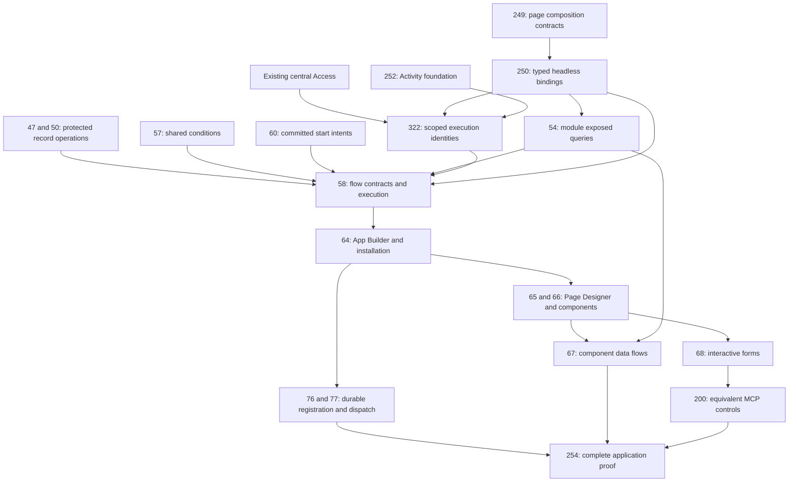

# Frontend Rule Designer delivery plan

[Build plan](README.md) · [Full specification](../specification/appendices/frontend-rule-designer.md) · [Architecture review](architecture-review-2026-09-07.md) · [GitHub board](https://github.com/orgs/Abzum-NZ/projects/2/views/1)

## Approved outcome and current scope

One Frontend Rule Designer configures application actions and component data loading. Every authored behaviour is a node with typed settings, input/output maps and outcome edges. Pages compose components and bind events; flows decide what happens. Quick actions edit the same graph.

A data flow may Query → Transform → Write → Query → Return data. A flow may pause for a Page Designer form, continue, commit protected operations at configured nodes and request durable work. Collecting all required answers before one atomic operation remains a useful selectable pattern, not a universal restriction. Each protected operation is atomic; a later cancellation or failure does not undo earlier committed nodes. No database transaction remains open while a user answers or an external service runs.

Each protected node resolves Current user, Specified user or scoped System through existing Access. The independent [execution-identity task #322](https://github.com/Abzum-NZ/Abzum-Vortex/issues/322) supplies the missing authority boundary. Editable configuration is not an authority grant. Platform-managed flows can expose public parameters/extension slots while keeping protected internals private. Result visibility always remains constrained to the invoking viewer.

This change specifies and schedules functionality; it does not implement it. Current Access work stays ahead of dependent UI. Existing completed contract milestones remain completed, with explicit versioned extensions owned by the tasks below. No new service package, infrastructure upgrade, database migration or frontend durable scheduler is introduced here.

## Dependency order

Runtime placement is part of [#58](https://github.com/Abzum-NZ/Abzum-Vortex/issues/58): shared Rule supplies the pure graph interpreter; existing App supplies the headless coordinator over lower-tier protected services. Page/web handles typed UI/form intents later. No upward imports, callback-hidden tier inversions or new service package are permitted; see the [reviewed placement](architecture-review-2026-09-07.md#runtime-placement-correction).

This shows feature-specific prerequisites, not every native issue edge. [#250](https://github.com/Abzum-NZ/Abzum-Vortex/issues/250) is headless and does not depend on [#58](https://github.com/Abzum-NZ/Abzum-Vortex/issues/58), [#322](https://github.com/Abzum-NZ/Abzum-Vortex/issues/322) or designer UI. [#54](https://github.com/Abzum-NZ/Abzum-Vortex/issues/54) does not depend on the flow engine. [#322](https://github.com/Abzum-NZ/Abzum-Vortex/issues/322) depends on [#34](https://github.com/Abzum-NZ/Abzum-Vortex/issues/34), [#250](https://github.com/Abzum-NZ/Abzum-Vortex/issues/250) and [#252](https://github.com/Abzum-NZ/Abzum-Vortex/issues/252), not the later IAM interface or [#104](https://github.com/Abzum-NZ/Abzum-Vortex/issues/104)'s external caller transport. [#58](https://github.com/Abzum-NZ/Abzum-Vortex/issues/58) consumes [#47](https://github.com/Abzum-NZ/Abzum-Vortex/issues/47), [#50](https://github.com/Abzum-NZ/Abzum-Vortex/issues/50), [#54](https://github.com/Abzum-NZ/Abzum-Vortex/issues/54), [#57](https://github.com/Abzum-NZ/Abzum-Vortex/issues/57), [#60](https://github.com/Abzum-NZ/Abzum-Vortex/issues/60), [#250](https://github.com/Abzum-NZ/Abzum-Vortex/issues/250) and [#322](https://github.com/Abzum-NZ/Abzum-Vortex/issues/322). [#64](https://github.com/Abzum-NZ/Abzum-Vortex/issues/64) supplies the installation hook before [#76](https://github.com/Abzum-NZ/Abzum-Vortex/issues/76) implements durable registration; never add a reverse dependency. Existing [#36](https://github.com/Abzum-NZ/Abzum-Vortex/issues/36) conditions do not depend on the later editor.

## Task ownership and acceptance additions

| Owner                                                                                                                                                                                             | Functionality and proof                                                                                                                                                                                                                                                                                                                                                                                                                                                                                      |
| ------------------------------------------------------------------------------------------------------------------------------------------------------------------------------------------------- | ------------------------------------------------------------------------------------------------------------------------------------------------------------------------------------------------------------------------------------------------------------------------------------------------------------------------------------------------------------------------------------------------------------------------------------------------------------------------------------------------------------ |
| [#250](https://github.com/Abzum-NZ/Abzum-Vortex/issues/250) — Headless bindings                                                                                                                   | Version exact component event, app/platform-managed flow, form, exposed query, operation and execution-identity binding descriptors. Distinguish public parameters/extensions from private configuration. Define typed results/continuations; configuration carries no live grant. No runtime or UI dependency.                                                                                                                                                                                              |
| [#54](https://github.com/Abzum-NZ/Abzum-Vortex/issues/54) — Reading records                                                                                                                       | Add versioned module-exposed query definitions and typed inputs/outputs to existing application queries, with complete compiler/publication/reference/restore fixtures. Enforce Access before filter/group/count/paging. Keep Query independent of Rule; bounded page transforms cannot impersonate dataset-wide sorting/filtering or invent writable record identity.                                                                                                                                       |
| [#322](https://github.com/Abzum-NZ/Abzum-Vortex/issues/322) — Scoped execution identities                                                                                                         | Register/revoke and resolve exact node authority in Access. Resolve each identity-changing node in a new short protected transaction; preserve existing lock order. Record effective operation actor and, for an initiating account, linked use; record actual system cause without fabricating a human. Refuse wrong scope, disabled/revoked accounts and grant substitution; prove the viewer-safe handoff seam with a representative operation. Concrete Query/flow/MCP projection follows in its owners. |
| [#47](https://github.com/Abzum-NZ/Abzum-Vortex/issues/47), [#50](https://github.com/Abzum-NZ/Abzum-Vortex/issues/50) — Saves and actions                                                          | One owning operation commits its bounded changes/events/intent atomically and rechecks inputs/access/revisions. A flow can call several operations in sequence; earlier successes remain. No operation depends on UI or the later graph executor.                                                                                                                                                                                                                                                            |
| [#57](https://github.com/Abzum-NZ/Abzum-Vortex/issues/57) — Shared Conditions Designer                                                                                                            | Reuse the pure typed language across flow branches, filters and validation. Context-specific operands/operators, null/missing semantics, previous/current values and adapter round trips remain explicit. No second Access predicate engine.                                                                                                                                                                                                                                                                 |
| [#58](https://github.com/Abzum-NZ/Abzum-Vortex/issues/58) — Flow execution                                                                                                                        | Version all graph/node/effect/identity definitions before runtime. Pure feedback, interactive/component orchestration and transactional rules share one catalogue but have explicit execution boundaries. Execute configured reads/writes/forms/durable requests in sequence. Use the operation receipts and private draft continuation planned in their owning tasks, not a new run store.                                                                                                                  |
| [#59](https://github.com/Abzum-NZ/Abzum-Vortex/issues/59) — Immediate feedback                                                                                                                    | Pure preview/validation remains effect-free. Separately configured field-change flows may execute effects through [#58](https://github.com/Abzum-NZ/Abzum-Vortex/issues/58). Show draft, committed, pending, partial and failed states truthfully.                                                                                                                                                                                                                                                           |
| [#64](https://github.com/Abzum-NZ/Abzum-Vortex/issues/64) — App Builder and installation                                                                                                          | Shared flow list/canvas/variables/node inspector; action and data inspectors open the same designer. Exact release installation registers flows and module queries. Managed-flow parameters/slots are editable only as allowed; installation/copy does not grant execution identity.                                                                                                                                                                                                                         |
| [#65](https://github.com/Abzum-NZ/Abzum-Vortex/issues/65), [#66](https://github.com/Abzum-NZ/Abzum-Vortex/issues/66) — Page Designer/components                                                   | Reuse Page Designer for Show form; semantic component events and stable controls. No hidden direct save or query path. Simple defaults remain visible editable nodes, with protected managed-flow internals unavailable to customer administrators.                                                                                                                                                                                                                                                          |
| [#67](https://github.com/Abzum-NZ/Abzum-Vortex/issues/67) — Component data flows                                                                                                                  | Default Query → Return data; configured transforms/writes/additional queries permitted. Explicit load/refresh/filter/sort/page events, safe row identity and viewer projection, loading/error/partial outcomes. Renders/prefetch do not execute writes; self-caused invalidation cannot recursively repeat a changing flow.                                                                                                                                                                                  |
| [#68](https://github.com/Abzum-NZ/Abzum-Vortex/issues/68) — Live forms                                                                                                                            | Pause/resume with exact release/node and safe receipt references in the private drafts this task will deliver. Cancel before the first commit changes no business records; cancel after a commit preserves it. Required gates are server verified, never a client next-node claim.                                                                                                                                                                                                                           |
| [#73](https://github.com/Abzum-NZ/Abzum-Vortex/issues/73) — Publication/restore                                                                                                                   | Include module queries, effects, actor bindings, managed-flow dependencies/public projection and extension slots in the complete versioned definition pipeline. No grants copied or silently broadened on upgrade.                                                                                                                                                                                                                                                                                           |
| [#76](https://github.com/Abzum-NZ/Abzum-Vortex/issues/76), [#77](https://github.com/Abzum-NZ/Abzum-Vortex/issues/77), [#78](https://github.com/Abzum-NZ/Abzum-Vortex/issues/78) — Durable handoff | Install exact workflows without restart; accept start intent at the configured protected node. Later failure does not remove a committed start. Dispatch remains asynchronous, duplicate-safe and version pinned. No Kestra execution inside a database transaction.                                                                                                                                                                                                                                         |
| [#81](https://github.com/Abzum-NZ/Abzum-Vortex/issues/81), [#83](https://github.com/Abzum-NZ/Abzum-Vortex/issues/83) — Durable human input                                                        | Durable waits use existing Kestra/application records and Page Designer forms. Do not turn an interactive frontend pause into a second durable scheduler.                                                                                                                                                                                                                                                                                                                                                    |
| [#104](https://github.com/Abzum-NZ/Abzum-Vortex/issues/104), [#107](https://github.com/Abzum-NZ/Abzum-Vortex/issues/107) — Caller/public adapters                                                 | Consume existing scoped execution authority. Public callers have no current organisation account and cannot nominate a specified user; only explicitly public protected operations may use a separately authorised System binding.                                                                                                                                                                                                                                                                           |
| [#115](https://github.com/Abzum-NZ/Abzum-Vortex/issues/115), [#267](https://github.com/Abzum-NZ/Abzum-Vortex/issues/267) — Activity/IAM consumers                                                 | Show permitted linked initiator/effective actor evidence and manage execution bindings through protected APIs. Role-management delegation is not execution delegation. No reopening of completed [#252](https://github.com/Abzum-NZ/Abzum-Vortex/issues/252) or independent granting surface.                                                                                                                                                                                                                |
| [#112](https://github.com/Abzum-NZ/Abzum-Vortex/issues/112) — Packages                                                                                                                            | Copy allowed definitions/public configuration, never private execution grants, hidden managed source or source-owned shared records. Validate exact dependencies before installation.                                                                                                                                                                                                                                                                                                                        |
| [#200](https://github.com/Abzum-NZ/Abzum-Vortex/issues/200), [#254](https://github.com/Abzum-NZ/Abzum-Vortex/issues/254) — MCP and complete proof                                                 | Same authoring, invocation, forms, effect summaries, result visibility and partial outcomes through UI/MCP. Test whole graphs, not privileged per-node bypass tools or prototype-only screens.                                                                                                                                                                                                                                                                                                               |

## Flow-first page actions and MCP authoring

The [page-to-flow composition](../specification/appendices/frontend-rule-designer.md#pages-compose-flows-define-actions) remains the canonical action model. Start configures a semantic trigger and optional condition; registered nodes implement all configured behaviour; Finish returns declared outcomes. Save form is one action node with structural Start/Finish. Presentation-only flows need no record or save. No blanket one-commit or manual-only rule remains.

A managed flow is a versioned platform definition, not a third customer publication root. Allowed local extensions compile into one exact graph, not recursive runtime subflows. The public representation includes only permitted parameters, slots and safe effects. A privileged server node can consume private values only within its authorised purpose; it cannot disclose those values through a returned row, count, error, message, export, subsequent write or MCP result.

## Verification before implementation and closure

1. Complete source/canonical/compiled fixtures and references for every new node, effect, actor binding, query, form, managed-flow slot and outcome before execution code.
2. Preserve legacy immutable bytes and workflow-wide run-as semantics; explicit draft conversion must not silently confer new identity authority.
3. Prove default Query/Return, Query/Transform/Write/Query/Return, presentation-only, single Save, collect-first atomic and multi-commit interactive flows.
4. Prove exact operation retry, stale result suppression, no render/prefetch writes, no self-trigger loop, permission/grant revocation between nodes and truthful partial completion. Do not retry a whole graph with new branch decisions after an uncertain commit.
5. Prove viewer-safe rows, fields, derived values, totals, files and errors for current/specified/System through UI, MCP and public adapters. Sharing/source ownership and entitlements remain enforced.
6. Prove installation/upgrade/withdrawal/copy/restore with exact published dependencies and no copied grants; durable accepted starts remain pinned.
7. Independently review actual code against acceptance, record real UI screenshots when UI exists, and update task/spec/plan evidence. Documentation review is not implementation evidence.

## Historical planning evidence

Earlier 7 September planning passes reconciled 22 issue descriptions, then ten flow-first descriptions, at 53 of 168 board tasks Done. Their one-final-submit and presentation-only load/field-trigger restrictions are superseded by this approved revision. Existing dependencies and unrelated acceptance remain. The current [architecture review](architecture-review-2026-09-07.md) records source evidence and the new scoped identity prerequisite. No implementation issue is closed by this documentation change.
