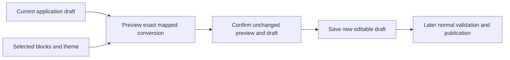

# Convert an existing application draft without losing its behaviour

Task: [#249](https://github.com/Abzum-NZ/Abzum-Vortex/issues/249).
Follows [native publication](issue-249-native-publication.md) and
[placement compatibility](issue-249-placement-compatibility.md).
This is a file-defined application operation, not App Designer work.

## Outcome

Prepare a readable conversion of a current V1 application draft to authored V2,
then save it only after confirmation against the same draft revision. Published
history stays unchanged. Conversion neither publishes nor installs the result.
The existing compiler remains the only source of canonical application content.

## Bounded implementation

1. Read the current draft through the existing Definition repository. Require
   the requested application root and draft revision, with exact V1 source
   metadata. Use existing transaction context and safe error handling.
2. Require explicit mappings from each used legacy block registration to an exact
   platform block release. These catalogues have independent version strings.
   Resolve actual releases through the trusted catalogue reader; the caller
   supplies selections, not trusted fingerprints or executable transformations.
3. Map setting keys explicitly. The target property schema decides whether the
   existing literal or typed reference is compatible. Preserve exact references;
   reject ambiguous mappings and data loss. Do not guess from labels, add scripts,
   or invent a separate property validator where the current one can be reused.
4. Preserve all shared application fields and existing component aliases, page
   kinds, queries, permissions, actions, workflows, public limits and guided-step
   content. Copy placement visibility conditions and query selections explicitly.
5. Put flat pages into the existing default main slot. Preserve desktop/phone
   sibling order; guided steps filter that order to their own placements and
   retain their separate navigation order. Tablet uses normal inheritance.
   Convert an implicit list only with an explicitly selected primary-list block
   and a new placement alias; never replace it with an empty page.
6. A custom shell is optional. If selected, require complete explicit named-slot
   attachments, including each guided step. Otherwise emit no custom shells.
   Do not create a mandatory shell or a parallel layout representation.
   `contentSlots` maps each source placement alias to its target shell content-slot
   alias. `stepContentSlots` maps each step alias to that same placement-to-slot
   map for the step. Every source placement appears exactly once; unknown or
   cross-step aliases are invalid. Preserve desktop/phone relative order in each
   target slot by filtering the existing authoritative page order. Required slots
   receive content for each page/step; optional slots may remain empty.
7. Select an exact theme base and validated typed token overrides. For a legacy
   application theme, show how brand, density, corners and focus are represented
   by that base or its explicit overrides. One legacy meaning may need several
   tokens. Do not synthesize colour/token values from a preset label or require
   artificial one-to-one mappings. Valid explicit overrides need not all be
   attributed to a legacy field: they are visible configuration in the preview.
8. Preparation writes nothing. Return the original source fingerprint, converted
   authored source, its fingerprint and the exact resolved catalogue evidence.
   Confirmation resends the same closed mapping selections, expected revision and
   prepared-source fingerprint. Reread, resolve and recompute before saving; do
   not retain a server-side prepared plan or accept caller-authored converted
   bytes as trusted output. A change to the prepared result requires a new preview.
9. Save only the recomputed source through the existing revision-checked
   `saveDraft` operation. Existing alias allocation retains old identities and
   allocates any new list/shell/slot identities atomically. No migration, table,
   counter, approval framework or new concurrency mechanism is needed.

## Acceptance

- Prepare has no writes; matching confirmation saves exactly one new V2 draft
  revision, without publishing or changing immutable V1 history.
- One complete neutral source covers ordinary, guided, list and public pages,
  supported references/literals, ordering, conditions and queries.
- Exact target block/theme selections and defaults validate through existing
  contracts. Missing, ambiguous or incompatible mappings give actionable errors;
  no lost content, guessed target setting or application-name special case.
- Stale revision, altered prepared result, missing catalogue release and alias
  conflict fail through the existing transaction/revision boundaries without
  partial draft or identity changes. Reuse existing storage/concurrency proofs.
- Default layout works without a custom shell. Explicit custom-shell mappings
  preserve all required page/step content. Public restrictions remain intact.
- Existing V1/V2 compilation, publication, comparison and restore checks remain
  green. Independent Sol reviews the actual bounded patch against this plan;
  delivery follows normal Testing checks, not an extra approval gate.

## Ownership

Expected changes are operation-specific contracts, one conversion module using
the current Definition repository/catalogue/store, package exports and tests.
Do not refactor unrelated storage or compiler code without a demonstrated need.
Richer page bindings remain [#250](https://github.com/Abzum-NZ/Abzum-Vortex/issues/250),
installed application use remains [#64](issue-64-application-runtime.md), and
editor delivery remains after the [complete application proof](engine-first-application-delivery.md).

