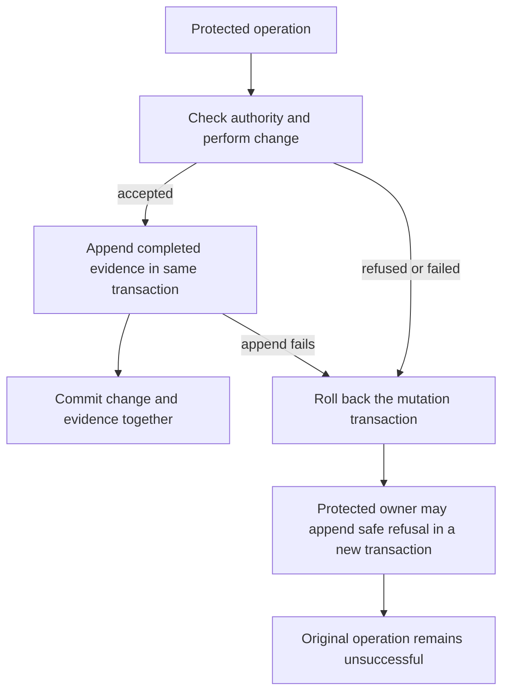

# Phase 3 — Activity append foundation

Task: [#252](https://github.com/Abzum-NZ/Abzum-Vortex/issues/252). Prerequisites [database isolation #28](https://github.com/Abzum-NZ/Abzum-Vortex/issues/28) and [central Access decision #34](https://github.com/Abzum-NZ/Abzum-Vortex/issues/34) are complete. This work is independent of [administration #30](https://github.com/Abzum-NZ/Abzum-Vortex/issues/30) and [page composition #249](https://github.com/Abzum-NZ/Abzum-Vortex/issues/249).

## Outcome

Protected operations can keep one content-free, immutable record of who acted and what happened. Recording a successful change must never outlive a rolled-back change. Repeating the same evidence must not create duplicates.

## What will be built

1. Correct the existing unused Activity contract rather than introduce a competing envelope. Its fields are organisation, activity identifier, occurrence time, actor kind and identifier, generic action key, subject identifiers, changed-field identifiers, source, correlation identifier, and outcome (`completed`, `refused`, or `failed`). Identifier lists are unique and canonically ordered. No arbitrary payload, labels, values, exception text, credentials, or retained-detail reference is accepted.
2. Use the existing activity identifier as the duplicate identity within its organisation. An exact retry returns the existing result; different evidence under that same identity is refused. No additional fingerprint, sequence, or duplicate-key registry is needed. Occurrence time is evidence, not an ordering or authorisation mechanism.
3. Add one private `vortex_activity` schema and one append-only organisation-owned table. The organisation must exist. Force row-level security and deny direct reads and writes by public, Data API, runtime, and request roles. Do not add public policies or an Activity endpoint.
4. Add one owner-only database append function, with fixed empty search path and no privilege escalation. Existing protected owning functions may compose it into their transactions; callers cannot submit an Activity row as proof that they were authorised. A representative test-owned operation proves the composition without opening administration or business-record commands in this task.
5. Record successful evidence in the same transaction as the owning change. If either fails, both roll back. After a refused mutation has fully rolled back, its protected owning wrapper may record content-free refusal evidence in a separate transaction using the same append function. Only independently verified local scope and subjects may be retained. An unknown or foreign identifier submitted by a caller is not evidence of a local subject. A refusal-recording failure never changes the operation to success.
6. Keep the foundation below the sixteen runtime services: shared contracts and private database composition, not a seventeenth service, another queue, or a generic mutation framework. No uncallable TypeScript database wrapper is required for an owner-only SQL helper.

Actor kinds describe the principal, not its roles or transport: `identity`, `organization_account`, `system`, or `public_session`. A public session identifier identifies an anonymous interaction, never an authenticated person. Federated actions use the verified principal and the `federation` source; federation is not a second kind of person. The append helper validates evidence shape but grants no authority to act as any principal. Each consuming protected operation derives its own principal and scope.

## Transaction behaviour

## Acceptance criteria

- [ ] Strict contract and database validation agree on identifiers, actor/source/outcome, canonical identifier arrays, and content-free fields; unknown or value-bearing fields are refused.
- [ ] Successful change and Activity entry commit together; a failure of either leaves neither committed.
- [ ] A refused mutation leaves no completed entry; separately committed refusal evidence survives its rollback without recording unknown or foreign target content.
- [ ] Exact sequential and concurrent retries produce one entry. Conflicting reuse of the same organisation/activity identifier refuses without modifying the existing entry.
- [ ] Ordinary update and delete are refused. Public, Data API, runtime and request roles cannot append, enumerate, or read another organisation's entries.
- [ ] Default privileges and row-level protections remain closed. No new caller authority, business-specific field, runtime service, or direct client endpoint is added.
- [ ] Independent review covers the actual patch and every criterion. Local database, concurrency, lint and repository checks pass; hosted Testing runs the checks belonging to the delivered revision before the task is marked Done.

## Boundaries and follow-through

[Activity views #115](https://github.com/Abzum-NZ/Abzum-Vortex/issues/115) owns permitted search, screens, export, federation-wide correlation and complete service-category integration using this store. Existing per-operation revision/audit columns remain state evidence, not another Activity history. Value history, retention deletion, privacy cases and all-service backfill are outside this foundation. No production upgrade, backup repair, browser UI, or new user approval mechanism belongs here.

## References

- [Activity specification](../specification/14-activity-privacy-and-retention.md)
- [Activity contracts](../specification/appendices/data-contracts.md#activity-and-retention-contracts)
- [Database ownership](../specification/17-runtime-storage-and-caching.md#database-and-storage-rules)
- [Supabase row-level security](https://supabase.com/docs/guides/database/postgres/row-level-security)
- [PostgreSQL transactions](https://www.postgresql.org/docs/current/tutorial-transactions.html)
