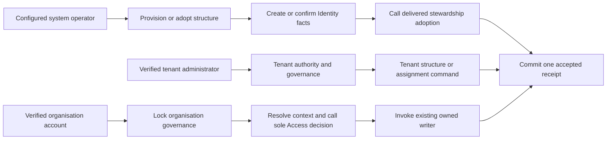

# Protected tenant and organisation administration — implementation plan

Owning task: [#30](https://github.com/Abzum-NZ/Abzum-Vortex/issues/30).
Governing requirements: [people and organisations](../specification/02-people-organisations-and-sign-in.md),
[Access](../specification/04-access-and-permissions.md),
[IAM](../specification/appendices/iam-application.md),
[data contracts](../specification/appendices/data-contracts.md) and
[platform-only core](../specification/appendices/core-contract-boundary.md).

## Status, delivered slices and dependency boundary

Implementation is unblocked: the exact hosted delivery for the
[central Access decision #34](https://github.com/Abzum-NZ/Abzum-Vortex/issues/34)
is [complete](../evidence/issue-34-access-decision.md#delivery-boundary). The other native prerequisites — [#23](https://github.com/Abzum-NZ/Abzum-Vortex/issues/23),
[#24](https://github.com/Abzum-NZ/Abzum-Vortex/issues/24),
[#26](https://github.com/Abzum-NZ/Abzum-Vortex/issues/26),
[#27](https://github.com/Abzum-NZ/Abzum-Vortex/issues/27),
[#32](https://github.com/Abzum-NZ/Abzum-Vortex/issues/32),
[#33](https://github.com/Abzum-NZ/Abzum-Vortex/issues/33) and
[#224](https://github.com/Abzum-NZ/Abzum-Vortex/issues/224) — are retained for
traceability. No user hold or additional approval gate exists.

This task does not depend on completing every role, Group or PIM operation in
[#40](https://github.com/Abzum-NZ/Abzum-Vortex/issues/40). Both tasks consume the
same completed Access decision and governance-first ordering, but each owns its
own protected operations. Adding a whole-task dependency would create no useful
code or authority boundary.

This work unlocks [the isolation suite #29](https://github.com/Abzum-NZ/Abzum-Vortex/issues/29),
[administration applications #72](https://github.com/Abzum-NZ/Abzum-Vortex/issues/72)
and [guided IAM setup #267](https://github.com/Abzum-NZ/Abzum-Vortex/issues/267).

Delivered on `testing`:

- **Slice 1** — tenant-administration facts and protected receipt boundary
  ([PR #441](https://github.com/Abzum-NZ/Abzum-Vortex/pull/441)).
- **Slice 2** — trusted configured-system provisioning and explicit adoption
  ([PR #444](https://github.com/Abzum-NZ/Abzum-Vortex/pull/444)).
- **Slice 3A** — human tenant authority, bounded tenant reads, and
  tenant-administrator grant, change and revoke
  ([PR #445](https://github.com/Abzum-NZ/Abzum-Vortex/pull/445)).
- **Slice 3B** — protected display-name rename and same-tenant/root reparent
  ([PR #446](https://github.com/Abzum-NZ/Abzum-Vortex/pull/446)).
- **Slice 3C** — protected organisation lifecycle: suspend, reactivate and
  administrative archive ([PR #448](https://github.com/Abzum-NZ/Abzum-Vortex/pull/448)).
- **Slice 3D** — tenant-authorised organisation creation with explicit existing
  stewardship ([PR #449](https://github.com/Abzum-NZ/Abzum-Vortex/pull/449)).

Slices 1, 2, 3A, 3B, 3C and 3D are merged to Testing; their exact hosted
verification remains a delivery gate. The next implementation assignment is
**Slice 4A only: configured-system cluster-local identity-projection lifecycle**.
It is intentionally separate from tenant lifecycle because projection changes can
span several organisations and tenants, making its discovery and locking races
independently reviewable.

## Outcome

Provide narrow, typed, channel-neutral protected operations above the existing
private Identity and Access storage:

- trusted initial provisioning, explicit adoption and system-only cluster lifecycle;
- tenant-authorised hierarchy, lifecycle and tenant-administrator operations;
- organisation-authorised account and invitation operations; and
- bounded safe administrative reads and deterministic replay evidence.

Tenant authority is structural only. It never grants organisation membership,
application entry, role authority or data access. Organisation-local operations
require an active organisation account and the exact current organisation
permission decided by [#34](https://github.com/Abzum-NZ/Abzum-Vortex/issues/34).
There is no role-name check, hidden administrator flag, tenant fallback or second
permission evaluator.

The service boundary is intentionally earlier than its user interfaces. A future
Tenant Administration application presents hierarchy and lifecycle; Organisation
Administration presents accounts, invitations and runtime settings; IAM presents
tenant-administrator grants and organisation access-grant journeys. Those locked
ordinary applications belong to [#72](https://github.com/Abzum-NZ/Abzum-Vortex/issues/72)
and [#267](https://github.com/Abzum-NZ/Abzum-Vortex/issues/267). This task adds no
page, route, generic form, MCP transport, model, assistant or AI behaviour.

## Authority and transaction boundaries

Tenant-governance operations resolve a verified identity, active cluster
projection, selected tenant and current effective same-tenant administrator
assignments inside the protected transaction. They require one exact capability
from this closed, no-wildcard catalogue:

- `platform.tenant.hierarchy.read`
- `platform.tenant.organizations.create`
- `platform.tenant.organizations.rename`
- `platform.tenant.organizations.reparent`
- `platform.tenant.organizations.lifecycle`
- `platform.tenant.administrators.read`
- `platform.tenant.administrators.manage`

This path deliberately needs no account in the target organisation. That allows
creation of the first organisation and recovery of a suspended organisation. A
later IAM journey additionally needs an active account and operating role in its
chosen IAM instance; that is application entry, not authority for the tenant
command.

Organisation-local reads use the existing [#27](https://github.com/Abzum-NZ/Abzum-Vortex/issues/27)
resolved context and the thin [#34](https://github.com/Abzum-NZ/Abzum-Vortex/issues/34)
adapter. Changing operations first acquire organisation governance, then resolve
and evaluate current authority in the same transaction before invoking the owned
writer. They do not acquire a read resolver's shared lock and later try to upgrade
it. [Lock-order correction #305](https://github.com/Abzum-NZ/Abzum-Vortex/issues/305)
establishes the compatible reader order; no retry or transaction framework is
added here.

## Reuse delivered stewardship and Identity work

Provisioning creates or confirms the tenant, organisation, cluster-local identity
projection, active organisation account and Access-version baseline. Inside that
same outer transaction, it calls the Identity-owned initializer from
[#430](https://github.com/Abzum-NZ/Abzum-Vortex/issues/430) with the explicit
runtime-settings values. #430 owns the settings shape, validation, storage,
persistence and internal runtime reader; #30 does not duplicate any of them. It
then invokes the delivered [#33 stewardship adoption](../evidence/issue-33-stewardship/README.md)
inside the same outer transaction. That composition already creates the exact
organisation-owned steward role, direct permanent assignment, organisation-wide
delegation, current stewardship requirement and one Access-version change. Do not
rebuild those rows or add another stewardship evaluator.

The tenant steward and organisation steward are distinct explicit nominations and
receive distinct scoped assignments. The same verified person may be nominated for
both. “Separate” forbids implicit tenant-to-organisation authority; it does not
require two different humans.

Existing live scopes are adopted only by an explicit configured-system command.
No migration guesses a steward from creator, row order, first account or tenant
administrator. Organisation readiness is established by the current delivered
stewardship requirement and its live qualifying facts. Tenant readiness is
established by a current qualifying permanent tenant assignment and its accepted
system command. Do not add a second bootstrap snapshot, history, continuity or
counter.

Structural adoption is not complete IAM availability. The exact management-
application binding delivered by [#33](https://github.com/Abzum-NZ/Abzum-Vortex/issues/33),
the installed IAM release and the steward's operating role are composed and proven
later by [application integration #64](https://github.com/Abzum-NZ/Abzum-Vortex/issues/64)
and [guided setup #267](https://github.com/Abzum-NZ/Abzum-Vortex/issues/267).
Do not report “IAM ready” from a successful
[#30](https://github.com/Abzum-NZ/Abzum-Vortex/issues/30) service operation.

Reuse the existing [#24](https://github.com/Abzum-NZ/Abzum-Vortex/issues/24)
invitation owner and the guarded account-state composition delivered with
[#33](https://github.com/Abzum-NZ/Abzum-Vortex/issues/33). Invitation creation in
this task is the no-intent path only. Invitation-time Group or role intent remains
the governed IAM operation owned by [#40](https://github.com/Abzum-NZ/Abzum-Vortex/issues/40)
and [#267](https://github.com/Abzum-NZ/Abzum-Vortex/issues/267).

## Private facts and common command rules

Correct the tenant-administrator assignment contract before adding storage. Each
assignment has a permanent identifier, tenant and verified identity, a canonical
unique nonempty set of closed structural capabilities, fixed start and optional
expiry, positive revision, original grant provenance, current change evidence and
all-or-none revocation evidence. `scheduled`, `active`, `expired` and `revoked` are
derived temporal outcomes, not editable authority. Remove the false Activity
identifier requirement; generic Activity remains with
[#252](https://github.com/Abzum-NZ/Abzum-Vortex/issues/252) and
[#115](https://github.com/Abzum-NZ/Abzum-Vortex/issues/115).

Add two #30-private forced-RLS fact tables: tenant assignments and accepted
administration receipts. [#430](https://github.com/Abzum-NZ/Abzum-Vortex/issues/430)
owns the separate runtime-settings table. Give public, browser, Data API, runtime
and request roles no direct table or raw-helper access. Actors, clocks,
correlations, resolved scopes and permission evidence are trusted server facts,
not editable command fields.

Use one minimal accepted-receipt pattern across successful #30 commands. Scope its
uniqueness by trusted actor, tenant or cluster scope, operation and duplicate key;
bind a canonical input fingerprint and resulting identifiers/revisions. An exact
retry returns the accepted result without another mutation or Access increment;
a changed payload conflicts. Store no raw input document, invitation secret,
credentials, email/profile data, permission snapshot, business value or second
Activity payload. A refused or failed transaction writes no success receipt. This
pattern does not wrap or replace #430's settings initializer or revision-checked
update behaviour.

Creates require duplicate protection but no prior revision. Updates and revocations
also require the exact current revision. Successful results return only the typed
operation and subject identifiers, resulting revision or Access version where
applicable, server correlation and server time. Safe refusals do not reveal whether
a foreign or inactive target exists.

## Build in bounded slices

### 1. Contracts and storage foundation

- Correct the tenant-assignment contract and add strict commands, results, safe
  refusals, operator context, tenant launcher/read models and receipt contracts.
- Reuse #430's canonical language and time-zone validators for organisation-account
  preferences; do not duplicate those validators.
- Add the two #30-private fact tables, their exact owner-only reads and storage
  invariants. Do not add an organisation role table, Access counter, permission
  cache, assignment history or generic policy engine.

### 2. Trusted provisioning and explicit adoption

- Add one server-only configured operator boundary with a non-nil system actor.
- Provision a tenant and root organisation with explicitly nominated tenant and
  organisation stewards, explicit #430 runtime settings, Access baseline and
  active projection and account; invoke delivered stewardship adoption and commit
  one #30 receipt.
- Create a later organisation through the same structural core after tenant
  authorization, always with an explicitly nominated organisation steward. The
  creating tenant administrator receives no organisation role unless separately
  nominated.
- Explicitly adopt pre-existing live tenants and organisations. Readiness refuses
  until every live scope has its supported current stewardship facts.

### 3. Tenant governance and structure

- **Delivered 3A:** tenant launcher and bounded deterministic hierarchy and
  administrator reads; grant, change and revoke tenant assignments with exact
  capability, revision, duplicate and final-manager protection.
- **Delivered 3B:** rename an existing organisation's display name, or reparent an
  existing organisation to a same-tenant parent or to the tenant root. Both use
  the exact `organizations.rename` or `organizations.reparent` capability,
  expected organisation revision, existing tenant serialization, existing
  receipt semantics and a post-wait authority recheck. Reparenting reuses #23's
  same-tenant, self-parent and cycle constraints. It does not alter descendants:
  their existing links make them move with the subtree.
- **Delivered 3C:** suspend, reactivate and administratively archive an existing
  organisation under the lifecycle capability and established structural rules.
- **Delivered 3D:** tenant-authorised creation of one organisation with an explicit
  existing active steward nominee and explicit runtime settings, using delivered
  provisioning composition.
- **Current 4A:** configured-system suspension, reactivation and closure of one
  cluster-local identity projection, preserving every affected scope's current
  stewardship requirements.
- **Later, separately picked up:** configured-system tenant lifecycle (4B).

### 4. System-only cluster lifecycle

- **Current 4A:** suspend, reactivate and close one cluster-local identity
  projection through the configured system operator with exact revision and
  deterministic replay using the existing configured actor + configured cluster
  + operation + duplicate-key receipt serialization. It discovers its affected
  organisations and tenants, locks existing governance rows `FOR UPDATE`, then
  tenant rows `FOR UPDATE`, then the target projection `FOR UPDATE`, each in
  stable identifier order, rechecks membership, and fails stale rather than
  expanding a lock set or retrying automatically.
- **Later 4B:** suspend/reactivate one tenant through the configured system
  operator. It will preserve current organisation/tenant stewardship while
  leaving child organisation state, accounts, assignments and Access versions
  unchanged.
- Neither slice mutates provider/Auth identity or sessions, another cluster,
  descendant organisation states or organisation Access versions.

## Slice 3B — protected rename and reparent

This slice has exactly two commands. A rename changes only an organisation's
display name. A reparent changes only its parent organisation reference, either
to another organisation in the same tenant or to `null` for a root organisation.
Neither command creates an organisation, changes its permanent identifier,
short name, tenant, lifecycle, accounts, local roles, record ownership or Access
version.

Both commands derive the caller from the verified session and selected active
tenant. They require the corresponding exact current structural capability; an
organisation account is neither required nor treated as a fallback. They use the
existing protected tenant-governance transaction and receipt pattern: an exact
accepted retry returns the recorded result, a changed-input duplicate conflicts,
and a refusal or rollback creates no accepted receipt.

Reparenting must continue to enforce #23's tenant, self-parent and cycle rules.
It must also safely refuse a foreign or missing target, a prohibited lifecycle
state identified by the existing structural rules, and a stale expected revision.
An active child beneath a suspended parent remains valid when #23 permits that
existing shape; this slice must not introduce a new parent-active requirement.

The proof must establish: authorised operation without target-organisation
membership; root moves and subtree preservation; exact capability separation;
foreign/missing/self/descendant refusal; replay and changed-payload conflict;
no mutation or receipt on refusal; and two concurrency cases. First, competing
moves cannot create a cycle. Second, an authority that was effective while queued
on the tenant lock but expires before it obtains the lock must be refused without
changing structure or creating a receipt. Reuse the deterministic database-clock
approach from Slice 3A rather than adding a timer or a second authority model.

Do not add a generic command dispatcher, a hierarchy representation, a policy
engine, a counter, a history table or another receipt mechanism. The existing
parent links, governance locks, capability catalogue and accepted receipts are
the complete implementation basis.

## Slice 3C — protected organisation lifecycle

This slice has exactly three commands: suspend an `active` organisation,
reactivate a `suspended` organisation, and administratively archive an `active`
or `suspended` organisation. Every command uses the exact current
`platform.tenant.organizations.lifecycle` capability, verified session identity,
active selected tenant, target expected revision and existing accepted receipt.
No target-organisation account is required or granted.

A successful new transition changes only organisation state, state-change time
and the existing revision, increments that revision once and commits one accepted
receipt atomically. Exact replay first rechecks current tenant authority and then
returns its original accepted result before current target-state or revision
checks. A changed-input duplicate conflicts. Same-state commands,
archived/removal-pending source states, stale or exhausted revisions and failed
transactions leave no state change or accepted receipt.

Suspension affects only the named organisation. An independently active child
remains active and enterable under its own valid tenant/account context. Archive
is terminal in this task and refuses while the named organisation has an active
or suspended direct child. It does not automatically archive, move or change
descendants. None of these operations changes identity, names, parent links,
accounts, roles, settings, installations, records, retention state, provider
identity or Access version.

Reactivation requires an existing `organization_stewardship_requirements` fact
and the delivered current `organization_has_permanent_steward` predicate under
the target organisation's governance lock at fresh database time. Calling the
assert helper alone is insufficient because its defined no-requirement outcome
does not refuse. A qualifying replacement steward is valid; the operation must
not recreate stewardship adoption or historical grants.

Reactivation remains valid under a suspended parent. An archived or
removal-pending parent refuses under #23's structural rules. Reuse a stored
management-application requirement when it exists; do not manufacture one for a
current requirement that has no binding.

Acquire the target organisation's existing governance row **for update** before
the tenant and Identity locks, then recheck authority (including an active
cluster-local identity projection) and readiness after waits. This preserves
the compatible ordering with request resolution; do not append an Access lock to
the tenant-first Slice 3B sequence. Tenant serialization covers the child-state
check and lifecycle write. No generic lifecycle framework, counter, history,
retry system or new stewardship evaluator is permitted.

Prove valid transitions without local membership; exact capability separation;
safe foreign/missing and temporal-authority refusals; expected revision, replay,
changed-payload conflict and rollback; non-cascading suspension; archive refusal
for active and suspended children; reactivation refusal for missing/nonqualifying
stewardship and success for a qualifying replacement steward. Separate-session
proof covers archive versus child attachment/reactivation, competing transitions,
authority expiry while queued, reactivation versus a supported stewardship/account
mutation, and lifecycle versus request resolution. The result must show no invalid
state, leaked receipt or lock-order deadlock.

## Slice 3D — tenant-authorised organisation creation

This slice has one server-only, channel-neutral command:
`create_tenant_organization`. It creates exactly one active organisation inside
the caller's selected tenant. Its input is an explicit duplicate key, tenant ID,
nullable parent ID (explicit `null` means a root), permanent short name, display
name, nominated organisation-steward identity, that steward account's display
name/language/time zone, and the five explicit runtime settings owned by
[#430](https://github.com/Abzum-NZ/Abzum-Vortex/issues/430): language, time zone,
currency, date format and number format. Server/database facts supply IDs, actor,
correlation, time and initial revisions. Creation has no expected prior revision.

The verified caller must have an active local identity projection, active selected
tenant and the exact current `platform.tenant.organizations.create` capability.
Tenant `.manage`, organisation membership and every other capability refuse; no
target organisation account is required. The nominated steward is an explicitly
nominated verified identity with an existing active local projection. This human
command neither creates nor revives a projection, performs provider/email lookup,
or grants the creator anything by default. The creator obtains an account, role or
stewardship only when explicitly nominated.

On first application, the transaction creates the active organisation, the
nominated steward's active organisation account, #430 runtime settings, its
private Access baseline and platform catalogue, and invokes the delivered
[#33 stewardship adoption](../evidence/issue-33-stewardship/README.md). It does
not create a tenant, tenant-administrator assignment, invitation, IAM installation
or binding, parent membership, inherited business access, second stewardship
evaluator, or new system-operator wrapper. All failures roll back the entire set.

The parent is either `null` or an existing same-tenant organisation. An active or
suspended parent is valid; a missing, foreign, archived or removal-pending parent
refuses. Creation changes no parent revision, lifecycle, settings, descendants or
Access version. It preserves #23's immutable scope, tenant-local short-name
uniqueness and hierarchy constraints without imposing a single-root policy.

Acquire tenant serialization, then compatible sorted identity-projection and
caller-assignment locks. Check authority at fresh database time after waits. An
exact accepted receipt is checked before current parent, nominee or created-scope
state; its exact retry returns the original identifiers, revisions and time, while
a changed payload conflicts. On a first application, lock and recheck parent and
nominee eligibility, create the transaction-private organisation governance
baseline, apply the owned settings and stewardship compositions, and write the
receipt atomically. Recheck temporal authority after any further blocking
acquisition. Existing organisation governance follows governance-before-tenant;
this new private governance row needs no existing-row lock inversion. Tenant
serialization protects creation versus parent archive.

Proof must cover root and child creation, explicit self/different nominee, and no
creator membership for a different nominee; exact capability and tenant/projection/
nominee/temporal refusals; settings and minimum stewardship facts; simultaneous
same-key creation producing exactly one complete organisation/account/settings/
stewardship set and one receipt; changed-input conflict; competing same-short-name
creation with no orphan facts;
creation versus parent archive, caller authority change/revoke/expiry, request
resolution and supported governance operations without a lock-order deadlock; and
exact replay after later account/stewardship mutation without restoring historical
grants. Do not add a generic dispatcher, retry framework, history, counter,
policy engine, UI, MCP transport or AI behaviour.

## Slice 4A — configured-system projection lifecycle

This slice has three server-only configured-system commands:
`suspend_cluster_identity` (`active` to `suspended`),
`reactivate_cluster_identity` (`suspended` to `active`), and
`close_cluster_identity` (`active` or `suspended` to terminal `closed`). Each
strict input has a duplicate key, target identity and expected projection
revision. The existing validated configured-system boundary supplies the cluster
and non-nil system actor; a supplied caller, selected tenant, human assignment or
organisation permission never substitutes.

Each first accepted command changes only the named existing projection's state,
revision and existing audit actor/time/correlation facts, then writes one accepted
receipt atomically. It creates no projection, account, assignment or stewardship
adoption, and changes no organisation Access version. Exact replay returns its
original result before current target state/revision checks; a changed fingerprint
conflicts. Same-state, terminal, missing, stale or exhausted-revision commands
refuse without an accepted receipt. Audit time retains the greatest locked audit
time where the existing trigger requires it; fresh database time remains the only
temporal-authority time.

Before changing a projection, discover organisations containing its accounts and
tenants containing those organisations or its tenant-administrator assignments.
History identifies affected scope only; expired or revoked assignments never
qualify. Lock existing organisation governance rows `FOR UPDATE` ordered by
organisation ID, then tenant rows `FOR UPDATE` ordered by tenant ID, then the
target projection `FOR UPDATE`. Re-read the
scope after locking. If creation, invitation acceptance or tenant assignment added
an affected scope, refuse stale and roll back; do not append locks or introduce a
retry loop. Evaluate stewardship against the proposed post-transition projection
state in the same transaction, rather than counting the still-active target. Reuse the delivered tenant-manager predicate and organisation
stewardship owner for current qualifying facts, including suspended adopted scopes
and a stored management-application requirement. An unrelated legacy scope with
no stewardship requirement does not require new adoption.

Proof must cover all valid/terminal transitions; malformed/unconfigured operator,
missing target, injected authority, stale/exhausted revision and receipt cases;
multi-organisation/multi-tenant rollback when any affected scope loses its final
required steward; qualifying replacements; scheduled, expired and revoked
or time-limited replacement managers; no revival of revoked/expired grants; unchanged accounts,
assignments, roles, organisation lifecycle and Access versions; and separate
sessions for competing transitions, replacement mutations, mutually dependent
identities, Slice 3D creation, invitation acceptance, tenant assignment, request
resolution and organisation lifecycle. A forced discovery race must serialize or
refuse stale, never succeed with an unguarded new scope. No provider/Auth/session
mutation, other-cluster operation, tenant lifecycle, account offboarding, generic
lifecycle framework, UI, MCP transport or AI behaviour belongs here.

### 5. Organisation-local reads

- Return bounded, deterministic safe views of the current organisation's accounts
  and invitations. The administrative runtime-settings view first makes the exact
  `platform.organization.runtime_settings.read` decision through #34, then invokes
  #430's internal reader for the resolved organisation in that same transaction;
  it does not recreate settings storage or a runtime reader.
- Require the exact registered `.read` permission through the completed
  [#27](https://github.com/Abzum-NZ/Abzum-Vortex/issues/27) context and
  [#34](https://github.com/Abzum-NZ/Abzum-Vortex/issues/34) decision. Membership
  and tenant assignment are never fallbacks.

### 6. Organisation-local changes

- Use a task-owned governance-first resolver and the sole
  [#34](https://github.com/Abzum-NZ/Abzum-Vortex/issues/34) decision in the same
  transaction for each exact `.manage` operation.
- Invoke the delivered guarded account-state writer. Account and Access version
  change together or neither, and the final permanent steward remains valid.
- Invoke the [#24](https://github.com/Abzum-NZ/Abzum-Vortex/issues/24) no-intent
  invitation create/revoke composition. Return the raw secret only for the first
  committed creation; an exact replay returns metadata without a secret.

### 7. Integrated evidence and delivery

Run focused contract/storage/ACL proofs first, then actual transaction and race
proofs, full repository and Local database gates, and exact protected Testing
delivery. Production remains separately gated.

## Acceptance checklist

- [x] No implementation begins before the exact hosted completion of
      [#34](https://github.com/Abzum-NZ/Abzum-Vortex/issues/34).
- [ ] The configured operator idempotently provisions or adopts live scopes with
      explicit tenant and organisation steward nominations; no first-user,
      creator-order or browser owner path exists.
- [ ] The same person may receive both nominations only through two explicit,
      separately scoped choices and facts.
- [ ] [#30](https://github.com/Abzum-NZ/Abzum-Vortex/issues/30) calls the delivered
      D1 stewardship and guarded account compositions; it does not recreate their
      role, assignment, delegation, final-steward or Access-version logic.
- [ ] Tenant authority resolves only current effective same-tenant structural
      assignments and cannot authorize organisation, application or record access.
- [ ] Organisation-local work requires the active
      [#27](https://github.com/Abzum-NZ/Abzum-Vortex/issues/27) context and exact
      [#34](https://github.com/Abzum-NZ/Abzum-Vortex/issues/34) permission. Changing
      work follows governance-first lock order and contains no second role/permission
      evaluator.
- [ ] Tenant assignment, organisation hierarchy, projection and account lifecycle
      races cannot remove the final required permanent tenant or organisation
      steward.
- [ ] Organisation creation never grants its creating tenant administrator local
      membership or a role unless that person is explicitly nominated.
- [ ] Parent lifecycle does not cascade to active children; tenant suspension blocks
      the tenant without rewriting child state.
- [ ] Invitation creation/revocation preserves
      [#24](https://github.com/Abzum-NZ/Abzum-Vortex/issues/24) invariants and exact
      replay never returns the raw secret. This task creates no invitation access
      intent.
- [ ] Provisioning initializes explicit runtime settings through #430's
      Identity-owned initializer in its existing outer transaction. Administrative
      settings reads use the exact `.read` permission and #430 reader; #30 does
      not own settings validation, storage, updates or retry semantics.
- [ ] Receipts provide deterministic same-input replay and changed-input conflict
      without storing secrets, profiles, business values or duplicate authority.
- [ ] Safe reads are bounded, deterministic and scope-filtered and expose no foreign
      tenant existence, credentials, provider profile, permission internals or SQL.
- [ ] User-facing tenant-assignment and organisation-access grant journeys remain
      with [#267](https://github.com/Abzum-NZ/Abzum-Vortex/issues/267); the
      [#30](https://github.com/Abzum-NZ/Abzum-Vortex/issues/30) service proof does
      not claim a usable IAM application.
- [ ] Independent review checks the actual completed work against this whole task;
      repository, Local database, real concurrency, schema lint/advisers, source
      boundary and protected Testing gates pass for the exact revision.
- [ ] Shipping code contains no example application, business domain, hardcoded
      business role, UI, MCP, model, assistant, prompt, sampling or AI behaviour.

## Explicitly outside this task

- Administration pages, routes and application definitions; these belong to
  [#72](https://github.com/Abzum-NZ/Abzum-Vortex/issues/72) and
  [#267](https://github.com/Abzum-NZ/Abzum-Vortex/issues/267).
- Role, Group, membership, assignment, activation, delegation or invitation-intent
  management; these belong to [#40](https://github.com/Abzum-NZ/Abzum-Vortex/issues/40).
- Application publication, registration, installation and update journeys; these
  belong to [#64](https://github.com/Abzum-NZ/Abzum-Vortex/issues/64).
- Record/field/share/data-policy decisions beyond the central decision; these remain
  with [#35](https://github.com/Abzum-NZ/Abzum-Vortex/issues/35),
  [#36](https://github.com/Abzum-NZ/Abzum-Vortex/issues/36),
  [#37](https://github.com/Abzum-NZ/Abzum-Vortex/issues/37),
  [#38](https://github.com/Abzum-NZ/Abzum-Vortex/issues/38),
  [#39](https://github.com/Abzum-NZ/Abzum-Vortex/issues/39),
  [#153](https://github.com/Abzum-NZ/Abzum-Vortex/issues/153) and
  [#154](https://github.com/Abzum-NZ/Abzum-Vortex/issues/154).
- Business administration records, tenant self-service, email delivery, domain
  ownership, implicit default roles and identity lookup by email.
- Full encrypted archive/restore, `removal_pending`, deletion and retention/hold
  policy; [#255](https://github.com/Abzum-NZ/Abzum-Vortex/issues/255) and later
  operated work own those concerns.
- Environment-wide provider/Auth disablement, cross-cluster identity changes and
  immediate token-revocation claims; these belong to
  [#171](https://github.com/Abzum-NZ/Abzum-Vortex/issues/171).
- Generic Activity/refusal persistence before
  [#252](https://github.com/Abzum-NZ/Abzum-Vortex/issues/252) and
  [#115](https://github.com/Abzum-NZ/Abzum-Vortex/issues/115).
