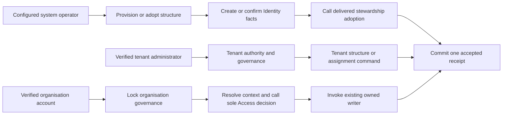

# Protected tenant and organisation administration — implementation plan

Owning task: [#30](https://github.com/Abzum-NZ/Abzum-Vortex/issues/30).
Governing requirements: [people and organisations](../specification/02-people-organisations-and-sign-in.md),
[Access](../specification/04-access-and-permissions.md),
[IAM](../specification/appendices/iam-application.md),
[data contracts](../specification/appendices/data-contracts.md) and
[platform-only core](../specification/appendices/core-contract-boundary.md).

## Status, delivered slices and dependency boundary

Implementation is unblocked: the exact hosted delivery for the
[central Access decision #34](https://github.com/Abzum-NZ/Abzum-Vortex/issues/34)
is [complete](../evidence/issue-34-access-decision.md#delivery-boundary). The other native prerequisites — [#23](https://github.com/Abzum-NZ/Abzum-Vortex/issues/23),
[#24](https://github.com/Abzum-NZ/Abzum-Vortex/issues/24),
[#26](https://github.com/Abzum-NZ/Abzum-Vortex/issues/26),
[#27](https://github.com/Abzum-NZ/Abzum-Vortex/issues/27),
[#32](https://github.com/Abzum-NZ/Abzum-Vortex/issues/32),
[#33](https://github.com/Abzum-NZ/Abzum-Vortex/issues/33) and
[#224](https://github.com/Abzum-NZ/Abzum-Vortex/issues/224) — are retained for
traceability. No user hold or additional approval gate exists.

This task does not depend on completing every role, Group or PIM operation in
[#40](https://github.com/Abzum-NZ/Abzum-Vortex/issues/40). Both tasks consume the
same completed Access decision and governance-first ordering, but each owns its
own protected operations. Adding a whole-task dependency would create no useful
code or authority boundary.

This work unlocks [the isolation suite #29](https://github.com/Abzum-NZ/Abzum-Vortex/issues/29),
[administration applications #72](https://github.com/Abzum-NZ/Abzum-Vortex/issues/72)
and [guided IAM setup #267](https://github.com/Abzum-NZ/Abzum-Vortex/issues/267).

Delivered on `testing`:

- **Slice 1** — tenant-administration facts and protected receipt boundary
  ([PR #441](https://github.com/Abzum-NZ/Abzum-Vortex/pull/441)).
- **Slice 2** — trusted configured-system provisioning and explicit adoption
  ([PR #444](https://github.com/Abzum-NZ/Abzum-Vortex/pull/444)).
- **Slice 3A** — human tenant authority, bounded tenant reads, and
  tenant-administrator grant, change and revoke
  ([PR #445](https://github.com/Abzum-NZ/Abzum-Vortex/pull/445)).

The active implementation assignment is **Slice 3B only: rename and reparent
an existing organisation**. It is intentionally separate from organisation
creation and lifecycle transitions so its hierarchy behaviour, authority and
concurrency proof can be reviewed on their own. Delivery to Testing remains a
closure gate for the exact revision; it does not prevent this independently
unblocked slice from being built and reviewed.

## Outcome

Provide narrow, typed, channel-neutral protected operations above the existing
private Identity and Access storage:

- trusted initial provisioning, explicit adoption and system-only cluster lifecycle;
- tenant-authorised hierarchy, lifecycle and tenant-administrator operations;
- organisation-authorised account and invitation operations; and
- bounded safe administrative reads and deterministic replay evidence.

Tenant authority is structural only. It never grants organisation membership,
application entry, role authority or data access. Organisation-local operations
require an active organisation account and the exact current organisation
permission decided by [#34](https://github.com/Abzum-NZ/Abzum-Vortex/issues/34).
There is no role-name check, hidden administrator flag, tenant fallback or second
permission evaluator.

The service boundary is intentionally earlier than its user interfaces. A future
Tenant Administration application presents hierarchy and lifecycle; Organisation
Administration presents accounts, invitations and runtime settings; IAM presents
tenant-administrator grants and organisation access-grant journeys. Those locked
ordinary applications belong to [#72](https://github.com/Abzum-NZ/Abzum-Vortex/issues/72)
and [#267](https://github.com/Abzum-NZ/Abzum-Vortex/issues/267). This task adds no
page, route, generic form, MCP transport, model, assistant or AI behaviour.

## Authority and transaction boundaries

Tenant-governance operations resolve a verified identity, active cluster
projection, selected tenant and current effective same-tenant administrator
assignments inside the protected transaction. They require one exact capability
from this closed, no-wildcard catalogue:

- `platform.tenant.hierarchy.read`
- `platform.tenant.organizations.create`
- `platform.tenant.organizations.rename`
- `platform.tenant.organizations.reparent`
- `platform.tenant.organizations.lifecycle`
- `platform.tenant.administrators.read`
- `platform.tenant.administrators.manage`

This path deliberately needs no account in the target organisation. That allows
creation of the first organisation and recovery of a suspended organisation. A
later IAM journey additionally needs an active account and operating role in its
chosen IAM instance; that is application entry, not authority for the tenant
command.

Organisation-local reads use the existing [#27](https://github.com/Abzum-NZ/Abzum-Vortex/issues/27)
resolved context and the thin [#34](https://github.com/Abzum-NZ/Abzum-Vortex/issues/34)
adapter. Changing operations first acquire organisation governance, then resolve
and evaluate current authority in the same transaction before invoking the owned
writer. They do not acquire a read resolver's shared lock and later try to upgrade
it. [Lock-order correction #305](https://github.com/Abzum-NZ/Abzum-Vortex/issues/305)
establishes the compatible reader order; no retry or transaction framework is
added here.

## Reuse delivered stewardship and Identity work

Provisioning creates or confirms the tenant, organisation, cluster-local identity
projection, active organisation account and Access-version baseline. Inside that
same outer transaction, it calls the Identity-owned initializer from
[#430](https://github.com/Abzum-NZ/Abzum-Vortex/issues/430) with the explicit
runtime-settings values. #430 owns the settings shape, validation, storage,
persistence and internal runtime reader; #30 does not duplicate any of them. It
then invokes the delivered [#33 stewardship adoption](../evidence/issue-33-stewardship/README.md)
inside the same outer transaction. That composition already creates the exact
organisation-owned steward role, direct permanent assignment, organisation-wide
delegation, current stewardship requirement and one Access-version change. Do not
rebuild those rows or add another stewardship evaluator.

The tenant steward and organisation steward are distinct explicit nominations and
receive distinct scoped assignments. The same verified person may be nominated for
both. “Separate” forbids implicit tenant-to-organisation authority; it does not
require two different humans.

Existing live scopes are adopted only by an explicit configured-system command.
No migration guesses a steward from creator, row order, first account or tenant
administrator. Organisation readiness is established by the current delivered
stewardship requirement and its live qualifying facts. Tenant readiness is
established by a current qualifying permanent tenant assignment and its accepted
system command. Do not add a second bootstrap snapshot, history, continuity or
counter.

Structural adoption is not complete IAM availability. The exact management-
application binding delivered by [#33](https://github.com/Abzum-NZ/Abzum-Vortex/issues/33),
the installed IAM release and the steward's operating role are composed and proven
later by [application integration #64](https://github.com/Abzum-NZ/Abzum-Vortex/issues/64)
and [guided setup #267](https://github.com/Abzum-NZ/Abzum-Vortex/issues/267).
Do not report “IAM ready” from a successful
[#30](https://github.com/Abzum-NZ/Abzum-Vortex/issues/30) service operation.

Reuse the existing [#24](https://github.com/Abzum-NZ/Abzum-Vortex/issues/24)
invitation owner and the guarded account-state composition delivered with
[#33](https://github.com/Abzum-NZ/Abzum-Vortex/issues/33). Invitation creation in
this task is the no-intent path only. Invitation-time Group or role intent remains
the governed IAM operation owned by [#40](https://github.com/Abzum-NZ/Abzum-Vortex/issues/40)
and [#267](https://github.com/Abzum-NZ/Abzum-Vortex/issues/267).

## Private facts and common command rules

Correct the tenant-administrator assignment contract before adding storage. Each
assignment has a permanent identifier, tenant and verified identity, a canonical
unique nonempty set of closed structural capabilities, fixed start and optional
expiry, positive revision, original grant provenance, current change evidence and
all-or-none revocation evidence. `scheduled`, `active`, `expired` and `revoked` are
derived temporal outcomes, not editable authority. Remove the false Activity
identifier requirement; generic Activity remains with
[#252](https://github.com/Abzum-NZ/Abzum-Vortex/issues/252) and
[#115](https://github.com/Abzum-NZ/Abzum-Vortex/issues/115).

Add two #30-private forced-RLS fact tables: tenant assignments and accepted
administration receipts. [#430](https://github.com/Abzum-NZ/Abzum-Vortex/issues/430)
owns the separate runtime-settings table. Give public, browser, Data API, runtime
and request roles no direct table or raw-helper access. Actors, clocks,
correlations, resolved scopes and permission evidence are trusted server facts,
not editable command fields.

Use one minimal accepted-receipt pattern across successful #30 commands. Scope its
uniqueness by trusted actor, tenant or cluster scope, operation and duplicate key;
bind a canonical input fingerprint and resulting identifiers/revisions. An exact
retry returns the accepted result without another mutation or Access increment;
a changed payload conflicts. Store no raw input document, invitation secret,
credentials, email/profile data, permission snapshot, business value or second
Activity payload. A refused or failed transaction writes no success receipt. This
pattern does not wrap or replace #430's settings initializer or revision-checked
update behaviour.

Creates require duplicate protection but no prior revision. Updates and revocations
also require the exact current revision. Successful results return only the typed
operation and subject identifiers, resulting revision or Access version where
applicable, server correlation and server time. Safe refusals do not reveal whether
a foreign or inactive target exists.

## Build in bounded slices

### 1. Contracts and storage foundation

- Correct the tenant-assignment contract and add strict commands, results, safe
  refusals, operator context, tenant launcher/read models and receipt contracts.
- Reuse #430's canonical language and time-zone validators for organisation-account
  preferences; do not duplicate those validators.
- Add the two #30-private fact tables, their exact owner-only reads and storage
  invariants. Do not add an organisation role table, Access counter, permission
  cache, assignment history or generic policy engine.

### 2. Trusted provisioning and explicit adoption

- Add one server-only configured operator boundary with a non-nil system actor.
- Provision a tenant and root organisation with explicitly nominated tenant and
  organisation stewards, explicit #430 runtime settings, Access baseline and
  active projection and account; invoke delivered stewardship adoption and commit
  one #30 receipt.
- Create a later organisation through the same structural core after tenant
  authorization, always with an explicitly nominated organisation steward. The
  creating tenant administrator receives no organisation role unless separately
  nominated.
- Explicitly adopt pre-existing live tenants and organisations. Readiness refuses
  until every live scope has its supported current stewardship facts.

### 3. Tenant governance and structure

- **Delivered 3A:** tenant launcher and bounded deterministic hierarchy and
  administrator reads; grant, change and revoke tenant assignments with exact
  capability, revision, duplicate and final-manager protection.
- **Current 3B:** rename an existing organisation's display name, or reparent an
  existing organisation to a same-tenant parent or to the tenant root. Both use
  the exact `organizations.rename` or `organizations.reparent` capability,
  expected organisation revision, existing tenant serialization, existing
  receipt semantics and a post-wait authority recheck. Reparenting reuses #23's
  same-tenant, self-parent and cycle constraints. It does not alter descendants:
  their existing links make them move with the subtree.
- **Later, separately picked up:** tenant-authorised organisation creation with
  explicit steward composition; suspend, reactivate and administrative archive;
  tenant lifecycle. Lifecycle keeps the existing non-cascading rule: parent
  suspension neither rewrites nor blocks an independently active child; archive
  is terminal when that later slice delivers it.

### 4. System-only cluster lifecycle

- Suspend, reactivate and close a cluster-local identity projection through the
  configured system operator with exact revision and deterministic replay.
- Check the current tenant and organisation stewardship conditions for every
  affected scope under sorted organisation governance locks.
- Add the bounded tenant suspend/reactivate path required by cluster operations.
  Do not mutate provider/Auth identity or sessions, another cluster, descendant
  organisation states or organisation Access versions.

## Slice 3B — protected rename and reparent

This slice has exactly two commands. A rename changes only an organisation's
display name. A reparent changes only its parent organisation reference, either
to another organisation in the same tenant or to `null` for a root organisation.
Neither command creates an organisation, changes its permanent identifier,
short name, tenant, lifecycle, accounts, local roles, record ownership or Access
version.

Both commands derive the caller from the verified session and selected active
tenant. They require the corresponding exact current structural capability; an
organisation account is neither required nor treated as a fallback. They use the
existing protected tenant-governance transaction and receipt pattern: an exact
accepted retry returns the recorded result, a changed-input duplicate conflicts,
and a refusal or rollback creates no accepted receipt.

Reparenting must continue to enforce #23's tenant, self-parent and cycle rules.
It must also safely refuse a foreign or missing target, a prohibited lifecycle
state identified by the existing structural rules, and a stale expected revision.
An active child beneath a suspended parent remains valid when #23 permits that
existing shape; this slice must not introduce a new parent-active requirement.

The proof must establish: authorised operation without target-organisation
membership; root moves and subtree preservation; exact capability separation;
foreign/missing/self/descendant refusal; replay and changed-payload conflict;
no mutation or receipt on refusal; and two concurrency cases. First, competing
moves cannot create a cycle. Second, an authority that was effective while queued
on the tenant lock but expires before it obtains the lock must be refused without
changing structure or creating a receipt. Reuse the deterministic database-clock
approach from Slice 3A rather than adding a timer or a second authority model.

Do not add a generic command dispatcher, a hierarchy representation, a policy
engine, a counter, a history table or another receipt mechanism. The existing
parent links, governance locks, capability catalogue and accepted receipts are
the complete implementation basis.

### 5. Organisation-local reads

- Return bounded, deterministic safe views of the current organisation's accounts
  and invitations. The administrative runtime-settings view first makes the exact
  `platform.organization.runtime_settings.read` decision through #34, then invokes
  #430's internal reader for the resolved organisation in that same transaction;
  it does not recreate settings storage or a runtime reader.
- Require the exact registered `.read` permission through the completed
  [#27](https://github.com/Abzum-NZ/Abzum-Vortex/issues/27) context and
  [#34](https://github.com/Abzum-NZ/Abzum-Vortex/issues/34) decision. Membership
  and tenant assignment are never fallbacks.

### 6. Organisation-local changes

- Use a task-owned governance-first resolver and the sole
  [#34](https://github.com/Abzum-NZ/Abzum-Vortex/issues/34) decision in the same
  transaction for each exact `.manage` operation.
- Invoke the delivered guarded account-state writer. Account and Access version
  change together or neither, and the final permanent steward remains valid.
- Invoke the [#24](https://github.com/Abzum-NZ/Abzum-Vortex/issues/24) no-intent
  invitation create/revoke composition. Return the raw secret only for the first
  committed creation; an exact replay returns metadata without a secret.

### 7. Integrated evidence and delivery

Run focused contract/storage/ACL proofs first, then actual transaction and race
proofs, full repository and Local database gates, and exact protected Testing
delivery. Production remains separately gated.

## Acceptance checklist

- [x] No implementation begins before the exact hosted completion of
      [#34](https://github.com/Abzum-NZ/Abzum-Vortex/issues/34).
- [ ] The configured operator idempotently provisions or adopts live scopes with
      explicit tenant and organisation steward nominations; no first-user,
      creator-order or browser owner path exists.
- [ ] The same person may receive both nominations only through two explicit,
      separately scoped choices and facts.
- [ ] [#30](https://github.com/Abzum-NZ/Abzum-Vortex/issues/30) calls the delivered
      D1 stewardship and guarded account compositions; it does not recreate their
      role, assignment, delegation, final-steward or Access-version logic.
- [ ] Tenant authority resolves only current effective same-tenant structural
      assignments and cannot authorize organisation, application or record access.
- [ ] Organisation-local work requires the active
      [#27](https://github.com/Abzum-NZ/Abzum-Vortex/issues/27) context and exact
      [#34](https://github.com/Abzum-NZ/Abzum-Vortex/issues/34) permission. Changing
      work follows governance-first lock order and contains no second role/permission
      evaluator.
- [ ] Tenant assignment, organisation hierarchy, projection and account lifecycle
      races cannot remove the final required permanent tenant or organisation
      steward.
- [ ] Organisation creation never grants its creating tenant administrator local
      membership or a role unless that person is explicitly nominated.
- [ ] Parent lifecycle does not cascade to active children; tenant suspension blocks
      the tenant without rewriting child state.
- [ ] Invitation creation/revocation preserves
      [#24](https://github.com/Abzum-NZ/Abzum-Vortex/issues/24) invariants and exact
      replay never returns the raw secret. This task creates no invitation access
      intent.
- [ ] Provisioning initializes explicit runtime settings through #430's
      Identity-owned initializer in its existing outer transaction. Administrative
      settings reads use the exact `.read` permission and #430 reader; #30 does
      not own settings validation, storage, updates or retry semantics.
- [ ] Receipts provide deterministic same-input replay and changed-input conflict
      without storing secrets, profiles, business values or duplicate authority.
- [ ] Safe reads are bounded, deterministic and scope-filtered and expose no foreign
      tenant existence, credentials, provider profile, permission internals or SQL.
- [ ] User-facing tenant-assignment and organisation-access grant journeys remain
      with [#267](https://github.com/Abzum-NZ/Abzum-Vortex/issues/267); the
      [#30](https://github.com/Abzum-NZ/Abzum-Vortex/issues/30) service proof does
      not claim a usable IAM application.
- [ ] Independent review checks the actual completed work against this whole task;
      repository, Local database, real concurrency, schema lint/advisers, source
      boundary and protected Testing gates pass for the exact revision.
- [ ] Shipping code contains no example application, business domain, hardcoded
      business role, UI, MCP, model, assistant, prompt, sampling or AI behaviour.

## Explicitly outside this task

- Administration pages, routes and application definitions; these belong to
  [#72](https://github.com/Abzum-NZ/Abzum-Vortex/issues/72) and
  [#267](https://github.com/Abzum-NZ/Abzum-Vortex/issues/267).
- Role, Group, membership, assignment, activation, delegation or invitation-intent
  management; these belong to [#40](https://github.com/Abzum-NZ/Abzum-Vortex/issues/40).
- Application publication, registration, installation and update journeys; these
  belong to [#64](https://github.com/Abzum-NZ/Abzum-Vortex/issues/64).
- Record/field/share/data-policy decisions beyond the central decision; these remain
  with [#35](https://github.com/Abzum-NZ/Abzum-Vortex/issues/35),
  [#36](https://github.com/Abzum-NZ/Abzum-Vortex/issues/36),
  [#37](https://github.com/Abzum-NZ/Abzum-Vortex/issues/37),
  [#38](https://github.com/Abzum-NZ/Abzum-Vortex/issues/38),
  [#39](https://github.com/Abzum-NZ/Abzum-Vortex/issues/39),
  [#153](https://github.com/Abzum-NZ/Abzum-Vortex/issues/153) and
  [#154](https://github.com/Abzum-NZ/Abzum-Vortex/issues/154).
- Business administration records, tenant self-service, email delivery, domain
  ownership, implicit default roles and identity lookup by email.
- Full encrypted archive/restore, `removal_pending`, deletion and retention/hold
  policy; [#255](https://github.com/Abzum-NZ/Abzum-Vortex/issues/255) and later
  operated work own those concerns.
- Environment-wide provider/Auth disablement, cross-cluster identity changes and
  immediate token-revocation claims; these belong to
  [#171](https://github.com/Abzum-NZ/Abzum-Vortex/issues/171).
- Generic Activity/refusal persistence before
  [#252](https://github.com/Abzum-NZ/Abzum-Vortex/issues/252) and
  [#115](https://github.com/Abzum-NZ/Abzum-Vortex/issues/115).
