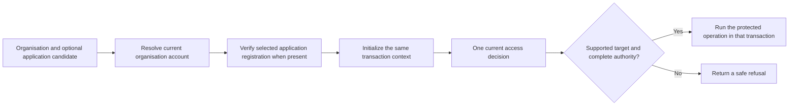

# Central access decision — implementation plan

Owning task: [#34](https://github.com/Abzum-NZ/Abzum-Vortex/issues/34).
Governing requirements: [Access](../specification/04-access-and-permissions.md),
[Groups and privileged activation](../specification/appendices/groups-and-privileged-access.md),
[data contracts](../specification/appendices/data-contracts.md#permission-and-role-contracts)
and [platform-only core](../specification/appendices/core-contract-boundary.md).

## Outcome and place in the plan

One read-only decision determines whether the transaction-bound organisation
account may perform one declared operation. PostgreSQL evaluates current permission,
role, assignment, activation and delegation facts. The server invokes that decision;
it does not implement a second role evaluator.

[Request context #27](https://github.com/Abzum-NZ/Abzum-Vortex/issues/27),
[permission registry #32](https://github.com/Abzum-NZ/Abzum-Vortex/issues/32) and
[authentication evidence #276](https://github.com/Abzum-NZ/Abzum-Vortex/issues/276)
are complete. [Roles and Groups #33](https://github.com/Abzum-NZ/Abzum-Vortex/issues/33)
is complete after its reviewed implementation and exact hosted E verification.
The [saved delivery evidence](../evidence/issue-33-invitation-access/README.md#hosted-testing-follow-up--6-september-2026)
identifies the delivered revision and completed checks. No user approval is outstanding.

[Request/account lock ordering #305](https://github.com/Abzum-NZ/Abzum-Vortex/issues/305)
is complete after [exact hosted Testing verification](../evidence/issue-305-request-lock-order.md#hosted-testing--6-september-2026).
The reader now follows the supported account writer's Access-before-Identity order
after an exact lock-free eligibility filter, then rechecks Identity under its normal
locks. The corrected proof exercises the actual account composition. Database
execution integration is no longer blocked by this correction; no role behaviour
or retry framework was added.

[Organisation administration #30](https://github.com/Abzum-NZ/Abzum-Vortex/issues/30)
and [protected Access operations #40](https://github.com/Abzum-NZ/Abzum-Vortex/issues/40)
consume the completed decision. They cannot bypass it through tenant administration,
membership, display labels or an application's identity.

## Build in reviewable slices

1. Define strict server-owned operation declarations, exact permission/target
   binding, authentication requirements and safe result contracts. Correct the
   unused legacy request/decision shapes rather than preserve caller-selected
   grant candidates, optional account substitution or random decision identities.
   Parsing is not authority, and no new operation registry is needed.
2. Implement one set-wise database decision over the existing verified request
   context and current facts. Cover direct/Group standing assignments and exact
   account activation paths, accepted permission continuity and application scope.
   Do not loop through owner-only fact readers or copy effective grants to a table.
3. Extend that same decision with current delegation coverage for access management:
   exact management permission plus all affected before/after and onward scopes.
   A permission-only intermediate must refuse management requests requiring this
   still-missing check; it is not a finished protected-operation boundary.
4. Add the thin server adapter within the existing resolved transaction and the
   closed target-policy composition. Complete genuine authentication, expiry,
   isolation, consistent-snapshot, safe-error and package-boundary proof.

Each slice receives independent task-versus-work review. It does not close #34 by
itself. Use focused behavioural tests for distinct outcomes, not speculative
combinations or another framework of counters, histories and fingerprints.

### Slice 1 checkpoint — 6 September 2026

The [operation and result contracts](../../contracts/src/organization-access-decision.ts)
and [focused tests](../../contracts/test/organization-access-decision.test.ts) are
implemented and independently reviewed. They bind exact organisation/application
targets, permission identity, action, authentication and before/after management
scope. Permission eligibility is not final allowance; public refusal contains no
private authority details. Unsupported policy and caller-supplied authority fields
are rejected. The unused legacy request/decision shapes were removed with no
remaining consumers.

Full repository verification passed: 1,196 tests with three existing skips, eight
fixture checks, all 23 package typechecks/builds and boundary checks, formatting and
lint. This proves contracts only, not effective access or a usable protected action.
The remaining database decision and server integration still belong to this task.

### Slice 2 implementation choices

Use one request-role callable, private-schema permission-eligibility function. It
reads the existing validated human context, samples database time after resolver
waits, and evaluates the four complete routes in one set-wise fact query. It returns
`eligible` or a closed refusal, never final `allowed`. Delegated management refuses
until the required delegation evaluation is implemented. No owner-only test adapter,
second role evaluator, new registry or stored effective-permission copy is needed.

Choose routes by fixed order: direct standing, Group standing, direct activation,
Group activation, followed by permanent identifiers for ties. The earliest relevant
bound on that chosen route determines its deadline. Do not combine paths or add an
expiry-optimization algorithm. The immutable role seal already verifies historical
acceptance; the live decision checks current entries, registration, catalogue and
continuity rather than repeatedly revalidating sealed history.

An organisation-target platform operation may retain an already selected application
in trusted context: IAM administration must work from inside IAM. Its required
permission remains organisation/platform-scoped. An application-target operation
requires the exact matching context application, declaration target, permission
application and current active registration. The current organisation-only server
wrapper cannot supply that application binding; the later verified application
selection handoff must establish it before context initialization. A declaration
alone cannot manufacture application context. Controlled SQL fixtures prove these
semantics; slice 4 below supplies the real server handoff, not an application UI.

### Slice 2 checkpoint — 6 September 2026

The private current-permission evaluator and restricted-role tests are implemented
and independently reviewed. Local verification passed 48 focused assertions, all
37 SQL files / 1,863 assertions, all 20 concurrency proofs, five-schema lint and the
full repository gate. The [reviewed source and evidence](../evidence/issue-34-permission-eligibility.md)
record the exact boundary. Exact hosted Testing verification also passed for the
merged revision, including all 20 concurrency proofs and five lint schemas. This
slice deliberately refuses delegated management and does not complete #34 or
authorize a protected operation by itself.

### Slice 3 implementation choices

Extend the same evaluator with current delegation coverage; do not add a second
decision or stored effective-authority view. Parse the distinct exact permissions
from the declared before and after scopes once. An organisation-catalogue scope is a
separate requirement that only one current organisation-catalogue delegation can
satisfy; several bounded delegations must never synthesize it. The after scope also
expresses the onward ceiling for a delegation grant or replacement, so no third
scope field or history is needed.

Build complete delegation paths from the existing
[#33](https://github.com/Abzum-NZ/Abzum-Vortex/issues/33) current facts. A direct
path belongs to the transaction account. A Group path also requires the active Group
and that account's current live membership. Every path
must be live and within its fixed window. A bounded path matches the exact
application/owner/permission identity and remains usable only while its stored
continuity and meaning evidence is current; stored fingerprints remain provenance,
not authority. Organisation-catalogue authority may cover future or stale exact
identities so a steward can introduce or repair catalogue state, while the protected
writer still validates the proposed candidate.

Choose one deterministic complete delegation path for each distinct required
permission and, when required, one actual catalogue path. Independent bounded paths
may cover different permissions. The decision is eligible only when every
requirement is covered, and its deadline is the earliest bound from the selected use,
authentication, context, delegation and Group-membership paths. Existing indexes
serve these joins; add no history scan, counter, fingerprint engine or path-search
framework.

The slice-3 contract and focused tests must first reject `delegated_management` when
both before and after are `none`: an empty management scope cannot bypass the
separate-delegation requirement. This evaluator checks only the transaction-bound
account. [Protected Access operations #40](https://github.com/Abzum-NZ/Abzum-Vortex/issues/40)
later bind and recheck any distinct requester or approver through trusted workflow
evidence; caller-selected account input does not belong here. Passing this slice is
still private eligibility, not final allowance or completed approval governance.

### Slice 3 checkpoint — 6 September 2026

Independent Sol review approved the strict management declaration, the extension
of the existing evaluator, and the focused tests. All 10 declaration tests passed;
local rollback probes passed all 28 delegated-management assertions and the 48
existing permission assertions with the updated both-none rejection.

The final focused case uses the real delegation and application withdrawal writers:
after removing the wider catalogue path, a valid bounded path works, then refuses
when its managed application is withdrawn. The use-permission application remains
active. The fixture correction supplies the real coordinator's required unaccepted
template state; it adds no accepted Role or authority. Existing evaluator-reader
and delegation-writer concurrency proofs cover the same governance-lock ordering,
so no duplicate concurrency harness was added. Full combined gates and hosted
delivery with slice 4 remain outstanding; this is not task completion.

### Slice 4 implementation choices

Complete the application-context handoff here, not in downstream
[runtime bindings #250](https://github.com/Abzum-NZ/Abzum-Vortex/issues/250), which
already depends on #34. Extend the existing organisation selection and resolved
scope with an optional exact application root. The organisation-only route remains
unchanged. A uniquely named private application resolver calls the delivered
organisation resolver first, then checks the exact same-organisation active
application registration while the existing Access shared lock remains held.
Only `vortex_runtime` may call it; no default argument, overloaded ambiguity, new
context store, installation engine or application-selection screen is introduced.
The server binds the returned application to the candidate before initialization.
Selection establishes scope, never application-use permission.

Add one server-only transaction-local adapter. It accepts the existing request
transaction, resolved scope, a server-owned declaration and an operation callback.
It calls the sole database evaluator once, strictly maps one result and matches
its operation, target, organisation, account and Access version. An application
result must also match the resolved application. Its closed organisation/application
policy switch invokes the callback only after final allowance. It adds no policy
callback registry or second role evaluator. Private refusal reasons are coarsened;
malformed trusted declarations, invalid storage results and unexpected failures
remain internal failures without invoking the callback or exposing raw details.

Changing operations in [#30](https://github.com/Abzum-NZ/Abzum-Vortex/issues/30) and
[#40](https://github.com/Abzum-NZ/Abzum-Vortex/issues/40) provide their own
governance-first resolver, then reuse the same context and transaction-local
adapter. They do not upgrade the ordinary read resolver's shared lock. Acquire
other potentially blocking operation locks before the decision or re-evaluate after
a wait; `validUntil` is not a capability to execute later without checking.

Prove strict one-row/one-call mapping, exact scope/operation binding, safe refusal
and callback suppression, ordinary and application-context selection, foreign or
withdrawn application refusal, and the real resolver versus withdrawal ordering.
An injected governance-first resolver verifies that the adapter opens no extra
transaction or takes its own locks. Real #30/#40 writers and #250 compiled page
operations remain with those tasks; controlled tests do not claim their delivery.

### Final integration checkpoint — 6 September 2026

All four slices are source-complete and independently approved against the whole
task. The application resolver and one-decision operation adapter are implemented;
the application binding is checked before either refusal or success. Existing
application coordination proof covers both real withdrawal orderings without a
new harness. Combined local verification passed 39 SQL suites / 1,903 assertions,
all 20 concurrency proofs, five-schema lint and full repository verification.
The [final integration evidence](../evidence/issue-34-access-decision.md) records
source fingerprints and the initial local test anomalies as well as successful
reruns. Normal combined Testing delivery and its exact receipt remain outstanding.
Keep #34 open and do not substitute slice 2's hosted receipt for this final work.

## Required decision behaviour

- Bind the actual operation/action to its trusted exact permission and target.
  A valid unrelated permission cannot authorize the requested operation. Clients
  supply validated operation parameters, never a permission declaration, account,
  grant list, policy result or allow flag that is trusted as authority.
  Platform code or a verified immutable compiled operation supplies the declaration.
  Match catalogue action kind, named action and any record-type restriction, not
  merely its key. Organisation targets require a platform permission whose identity
  has no application scope; the trusted request may still retain its selected
  application. Application/module use carries the exact active target application
  registration. An operation key is evidence, not a registry or grant.
- Validate active identity, account, organisation and tenant; current Access version;
  exact registration, owner/application scope, accepted meaning and continuity.
  Same-named applications or shared module identities never merge authority.
- Evaluate active and `acceptance_required` retained permissions only. Pending
  additions, unavailable/retired roles and broken availability/meaning continuity
  grant nothing. Publication and registration alone never grant use.
- Standing assignments contribute only under current standing policy. Eligibility
  alone never contributes. Activation requires the exact current account, source
  assignment and optional originating membership identity/revision, authority and
  policy periods, retained permission and finite live bounds. Role revision is
  provenance, not blanket equality with the latest metadata revision.
- Preserve matching-kind eligibility through compatible policy-detail changes,
  while invalidating old policy-bound windows. Mode changes never convert assignment
  kinds. An explicitly reviewed return may make a still-valid matching kind
  compatible; eligible access still needs fresh activation. No assignment-mode
  counter is added.
- Membership restoration keeps its original window and changes its revision;
  renewal has a new identity. Neither revives old activation evidence. Assignment
  and delegation revocation, and Group retirement, remain terminal.
- Management requires both the exact use permission and current separate delegation.
  Catalogue governance may cover future registrations but grants no application use.
  Bounded delegation retains exact accepted scope and cannot widen through updates,
  reciprocal grants or another application's module availability.
  Different complete current bounded delegations may cover different exact required
  tuples; every tuple needs one complete valid delegation path. Bounded pieces never
  synthesize organisation-catalogue governance or wider onward delegation.
- Use trusted primary/MFA confirmation evidence from Identity. Refresh, token issue
  time, context creation and strength labels alone do not establish recency. Do not
  impose MFA on ordinary operations that do not require it.
- Bind private allow evidence to the exact operation, target, account, organisation,
  current Access version and finite recheck deadline. An unchanged Access version
  cannot preserve expired authority. Evidence is not a reusable capability or cache.
  Choose one complete direct-standing, Group-standing, direct-activation or
  Group-activation path deterministically. Never combine fragments of different
  paths. The deadline is the earliest relevant bound on the selected use path and
  every selected delegation path, plus context and authentication bounds. A fresh
  decision may choose another complete path; an old result does not silently switch.
- Read one consistent fact snapshot. Competing changes yield wholly old or wholly
  new facts, not mixed accepted entries, role policy, assignment or Access versions.
  Protected mutation owners remain responsible for invoking/rechecking authority in
  the same guarded transaction as their change.
  The read adapter uses the existing resolved request transaction and derives scope
  from `validated_human_request_context()`. Observe database time after resolver
  lock waits, not at transaction start. Keep allow evidence inside that transaction.
  Changing operations in #30 and #40 must acquire governance before mutable account/access facts,
  rather than upgrade the read resolver's shared lock after checking permission.
  Test the actual read/write lock orders and expiry across a wait; correct a
  demonstrated ordering defect at its source, not with a new retry framework.
- Organisation administration in [#30](https://github.com/Abzum-NZ/Abzum-Vortex/issues/30)
  composes its own account, invitation and settings changes with the completed
  decision in that governance-first transaction. It does not wait for every role,
  Group or PIM operation in [#40](https://github.com/Abzum-NZ/Abzum-Vortex/issues/40).
  Keep the actual dependency graph; do not add a whole-task gate for this shared
  ordering rule or introduce a separate transaction framework.
- Refuse safely without exposing internal role labels, permission keys or record
  existence. The decision writes no Activity; the owning operation records evidence.

## Policy ownership — no missing policy is treated as allowed

Initially only organisation/application operations whose declared requirements are
fully implemented may receive final allowance. A basic permission match is not
record, field, file, sharing, public or remote authority. Unsupported caller kinds
and missing required target policies refuse. Future owners extend the same boundary:

| Policy or integration | Owner |
|---|---|
| Generated row enforcement and actual records | [#35](https://github.com/Abzum-NZ/Abzum-Vortex/issues/35), [#45](https://github.com/Abzum-NZ/Abzum-Vortex/issues/45) |
| Ownership, Groups, direct shares and approved relationship scopes | [#36](https://github.com/Abzum-NZ/Abzum-Vortex/issues/36); shared condition vocabulary reused by [#57](https://github.com/Abzum-NZ/Abzum-Vortex/issues/57) |
| Field and action restrictions | [#37](https://github.com/Abzum-NZ/Abzum-Vortex/issues/37) |
| External/delegated callers and anonymous public operations | [#104](https://github.com/Abzum-NZ/Abzum-Vortex/issues/104), [#107](https://github.com/Abzum-NZ/Abzum-Vortex/issues/107) |
| Source-authoritative complete sharing grant and two-sided consent | [#153](https://github.com/Abzum-NZ/Abzum-Vortex/issues/153), [#154](https://github.com/Abzum-NZ/Abzum-Vortex/issues/154) |
| Local/remote equivalence and verified federation transport | [#156](https://github.com/Abzum-NZ/Abzum-Vortex/issues/156), [#157](https://github.com/Abzum-NZ/Abzum-Vortex/issues/157) |
| Governed MCP transport and interface parity | [#200](https://github.com/Abzum-NZ/Abzum-Vortex/issues/200) |

Controlled adapter parity proves shared decision composition, not those complete
runtime integrations. Credential restrictions can only narrow account authority;
unsupported credentials never become a synthetic human context. These later tasks
keep their complete requirements and must not be pulled forward merely for tests.

## Acceptance evidence

Prove positive and negative organisation directions; exact action/target/owner
binding; direct/Group standing and activated paths; retained and broken permission
continuity; delegation and onward-scope limits; stale context; real authentication
and time bounds; missing policy refusal; non-owner SQL privileges; safe errors;
consistent concurrent snapshots; and absence of a second evaluator. Use neutral
fixtures and the actual restricted request role, not owner credentials as proof of
runtime access. Finish the normal repository, database, concurrency and hosted gates.

No IAM UI, granting workflow, new permission cache, effective-grants table, Activity
store, operation registry or business-domain implementation belongs to this task.
