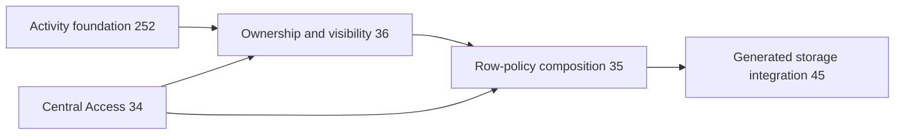

# Phase 3 — Row-policy composition

Task: [#35](https://github.com/Abzum-NZ/Abzum-Vortex/issues/35). Prerequisites are complete: [central Access #34](https://github.com/Abzum-NZ/Abzum-Vortex/issues/34), [ownership and visibility #36](https://github.com/Abzum-NZ/Abzum-Vortex/issues/36) and [access administration #40](issue-40-protected-access-administration.md), each with verified exact hosted evidence.

The earlier local implementation candidate and its unmerged migrations are set
aside and are not recovered, copied or reassigned. The assigned developer
implements this task fresh from current source and the requirements below,
creating new migrations through the normal migration gate and current ordering.
The reviewed [typed exact-record handoff](../evidence/issue-35-record-access-enforcement.md#typed-exact-record-handoff--8-september-2026) remains a source checkpoint only; it adds no default database adapter and is not a delivered record policy.

## Outcome

Permission to perform an action and permission to see or change a particular record are both enforced by the database. Neither check can substitute for the other.

## What will be built

1. Extend the existing central decision to an exact record target using the complete local row-narrowing contract from #36. Keep current organisation/application, permission, role, recent-authentication and lifecycle checks; an operation-permission result alone is not row authority.
2. Compose that decision into four fixed policies on controlled neutral business-row test tables: SELECT uses `USING`; INSERT uses `WITH CHECK`; UPDATE checks both the old row with `USING` and the proposed row with `WITH CHECK`; DELETE uses `USING`.
3. Bind the operation and exact declared scope on the trusted side. Callers cannot choose a permission, table, predicate function, or arbitrary condition to bypass the operation's declaration. Apply row restrictions before reading, counting or changing data, never by filtering fetched rows.
4. Consume #36's database row predicates for account/Group/inherited ownership, explicit all-record routes, current local direct shares, approved relationships and saved conditions. There is no separate organisation-owner mode: organisation-shared storage describes a storage boundary, not who owns a row. Missing or unsupported required policy refuses. Reuse current account, Group and Access-version facts; do not add a second permission evaluator or authority cache.
5. Preserve the private Identity, Definition, Access and Activity tables behind their narrow protected functions. They are not ordinary shareable business tables and receive no generic CRUD policies or broad request grants.
6. Extend only the trusted record-operation binding to a nonempty, unique, canonical set of alternative exact permissions. This lets one action serve people with own-record permission and people with all-record permission without duplicate screens or role-specific code. Keep historical singular bindings readable and leave non-record #34 operations unchanged. New record-operation publication resolves every alternative to the exact subject record type, owner and action; named actions also match the exact owner-scoped named action. Normal operation meaning/version comparison applies.

For a record, the decision is `OR(permission eligibility AND that same permission's complete row scope)` across the declared alternatives. It is never `ANY eligibility AND ANY scope`. Each permission retains #36's own base routes and optional condition; an alternative cannot supply missing authority to another. UPDATE applies this complete-pair test to both the old and proposed row. Carry independently complete matched contributions to #37; field bounds may combine only those complete contributions, never an incomplete alternative or an arbitrary first witness. This is an extension of the current decision, not another permission evaluator or policy registry.

## Implementation sequence

1. Extend the trusted record-operation contract and publication/compiler mapping with canonical permission alternatives, retaining existing singular bindings and normal meaning/version comparison.
2. Extend the existing private central decision compatibly: its current non-record path explicitly excludes record catalogue entries and cannot be reused unchanged for a record. Select the exact current record permission and keep its `record_scope`, identity, context and validity deadline bound to that eligibility result. Preserve the existing non-record operation contract and behavior.
3. Compose each eligible alternative with its own complete visibility scope through the existing predicates. Keep only complete matches and their conservative validity deadline for the field-access consumer. Reuse the published cycle-free relationship graph for recursion; add no parallel policy registry or authority cache.
4. Apply and verify the four fixed policy shapes below on neutral business-row tables, followed by whole-scope review and exact hosted evidence. Generated storage and field projection remain downstream consumers.

## Implementation ownership verified against current source

The reviewed implementation keeps the existing non-record declaration and eligibility function signature unchanged. A separate strict record declaration carries the exact application and installed module/record-type/storage binding, canonical required permissions, action and recent-authentication requirement; it allows ordinary permission authority only, not delegated-management scopes. A private shared eligibility core reuses current catalogue and role-path logic for both wrappers. Each wrapper validates its context and takes one Access-version observation and time sample; request roles cannot call the core directly or supply those internal facts. The first checkpoint proves candidate-bound eligibility and legacy equivalence only. It must not report a final record allow result before the row-scope composition is implemented.

The complete record decision retains each independently successful permission contribution and each applicable direct share's own field bounds and expiry. Its validity cannot outlive any contribution it reports. Immutable Definition releases and their exact dependencies supply conditions and relationship declarations; a fixed protected adapter supplies actual rows and edges. No caller selects a table, predicate or source permission. Relationship recursion uses the same decision and refuses cycles; inherited ownership remains a separate factual owner route. These are private implementation seams, not another catalogue, cache or public endpoint.

Both allowed and refused final record evidence identify the exact `recordId` supplied by the trusted record adapter, in addition to the existing organisation/application/type/storage binding. A result for one record cannot stand in for another record of the same type. Permission-only eligibility remains pre-row and does not carry a record identifier. Reuse the existing record identifier contract; do not add a decision token, fingerprint or duplicate scope model. The downstream field-access consumer must check this exact target before using the result.

UPDATE's old-row and proposed-row policies are separate complete decisions under the transaction's held Access facts. Each may take a fresh time sample: expiry between them must refuse the later decision, never extend authority. Do not introduce a statement-local cache or token merely to force identical timestamps. A direct-share update contribution here proves row eligibility only; [field access #37](issue-37-field-access.md) must still restrict the fields actually changed. The fixed neutral adapters are a proof boundary, not the generated storage delivered by [#45](https://github.com/Abzum-NZ/Abzum-Vortex/issues/45).

| Existing area | Required change |
| --- | --- |
| [Module authored actions](../../contracts/src/module-source-contracts.ts), [application authored actions](../../contracts/src/application-source-contracts.ts), [compiled actions](../../contracts/src/module-contracts.ts) | Extend record-action permission binding to canonical alternatives while retaining historical singular definitions. Do not broaden unrelated navigation, interface or non-record bindings into caller-selected permission lists. |
| [Compiler](../../runtime/definition/src/compiler.ts), [validation](../../runtime/definition/src/validation.ts), [version comparison](../../runtime/definition/src/comparison-policy.ts) | Resolve all alternatives to the exact record/action owner before fingerprinting. Validate the complete set and include it in ordinary meaning/version comparison; do not rewrite immutable historical artifacts. |
| [Central decision contracts](../../contracts/src/organization-access-decision.ts) and existing database eligibility implementation | Add the record-aware branch through shared existing eligibility logic, with one locked context/Access version and conservative time evidence. Preserve non-record callers. Do not repeatedly combine independent eligibility calls with drifting facts or relax the current non-record filter alone. |
| Existing eligibility, record-scope, ownership, share and relationship SQL proofs | Reuse fixtures and add the complete-pair, old/new UPDATE, alternative contribution and isolation cases unique to this task. No new test framework; #45 still owns generated tables and #37 field combination. |

Preserve the existing authored `permission` and compiled `permissionKey` shapes for single-permission actions. Add mutually exclusive authored `permission_alternatives` and compiled `permissionKeys` only for two or more canonical unique alternatives. Normalize both to a permission set for reference checks, semantic comparison and trusted Access declarations; preserve the original artifact representation and normal hashing, without rewriting historical bytes. This is authorization metadata only: #250 still owns flow/action execution, and an interface's separate exposure permission cannot be mixed into the target action's row authority.

Do not infer action meaning or permission ownership from a button/action key. Existing singular bindings retain their supported reference semantics, including broader management permissions. For plural bindings, resolve exact declaring owners through the existing application/module dependency lookup, refuse ambiguous permission keys, and require the same subject record type and action meaning. Named alternatives must also share the same declaring owner. Application actions may legitimately bind module permissions; no extra authored or compiled owner field is needed because the resolved permissions already carry that identity.

Neither this implementation map nor passing earlier predicate tests constitutes delivered record policies. Contract/compiler work precedes the complete database decision and fixed-policy proof. The eligibility-only SQL checkpoint stays unmerged until it participates in a complete record decision and neutral policy proof. Compatible contract/compiler metadata may be reviewed separately, but no runtime or interface may execute alternative bindings before the complete-pair database enforcement is available.

## Relationship-route composition

[#36](issue-36-ownership-and-visibility.md#c--next-inherited-ownership-and-relationship-witness-checkpoint) supplies an exact factual relationship witness and proves inherited-owner routing separately. This task owns the complete relationship visibility decision: resolve the declared `sourcePermissionId`, evaluate its current eligibility and its own complete row scope against the exact source row, and only then apply the declared relationship witness to the target row. Recursively apply that same composition when the source permission itself uses a relationship route. Preserve publication's cycle-free route graph and exact installed storage bindings; do not accept a caller-provided allow flag or mix different permissions' eligibility and scope.

Inherited ownership is not this permission recursion. It follows the child's declared parent edge to account/Group owner facts and does not require a permission to read the parent. A parent share therefore cannot substitute for inherited ownership. The two paths reuse #36's factual edge checks without adding a second authorization evaluator, relationship catalogue or reverse dependency on #35. [#45](https://github.com/Abzum-NZ/Abzum-Vortex/issues/45) later binds this complete composition to generated physical storage.

## Acceptance criteria

The pre-policy [direct-ownership proof](../evidence/issue-36-record-visibility.md#direct-account-and-current-group-ownership--7-september-2026) deliberately separates an existing non-record operation permission from a stored scoped declaration in its rollback-only fixture. It proves the private predicate seam, not this task's shipping authorization. Here the same selected eligible record-permission identity and current catalogue entry must supply its own row scope. Do not carry that temporary fixture split into a production operation or relax the current non-record evaluator in isolation.

- [ ] Actual non-owner request-role tests cover all four operations in both organisation directions and same-organisation application separation.
- [ ] Having only the operation permission or only the row visibility never admits the operation.
- [ ] One action correctly serves own-record and all-record alternatives. Eligibility from alternative A plus row visibility from B refuses when neither complete pair passes. Empty/duplicate alternatives, foreign record types, wrong action kinds and wrong named-action owners refuse at publication.
- [ ] Field-access handoff identifies only complete matched alternatives. Legacy singular operation bindings remain readable; newly published alternatives have complete compiler/provenance mapping and participate in meaning/version comparison.
- [ ] Ownership, multiple Groups, active/revoked/expired local shares, approved relationships and conditions match the #36 results at the database boundary.
- [ ] Forged, stale, wrong-organisation/application and revoked contexts refuse. UPDATE cannot move an existing row into an unauthorised scope.
- [ ] Policy definitions bind the fixed central decision and correct old/new row checks. Private platform tables remain inaccessible and have no generic record policies.
- [ ] Independent review and local/hosted verification cover the delivered scope. Evidence explicitly identifies the neutral test tables; it does not claim generated-table or end-user application delivery.

## Integration ownership

### Trusted record adapters — 8 September 2026

The existing runtime connection becomes the restricted `vortex_request` role
inside the verified transaction. It cannot call the private record evaluator,
and must not receive an owner connection or a generic wrapper accepting permission,
ownership, row or relationship JSON from a caller.

#35 supplies a typed operation-specific adapter seam and exact-result
orchestration, plus the actual four-policy proof using fixed neutral adapters in
SQL430. The neutral adapter fixes the operation and storage binding, loads rows
and edges itself, and invokes the private evaluator. Unit tests of the TypeScript
seam are not a permanent generated database adapter.

[#45](https://github.com/Abzum-NZ/Abzum-Vortex/issues/45) generates permanent
storage-specific adapters and policies from verified definitions. They accept
only the normal target and operation payload; they select the exact declaration,
physical storage and relationship facts on the trusted side. #35 and #37 do not
wait for #45 to prove their engines on controlled neutral tables, and #45 does
not receive a bypass around those engines. No second driver, authority store,
caller-selected helper or generic dispatcher is required.

### Implementation restart — 9 September 2026

The prior local candidate refused record decisions above fixed 1,000-permission
and recursion cutoffs. Neither cutoff is an approved product behaviour, and the
candidate is not recovered. The fresh implementation uses the existing
published-graph bound and cycle refusal as its traversal safeguards; any
additional resource bound requires current evidence and belongs to
implementation and testing, not business behaviour.

This task proves the policy shape that [generated storage #45](https://github.com/Abzum-NZ/Abzum-Vortex/issues/45) will install. #45 owns real storage mappings, Definition-derived physical tables and generated integration. It continues to depend on #35; #35 does not depend on #45 or a new storage subtask. That avoids a cycle through the Phase 3 epic and Phase 4 installation tasks.

[Field access #37](https://github.com/Abzum-NZ/Abzum-Vortex/issues/37) owns field projection and allowed changes. [Sharing #153](https://github.com/Abzum-NZ/Abzum-Vortex/issues/153) and [federation #156](https://github.com/Abzum-NZ/Abzum-Vortex/issues/156) own complete cross-organisation and live remote integration; unsupported routes stay closed until those policies exist. Search, reporting and export owners reuse the delivered decision when their executors arrive.

## References

- [Record visibility](../specification/04-access-and-permissions.md#record-visibility)
- [Database roles and context](../specification/17-runtime-storage-and-caching.md#database-roles-connections-and-request-context)
- [Phase 3 build plan](README.md#phase-3--access)
