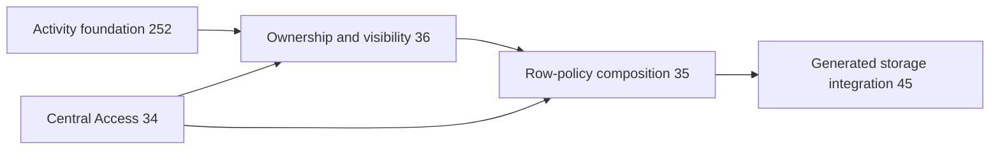

# Phase 3 — Row-policy composition

Task: [#35](https://github.com/Abzum-NZ/Abzum-Vortex/issues/35). Prerequisites: [central Access #34](https://github.com/Abzum-NZ/Abzum-Vortex/issues/34), complete, and [ownership and visibility #36](https://github.com/Abzum-NZ/Abzum-Vortex/issues/36), still required. This is a technical dependency, not a user hold.

## Outcome

Permission to perform an action and permission to see or change a particular record are both enforced by the database. Neither check can substitute for the other.

## What will be built

1. Extend the existing central decision to an exact record target using the complete local row-narrowing contract from #36. Keep current organisation/application, permission, role, recent-authentication and lifecycle checks; an operation-permission result alone is not row authority.
2. Compose that decision into four fixed policies on controlled neutral business-row test tables: SELECT uses `USING`; INSERT uses `WITH CHECK`; UPDATE checks both the old row with `USING` and the proposed row with `WITH CHECK`; DELETE uses `USING`.
3. Bind the operation and exact declared scope on the trusted side. Callers cannot choose a permission, table, predicate function, or arbitrary condition to bypass the operation's declaration. Apply row restrictions before reading, counting or changing data, never by filtering fetched rows.
4. Consume #36's database row predicates for account/Group/organisation ownership, current local direct shares, approved relationships and saved conditions. Missing or unsupported required policy refuses. Reuse current account, Group and Access-version facts; do not add a second permission evaluator or authority cache.
5. Preserve the private Identity, Definition, Access and Activity tables behind their narrow protected functions. They are not ordinary shareable business tables and receive no generic CRUD policies or broad request grants.

## Acceptance criteria

- [ ] Actual non-owner request-role tests cover all four operations in both organisation directions and same-organisation application separation.
- [ ] Having only the operation permission or only the row visibility never admits the operation.
- [ ] Ownership, multiple Groups, active/revoked/expired local shares, approved relationships and conditions match the #36 results at the database boundary.
- [ ] Forged, stale, wrong-organisation/application and revoked contexts refuse. UPDATE cannot move an existing row into an unauthorised scope.
- [ ] Policy definitions bind the fixed central decision and correct old/new row checks. Private platform tables remain inaccessible and have no generic record policies.
- [ ] Independent review and local/hosted verification cover the delivered scope. Evidence explicitly identifies the neutral test tables; it does not claim generated-table or end-user application delivery.

## Integration ownership

This task proves the policy shape that [generated storage #45](https://github.com/Abzum-NZ/Abzum-Vortex/issues/45) will install. #45 owns real storage mappings, Definition-derived physical tables and generated integration. It continues to depend on #35; #35 does not depend on #45 or a new storage subtask. That avoids a cycle through the Phase 3 epic and Phase 4 installation tasks.

[Field access #37](https://github.com/Abzum-NZ/Abzum-Vortex/issues/37) owns field projection and allowed changes. [Sharing #153](https://github.com/Abzum-NZ/Abzum-Vortex/issues/153) and [federation #156](https://github.com/Abzum-NZ/Abzum-Vortex/issues/156) own complete cross-organisation and live remote integration; unsupported routes stay closed until those policies exist. Search, reporting and export owners reuse the delivered decision when their executors arrive.

## References

- [Record visibility](../specification/04-access-and-permissions.md#record-visibility)
- [Database roles and context](../specification/17-runtime-storage-and-caching.md#database-roles-connections-and-request-context)
- [Phase 3 build plan](README.md#phase-3--access)
