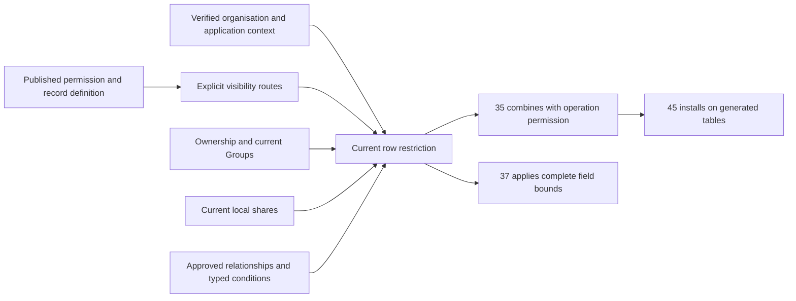

# Phase 3 — Ownership and record visibility

Task: [#36](https://github.com/Abzum-NZ/Abzum-Vortex/issues/36). Prerequisites: completed [central Access #34](https://github.com/Abzum-NZ/Abzum-Vortex/issues/34) and [transactional Activity #252](issue-252-activity-foundation.md). The [exact hosted Activity receipt](../evidence/issue-252-activity-foundation.md#hosted-delivery--6-september-2026) is verified; implementation may proceed.

## Outcome

Each record operation sees only records admitted by its explicitly declared scope in the current organisation and application. Ownership, Group membership, direct sharing, approved relationships and saved conditions can narrow that scope. None replaces the account's permission to perform the operation.

## What will be built

1. **Explicit record scope beside the existing permission declaration.** Reuse the exact record-type/action permission identity and current permission catalogue rather than add a role language or operation registry. A scope explicitly selects one or more base routes: all records in the valid storage context, declared ownership, local direct sharing, or an approved relationship. One optional published saved condition further narrows their result. Having an owner does not mean owner-only visibility; having no owner does not grant all-record visibility. Missing required scope refuses.
2. **Complete definition-to-runtime mapping.** Resolve authored relationship, condition and permission references to permanent identities through the existing Definition compiler. Include scope in permission meaning, publication validation, provenance and change comparison so an update cannot silently broaden assigned authority. Preserve readable immutable historical releases; an older declaration without scope supplies no record authority. Do not rewrite released JSON or depend on unrelated page-composition changes.
3. **One shared typed condition implementation.** Reuse the existing condition tree and twelve comparison operators plus `all`, `any` and `not`. Move the pure boolean semantics into the existing Rule package and explicitly change that contracts-only shared package from tier 2 to tier 1. Definition remains tier 2 and Access remains tier 3, so both can consume it through the enforced package graph. Retain the existing Definition export as a thin compatibility entry. This adds no runtime service or second expression language. The later [condition builder #57](https://github.com/Abzum-NZ/Abzum-Vortex/issues/57) and [rule execution #58](https://github.com/Abzum-NZ/Abzum-Vortex/issues/58) reuse it.
4. **Database row narrowing.** Derive current organisation/account/application from the existing verified context. Evaluate exact stable [record scope](../../contracts/src/records.ts), current lifecycle, permitted ownership route, current active Group memberships, live local shares and declared relationship/condition routes before fetching, counting or aggregating. Use a database predicate with shared parity examples, not server-side filtering of fetched records. Relationships are explicitly bounded, same-organisation, publication-validated and cycle-free; another visible record alone does not grant arbitrary traversal.
5. **Correct local-share facts.** Replace the currently unused incomplete direct-share shape with the existing full record-scope identity, account-or-Group recipient, unique readable/changeable field bounds, immutable grant window, current revision and grant/revocation evidence. Changeable fields must also be readable. Use one private Access-owned store with no direct client/runtime table access. Expiry is evaluated from current time, not a background status transition. Compatible definition updates must not invalidate a share merely because the module version changed.
6. **Minimal private ownership/share changes.** Compose revision-checked local share grant/revocation and representative ownership transfer with one Access-version change and one completed Activity entry in the same transaction. Reuse governance-first ordering and existing account/Group facts. Controlled neutral operations prove the transaction and exact permitted candidate boundary; they do not claim the missing #35 record decision or #37 grantor field policy is implemented. Keep all raw mutation compositions owner-only. A share grants no ownership, delete, restore, export, re-sharing or administration. Refusal or Activity failure rolls back the change. Expiry requires no scheduler.
7. **Truthful Phase 3 proof.** Use controlled neutral record tables and actual non-owner database roles. Private mutation helpers remain unexposed until their owning operation has the complete permission, row and field enforcement. This task supplies the predicates and bounded field results; it does not claim generated storage, a record editor, a sharing screen or completed public/MCP transport.

## Scope and condition semantics

An ownership route follows the record type's declared account, Group or inherited-parent ownership. `none` has no ownership route; broad visibility needs an explicit all-record route. An application-contained record retains its exact source application boundary. An organisation-shared record retains its organisation/module/storage identity while each consuming application still needs its own compatible binding and current permission. Local direct shares cannot bypass the separate inter-application grant required for application-contained records.

The minimal composition is `(any declared base route) AND (the optional saved condition)`. Thus own records can also be limited by a condition; condition-only visibility explicitly declares all-record base scope plus that condition. The saved condition already provides its own closed Boolean tree. Do not introduce another arbitrary nested policy language around it. Canonicalise the route set by kind and resolved identity before meaning comparison.

The entire condition is validated before evaluating its result. Missing or undeclared fields/parameters, wrong types and unsupported operators refuse even beneath `not` or a branch that would otherwise short-circuit. No JavaScript coercion, arbitrary SQL, executable expressions, network calls or client-selected actor identity is allowed. Current-account parameters come from verified context. Null and empty text are values with explicit empty-test behaviour; missing input is an error, not a matching empty value.

The source/canonical wire addition is optional solely to read historical V1 bytes without changing their shape or fingerprint. Omission remains omission, never a generated default. New publication requires explicit scope on every record permission and refuses it on a non-record permission. Restoring and republishing old source therefore requires an explicit scope choice. The live catalogue may retain a historical absent scope, but cannot use it as row authority. Adding, removing or changing scope participates in permission-meaning continuity and major permission-change comparison; existing assignments need the normal acceptance before using changed authority. No Module V2 or unrelated page migration is required for this additive representation.

Preserve the exact legacy permission-meaning fingerprint input when scope is absent. Add the scope property only when explicitly present, not as an unconditional null or undefined property. Otherwise an unrelated existing permission would appear changed merely because the code upgraded. Tests must prove unchanged legacy fingerprints and real scope changes; existing continuity already prevents a removed scope returning to an older fingerprint from reviving authority.

Equality and collection membership use deterministic value equality, not JavaScript object identity. Text containment accepts text only; collection containment requires the declared collection shape. Ordering compares compatible declared types, with shared text/date/date-time semantics proved against PostgreSQL. Negated operators negate a valid comparison, not a validation failure. Reuse the existing nesting/operand bounds rather than add a new policy budget. General rule-only operators and presentation tooling remain with #57/#58.

For B, the pure Rule entry takes the existing condition tree, trusted complete source-record field definitions, explicit declared field identifiers and parameter declarations, and their input values. Reject duplicate declarations before building lookup maps and require exactly the declared value keys. The Definition compatibility entry keeps its name and closed error mapping but gains the required field-definition argument; the previous three arguments cannot establish field-to-field type compatibility. Keep the package shared and contracts-only, with the already approved Rule tier-1 change and a thin Definition adapter.

After declared-type validation, equality is null-safe: two nulls are equal, one null and one non-null are not. Positive ordering, containment and membership return false when either operand is null; negative containment/membership return the exact inverse. Missing input refuses. Empty means null or empty text, not an empty array. Dates are calendar-valid; date-times require offsets and compare instants, without date-to-date-time promotion. Text comparisons use deterministic code-point ordering and exact case; JSON equality ignores object key order but preserves array order. Numeric parity uses the existing finite JavaScript-number wire and the same double-precision comparison domain in PostgreSQL; it does not promise arbitrary PostgreSQL numeric precision. Removing the old date/date-time mismatch and opaque-JSON text/membership coercions is an intentional correctness repair, not a claim that those old results stay unchanged. Test each semantic field class, each operator and compound form, and representative invalid hidden branches; do not multiply every field type by every operator. B prepares shared parity vectors; C must execute them against the actual database predicate before parity is claimed.

Each admitted row needs a complete valid visibility route. Local direct-account and current-Group shares may contribute the union of their individually granted field bounds; they cannot contribute an underlying operation permission or cross an application boundary. A conservative recheck deadline is no later than the earliest contributing share/membership expiry and current context/authority deadline. This local field composition does not weaken the distinct one-complete-grant rule for [cross-organisation sharing](../specification/04-access-and-permissions.md#between-organisations).

## Acceptance criteria

- [ ] Explicit all-record scope and ownership scope produce different correct results; ownership mode alone is never the permission policy.
- [ ] New authored declarations resolve completely through publication and catalogue meaning. Missing/foreign references, incompatible routes and relationship cycles refuse. Historical releases remain readable without receiving new authority.
- [ ] All supported condition operators and nesting forms agree in pure evaluation, Definition publication tests and database restrictions. Invalid inputs refuse before Boolean short-circuiting or negation; there is no coercion or fetch-then-filter path.
- [ ] Account ownership, multiple Groups, inherited ownership, approved relationships and saved conditions pass both positive and negative organisation/application directions, including identical labels with different permanent identities.
- [ ] Active direct-account and Group shares expose only their current allowed field bounds. Revocation, expiry, recipient suspension and Group removal remove the corresponding route on the next request. A surviving independent route retains only its own authority.
- [ ] Private ownership-transfer and share compositions are revision-checked and atomic with one Access change and one Activity entry. Controlled permitted-candidate tests prove stale, foreign, duplicate/conflicting and competing changes cannot partially apply or revive old sharing authority. Actual grantor field-authority enforcement is not replaced with a permissive stub or duplicate evaluator while #37 is unavailable.
- [ ] Neutral-row queries/counts are restricted in PostgreSQL through the actual non-owner role. The neutral result contains no field outside its allowed bound; full field policy remains #37 rather than being claimed here.
- [ ] No private Identity, Definition, Access or Activity table receives generic record policies. No owner-credential runtime adapter, new role evaluator, approval framework, business-specific predicate or background expiry service is introduced. The explicit Rule tier change and its Definition/Access dependencies pass the package-boundary checks; browser-shared Rule imports no server package.
- [ ] Independent review covers the task against the actual patch. Local repository/database/concurrency checks and exact hosted Testing evidence pass before the task is Done.

## Reviewable delivery slices

The independently reviewed [initial A checkpoint](../evidence/issue-36-record-visibility.md) supplies same-module saved-condition compilation and explicit application-owned base routes. The subsequent [application-condition checkpoint](../evidence/issue-36-record-visibility.md#application-owned-saved-conditions--7-september-2026) completes the missing trusted dependency-condition mapping described below. The first C catalogue checkpoint also preserves scope through registration and reads. These reviewed foundations do not yet supply the remaining database row predicates or justify marking the whole visibility task complete.

An application permission uses a saved condition from the module owning that permission's exact record type. The qualified record type determines the module; the condition key is then resolved only within that module. Two installed modules may use the same condition key without ambiguity. This is reuse of a module's condition, not an application-defined or cross-module condition language.

Complete that mapping by reusing the existing compiled dependency outputs as trusted compiler context, separate from authored source. Pass the same verified dependency outputs into provisional and final publication compilation; compilation of a whole definition set also supplies its already-compiled module outputs. Validate the selected output's exact module binding, version and existing artifact evidence before resolving the condition. Reuse the current scope schema, parameter checks and provenance mapping. Missing, stale, ambiguous or wrong-record-type evidence refuses. Tests cover exact owner selection, standalone and set compilation, publication consistency and historical omission; no new evidence registry, fingerprint or author-controlled authority field is needed.

| Slice | Deliverable |
|---|---|
| A — Definition and contracts | Explicit scope, complete source/compiler/meaning mapping, historical-read compatibility and corrected unused local-share contract |
| B — Shared conditions | One pure typed implementation plus Definition compatibility and PostgreSQL parity vectors |
| C — Current visibility | Private current shares and database ownership/Group/relationship/condition restrictions on neutral rows |
| D — Changes and delivery | Revision-checked transfer/share composition, Activity/Access atomicity, actual competing-write proof and hosted verification |

Do not add a new issue for each slice. Review them against the same complete task, and keep dependencies blocked until the required outcomes exist.

### C — First checkpoint: permission scope survives registration

The independently reviewed first C change carries the already validated scope through the existing private permission catalogue. It does not yet evaluate record visibility.

1. Add nullable `record_scope` to the existing permission catalogue, without a default or historical backfill. A present value must be an object belonging to an application/module record permission. Preserve the existing full candidate-to-sealed-Definition comparison as the authoritative deep validation.
2. Update the current registration, withdrawal, unchanged-candidate comparison and exact permission read functions together. Preserve their existing transactions, locks, meaning continuity and Access-version increments. The read function's added result column requires drop/recreation with dependency restriction, never cascading removal; restore its private privileges in the same migration.
3. Reconstruct optional `recordScope` in the existing private repository. A historical SQL null remains an omitted property, preserving legacy meaning. Do not add another evaluator, fingerprint, history or counter.
4. Prove actual registration, unchanged replay, scope change, withdrawal, reactivation and read reconstruction. Check legacy omission, one Access-version increment per real change, no increment on replay and the existing fresh-acceptance behaviour after changed permission meaning. Existing concurrency proofs remain applicable because locking and mutation semantics do not change.

Returning scope is definition evidence, not authority to access a record. The remaining C predicates and [row policy composition #35](issue-35-row-policy-composition.md) still govern live record access.

### C — Next checkpoint: actual database condition parity

Implement a private, pure PostgreSQL predicate over the existing typed condition tree. Do not introduce runtime-generated SQL, another expression language or a query framework. It accepts the published permission scope, sealed saved condition and source record-type semantic definitions, current row field values, and a trusted current organisation-account identifier. Verify their existing condition identity/revision/fingerprint and exact record/field/parameter bindings; reuse published evidence rather than computing a new hash. The later protected composition supplies the current account from verified context, never from a form's parameter map.

Keep the predicate owner-only, `SECURITY INVOKER`, immutable and under an empty search path, with only the private recursive support needed by this tree. It reads no authority tables and creates no state. Validate every consumed node, operand, declaration and supplied value before using the Boolean result, including branches hidden by a successful sibling or negation. Reuse existing limits and semantic types; do not duplicate unrelated Definition settings or invent another validation budget. Invalid input produces a closed error, not a matching result.

Match the [current Rule evaluator](../../runtime/rule/src/typed-condition.ts) exactly. In particular, its offset-bearing date-times use integer microseconds with up to six fractional digits, including pre-epoch values, year zero and the supported offset range; they do not use JavaScript's millisecond-only date parsing. Preserve finite double-precision numbers, exact code-point text ordering, typed-reference UUID identity, null/empty behaviour, contextual collections and structural JSON equality. A permissive PostgreSQL cast must not silently expand the accepted language.

Use a bounded table-driven SQL suite for all existing operators and compound forms plus representative semantic types, invalid hidden branches and exact bindings. A rollback-scoped protected wrapper over neutral rows must derive its account from verified context, filter and count in SQL, and prove the request role cannot call the private predicate directly. This proves condition parity and the integration seam only: complete ownership, local shares, relationship routing and final row/field authority remain in the existing C/D and downstream task scope. Add no new race harness for a pure function. Later [generated storage #45](https://github.com/Abzum-NZ/Abzum-Vortex/issues/45) integrates the reviewed predicate; any query-plan-driven optimization must preserve the same parity examples and is not a requirement to build another compiler now.

The private database-condition checkpoint is implemented, independently reviewed and locally verified in [the parity evidence](../evidence/issue-36-record-visibility.md#postgresql-condition-parity--7-september-2026). Remaining ownership/share/relationship routing and final hosted delivery are not covered by that checkpoint. The following shared-contract correction is the next dependency-ready condition task.

### Next condition correction: compare a person field with the current account

The parity checks exposed a practical limitation in the existing declaration vocabulary: a current-account binding can only supply a `text` parameter, which correctly refuses comparison with a typed `link_to_person` field. Fix the missing type at the shared contract boundary; do not coerce a person reference into ordinary text or alter the frozen evaluator's results without an explicit declaration.

After the database-parity checkpoint, add exactly one parameter type, `organization_account_reference`, through the authored and canonical saved-condition contracts, existing Definition validation/publication tests, shared Rule parameter declaration and private SQL predicate. Its values must be non-nil platform UUIDs. The existing `current_organization_account_id` binding may supply either legacy text or the new explicit reference type; a literal reference parameter is validated using the same UUID contract. Preserve legacy text behaviour and the negative text-versus-person test. A reference-typed parameter and person field compare UUID identity without changing field-key or ordinary-text case rules.

Use an additive migration replacing the same private predicate, not a new current-account source, evaluator, registry, fingerprint mechanism or contract version family. New definitions naturally include the declared type in their existing publication evidence; historical definitions and fingerprints remain unchanged. Add a positive shared current-account/person comparison and representative invalid-reference/typed-mismatch cases, plus source-to-publication validation. This is necessary functional completion within [#36](https://github.com/Abzum-NZ/Abzum-Vortex/issues/36), not deferred to [general rule execution #58](https://github.com/Abzum-NZ/Abzum-Vortex/issues/58). The latter consumes the shared correction without becoming a reverse dependency.

The explicit current-person parameter correction is implemented and independently verified in [its evidence](../evidence/issue-36-record-visibility.md#typed-current-person-condition-parameters--7-september-2026). The next functional work is the remaining current ownership, Group, local-share and relationship restriction within C, followed by the revision-checked changes in D. These remain prerequisites for downstream complete row/field enforcement; a passing condition component does not satisfy them.

### C — Next ownership checkpoint: all-record, account and current-Group routes

Build only the next concrete row restriction: the published `all_records` route and direct organisation-account/current-Group ownership. There is no physical record table yet. Use generated-storage-shaped neutral rows for proof; do not create an Access record catalogue, ownership mirror or generic relationship engine to stand in for [generated storage #45](https://github.com/Abzum-NZ/Abzum-Vortex/issues/45).

1. Add one private, owner-only, invoker-rights database predicate. Its trusted inputs identify the published permission routes, compiled record ownership mode, the current installed storage binding, the row's complete RecordScope and owner columns, the verified current organisation/application/account, and one time sampled after the existing Access read lock. The storage-contract identity belongs to the installed storage binding, not an invented field in sealed Definition JSON. Preserve exact compiled V1 ownership spelling through the existing compatibility meaning.
2. Require the row's organisation, module, record type, storage contract and storage scope to match the trusted binding. For application-contained storage, require its exact source application to match the current application too. For organisation-shared storage, the consuming application's compatible binding must still be established by the caller; shared storage is not an application-access bypass. Validate the row identity shape without inventing a duplicate expected-record identity or new fingerprint.
3. Admit an explicit all-record route within that valid context. For the ownership route, require the exact current account owner or an active owner Group with a current, live, started, unexpired membership for that account in the same organisation. Another Group, revoked/expired/future membership, retired Group or foreign account supplies no ownership route. `none` and inherited ownership supply no direct ownership route in this checkpoint; local-share and relationship routes likewise add no authority until implemented.
4. Return a Boolean admission and an optional membership-based recheck deadline. A sufficient all-record or account-owner route is not artificially dependent on Group expiry. Use the existing membership window and current facts, not a new expiry state or scheduler. The helper reads mutable facts and must preserve fresh post-lock observation; it is not an immutable pure function like the condition evaluator.
5. The rollback-only protected neutral read/count wrapper obtains the verified application context and exact existing operation permission, uses a controlled compatible-binding fixture, and passes stored row facts rather than a client permission or owner claim. It restricts active rows in SQL and composes the supported base route with the existing optional saved-condition predicate. Lifecycle-specific restore/delete rules remain with the full operation composition, not guessed here. Raw callers cannot execute the private predicate.
6. Prove the actual non-owner read/count seam, explicit all-record versus account/Group ownership, current and unavailable membership/Group cases, exact organisation/application/storage identity, unsupported ownership routes, the membership deadline, and one true/false saved-condition combination. Reuse existing condition parity and governance/read-lock proofs. Do not add another general test matrix, runtime adapter, writer, index, Activity event or concurrency framework for this read-only checkpoint.

Independent review clarifies that owner shape is validated before OR routing: direct-account mode has only its account owner, Group mode only its Group owner, and this checkpoint's `none`/inherited rows have neither direct owner. Malformed evidence refuses; a valid nonmatching route returns false. Inherited ownership and other unsupported routes do not invalidate an otherwise complete explicit all-record route. Organisation-shared rows carry no application-root property, but their trusted consuming-application binding is still required.

This is a truthful partial C delivery. Private local-share storage and bounded recipient field contributions, approved relationship/inherited-parent joins, D ownership/share writers and complete hosted verification remain required by this same task. The later #45 storage allocator supplies real bindings and owner/relationship columns and installs #35's complete policies; the neutral fixture is not claimed as that shipping implementation.

The direct-account/current-Group checkpoint is implemented and independently reviewed; [its evidence](../evidence/issue-36-record-visibility.md#direct-account-and-current-group-ownership--7-september-2026) records 42 passing focused assertions and the exact limits of the rollback-only protected seam. The existing non-record operation gate and separately stored scoped declaration are deliberately independent fixture inputs until #35 supplies the same-permission eligibility/scope pairing. No shipping wrapper or complete row policy is claimed here.

### Remaining C semantics: inherited ownership is not relationship visibility

Keep these existing routes distinct. [Inherited ownership](../specification/appendices/data-contracts.md) resolves the child's declared ownership relationship through the actual parent edge to an account or Group owner; it does not copy owner columns or require a parent read permission. A share of the parent does not itself establish ownership of the child. By contrast, the [published relationship visibility route](../../contracts/src/permissions.ts) names both a relationship and a source permission: admission needs a complete current source-permission-and-visibility result for the exact source row, not simply a parent owner or an unrelated readable row. Both compositions preserve exact storage/organisation/application identities and the published relationship target. This is a clarification of existing contracts, not a new propagation option or approval requirement; its implementation follows the direct-owner checkpoint.

## Downstream ownership

- [#35](issue-35-row-policy-composition.md) combines the predicates with the central operation decision in fixed SELECT/INSERT/UPDATE/DELETE policies.
- [#37](https://github.com/Abzum-NZ/Abzum-Vortex/issues/37) enforces complete field read/write/action bounds, including filters, sorting, aggregates and errors.
- After #35, #37 also owns the complete same-organisation direct-share invocation: check the exact share permission and visible target, compute the grantor's current readable/changeable field ceiling, and call this task's private writer in that same protected transaction. #36 does not implement a partial field evaluator to simulate this missing authority. This is a one-way #37 dependency on #35, not a dependency from #36 back to #37.
- [#45](https://github.com/Abzum-NZ/Abzum-Vortex/issues/45) allocates and integrates actual Definition-derived tables. There is no reverse dependency from #36 to #45.
- [#57](https://github.com/Abzum-NZ/Abzum-Vortex/issues/57) supplies authoring and later vocabulary extensions; it cannot replace the early shared evaluator.
- [#153](https://github.com/Abzum-NZ/Abzum-Vortex/issues/153) and [#156](https://github.com/Abzum-NZ/Abzum-Vortex/issues/156) supply full inter-application/cross-organisation sharing and federation. Unsupported routes remain closed.

## References

- [Record visibility](../specification/04-access-and-permissions.md#record-visibility) and [local direct sharing](../specification/04-access-and-permissions.md#direct-record-sharing-inside-one-organisation)
- [Record identity and lifecycle](../specification/06-records-and-lifecycle.md)
- [Current condition contract](../../contracts/src/module-contracts.ts) and [existing publication evaluator](../../runtime/definition/src/validation.ts)
- [Supabase row-level security](https://supabase.com/docs/guides/database/postgres/row-level-security)
- [Proportionate platform-only implementation](../specification/appendices/core-contract-boundary.md#keep-the-implementation-proportionate)
