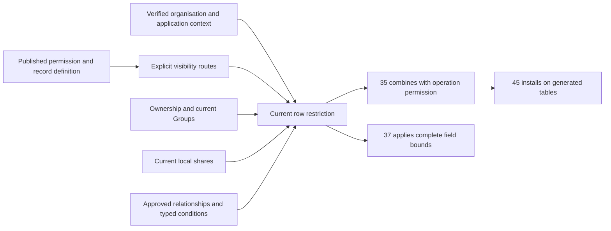

# Phase 3 — Ownership and record visibility

Task: [#36](https://github.com/Abzum-NZ/Abzum-Vortex/issues/36). Prerequisites: completed [central Access #34](https://github.com/Abzum-NZ/Abzum-Vortex/issues/34) and [transactional Activity #252](issue-252-activity-foundation.md). The [exact hosted Activity receipt](../evidence/issue-252-activity-foundation.md#hosted-delivery--6-september-2026) is verified; implementation may proceed.

## Outcome

Each record operation sees only records admitted by its explicitly declared scope in the current organisation and application. Ownership, Group membership, direct sharing, approved relationships and saved conditions can narrow that scope. None replaces the account's permission to perform the operation.

## What will be built

1. **Explicit record scope beside the existing permission declaration.** Reuse the exact record-type/action permission identity and current permission catalogue rather than add a role language or operation registry. A scope explicitly selects one or more base routes: all records in the valid storage context, declared ownership, local direct sharing, or an approved relationship. One optional published saved condition further narrows their result. Having an owner does not mean owner-only visibility; having no owner does not grant all-record visibility. Missing required scope refuses.
2. **Complete definition-to-runtime mapping.** Resolve authored relationship, condition and permission references to permanent identities through the existing Definition compiler. Include scope in permission meaning, publication validation, provenance and change comparison so an update cannot silently broaden assigned authority. Preserve readable immutable historical releases; an older declaration without scope supplies no record authority. Do not rewrite released JSON or depend on unrelated page-composition changes.
3. **One shared typed condition implementation.** Reuse the existing condition tree and twelve comparison operators plus `all`, `any` and `not`. Move the pure boolean semantics into the existing Rule package and explicitly change that contracts-only shared package from tier 2 to tier 1. Definition remains tier 2 and Access remains tier 3, so both can consume it through the enforced package graph. Retain the existing Definition export as a thin compatibility entry. This adds no runtime service or second expression language. The later [condition builder #57](https://github.com/Abzum-NZ/Abzum-Vortex/issues/57) and [rule execution #58](https://github.com/Abzum-NZ/Abzum-Vortex/issues/58) reuse it.
4. **Database row narrowing.** Derive current organisation/account/application from the existing verified context. Evaluate exact stable [record scope](../../contracts/src/records.ts), current lifecycle, permitted ownership route, current active Group memberships, live local shares and declared relationship/condition routes before fetching, counting or aggregating. Use a database predicate with shared parity examples, not server-side filtering of fetched records. Relationships are explicitly bounded, same-organisation, publication-validated and cycle-free; another visible record alone does not grant arbitrary traversal.
5. **Correct local-share facts.** Replace the currently unused incomplete direct-share shape with the existing full record-scope identity, account-or-Group recipient, unique readable/changeable field bounds, immutable grant window, current revision and grant/revocation evidence. Changeable fields must also be readable. Use one private Access-owned store with no direct client/runtime table access. Expiry is evaluated from current time, not a background status transition. Compatible definition updates must not invalidate a share merely because the module version changed.
6. **Minimal private ownership/share changes.** Compose revision-checked local share grant/revocation and representative ownership transfer with one Access-version change and one completed Activity entry in the same transaction. Reuse governance-first ordering and existing account/Group facts. Controlled neutral operations prove the transaction and exact permitted candidate boundary; they do not claim the missing #35 record decision or #37 grantor field policy is implemented. Keep all raw mutation compositions owner-only. A share grants no ownership, delete, restore, export, re-sharing or administration. Refusal or Activity failure rolls back the change. Expiry requires no scheduler.
7. **Truthful Phase 3 proof.** Use controlled neutral record tables and actual non-owner database roles. Private mutation helpers remain unexposed until their owning operation has the complete permission, row and field enforcement. This task supplies the predicates and bounded field results; it does not claim generated storage, a record editor, a sharing screen or completed public/MCP transport.

## Scope and condition semantics

An ownership route follows the record type's declared account, Group or inherited-parent ownership. `none` has no ownership route; broad visibility needs an explicit all-record route. An application-contained record retains its exact source application boundary. An organisation-shared record retains its organisation/module/storage identity while each consuming application still needs its own compatible binding and current permission. Local direct shares cannot bypass the separate inter-application grant required for application-contained records.

The minimal composition is `(any declared base route) AND (the optional saved condition)`. Thus own records can also be limited by a condition; condition-only visibility explicitly declares all-record base scope plus that condition. The saved condition already provides its own closed Boolean tree. Do not introduce another arbitrary nested policy language around it. Canonicalise the route set by kind and resolved identity before meaning comparison.

The entire condition is validated before evaluating its result. Missing or undeclared fields/parameters, wrong types and unsupported operators refuse even beneath `not` or a branch that would otherwise short-circuit. No JavaScript coercion, arbitrary SQL, executable expressions, network calls or client-selected actor identity is allowed. Current-account parameters come from verified context. Null and empty text are values with explicit empty-test behaviour; missing input is an error, not a matching empty value.

The source/canonical wire addition is optional solely to read historical V1 bytes without changing their shape or fingerprint. Omission remains omission, never a generated default. New publication requires explicit scope on every record permission and refuses it on a non-record permission. Restoring and republishing old source therefore requires an explicit scope choice. The live catalogue may retain a historical absent scope, but cannot use it as row authority. Adding, removing or changing scope participates in permission-meaning continuity and major permission-change comparison; existing assignments need the normal acceptance before using changed authority. No Module V2 or unrelated page migration is required for this additive representation.

Preserve the exact legacy permission-meaning fingerprint input when scope is absent. Add the scope property only when explicitly present, not as an unconditional null or undefined property. Otherwise an unrelated existing permission would appear changed merely because the code upgraded. Tests must prove unchanged legacy fingerprints and real scope changes; existing continuity already prevents a removed scope returning to an older fingerprint from reviving authority.

Equality and collection membership use deterministic value equality, not JavaScript object identity. Text containment accepts text only; collection containment requires the declared collection shape. Ordering compares compatible declared types, with shared text/date/date-time semantics proved against PostgreSQL. Negated operators negate a valid comparison, not a validation failure. Reuse the existing nesting/operand bounds rather than add a new policy budget. General rule-only operators and presentation tooling remain with #57/#58.

For B, the pure Rule entry takes the existing condition tree, trusted complete source-record field definitions, explicit declared field identifiers and parameter declarations, and their input values. Reject duplicate declarations before building lookup maps and require exactly the declared value keys. The Definition compatibility entry keeps its name and closed error mapping but gains the required field-definition argument; the previous three arguments cannot establish field-to-field type compatibility. Keep the package shared and contracts-only, with the already approved Rule tier-1 change and a thin Definition adapter.

After declared-type validation, equality is null-safe: two nulls are equal, one null and one non-null are not. Positive ordering, containment and membership return false when either operand is null; negative containment/membership return the exact inverse. Missing input refuses. Empty means null or empty text, not an empty array. Dates are calendar-valid; date-times require offsets and compare instants, without date-to-date-time promotion. Text comparisons use deterministic code-point ordering and exact case; JSON equality ignores object key order but preserves array order. Numeric parity uses the existing finite JavaScript-number wire and the same double-precision comparison domain in PostgreSQL; it does not promise arbitrary PostgreSQL numeric precision. Removing the old date/date-time mismatch and opaque-JSON text/membership coercions is an intentional correctness repair, not a claim that those old results stay unchanged. Test each semantic field class, each operator and compound form, and representative invalid hidden branches; do not multiply every field type by every operator. B prepares shared parity vectors; C must execute them against the actual database predicate before parity is claimed.

Each admitted row needs a complete valid visibility route. Local direct-account and current-Group shares may contribute the union of their individually granted field bounds; they cannot contribute an underlying operation permission or cross an application boundary. A conservative recheck deadline is no later than the earliest contributing share/membership expiry and current context/authority deadline. This local field composition does not weaken the distinct one-complete-grant rule for [cross-organisation sharing](../specification/04-access-and-permissions.md#between-organisations).

## Acceptance criteria

- [ ] Explicit all-record scope and ownership scope produce different correct results; ownership mode alone is never the permission policy.
- [ ] New authored declarations resolve completely through publication and catalogue meaning. Missing/foreign references, incompatible routes and relationship cycles refuse. Historical releases remain readable without receiving new authority.
- [ ] All supported condition operators and nesting forms agree in pure evaluation, Definition publication tests and database restrictions. Invalid inputs refuse before Boolean short-circuiting or negation; there is no coercion or fetch-then-filter path.
- [ ] Account ownership, multiple Groups, inherited ownership, approved relationships and saved conditions pass both positive and negative organisation/application directions, including identical labels with different permanent identities.
- [ ] Active direct-account and Group shares expose only their current allowed field bounds. Revocation, expiry, recipient suspension and Group removal remove the corresponding route on the next request. A surviving independent route retains only its own authority.
- [ ] Private ownership-transfer and share compositions are revision-checked and atomic with one Access change and one Activity entry. Controlled permitted-candidate tests prove stale, foreign, duplicate/conflicting and competing changes cannot partially apply or revive old sharing authority. Actual grantor field-authority enforcement is not replaced with a permissive stub or duplicate evaluator while #37 is unavailable.
- [ ] Neutral-row queries/counts are restricted in PostgreSQL through the actual non-owner role. The neutral result contains no field outside its allowed bound; full field policy remains #37 rather than being claimed here.
- [ ] No private Identity, Definition, Access or Activity table receives generic record policies. No owner-credential runtime adapter, new role evaluator, approval framework, business-specific predicate or background expiry service is introduced. The explicit Rule tier change and its Definition/Access dependencies pass the package-boundary checks; browser-shared Rule imports no server package.
- [ ] Independent review covers the task against the actual patch. Local repository/database/concurrency checks and exact hosted Testing evidence pass before the task is Done.

## Reviewable delivery slices

The independently reviewed [initial A checkpoint](../evidence/issue-36-record-visibility.md) supplies same-module saved-condition compilation and explicit application-owned base routes. Completing application-owned saved conditions still requires trusted condition evidence from the exact bound module compilation output; the current resolution snapshot contains identities and versions, not that condition's immutable contract. Add that minimal compiler input and revalidate it against the exact dependency artifact before claiming complete source mapping. Do not infer it from keys or trust author-supplied fingerprints. The current catalogue also requires the additive scope storage, validation and read reconstruction in C before these declarations can supply live record authority. Neither gap is a new business decision or a reason to mark A as the whole task.

| Slice | Deliverable |
|---|---|
| A — Definition and contracts | Explicit scope, complete source/compiler/meaning mapping, historical-read compatibility and corrected unused local-share contract |
| B — Shared conditions | One pure typed implementation plus Definition compatibility and PostgreSQL parity vectors |
| C — Current visibility | Private current shares and database ownership/Group/relationship/condition restrictions on neutral rows |
| D — Changes and delivery | Revision-checked transfer/share composition, Activity/Access atomicity, actual competing-write proof and hosted verification |

Do not add a new issue for each slice. Review them against the same complete task, and keep dependencies blocked until the required outcomes exist.

## Downstream ownership

- [#35](issue-35-row-policy-composition.md) combines the predicates with the central operation decision in fixed SELECT/INSERT/UPDATE/DELETE policies.
- [#37](https://github.com/Abzum-NZ/Abzum-Vortex/issues/37) enforces complete field read/write/action bounds, including filters, sorting, aggregates and errors.
- After #35, #37 also owns the complete same-organisation direct-share invocation: check the exact share permission and visible target, compute the grantor's current readable/changeable field ceiling, and call this task's private writer in that same protected transaction. #36 does not implement a partial field evaluator to simulate this missing authority. This is a one-way #37 dependency on #35, not a dependency from #36 back to #37.
- [#45](https://github.com/Abzum-NZ/Abzum-Vortex/issues/45) allocates and integrates actual Definition-derived tables. There is no reverse dependency from #36 to #45.
- [#57](https://github.com/Abzum-NZ/Abzum-Vortex/issues/57) supplies authoring and later vocabulary extensions; it cannot replace the early shared evaluator.
- [#153](https://github.com/Abzum-NZ/Abzum-Vortex/issues/153) and [#156](https://github.com/Abzum-NZ/Abzum-Vortex/issues/156) supply full inter-application/cross-organisation sharing and federation. Unsupported routes remain closed.

## References

- [Record visibility](../specification/04-access-and-permissions.md#record-visibility) and [local direct sharing](../specification/04-access-and-permissions.md#direct-record-sharing-inside-one-organisation)
- [Record identity and lifecycle](../specification/06-records-and-lifecycle.md)
- [Current condition contract](../../contracts/src/module-contracts.ts) and [existing publication evaluator](../../runtime/definition/src/validation.ts)
- [Supabase row-level security](https://supabase.com/docs/guides/database/postgres/row-level-security)
- [Proportionate platform-only implementation](../specification/appendices/core-contract-boundary.md#keep-the-implementation-proportionate)
