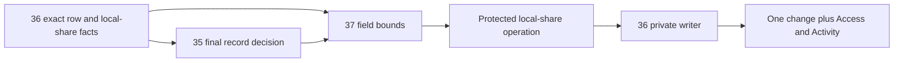

# Phase 3 — Field access and protected local sharing

Task: [#37](https://github.com/Abzum-NZ/Abzum-Vortex/issues/37). Prerequisites: completed [central Access #34](issue-34-access-decision.md), [ownership and visibility #36](issue-36-ownership-and-visibility.md), and [final record/row decision #35](issue-35-row-policy-composition.md). Pure field contracts can be prepared alongside #35; complete protected invocation requires its final record decision.

## Outcome

A person receives only fields they may read and changes only fields they may change. Sharing a local record cannot give someone else field access the grantor does not have.

## What will be built

1. Resolve current field permission declarations and #36's local-share bounds into separate readable and changeable sets. Reuse the existing declaration/permission identities, not hardcoded field names, role labels or another access store.
   Where #35 admits several declared record-permission alternatives, combine only independently complete matched contributions. An alternative missing its own current eligibility or row scope contributes no field access; choosing an arbitrary first match must not hide another complete permitted contribution.
2. Apply those bounds centrally before response, query or semantic-map projection. Unreadable fields are absent, not blank, CSS-hidden or returned as disabled metadata. Reject an attempted unauthorised write rather than silently dropping it.
3. Enforce field/action restrictions on filters, sorts, aggregates, error details, named-action inputs and semantic resources as well as displayed values. Sensitive fields require their explicit authority. An allowed row or ordinary permission alone is insufficient.
4. Add the complete protected same-organisation direct-share grant/revocation invocation over #36's private writer. In one verified transaction, check #35's exact share action/target decision, derive the grantor's current readable/changeable ceiling, require proposed fields to be subsets, validate the current recipient and scope, and invoke the revision-checked writer with Activity and Access invalidation. Keep raw helpers private. Revocation uses its current exact authority and does not wait for a granting approval or revive expired access.
5. Supply typed service operations and parity cases for later record/query/search/export/interface/MCP executors. Prove actual server/database boundaries on neutral rows here, without claiming those later screens or transports are delivered.

## Acceptance criteria

- [ ] A response and semantic projection contain no unreadable values or protected labels/metadata. Shared fields cannot leak through filters, sorts, aggregates, errors or action inputs.
- [ ] Alternative permissions contribute field bounds only when their own eligibility and complete row scope both pass. Incomplete alternatives cannot lend field access to an otherwise allowed row.
- [ ] An unauthorised field write leaves the record unchanged and returns a safe refusal; it is not partially applied.
- [ ] Current account, role, Group, share and Access-version changes affect the next request. No hardcoded application/field lists decide core behaviour.
- [ ] A local share grants only fields the grantor may currently read/change. Missing share permission, invisible target, wider field proposal, foreign scope/recipient and stale evidence refuse before mutation.
- [ ] Actual non-owner runtime/request-role tests prove local-share invocation and raw-helper denial. Success, Activity and one Access change commit together; failed authority or append rolls back all changes.
- [ ] Multiple local share contributions remain distinct from cross-organisation one-complete-grant rules. Revocation removes only that share's contribution; surviving independent authority is evaluated normally.
- [ ] One shared matrix covers both organisation directions and application separation in server/database integration. Later executors reuse the result; mocks are not described as live integration.
- [ ] Independent actual-work review, relevant local checks and exact hosted Testing verification pass. UI editors remain [#52](https://github.com/Abzum-NZ/Abzum-Vortex/issues/52)/[#72](https://github.com/Abzum-NZ/Abzum-Vortex/issues/72), and complete cross-phase evidence remains [#254](https://github.com/Abzum-NZ/Abzum-Vortex/issues/254).

This handoff avoids a cycle: #36 builds private share facts and row predicates; #35 completes record permission/row composition; #37 adds the missing field ceiling and protected share invocation. It does not make #36 depend on #37, move Access grants into the generic Record save pipeline, or pull cross-organisation sharing [#153](https://github.com/Abzum-NZ/Abzum-Vortex/issues/153) into Phase 3.

## References

- [Field access](../specification/04-access-and-permissions.md#field-access)
- [Local sharing](../specification/04-access-and-permissions.md#direct-record-sharing-inside-one-organisation)
- [Page semantic bindings](../specification/appendices/page-builder-contracts.md#forms-actions-and-semantic-controls)
- [Platform-only scope](../specification/appendices/core-contract-boundary.md)
