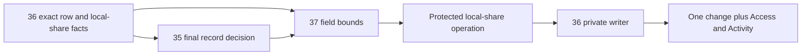

# Phase 3 — Field access and protected local sharing

Task: [#37](https://github.com/Abzum-NZ/Abzum-Vortex/issues/37). Prerequisites: completed [central Access #34](issue-34-access-decision.md), completed [ownership and visibility #36](issue-36-ownership-and-visibility.md), and [final record/row decision #35](issue-35-row-policy-composition.md). The [definition-to-catalogue checkpoint](../evidence/issue-37-field-access.md#definition-to-catalogue-checkpoint--8-september-2026) is implemented, locally verified and independently reviewed. Source declarations, compiler/provenance, publication/version impact and catalogue persistence now carry explicit field policies. The field resolver and projection/write contracts can proceed alongside #35; complete record integration and protected sharing still require #35's final exact-record decision and trusted fixed-adapter handoff. The catalogue checkpoint has passed [exact hosted Testing verification](../evidence/issue-37-field-access.md#hosted-testing-result); this whole task remains in progress.

The [pure field-resolution checkpoint](../evidence/issue-37-field-access.md#pure-field-resolution-checkpoint--8-september-2026) is implemented and independently reviewed: complete contribution union, share intersection, current-evidence binding, projection and whole-write validation. Actual neutral database enforcement and protected sharing remain required; passing pure helpers does not deliver the later executors.

## Outcome

A person receives only fields they may read and changes only fields they may change. Sharing a local record cannot give someone else field access the grantor does not have.

## What will be built

1. Add the missing authored-source and canonical permission field-access declarations for module and application record permissions. Resolve authored field aliases against the permission's exact record type into permanent field identities; reject unresolved, duplicate, non-canonical or foreign-record fields and invalid read/change relationships. Preserve historical immutable releases without rewriting them. Carry every accepted declaration through compiler provenance, permission-catalogue fingerprints and the existing permission meaning/version comparison so a field-authority change cannot be treated as presentation-only. Do not infer field authority from a field name, role label, action label or installed application fixture.
2. Resolve those declared policies and #36's local-share bounds into separate readable and changeable sets. Reuse the existing declaration, permission and field identities, not hardcoded field lists or another access store. A field absent from a permission's allowlist is refused by that contribution, not a veto against another independently complete permission.
   Where #35 admits several declared record-permission alternatives, combine only independently complete matched contributions. Each contribution retains its exact permission declaration, current eligibility, complete row route, immutable source evidence and deadline. An incomplete alternative contributes no field access; choosing an arbitrary first match must not hide another complete permitted contribution. A direct-share contribution is additionally bounded by that share's own readable and changeable field sets before it can contribute to the final result.
   Before using a final result, match its exact record identifier, organisation/application/module/type/storage binding, operation and current transaction evidence to the requested record. An allowed result for another record of the same type grants nothing here; reuse #35's existing Access version, checked time, validity deadline and correlation evidence rather than creating another token, cache, counter or dispatcher.
3. Apply the resolved bounds centrally before response, query or semantic-map projection. Unreadable fields and field-derived protected labels, choices or validation metadata are absent, not blank, CSS-hidden or returned as disabled metadata. Reject an attempted unauthorised write as one operation rather than silently dropping fields or partially applying the permitted subset.
4. Enforce field/action restrictions on selected values, filters, sorts, groups, field aggregates, safe error details, named-action inputs and semantic resources. An aggregate that names a field requires authority for that field; a content-free operation such as a permitted row count does not invent a field dependency. Sensitive fields require their explicit authority. An allowed row or ordinary permission alone is insufficient.
5. Add the complete protected same-organisation direct-share grant/revocation invocation over #36's private writer. In one verified transaction, check #35's exact share action and target-record decision, derive the grantor's current readable/changeable ceiling, require proposed fields to be subsets, validate the current recipient and exact organisation/application/module/type/storage/record scope, and invoke the revision-checked writer with Activity and one Access invalidation. Keep raw decision, fact and writer helpers private. Revocation uses its declared current exact authority and expected revision; it does not wait for a granting approval, require the grantor to retain the old field ceiling, or revive expired access.
   A share must include at least one readable field, matching the existing private writer. Read-only sharing requires current read authority but not update authority; derive the update ceiling only when changeable fields are proposed. Acquire the existing governance/change lock before evaluating current authority, not by upgrading a read lock midway through the operation. Reuse the existing writer's Activity and Access change without appending a second change.
6. Supply typed field-decision, projection, write-validation and protected-share service operations plus shared parity cases for later record/query/search/export/interface/MCP executors. Prove the actual server/database boundary on controlled neutral rows and with the real non-owner request role here. Row-level policies do not hide columns: withhold raw content-table privileges and expose only fixed projection/change adapters that enforce the field bounds. Prove direct table access and raw-helper calls are refused. Later executor tasks must reuse this result; #37 does not claim their screens, generated storage, query engines or transports are delivered.

## Delivery boundary and dependency

The reviewed definition-to-catalogue slice carries the policy all the way through
the existing permission meaning fingerprint and private catalogue alongside
its new-publication requirement. Nullable `field_policy` sits beside the existing
record scope, retaining strict registration and exact read reconstruction. Do not
add another table, permission evaluator, continuity counter or approval gate.
Absent historical policy must remain absent through TypeScript and database
round-trips; explicit empty is a distinct published meaning. The
[fixture field-policy notes](../../testing/fixtures/README.md#explicit-field-permissions)
record intentional usable field lists and the separate later action-binding gaps.

The source/canonical declaration shape, compiler mapping, provenance, version-impact comparison, pure field resolver and typed operation contracts can be built without a callable #35 runtime. Their tests must use typed exact-record fixtures and must not describe mocks as live record integration.

Database projection/update proof and protected local-share invocation use #35's final exact-record decision through fixed trusted adapters on controlled neutral storage with the real restricted request role. The [reviewed adapter split](issue-35-row-policy-composition.md#trusted-record-adapters--8-september-2026) keeps raw evaluators private: typed runtime orchestration cannot confer authority on caller-supplied declarations or record graphs. Permanent definition-derived adapters remain #45; they are not a reverse dependency for this neutral engine proof. They must consume that decision directly rather than copying its evidence into a new wrapper format. #36's private current-share reader and revision-checked writers are prerequisites to reuse, not blockers that #37 should replace. Later executor ownership does not block the neutral engine proof, and absence of a later screen or transport is not repaired by adding a generic dispatcher here.

## Reviewed field-policy composition

The architect and independent Sol review select explicit per-permission `fieldPolicy` with canonical unique `readableFieldIds` and `changeableFieldIds` (changeable is a subset of readable). This implements the existing permission-union model without introducing a global deny policy. Only independently complete current record contributions combine; direct-share bounds intersect each contribution before union. Missing or empty policy contributes no fields and does not veto another complete contribution. No wildcard includes future or sensitive fields. Field lists narrow an already authorised action and cannot turn read into update authority.

Keep policy optional when reading historical canonical definitions; require explicit `field_policy` for newly authored/published record permissions, resolve aliases to exact record-type field identities, and forbid policy on non-record permissions. Empty lists are valid, including for share-action authority whose grantor ceiling is derived separately from current read/update authority. Do not rewrite old releases or invent defaults. Policy changes use the existing permission-meaning and major-version/acceptance comparison, including absent-to-empty, additions, removals and movement between read/change lists. This is implementation architecture, not an unresolved user approval.

## Acceptance criteria

- [ ] Authored and canonical record-permission contracts express the reviewed explicit field policy with exact field identities. Compilation resolves only fields on the permission's exact record type, emits complete provenance, preserves historical releases, and treats authority changes through the existing permission meaning/version policy.
- [ ] The engine-level response and semantic projection proofs contain no unreadable values or protected labels/metadata. Shared fields cannot leak through filters, sorts, field aggregates, errors or action inputs. These proofs do not claim that later record/query/search/export/interface/MCP executors or UI are delivered.
- [ ] Alternative permissions contribute field bounds only when their own eligibility and complete row scope both pass. Incomplete alternatives cannot lend field access to an otherwise allowed row.
- [ ] Final evidence for record A cannot supply readable/changeable fields or sharing authority for record B, including two records with the same organisation, application and record type.
- [ ] An unauthorised field write leaves the record unchanged and returns a safe refusal; it is not partially applied.
- [ ] Canonical contract, TypeScript and SQL parity cases prove missing/empty policy, multiple complete contributions, per-share intersection, sensitive explicit access, field/type mismatch and read-not-write separation. No incomplete contribution lends fields and no missing policy globally vetoes a valid contribution.
- [ ] Current account, role, Group, share and Access-version changes affect the next request. No hardcoded application/field lists decide core behaviour.
- [ ] A local share grants only fields the grantor may currently read/change. Missing share permission, invisible target, wider field proposal, foreign scope/recipient and stale evidence refuse before mutation.
- [ ] Actual non-owner runtime/request-role tests prove local-share invocation and raw-helper denial. Success, Activity and one Access change commit together; failed authority or append rolls back all changes.
- [ ] Multiple local share contributions remain distinct from cross-organisation one-complete-grant rules. Revocation removes only that share's contribution; surviving independent authority is evaluated normally.
- [ ] One shared matrix covers both organisation directions and application separation in actual server/database integration using the #35 fixed neutral-adapter handoff. Contract and pure-engine work completed earlier is labelled accordingly; later executors reuse the result and mocks are not described as live integration.
- [ ] Independent actual-work review, relevant local checks and exact hosted Testing verification pass. UI editors remain [#52](https://github.com/Abzum-NZ/Abzum-Vortex/issues/52)/[#72](https://github.com/Abzum-NZ/Abzum-Vortex/issues/72), and complete cross-phase evidence remains [#254](https://github.com/Abzum-NZ/Abzum-Vortex/issues/254).

This handoff avoids a cycle: #36 builds private share facts and row predicates; #35 completes record permission/row composition; #37 adds the missing field ceiling and protected share invocation. It does not make #36 depend on #37, move Access grants into the generic Record save pipeline, or pull cross-organisation sharing [#153](https://github.com/Abzum-NZ/Abzum-Vortex/issues/153) into Phase 3.

## References

- [Field access](../specification/04-access-and-permissions.md#field-access)
- [Local sharing](../specification/04-access-and-permissions.md#direct-record-sharing-inside-one-organisation)
- [Page semantic bindings](../specification/appendices/page-builder-contracts.md#forms-actions-and-semantic-controls)
- [Platform-only scope](../specification/appendices/core-contract-boundary.md)
