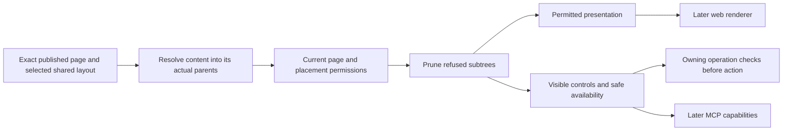

# Page, section and block permission projection

Task: [#38](https://github.com/Abzum-NZ/Abzum-Vortex/issues/38).
Engine prerequisites: completed [permission registry #32](https://github.com/Abzum-NZ/Abzum-Vortex/issues/32)
and [current Access #34](issue-34-access-decision.md).
Final V2 authored-to-published integration requires the coordinated publication
and readback slice of [#249](https://github.com/Abzum-NZ/Abzum-Vortex/issues/249),
normally merged in [PR #344](https://github.com/Abzum-NZ/Abzum-Vortex/pull/344).
Its exact hosted Testing verification is running. This handoff does not wait
for the remaining draft conversion, Puck adapter or App Designer.

## Outcome

An application page exposes only the page, nested sections, blocks and controls
the current person may discover. The engine retains usable permitted presentation
and removes refused content before a later renderer or semantic interface sees it.
Viewing a control never grants permission to perform its operation.

This is still required. The original task missed permission fields on the nested
V2 placements and conflated this engine with later installed-page, anonymous and
MCP delivery. The plan below corrects those gaps without adding a Section entity,
permission evaluator, cache, SQL store or visual designer.

## Placement rule — architect and independent Sol review

- A page retains its existing required access permission.
- A V2 placement may declare an additional `view_permission` and `use_permission`
  in authored source, compiled to `viewPermissionKey` and `usePermissionKey`.
- No explicit view key means inherit the page and all enclosing placement view
  gates. It is not public or unconditional access. An explicit key adds a condition;
  it never replaces or weakens an ancestor's gate.
- A refused parent removes its entire subtree, including identities, settings,
  labels, binding metadata and responsive order references. An independently
  permitted child cannot reopen that parent.
- No explicit use key means no additional placement restriction, not permission
  to execute an action. An actual operation still needs its own fixed binding and
  current decision. If an additional use gate refuses, permitted presentation may
  remain visible as unavailable with a fixed safe reason and no invocable binding.
- Historical V2 placements with no keys inherit the existing page gate. Do not
  rewrite immutable releases. Legacy V1 required placement keys remain required.
- Nested section/container placements use these same rules. No block name,
  application name, role label or special administration screen decides access.

## What will be built

1. **Complete authored and canonical contracts.** Add optional V2 view/use references
   to the existing placement types, including placements in shells and guided-form
   step content. Resolve every explicit reference against its exact owning
   application/module permission through the Definition pipeline owned by #249. Refuse unknown,
   foreign or ambiguous references. Preserve omission and exact compiler provenance.
   A view/use permission change is an existing permission-semantic major change,
   not presentation-only. No new counter or release/acceptance mechanism.
   The native V2 compiler and permission-reference provenance are delivered in
   [PR #341](https://github.com/Abzum-NZ/Abzum-Vortex/pull/341). V2 comparison,
   publication/storage and consumer/history/restore integration remain in #249.
   Do not treat compiler coverage as their completion or add dead V2 branches to the
   V1 compiler, build a parallel compiler here, or close #38 on schema parsing alone.
2. **One recursive projection engine.** Support the existing V1 page blocks and V2
   placement trees. Page refusal returns no page. Filter refused placements and
   descendants, and remove their IDs from all desktop/tablet/phone orders. Keep
   permitted definition presentation needed to render. Remove internal permission
   keys and decision/catalogue evidence from output. A projection is not a new
   published definition: permitted layouts can become empty after pruning without
   treating this as invalid authoring or refusing the whole page.
3. **Separate discovery from operation availability.** Return only safe unavailable
   reasons for an already-visible control. Missing real operation bindings must
   never be advertised as executable. Query/action/record/field references in
   admitted definitions are not authority to read values or invoke them. Dynamic
   conditions and data resolution remain with their owning executors and may
   further restrict presentation; they cannot override this permission projection.
4. **Trusted authenticated service handoff.** Use an operation-specific server
   adapter that selects the exact immutable application/page and resolves the
   current registered permission identities. Call the existing Access service in
   the current organisation/application transaction; bind account, application,
   Access version, correlation and validity evidence consistently. Request input
   cannot select an allow-map, permission key, declaration or helper. Prove this
   using a fixed neutral adapter before the installed application consumer exists.
   The initial published-page adapter uses the delivered Definition consumer V1
   reader, which requires a trusted system context. Read and verify an exact
   immutable release in that context, then project permissions in the separate
   human request transaction; bind the same organisation, exact application/page,
   release fingerprint and server correlation. Do not pass a human context to the
   system reader or fabricate system authority from request input. Before #64,
   a fixed release and injected validated fixture context can prove the actual
   stored-reader integration, not a deployed context issuer. #64 owns real service
   context provisioning and installed-release selection; #30's structural operator
   is not a prerequisite or substitute. Access owns the fixed system-context
   application/permission-source read and its existing request runner. Page
   consumes that verified evidence and owns page selection/projection; it does
   not initialize database authority or use the Access-only runner directly.
   Do not widen package boundaries or add a general privileged execution API.
   V2 projection
   fixtures may use contract-parsed canonical trees, but are not publication
   evidence. Enable published V2 selection only when #249's coordinated readers
   and persistence are delivered; a caller-provided tree is not a substitute.
5. **Bounded verification and handoff.** Test inheritance, subtree removal, sibling
   retention, responsive order pruning, safe unavailable controls, exact reference
   and revision meaning, and mismatched/stale evidence. Reuse fixture definitions
   without application-specific behavior. Record independent actual-work review
   and exact normal Testing source delivery. Do not create a public endpoint or
   claim a working renderer, anonymous authority or MCP transport here.

## Acceptance criteria

### Implementation decision — selected shell and page handoff

Resolve the exact published shell and its named-slot page attachments into one
internal runtime tree before permission collection and recursive filtering. A
guided form resolves that tree for each step. Published canonical data is not
mutated or republished; the runtime output contains only permitted resolved
content. The existing recursive projector handles both shell and page ancestors.

Generalize the current internal V1-only stored-page adapter to one exact V1/V2
adapter. It consumes the existing Definition/Access source and registration;
there is no second reader, authority issuer, database store or permission engine.
Validate the trusted boundary once and check the structural facts needed for
slot attachment, without repeatedly revalidating an entire application at each
recursive step. Review the actual completed Page changes independently with Sol.

### Completion checks

- [ ] Resolve the selected published shell layout and its exact named-slot
      attachments before returning page capabilities. A refused shell ancestor
      removes injected page descendants, including guided-step content and
      responsive-order references; do not refuse all custom shells instead.
- [ ] V2 authored/canonical permission references compile with exact provenance,
      owner/reference validation and permission-semantic version impact.
- [ ] Historical omission inherits page/ancestor authority; V1 semantics and
      immutable bytes are preserved.
- [ ] Refused page returns no page content. Refused parent removes all descendants
      even when their own permissions pass; a refused child leaves allowed siblings.
- [ ] Every responsive order contains only surviving placement IDs. Empty permitted
      runtime layouts are supported without adding a new authoring constraint.
- [ ] Allowed presentation remains usable; refused content/labels/settings/counts
      and internal permission/evidence fields do not enter the projection.
- [ ] Viewing a control never authorizes an operation. Additional use refusal is
      represented safely, and missing operation bindings are not invocable.
- [ ] The trusted adapter binds exact page/release and current organisation,
      account/application, Access version, correlation and validity evidence.
      Caller-supplied authority selectors and mixed/stale decisions refuse.
- [ ] Focused contracts, compiler/provenance/version, projection and fixed-adapter
      checks pass, with independent actual-work review and normal source delivery.
- [ ] Related consumer tasks record the concrete integration below, so later
      application/public/MCP behavior is retained rather than silently omitted.

## Later integration ownership — not reverse engine dependencies

| Owner                                                                                           | Required integration                                                                                                                                                                                               |
| ----------------------------------------------------------------------------------------------- | ------------------------------------------------------------------------------------------------------------------------------------------------------------------------------------------------------------------ |
| [#249 page-composition foundation](https://github.com/Abzum-NZ/Abzum-Vortex/issues/249)         | Finish V2 comparison and publication/persistence/readback after the delivered native compiler/provenance, including #38 permission meaning. This is a real prerequisite for final V2 integration, not designer UI. |
| [#64 application runtime](issue-64-application-runtime.md)                                      | Bind the installed active application and exact release to the trusted page adapter.                                                                                                                               |
| [#69 page permissions](https://github.com/Abzum-NZ/Abzum-Vortex/issues/69)                      | Real navigation, direct addresses, render responses and live access-ended continuity use the projection.                                                                                                           |
| [#250 semantic bindings](https://github.com/Abzum-NZ/Abzum-Vortex/issues/250)                   | Complete form/query/flow/operation bindings determine actual invocable controls.                                                                                                                                   |
| [#35 record access](issue-35-row-policy-composition.md), [#37 fields](issue-37-field-access.md) | Independently enforce every actual data read/change; page admission grants no record/field access.                                                                                                                 |
| [#107 public access](https://github.com/Abzum-NZ/Abzum-Vortex/issues/107)                       | Implement the distinct anonymous authority and explicit public-operation/field allowlist, then compose public page projection. Do not fabricate an organisation account.                                           |
| [#200 MCP](https://github.com/Abzum-NZ/Abzum-Vortex/issues/200)                                 | Use the same filtered capabilities and owning operations; prove actual discovery/invocation parity.                                                                                                                |

References: [Access](../specification/04-access-and-permissions.md),
[semantic interface map](../specification/07-applications-pages-and-themes.md#semantic-interface-map),
[nested placement contracts](../specification/appendices/page-builder-contracts.md#composition),
and [engine-first delivery](engine-first-application-delivery.md).

The [final native handoff evidence](../evidence/issue-38-native-page-handoff.md)
records the completed implementation, independent actual-work review and its
delivery status. The reviewer independently passed 19 Page tests and the Page
type check. Source delivery and exact hosted verification remain before closure.
