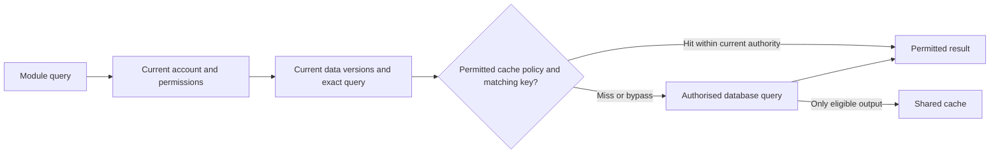

# Permission-safe query caching

Task: [#39](https://github.com/Abzum-NZ/Abzum-Vortex/issues/39).
Phase: [5 — queries, rules and events](https://github.com/Abzum-NZ/Abzum-Vortex/issues/53).
Depends on [module-exposed queries #54](https://github.com/Abzum-NZ/Abzum-Vortex/issues/54).

## Architecture review and outcome

Caching remains useful, but there is no application data-result cache to protect
in Phase 3. Build it with the first real query consumer, not a dormant framework.
The former task incorrectly proposed another permission counter, a global person
key and a fixed 60-second lifetime. Reuse the existing current Access version and
Record-owned data versions. No new approval or invalidation authority is needed.

People may receive a previously computed query result only when their current
organisation account, permissions, application and underlying data still match.
A cached value must never delay an access removal or expose another person's data.

## What will be built

1. Integrate an explicit cache policy into the real #54 query execution path and
   its shared runtime-cache adapter. Default to bypass unless the complete query
   dependency and permitted output can be established. A standalone key builder
   or in-memory fake is not the completed feature.
2. Resolve the current organisation account, session, Access version and relevant
   data versions before any lookup. Current access and field authorization still
   apply on a hit. Never use a cached permission decision to validate its own key.
3. Key permission-varying data by organisation, organisation-account identity,
   application context, current Access version, exact pinned definition releases
   and fingerprints, every relevant record-type data version and the complete
   query fingerprint including parameters. A global identity alone is not the
   account scope. Reuse existing version ownership rather than adding counters.
4. Bound reuse by the earliest configured cache lifetime, authority validity and
   session/context expiry. Cache retention is not authority. Expired or changed
   context cannot make an old result reachable even if invalidation is delayed.
5. Never cross-request-cache current account/discovery pointers, Access decisions,
   secrets, sensitive-field responses, permission-administration or Activity
   responses. Bypass cross-organisation/shared-source record results in the first
   release, as required by the existing federation contract.
6. Preserve the existing explicit exception for content-hashed public application
   assets. Immutable definition caching uses organisation, root, exact revision
   and fingerprint; later installed-application consumers integrate that contract
   under #64 rather than introducing a reverse dependency here.
7. Use invalidation for freshness and reclaiming old entries, never as the proof
   that a person still has access. Record versions belong to the Record service;
   Access versions belong to Access. Explain cache bypass and misses through
   existing diagnostics without exposing private keys or result contents.

## Acceptance criteria

- [ ] A real permitted query demonstrably hits the configured shared cache;
      unsupported/sensitive/shared-source queries bypass it.
- [ ] The same query across different organisations, organisation accounts or
      application contexts cannot reuse another context's permission-varying data.
- [ ] Revocation, account suspension and time-limited access expiry take effect on
      the next request even when an old cache entry still exists.
- [ ] A change to any queried record type, query parameter or pinned definition
      selects a different valid result; dependencies are not silently omitted.
- [ ] Current permission and field checks cannot be skipped by a cache hit.
- [ ] Cache-provider failure follows the normal authorised query path rather than
      serving unverifiable stale data or adding a second data-access engine.
- [ ] Focused integration tests cover actual hits, isolation, invalidation/version
      changes, expiry and bypass; independent review inspects the real query path.
- [ ] #56 and #64 document their later integrations without duplicating counters
      or treating cached output as authorization.

## Dependencies and later owners

Move this task from Phase 3 to Phase 5, after #54 and before
[live refresh #56](https://github.com/Abzum-NZ/Abzum-Vortex/issues/56).
The [query-plan work #55](https://github.com/Abzum-NZ/Abzum-Vortex/issues/55)
remains a separate consumer of #54. The
[application runtime #64](https://github.com/Abzum-NZ/Abzum-Vortex/issues/64)
owns its immutable-definition/resolved-application cache integration later.
Neither #56 nor #64 is a prerequisite of this query-cache task.

Governing specification: [runtime caching](../specification/17-runtime-storage-and-caching.md#cache-model).
