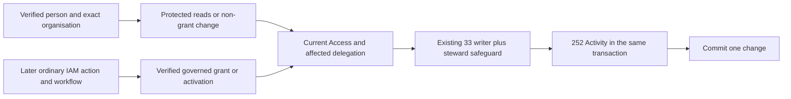

# Phase 3 — Protected Access administration

Task: [#40](https://github.com/Abzum-NZ/Abzum-Vortex/issues/40). Completed prerequisites: [permission registry #32](https://github.com/Abzum-NZ/Abzum-Vortex/issues/32), [Roles and Groups #33](https://github.com/Abzum-NZ/Abzum-Vortex/issues/33), [central Access #34](issue-34-access-decision.md), [authentication evidence #276](../specification/appendices/recent-authentication.md), and [Activity #252](issue-252-activity-foundation.md), whose [exact hosted receipt](../evidence/issue-252-activity-foundation.md#hosted-delivery--6-september-2026) is verified. [Organisation administration #30](issue-30-protected-administration.md) is a separate consumer, not a dependency.

## Outcome

Authorised people can inspect and administer their organisation's access through protected operations. Existing role, Group, membership, assignment, activation and delegation facts are reused. The later ordinary IAM application supplies forms, requests and approvals; it cannot grant authority by editing a record.

## Already built — do not rebuild

The [temporary activation ledger](../evidence/issue-40-access-administration.md#temporary-activation-ledger--7-september-2026) is implemented and locally verified. Together with the earlier catalogue, role/template, Group, membership, assignment and delegation views, it completes the planned safe-read resources at source level. Exact hosted delivery is still required. The next implementation slices are the existing protected reductions and private governed IAM handoffs below, not another administration read model or early granting UI. This whole task remains open.

- #32 supplies permission identities, current availability and source preparation.
- #33 supplies the private facts and revision-checked writers, including role changes, Groups, memberships, assignments, activations, delegation, application coordination, stewardship and invitation intents.
- #34 supplies the sole current permission/delegation decision and read-transaction adapter. #276 supplies genuine authentication evidence.
- #252 supplies the private content-free Activity append. Existing private readers/writers and that raw append helper are not runtime endpoints.

## What will be built

1. **One governance-first writer path.** Resolve the verified human into the exact organisation/application in the existing transaction, taking the organisation's write/governance locks before mutable account facts and authority evaluation. Recheck source/time facts after waits. Do not upgrade the ordinary read resolver's shared Access lock after permission checking, add another database driver, or give the application owner credentials.
2. **Safe administration reads.** Provide bounded list/detail projections for the permission catalogue, roles, Groups, memberships, assignments, activations and delegations under their exact administration permissions. Return useful labels/descriptions and stable references, not internal fingerprints, credentials or unrelated organisations. Reuse current stored facts; do not create a second effective-access table or unbounded owner snapshot.
3. **Protected invocation of existing changes.** Bind actor, organisation, account and correlation from trusted context. Validate the operation's exact input and reviewed revisions; derive its affected scope from locked stored facts and verified prepared candidates. Invoke #34's fixed declared permission and applicable before/after delegation check, then the latest stewardship-aware #33 composition and #252 append in the same transaction. No request supplies an allow flag, authority declaration, prepared JSON that is trusted without verification, or an arbitrary helper name.
4. **Clear operation-specific authority.** Empty Group creation and label changes do not invent a permission grant. Metadata-only role changes preserve policy and permissions exactly. Management changes check the exact management permission and all authority they actually affect; granting onward authority cannot exceed the caller's current delegation. Current accepted role/template preparation and the complete affected-assignment manifest are reused where #33 requires them, not rebuilt.
5. **PIM and self-service distinctions.** Self-activation uses the authenticated beneficiary's exact current eligibility, role policy, finite requested duration, required reason and genuine recent authentication. It does not require that person to be a role administrator before activating an eligible role. Required independent approval comes from the later verified workflow response, never an editable status or submitted approver ID. Self-deactivation is immediate. An administrator revoking another person's activation needs the exact management permission and affected delegated scope. All paths preserve current source/revision and permanent-steward safeguards.
6. **Separate invitation-intent acceptance.** Use the verified global identity and existing invitation composition before an organisation account exists; do not require the invitee to already possess that account. Bind the exact intended access and recheck the inviter/approver's current authority through the governed path. Preserve the existing account-only invitation behaviour. This is not a new invitation store or general Identity writer.
7. **Activity and safe results.** Successful changes and their one content-free Activity entry commit together with the existing single Access increment. Failure rolls back everything. After rollback, the protected owner may record a safe refusal without storing an unknown/foreign target as a verified local subject. Retries follow the existing operation's actual replay/stale semantics; no second successful mutation, receipt framework or history store is introduced.

Fixed platform-catalogue initialisation and metadata transitions remain bounded system/bootstrap operations. They do not create a human `permissions.manage` capability. Human catalogue reads use the existing exact read permission. Preserve this separation when replacing owner-only test handoffs with concrete protected invocation.

#40 supplies the private governed invocation handoff around the existing `coordinate_application_access_change`; #64 supplies its declared application-lifecycle operation and protected caller binding, then consumes this handoff rather than calling the raw coordinator. Withdrawal is a reduction but is not authorised by role-management or assignment-management permission. #40 completes its private typed preparation/composition without waiting for the #64 endpoint; it must not expose a withdrawal endpoint before that legitimate operation binding exists. This avoids a circular dependency without omitting withdrawal. Human registration, update and reactivation paths remain private where they can establish or broaden authority until the verified #267 binding exists. A bounded system/bootstrap registration must be explicitly identified as such, not inferred from an installer or application name. Plain account-only invitation create/revoke belongs to #30; only the access-intent preparation and verified pre-organisation acceptance handoff described above belong here.

## Availability before the full IAM journey

| Operation class                                                                                                                                                                   | Phase 3 boundary                                                                                                                                                        |
| --------------------------------------------------------------------------------------------------------------------------------------------------------------------------------- | ----------------------------------------------------------------------------------------------------------------------------------------------------------------------- |
| Permitted list/detail reads                                                                                                                                                       | Shipping protected service operation; later generic pages consume it                                                                                                    |
| Empty Group creation/label change, role metadata-only edit with policy/permissions unchanged                                                                                      | Protected non-grant operation with exact authority and Activity                                                                                                         |
| Terminal retirement, removal, revocation, withdrawal and self-deactivation                                                                                                        | Immediate protected operation; no granting approval wait, but current authority and final-steward protection still apply                                                |
| Grants, membership restore/renewal, assignment grants, permission acceptance/broadening, policy/mode edits, delegation grant/replacement, activation and application reactivation | Private preparation/composition only until [#267](https://github.com/Abzum-NZ/Abzum-Vortex/issues/267) supplies the verified IAM action/workflow/human-response binding |
| Invitation carrying access intent                                                                                                                                                 | Separate private verified-identity handoff until that governed binding is available                                                                                     |

The available writer variants are `create_group`, `revise_group_label`, `retire_group`, `retire_role`, `remove_membership`, assignment `revoke`, `revoke_role_activation`, `revoke_delegation`, and application withdrawal, each through its owning protected wrapper. Activation revocation distinguishes the authenticated person's own deactivation from administration of another account. The existing `revise_metadata_policy` variant is available here only with policy and permissions unchanged; a changed policy is routed to the private governed class instead. These are exact existing variants, not permission names or a general caller-selected dispatcher.

A policy edit is not classified as harmless metadata merely because its label is unchanged. A no-approval activation policy does not fabricate an approval record; it still uses the declared IAM action and verified current beneficiary evidence. No generic Phase 6 form, other application or MCP tool receives an early direct granting route.

## Acceptance criteria

- [ ] Actual restricted runtime/request-role tests prove permitted reads and available non-grant changes, plus unauthorised, foreign, stale and raw-helper refusal. Owner fixtures and transaction mocks alone do not prove the shipping path.
- [ ] Every command uses the existing exact writer variant and correct expected revision. Current preparation verification, before/after authority and permanent stewardship are enforced in the same transaction; no name or tenant-administrator shortcut exists.
- [ ] Group membership add/remove/restore/renew, role acceptance, assignment windows and terminal revocation retain #33's distinct semantics. No old privileged activation resumes after source restoration or a new grant identity.
- [ ] Self-activation eligibility is not confused with administration permission; self-deactivation and administrator revocation follow their distinct authority paths. Missing, foreign, stale, self-approved or replayed required response evidence refuses. Authentication is rechecked after an approval wait.
- [ ] Existing private grant paths remain unreachable from shipping runtime exports or arbitrary forms/MCP until #267 is delivered. Read/non-grant operations do not depend on that later UI.
- [ ] Successful mutation, one Access increment and one Activity entry are atomic. Refusal does not increment or create completed evidence, and retries do not repeat a change.
- [ ] Real competing writer orders and expiry across waits are tested using the governance-first seam. Fix lock-order defects at their source; add no generic retry or lock framework.
- [ ] Invitation-intent acceptance works from verified identity without a pre-existing account and cannot omit the intended grant checks. Its live governed journey remains explicitly assigned to #267.
- [ ] Outputs are usable by ordinary application definitions without hardcoded role screens, business names, AI behaviour or another permission/approval store.
- [ ] Independent actual-work review, full relevant local checks and exact hosted Testing evidence pass before completion. Service-only evidence is not described as a usable IAM interface.

## Delivery slices and consumers

The [first implementation checkpoint](../evidence/issue-40-access-administration.md) covers the governance-first seam and Group list/detail reads only. Its local restricted-role and competing-write checks pass; the other reads, changes, private governed handoffs and final hosted delivery below remain required. Do not describe that checkpoint as a complete administration API or an IAM interface.

1. Governance-first writer seam and safe reads.
2. Available non-grant operations with Activity and real restricted-role proof.
3. Private governed grant, PIM and invitation-intent composition and exact handoff contracts.
4. Combined review, concurrency and hosted delivery evidence.

### Non-grant checkpoint: create and rename an empty or existing Group

After the membership-read checkpoint, add protected Group creation and label changes using the existing `create_group` and `revise_group_label` compositions. Creating a Group creates no members, roles, assignments or delegation. Renaming changes only its display label; the permanent identity and key remain unchanged. Neither operation needs a new approval journey.

Use the existing governance-first human change path and the exact Group-management permission. Bind organisation, actor and correlation to verified context, generate new identities on the trusted side, and require the current Group revision when renaming. Call the existing private writer and append one content-free completed Activity entry in the same transaction. Return the safe Group summary and resulting Access version; do not expose writer audit internals or accept caller-supplied authority. Preserve the existing stale/unchanged-result semantics rather than introducing a retry or receipt framework.

Actual restricted-role checks must cover permitted creation/rename, refused permission and foreign/stale targets, and rollback of both the Group change and Access increment if Activity fails. Reuse the existing locking model and prove a representative competing rename order. Retirement and membership/assignment reductions still require their own complete affected-authority checks; these two metadata operations must not become a generic change dispatcher.

This bounded checkpoint is implemented, independently reviewed and locally verified in [PR #314](https://github.com/Abzum-NZ/Abzum-Vortex/pull/314); [evidence](../evidence/issue-40-access-administration.md#group-create-and-rename-checkpoint--7-september-2026) separates its local results from outstanding hosted delivery. The next demonstrated correction is [invitation acceptance #315](https://github.com/Abzum-NZ/Abzum-Vortex/issues/315): preserve the existing fresh expiry check and clamp only written audit timestamps after serialized changes. It introduces no approval gate and does not reopen [approved Roles and Groups #33](https://github.com/Abzum-NZ/Abzum-Vortex/issues/33). The remaining safe reads, reductions and private governed handoffs above are still required before this whole task is complete.

### Next safe-read checkpoint: registered permission catalogue

Let permitted administrators browse the selected organisation's current registered permissions and inspect one exact entry. Reuse the existing verified read transaction and fixed `platform.organization.permissions.read` permission. An entry is identified by its optional application root, owner kind, owner identity and permission identity; the same module permission installed in two applications remains two distinct contextual entries. Reuse existing reference validation rather than creating different ownership rules.

Return only that reference, key, label, description, optional record type and declared action/administrative metadata. Do not return catalogue or meaning fingerprints, source preparation, raw saved-condition evidence or audit internals. This view describes registered permissions; seeing an entry never proves that the caller can use, assign or delegate it. Include current entries from active registrations at the matching current registration revision, not withdrawn or historical entries. Pending acceptance does not erase a registered declaration from this administration view.

Provide bounded keyset pages and exact detail with the established unavailable result for unknown/foreign references. Sort by the complete reference with an explicit null ordering for platform entries; do not add a new index without evidence the current index is inadequate. Test the actual restricted-role path, authorised and forbidden reads, application/module ambiguity, current versus withdrawn revisions, cursor boundaries and safe results. Reuse the existing governance concurrency coverage because this slice introduces no new lock path, granting operation or authority evaluator.

This checkpoint is implemented, independently reviewed and locally verified; [the evidence](../evidence/issue-40-access-administration.md#registered-permission-catalogue-checkpoint--7-september-2026) records the exact bounded scope and separates local verification from outstanding hosted delivery. Role, assignment, activation and delegation projections, remaining non-grant changes and private governed handoffs are still required before this whole task is complete.

### Next safe-read checkpoint: local roles and application role templates

Provide two distinct read resources under the existing fixed `platform.organization.roles.read` permission. Neither resource answers whether a person currently has access or may receive a grant. Assignments remain a separate later `assignments.read` checkpoint.

1. **Current local roles.** List by stable role identity and inspect one exact role using the stored current revision pointer. Include active, acceptance-required, unavailable and retired roles so administrators can understand their current state; do not return historical revisions as current roles.
2. **Useful role configuration.** Summaries contain identity, key, label, role kind, lifecycle, current revision, privilege classification, safe assignment-policy settings and the application/source-role reference where applicable. Reuse one safe policy shape for list and detail rather than a duplicate partial-policy contract; it includes duration and authentication/review requirements, not policy fingerprints or approver identities. Detail adds description and the ordered accepted permission configuration. These are accepted configuration facts, not effective access or a promise that the role is assignable. Omit assignment facts, continuity counters, fingerprints and audit internals.
3. **Registered application templates.** List and inspect templates separately by the complete application-root and source-role identity. Read the exact immutable application release selected by its active current permission registration and require the current available template at that registration revision. Return the reference, key, name, published permission selection kind and keys. Do not use a mutable latest draft, stale continuity row or an inferred link to a local role. Omit home-page metadata and internal publication fingerprints.
4. **One existing protected boundary.** Reuse the verified read transaction, exact organisation and Access version, fixed permission and restricted request role. Return the established unavailable result for unknown or foreign details. Use bounded keyset pages with the complete stable reference, not an unbounded snapshot or new filter language.
5. **Actual storage proof.** Test permitted and denied request-role reads; unknown/foreign details; current versus historical role revisions and relevant lifecycles; retained accepted configuration; complete cursor ordering; withdrawn registrations and removed templates; exact release selection; the same source-role identity in different applications; and safe output fields. No new index, lock path, writer, Activity entry, concurrency framework or granting endpoint is required.
6. **Independent actual-work review and delivery.** Implement in the existing administration contracts/service and tests plus one additive migration/database suite. Recheck the delivered result against this scope, run relevant local checks and keep hosted delivery evidence distinct. This checkpoint does not complete the remaining administration operations or IAM interface.

[Administration definitions #72](https://github.com/Abzum-NZ/Abzum-Vortex/issues/72) consumes safe reads and available non-grant operations. [Application lifecycle #64](https://github.com/Abzum-NZ/Abzum-Vortex/issues/64) coordinates protected registration/withdrawal and management bindings. [IAM #267](https://github.com/Abzum-NZ/Abzum-Vortex/issues/267), after [#76](https://github.com/Abzum-NZ/Abzum-Vortex/issues/76) and [#81](https://github.com/Abzum-NZ/Abzum-Vortex/issues/81), owns actual user-linked approval and activation journeys. These later tasks are not prerequisites for the bounded private foundation or safe reads here.

The local-role/template checkpoint is implemented, independently reviewed and locally verified in [its evidence](../evidence/issue-40-access-administration.md#local-roles-and-registered-application-templates--7-september-2026). It does not finish the remaining assignment/activation/delegation views, non-grant changes or governed IAM handoffs.

### Next safe-read checkpoint: role assignments and delegation authorities

Let permitted administrators inspect the organisation's assignment ledger through two separate resources under the existing fixed `platform.organization.assignments.read` permission. One resource describes role assignments; the other describes delegation authorities. PIM activations follow as their own safe-read checkpoint because their policy and eligibility provenance is different. Do not infer effective permissions from either ledger.

1. List by stable assignment/delegation identity and inspect one exact detail, using the existing verified read transaction and organisation-bound Access result. Reuse the existing indexes and complete keyset cursors with bounded page sizes.
2. Role assignments show their identity, current role reference/key/label/lifecycle, safe account or Group assignee summary, standing/eligible kind, revision, fixed window, stored state and descriptive temporal state. Include revoked and out-of-window facts and retained unavailable-role or retired-Group references. Do not include grant/change audit details or another effective-access calculation.
3. Delegations show identity, safe account or Group holder, revision/window/state and organisation-catalogue scope or the ordered bounded exact permission references. Strip registration revisions, fingerprints, continuity and meaning evidence from the latter. Do not return the private raw delegated-scope object.
4. A single post-authorisation database time observation supplies the descriptive temporal state for each query. Active means only that this fact is live within its window, not that the holder has current effective authority. Do not repurpose timestamps as ordering or use an audit clamp for expiry.
5. Use one private fixed-permission scope and four request-only list/detail functions in an additive migration, extending the existing contracts/service and focused tests. No writer, Activity append, new index, cache, race framework or granting endpoint is required.
6. Prove actual permitted/denied restricted-role reads, direct/Group holders, standing/eligible assignments, catalogue/bounded delegations, relevant temporal states and retained source lifecycles, complete cursor pages, unknown/foreign unavailable results, and omission of internal evidence. Reuse the existing read-lock concurrency proofs. Independently review the actual work before delivery.

The role-assignment/delegation ledger checkpoint is implemented and independently reviewed; [its evidence](../evidence/issue-40-access-administration.md#role-assignment-and-delegation-ledgers--7-september-2026) records the passing restricted-role checks. PIM activation views, remaining non-grant changes and governed IAM handoffs remain part of this open task.

### Next safe-read checkpoint: temporary privileged activations

Let permitted administrators inspect retained temporary role activations through one bounded list/detail resource under the existing assignments-read permission and private fixed-permission scope. This is an administration ledger, not a self-service activation command or a calculation of currently effective access.

1. List by activation identity with the existing 1–100 page bound; inspect one exact activation. Reuse the verified organisation read transaction, request role, Access version and unknown/foreign unavailable result.
2. Summaries show activation identity, safe beneficiary identity/display name, current role identity/key/label/lifecycle, activation revision, existing `historicalRoleRevision`, direct/Group eligibility-source kind, activation time, finite expiry, stored live/revoked state and descriptive active/expired/revoked window state. Activations are not scheduled. The current role label/lifecycle is descriptive and distinct from the historical role revision used at activation.
3. Detail replaces the summary's source-kind shortcut with the existing closed eligibility-source reference: exact assignment identity/revision and, for Group eligibility, exact originating membership identity/revision. It adds safe policy settings as they were at activation, selected through the complete immutable policy foreign-key tuple. Do not substitute the current role policy. Omit internal policy identities/fingerprints/continuity, authority witnesses, reason, approval/authentication payloads, actor/correlation evidence and account state.
4. Authorize first, then observe time once per query. Revoked takes precedence over expired; otherwise the window is active. Do not hide a retained activation because its current assignment, membership, Group or role no longer provides authority. The central decision alone answers whether it is usable now.
5. Add two narrow request-only database leaves and extend the existing administration contracts/service. Reuse current indexes, source schemas and read-lock ordering. Do not add an effective-state evaluator, writer, Activity event, history table, new race proof or UI.
6. Verify restricted-role allowed/denied reads, private-helper refusal, direct/Group sources, retained active/expired/revoked facts, complete cursors and unknown/foreign details. Prove historical policy settings survive later policy changes and retained source references survive authority changes. Contract/service tests enforce exact shapes, finite windows, context/result binding and absence of private evidence. Independently review the actual patch and distinguish local checks from hosted delivery.

## Next protected change: revoke one role assignment

After the activation-ledger checkpoint, implement one immediate reduction through the existing human governance-first transaction. This is not a grant or approval journey.

1. Accept only the exact assignment identity and expected assignment revision. Derive organisation, actor and correlation from verified context, and generate Activity identity on the trusted side. Do not accept a role, beneficiary, permission scope, operation selector or granting fields from the caller.
2. Lock the exact live assignment in that organisation. Read its role's current accepted revision and complete accepted permission references under the existing governance lock. That snapshot is the affected `before` scope; `after` is none. Use the existing fixed assignments-management permission and current delegated-management decision. Do not derive a smaller scope from currently effective beneficiary access: this would understate scheduled, expired or activation-required authority being removed.
3. Preserve cleanup of retired roles, expired assignments and inactive assignees/Groups. Retain unavailable accepted permission references in the affected scope; the existing organisation-catalogue delegation can cover those references, whereas stale bounded delegation cannot invent authority. A missing or empty required role snapshot refuses; it does not fall back to a permission-only check.
4. Invoke the existing terminal assignment-revocation composition, its expected-revision check, single Access change and permanent-steward safeguard. Append one content-free completed Activity entry in the same transaction and return only the safe assignment summary and resulting Access version. A failed append rolls back the revocation and version change. No duplicate writer, dispatcher, counter, retry framework or granting endpoint is added.
5. Test the actual restricted request role: permitted complete delegation, insufficient/partial scope refusal, foreign/unknown/stale/replayed targets, expired/inactive-source cleanup, final-steward refusal, safe output and Activity-failure rollback. Prove competing same-revision revokes and a role-change race using the existing local concurrency pattern; operations serialize against the same accepted scope or refuse stale, without partial effects.
6. Independently review the actual patch against this bounded scope, run the relevant and aggregate checks, and record exact local versus hosted delivery. Keep the full task open for its other reduction families and private governed handoffs.

### Pending authorization: removal after application withdrawal

Actual execution exposed one exception to the planned cleanup behavior: application withdrawal creates a current `unavailable` role revision with no permission entries. The current protected removal correctly refuses rather than invent an affected scope. An attempted historical-snapshot fallback was rejected by the automated safety check and is not implemented. A second attempted empty-snapshot catalogue fallback was also rejected; no alternative write method is permitted to bypass that rejection.

Independent Sol review recommends a narrower documented behavior: only a current role revision explicitly marked `unavailable` with zero entries may require the existing `organization_catalogue` delegated-management scope for terminal assignment removal. Nonempty current entries retain exact bounded-scope checks. Empty active or retired revisions refuse. Historical permissions are never used, and an administrator holding only a bounded delegation—even matching the old permissions—cannot perform this cleanup. This changes removal capability only, not a grant or restored access.

Explicit authorization was requested from the user on 7 September 2026 because the tool safety check requires it. Only this exception is held; other Phase 3 work continues. Until authorization and actual proof, the proposed exception is not normative and the full assignment-revocation checkpoint is not approved. The real withdrawal fixture currently fails with `Organization role-assignment authority is stale or unavailable`; retain that result rather than claiming the new harness passed. If approved, update this plan's empty-snapshot rule, prove catalogue success/bounded refusal/invalid-lifecycle refusal and one atomic Access/Activity result, then obtain a superseding actual-patch review.

## Locally verified delivery: end temporary and delegated authority

The activation/delegation implementation and its restricted-caller and concurrency coverage are complete and independently approved at source level. [The evidence](../evidence/issue-40-access-administration.md#temporary-and-delegated-access-removal--locally-verified-candidate) records the exact candidate proof. Source delivery and exact hosted verification remain separate; this does not close the whole task. The structural-reduction family below is the next available implementation work.

Complete activation and delegation revocation together using the existing transaction and writer patterns. These operations are available engineering work; they do not depend on the isolated unavailable/empty-role assignment-cleanup authorization above. Keep that assignment exception unchanged rather than silently widening this delivery.

1. Add strict commands containing only an activation/delegation identity and its expected revision. Organisation, actor, correlation and Activity identity come from the trusted service. Return the existing safe ledger summary and resulting Access version; accept no caller-selected beneficiary, permission, authority scope or execution mode.
2. Derive activation self-deactivation from the locked beneficiary matching the verified account. A person can end their own retained live activation without an administration permission or renewed eligibility. For another beneficiary, require the fixed assignments-management permission and delegated coverage of the exact immutable role revision recorded on that activation. This snapshot is the authority originally activated, not a historical fallback for an unavailable assignment; do not substitute the role's current configuration. Neither path restores authority.
3. Revoke a delegation only after the fixed assignments-management permission and coverage of its exact locked current scope, whether organisation-catalogue or bounded permission references. There is no self-revocation shortcut for delegation administration. Inactive holders do not make retained facts disappear.
4. Take the existing governance/Access-version lock before target facts and authority evaluation. Call the existing activation/delegation revocation writer, preserving revision checks and permanent-steward protection, and append one completed Activity entry in the same transaction. Reuse ledger projections; add no dispatcher, grant endpoint, effective-access store or approval mechanism.
5. Verify actual restricted-role success/refusal, self versus other beneficiary, unchanged historical activation scope after role/source changes, complete versus partial delegation coverage, foreign/stale/replayed targets, last-steward refusal and atomic Access/Activity rollback. Reuse existing race harnesses for representative activation/source-change and delegation revoke/replace contention; do not multiply equivalent test combinations.
6. Obtain independent review of the actual work, then combined local and exact hosted evidence. The later structural-reduction family covers Group retirement, membership removal, role retirement and metadata-only edits. Grants, renewal, activation and broadening remain private until [IAM #267](https://github.com/Abzum-NZ/Abzum-Vortex/issues/267) supplies its verified user-linked workflow binding.

## Reviewed structural-reduction delivery

All four operations below are implemented and independently source-approved. [The evidence](../evidence/issue-40-access-administration.md#structural-administration--7-september-2026) records local verification and subsequent delivery results. Remaining private governed handoffs follow this family; the isolated assignment-cleanup exception and exact hosted evidence still prevent whole-task closure.

After temporary/delegated authority revocation, deliver Group retirement, membership removal, role metadata edits and role retirement together. Reuse the existing governance-first writer and safe ledger results; no designer, new approval journey or second access evaluator is required.

1. Public commands contain the exact target and expected revision only; role metadata additionally accepts label and description. Preserve role key, lifecycle, privilege classification, assignment policy, accepted permissions and source provenance. Actor, organisation, correlation and Activity identity remain trusted service inputs.
2. Group retirement and membership removal require the existing Group-management permission and coverage of the Group's complete affected authority: every non-revoked Group-held assignment and delegation, including scheduled or expired retained facts. Derive a unique bounded permission union from current accepted role snapshots and exact delegation scopes, or catalogue scope if any Group delegation has it. Truly authority-free Groups use the existing permission-only decision. Do not infer a smaller scope from presently effective access.
3. Role retirement uses the exact current accepted permission scope, before to none, with the existing role-management permission and final-steward safeguard. Metadata edits use that same scope before and after and must prove all non-metadata facts unchanged through the existing preparation/canonical evidence path. Do not add a permission/assignment manifest where the existing retirement contract excludes one.
4. Keep the already recorded unavailable/empty-role exception isolated: a retained assignment with that unresolved scope refuses rather than using historical permissions or a permission-only fallback. This is not a hold on the other structural changes.
5. Change only the target fact and retain related assignments, activations, delegations and shares as evidence. Revoked membership cannot revive old activation authority. Each successful operation and its one Activity/Access change are atomic; failed Activity, stale revision, foreign target, missing permission or incomplete delegation leaves no partial change.
6. Prove the actual restricted caller paths, safe results, source retention and final-steward protection. Extend representative existing Group/role versus assignment/membership races; do not build a new concurrency framework or exhaustive permutation suite. Independent review must assess all four operations against this scope.

## Remaining private governed composition

After the available reductions, complete the existing membership/assignment, authority-changing role, activation, delegation, invitation-intent and application-lifecycle handoffs. Reuse their existing command/result contracts and coordinators; do not add a universal governed envelope, another approval store or a generic dispatcher.

The first coherent family is membership add/restore/renew and role-assignment grant. Add operation-specific **owner-only** composition that derives the current affected authority under the existing governance lock, applies the existing management/delegation decision, calls the existing coordinator and appends Activity atomically. Bind organisation, account, actor and correlation to validated human context rather than trusting copies submitted in a command. Preserve existing candidate identities, expected revisions and membership/assignment windows; use the existing schemas instead of duplicating them.

These private functions receive no request-role, public-client or service-role execution grant and no shipping runtime/MCP endpoint. Their actual owner-bound tests must prove current authority, isolation, stale/source refusal, atomic results and refusal of direct restricted-role invocation. Such tests prove private composition only, not a working approval or grant journey. The later verified IAM operation in [#267](https://github.com/Abzum-NZ/Abzum-Vortex/issues/267) supplies the invocation boundary and rechecks after user/workflow waits; verified session alone is insufficient, including for activation policies that require no independent approval. Do not invent an approval flag to bridge the missing consumer.

## References

- [Access model](../specification/04-access-and-permissions.md) and [platform permission catalogue](../specification/appendices/platform-permission-catalogue.md)
- [Groups and privileged access](../specification/appendices/groups-and-privileged-access.md)
- [IAM application](../specification/appendices/iam-application.md)
- [Core admission and proportionate implementation](../specification/appendices/core-contract-boundary.md)
