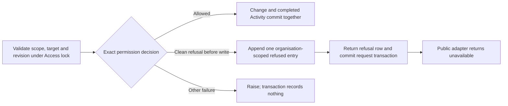

# Access Activity integration

Task: [#41](https://github.com/Abzum-NZ/Abzum-Vortex/issues/41).
Uses completed [Access #34](issue-34-access-decision.md),
[Activity foundation #252](issue-252-activity-foundation.md) and
[protected administration #40](issue-40-protected-access-administration.md).

## Read-through and architectural decision

This integration is still needed. The existing protected administration writers
already append completed Activity atomically; do not append a second success
entry or rebuild their store. The missing behavior is one content-free record of
a clean permission refusal before any business write. The refusal entry and the
unchanged operation result commit in the request's existing transaction.
The foundation's neutral proof is not actual owning-operation integration.

## What will be built

1. Inventory the available Phase 3 protected Access entry points and their existing
   completed/refused outcomes. Record which already have atomic completed evidence,
   which need a refusal boundary and which depend on an unfinished owning operation.
   Keep this inventory in the evidence, not a new runtime registry or service.
2. Add a closed, owner-specific refusal classification at the fixed operation
   boundary. An arbitrary database exception or SQL permission error is not proof
   of a business refusal. Unexpected failures remain failures, without exception
   text or user-supplied values in Activity.
3. Use the existing request wrapper and transaction. Generate one Activity identity
   on the server, establish and lock the local organisation/account scope, validate
   the exact target and revision, then decide permission before the first write.
   A clean refusal uses the existing owner-only append and returns from that same
   transaction. No second transaction, privileged wrapper or error classification
   is introduced.
4. Fix action, source and refused outcome in the owning adapter. Callers cannot
   choose Activity content or use the append path as authority. Refusal subjects
   contain only verified safe local scope: submitted missing/foreign targets,
   requested permission identifiers, labels and field values are not evidence.
   Invalid sessions or failures before any safe local scope is established create
   no organisation Activity entry; they cannot nominate an organisation to log in.
5. Reuse the existing organisation/Activity identity. A duplicate or conflicting
   append raises and rolls back; it never turns refusal into success or claims
   recording. Do not add a second
   counter, audit store, retry queue or generic callback-based mutation framework.
6. Apply the same request-level boundary to actual supported Access operations,
   without per-row emission. Keep later Record/Query, public, workflow, federation
   and MCP integration with their owning tasks. Reads must not generate one
   Activity entry per returned record. Aggregate-read metrics are not implemented
   by this task and must not be claimed from a refusal test.

## Acceptance criteria

- [ ] The evidence inventory maps each available Phase 3 protected operation to
      its actual Activity owner and identifies remaining integration dependencies.
- [ ] A real permitted administration change still commits exactly one completed
      entry atomically; a rolled-back change leaves no completed entry.
- [ ] A real clean permission refusal leaves business and Access state unchanged
      and commits exactly one content-free refused entry in the request transaction,
      with its established actor, correlation and decision time.
- [ ] Exact retry of that evidence is duplicate-safe; conflicting evidence cannot
      replace the existing entry. Reuse the already-proved foundation behavior.
- [ ] Foreign/missing targets and malformed input cannot place private values or
      unverified target identities in Activity; pre-scope failures cannot select
      an organisation or fabricate an actor.
- [ ] Direct client/raw-table access stays closed. The fixed owning append path
      cannot manufacture a successful operation or arbitrary Activity content.
- [ ] Failure to append remains unsuccessful and is not reported as a recorded
      refusal. Known denial and unexpected infrastructure failure stay distinct.
- [ ] Independent review and actual restricted-role transaction tests cover the
      integration, followed by normal source and exact hosted Testing evidence.
- [ ] Later query owners retain the concrete one-refused-request/not-per-row
      acceptance, including the 500-row scenario; no unbuilt query engine, metrics
      collector or Activity screen is claimed complete here.

## Access writers in this slice

The protected Group create, rename and retire operations, Group membership removal,
role-metadata preparation and revision, role retirement, role-activation revocation,
delegation revocation and role-assignment revocation use this boundary. Preparation
and revision share one Activity identity, and revision is not called after preparation
refuses. These are standalone request entry points; composed SQL writers continue to
raise and do not return a refusal row.

Only an exact, bound decision refusal with a supported permission reason records.
Invalid input, pre-scope failure, stale Access, missing/foreign/stale targets, binding
mismatch, unavailable target policy, permanent-steward protection and append conflict
retain their existing error and record nothing. The submitted target is never an
Activity subject; the subject is the established organisation.

## Later owners

[Record operations #47](https://github.com/Abzum-NZ/Abzum-Vortex/issues/47),
[record actions #50](https://github.com/Abzum-NZ/Abzum-Vortex/issues/50) and
[module queries #54](https://github.com/Abzum-NZ/Abzum-Vortex/issues/54) integrate
request-level refusal at their actual owning boundary. A query refused across
500 candidate rows creates one safe entry, never 500 row entries or a list of
refused identifiers. [Activity views #115](https://github.com/Abzum-NZ/Abzum-Vortex/issues/115)
owns permitted history browsing, aggregate read evidence and remaining service-category integration.
No reverse dependency on those later screens or executors is created.

References: [Activity specification](../specification/14-activity-privacy-and-retention.md#activity-history),
[PostgreSQL transactions](https://www.postgresql.org/docs/current/tutorial-transactions.html)
and [existing Activity foundation](issue-252-activity-foundation.md).
