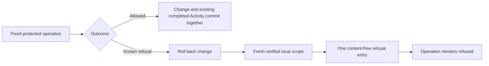

# Access Activity integration

Task: [#41](https://github.com/Abzum-NZ/Abzum-Vortex/issues/41).
Uses completed [Access #34](issue-34-access-decision.md),
[Activity foundation #252](issue-252-activity-foundation.md) and
[protected administration #40](issue-40-protected-access-administration.md).

## Read-through and architectural decision

This integration is still needed. The existing protected administration writers
already append completed Activity atomically; do not append a second success
entry or rebuild their store. The missing behavior is one content-free record of
a known refused request after its unsuccessful transaction has rolled back.
The foundation's neutral proof is not actual owning-operation integration.

## What will be built

1. Inventory the available Phase 3 protected Access entry points and their existing
   completed/refused outcomes. Record which already have atomic completed evidence,
   which need a refusal boundary and which depend on an unfinished owning operation.
   Keep this inventory in the evidence, not a new runtime registry or service.
2. Add a closed, owner-specific refusal classification at the fixed operation
   boundary. An arbitrary database exception or SQL permission error is not proof
   of a business refusal. Unexpected failures remain failures, without exception
   text or user-supplied values in Activity.
3. Use the existing request wrapper and transaction model. Generate the Activity
   and correlation identifiers on the server and retain only successfully verified
   local organisation/account scope. After the denied mutation has fully rolled
   back, append one refusal through a fixed private owning path in a fresh,
   revalidated transaction. Never append inside a transaction that will roll back.
4. Fix action, source and refused outcome in the owning adapter. Callers cannot
   choose Activity content or use the append path as authority. Refusal subjects
   contain only verified safe local scope: submitted missing/foreign targets,
   requested permission identifiers, labels and field values are not evidence.
   Invalid sessions or failures before any safe local scope is established create
   no organisation Activity entry; they cannot nominate an organisation to log in.
5. Reuse the existing organisation/Activity identity for exact retry deduplication.
   An audit append failure never turns refusal into success or claims successful
   recording; return the existing safe unavailable outcome. Do not add a second
   counter, audit store, retry queue or generic callback-based mutation framework.
6. Apply the same request-level boundary to actual supported Access operations,
   without per-row emission. Keep later Record/Query, public, workflow, federation
   and MCP integration with their owning tasks. Reads must not generate one
   Activity entry per returned record. Aggregate-read metrics are not implemented
   by this task and must not be claimed from a refusal test.

## Acceptance criteria

- [ ] The evidence inventory maps each available Phase 3 protected operation to
      its actual Activity owner and identifies remaining integration dependencies.
- [ ] A real permitted administration change still commits exactly one completed
      entry atomically; a rolled-back change leaves no completed entry.
- [ ] A real known refused administration request leaves business and Access
      state unchanged and commits exactly one content-free refused entry after
      rollback, with its original server-generated correlation.
- [ ] Exact retry of that evidence is duplicate-safe; conflicting evidence cannot
      replace the existing entry. Reuse the already-proved foundation behavior.
- [ ] Foreign/missing targets and malformed input cannot place private values or
      unverified target identities in Activity; pre-scope failures cannot select
      an organisation or fabricate an actor.
- [ ] Direct client/raw-table access stays closed. The fixed owning append path
      cannot manufacture a successful operation or arbitrary Activity content.
- [ ] Failure to append remains unsuccessful and is not reported as a recorded
      refusal. Known denial and unexpected infrastructure failure stay distinct.
- [ ] Independent review and actual restricted-role transaction tests cover the
      integration, followed by normal source and exact hosted Testing evidence.
- [ ] Later query owners retain the concrete one-refused-request/not-per-row
      acceptance, including the 500-row scenario; no unbuilt query engine, metrics
      collector or Activity screen is claimed complete here.

## First owning operation and tool restriction — 8 September 2026

Architect and independent Sol review selected Group rename as the first bounded
integration. Its existing completed event remains unchanged. A classified
permission refusal after a verified local request would append only the fixed
`revise_group_label` / `web` / `refused` evidence, with empty subject/field lists,
after rollback and fresh human-context validation. A missing/foreign organisation
before scope validation cannot create Activity. A submitted foreign Group is
never recorded; a permission denial before target lookup may still create one
local, content-free request refusal. Missing-target, stale-revision and unexpected
database errors are not relabelled as permission refusals.

Reuse the existing runtime transaction runner and private context-building logic;
do not add a general privileged-runner API. The private append wrapper would be
callable only by the trusted runtime role, not request/browser roles, and could
not append successes, arbitrary actions, subjects or values.

The tool security reviewer rejected creation of that persistent privileged
function and its runtime-only execution grant pending explicit user authorization.
No function, grant or runtime change was applied. The CLI-created empty migration
was removed so it cannot enter delivery. This is a tool-permission restriction,
not a business decision, a new native task dependency or a reason to stop other
engines. Do not retry the denied capability through another actor or mechanism.

## Later owners

[Record operations #47](https://github.com/Abzum-NZ/Abzum-Vortex/issues/47),
[record actions #50](https://github.com/Abzum-NZ/Abzum-Vortex/issues/50) and
[module queries #54](https://github.com/Abzum-NZ/Abzum-Vortex/issues/54) integrate
request-level refusal at their actual owning boundary. A query refused across
500 candidate rows creates one safe entry, never 500 row entries or a list of
refused identifiers. [Activity views #115](https://github.com/Abzum-NZ/Abzum-Vortex/issues/115)
owns permitted history browsing, aggregate read evidence and remaining service-category integration.
No reverse dependency on those later screens or executors is created.

References: [Activity specification](../specification/14-activity-privacy-and-retention.md#activity-history),
[PostgreSQL transactions](https://www.postgresql.org/docs/current/tutorial-transactions.html)
and [existing Activity foundation](issue-252-activity-foundation.md).
