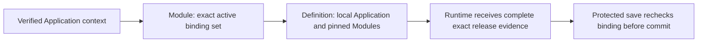

# Read the exact installed Application

[Module lifecycle #43](https://github.com/Abzum-NZ/Abzum-Vortex/issues/43) ·
[Installation plan](module-record-provisioning.md) ·
[Event preparation](module-record-provisioning.md#event-append-authority)

## Outcome

The runtime can identify the exact active Application and all its required Module
releases, including a shared Module owned by another organisation. Application
ownership stays local. This read grants no record access and activates nothing.
It supplies the real evidence needed by Application rendering and protected
Record/Event operations, rather than accepting a caller's installation claims.

## Independently reviewed implementation

1. Module's fixed `read_current_active_installation()` accepts no organisation or
   Application identifiers. It derives them from the validated human Application
   request context and returns one exact active Application release plus its
   canonically ordered active Module bindings. The required dependency set must
   be complete and consistent. Ignore unrelated retained detached history; refuse
   missing, mixed, partial or mismatching required active bindings.
   Follow the complete recursively reachable Module dependency set, not only
   direct Application dependencies. An Application using Module A, which itself
   uses shared Module B, must work without declaring B again on the Application.
2. Definition's separate `read_application_bound_release_set(revision)` derives
   the same local Application root and organisation from that context. It reads
   the exact immutable Application release and every Module pinned by its stored
   dependency manifest. Match root, revision, key, version and content/resolution
   evidence. No caller-supplied foreign root or organisation is accepted, and a
   missing or mismatched dependency refuses the entire result.
3. Use both through the same existing request transaction. Do not nest `runSystem`
   inside a human transaction or treat an external pre-read as authority. Keep
   the existing generic same-organisation, system-only Definition consumer read
   unchanged. Immutable releases need no row locks.
4. Reuse the existing binding-evidence and consumer-release shapes. Move the
   projector's binding shape into shared storage contracts; do not introduce a
   copied catalogue or second integrity validator. The Event projector removes
   only its unnecessary Module/Application organisation equality check, keeping
   complete dependency closure, field ownership and exact release checks.
5. Install the two fixed reads in private schemas with validated context, fixed
   search paths and explicit minimal execution grants. Ordinary runtime discovery
   does not require installation-management permission. No write, counter or
   readiness flag is introduced.

This produces a coherent installation snapshot for discovery. A later protected
save must still recheck the real active state and binding revision before commit;
the earlier read is not a successful-authorisation receipt.

## Verification and remaining work

Prove an exact shared external Module works while arbitrary external reads,
wrong context, dependency substitution and partial/mixed active sets fail. Prove
the Application-to-Module-to-shared-Module case agrees across binding discovery,
Definition readback and Event projection; extra unrelated active bindings fail.
Prove unrelated detached history does not break a valid current installation. Exercise
the real restricted request role and preserve the existing generic reader's
scope. Test contract parsing, canonical ordering and projector integrity without
adding another test framework.

Activation remains application-wide and must co-deliver actual permission/event
readiness and protected Record operations with
[#45](https://github.com/Abzum-NZ/Abzum-Vortex/issues/45),
[#47](https://github.com/Abzum-NZ/Abzum-Vortex/issues/47) and
[#64](https://github.com/Abzum-NZ/Abzum-Vortex/issues/64). Upgrade, detach, governed
non-human execution and full runtime integration retain their owning acceptance.
Fixture-created active states prove this reader, not a delivered activation path.
