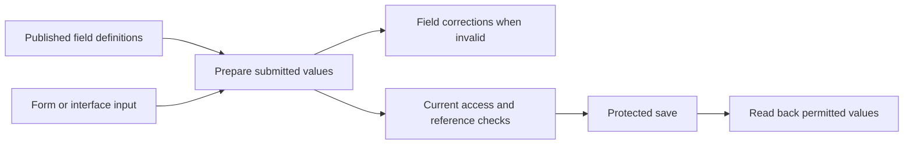

# Record field values — implementation plan

[Task #44](https://github.com/Abzum-NZ/Abzum-Vortex/issues/44) · [Field specification](../specification/05-modules-fields-and-relationships.md) · [Engine-first delivery](engine-first-application-delivery.md)

## Outcome

An application can use the published field definitions to check user-entered
record values, explain which field needs correction and preserve valid values.
The runtime is generic: example application names and rules remain in fixtures.

The catalogue and Definition publication pipeline already exist. Reuse them and
preserve V1 rather than recreating the engine. Add the explicit Module V2
source/canonical contracts required by the value-format decision below, then
implement their runtime use in `@vortex/record` and actual protected saves/reads.

## First implementation: value preparation

- Consume the existing canonical record-type and field definitions. Validate all
  twenty-two field types and their declared settings; use one implementation for
  form and non-browser callers.
- Distinguish a create payload from an update patch. Apply valid declared defaults
  only when creating an omitted value; never reset omitted fields on update.
  Explicit clearing must respect required fields. Preserve valid values without
  guessing a currency, time zone, relationship target or implicit type coercion.
- Check unknown fields, required values, declared choice options, text/numeric/date
  settings, reference shapes and repeating-table column/row constraints. Do not
  accept nested tables, links or attachments inside table columns.
- Refuse user-supplied reference numbers, calculations and totals. Their values
  come from their owning generation/calculation operations, not a browser claim.
- Report stable, field-located reasons without echoing submitted personal values.
- Keep structural validation distinct from current access and database facts.
  A correctly shaped reference does not prove its record exists or is readable;
  a declared gated choice does not prove the caller holds its permission.

Before coding, compare the actual canonical contracts and complete application
fixtures for the representation of money, dates, references, formatted content,
table cells and defaults. Resolve contradictions at their owning specification or
contract instead of inventing an incompatible value format in this runtime.

## Files and proportionate verification

Use `runtime/record/src/field-values.ts`, its public export and focused tests in
`runtime/record/test/`. Reuse existing compiled fixtures and test tooling. Add
source-contract or specification corrections only when a concrete inconsistency
requires them; do not introduce a second schema system or an application handler.

Verify representative valid and invalid values for every type, create/update
omission versus clearing, derived-field input refusal and nested table locations.
Exercise actual compiled module definitions used by the application fixtures as
well as focused field cases.
Run the Record package typecheck and existing package-boundary checks, then obtain
an independent review of the actual implementation against this plan.

## What remains before closing the whole task

- [Record storage #45](https://github.com/Abzum-NZ/Abzum-Vortex/issues/45) and
  [save lifecycle #47](https://github.com/Abzum-NZ/Abzum-Vortex/issues/47) must save
  and read back the supported values through real protected adapters. This cannot
  be replaced by an in-memory validator roundtrip.
- [Row enforcement #35](https://github.com/Abzum-NZ/Abzum-Vortex/issues/35) and
  [field access #37](https://github.com/Abzum-NZ/Abzum-Vortex/issues/37) remain
  prerequisites of that integrated save/read path. Permission-gated options must
  be hidden from an unauthorised caller and refused on a direct server save.
- Missing personal-data declarations must still fail publication with a field
  location. Existing publication evidence should be reused rather than creating
  a new publication gate.
- Attachments remain file references here; real upload/download and file access
  belong to the File engine. Derived values remain owned by their relevant engines.

The pure value-preparation slice does not require the whole Phase 3 epic to close.
Full integration remains dependency-blocked where the actual owning engines are
not ready. Do not close #44 merely because the first slice passes.

## Root-cause gaps confirmed before runtime implementation

The repository review found that a few declarations cannot yet express their
promised behavior. Resolve these in the existing owning contracts, not through
guesses or special cases in Record:

- **Table columns:** the existing column shape names a type but has no settings.
  Actual fixture choice columns therefore have no allowed options, and money
  columns have no currency. Add corresponding type-specific settings using the
  existing field settings and complete the editable module fixtures. Reject
  duplicate column keys and validate the cells of table defaults.
- **Permission-gated options:** the existing option shape has no permission
  reference. Add an optional authored permission reference resolved to its exact
  canonical identity through the ordinary compiler/dependency path. A configured
  gate is not evidence that an invoking person satisfies it; that remains the
  later Access-integrated save and option-read operation.
- **Value representations:** formatted content lacks a declared block/value
  representation; decimal precision settings exceed what a JSON number can
  preserve; money values do not yet retain an explicit resolved currency; and
  single/multiple attachment values lack a uniform wire shape. These need an
  explicit owning value contract and consumer-impact check before their complete
  runtime behavior can be claimed.
- **Reference and format details:** polymorphic links must identify or resolve
  their permitted target unambiguously; at least two declared target types are
  required by the specification. Text formats and numeric step origins need
  defined behavior, not guessed runtime normalization.

Start with the concrete table/option declaration corrections through authored
source, canonical output, compiler validation, version impact and fixtures. Keep
existing published-release meaning explicit; never silently insert settings or
authority into an already published release. This is a prerequisite correction
inside #44, not completion of the Record engine or a new approval gate.

## Value-format architecture decision

The next coordinated representation change uses an explicit Module source and
validation-contract version, following the already implemented Application
contract-version selection. It must not change the meaning of stored V1 releases.
This is required by concrete value differences, not a general compatibility
framework. Complete it through Definition compilation/publication/read/restore
and the affected Rule/value consumers before claiming the new Record path works.

| Value             | Required representation and behavior                                                                                                                                                                                                         |
| ----------------- | -------------------------------------------------------------------------------------------------------------------------------------------------------------------------------------------------------------------------------------------- |
| Decimal           | Exact base-10 text, with matching exact bounds and defaults. Normalize zeroes deliberately at the value boundary; do not convert through a JavaScript number.                                                                                |
| Money             | Exact amount plus an explicit currency code. Resolve an organisation default during creation and retain the resulting currency with the value, so changing the default never changes old amounts.                                            |
| Formatted content | Reuse the existing safe rich-text document primitives from Page composition. Add the required Record table/file blocks without widening the existing Page V2 property whitelist.                                                             |
| Attachment        | An ordered array of file identifiers for both single and multiple fields; the single-file form permits at most one. File ownership, state and detected-content checks remain with File.                                                      |
| Record link       | Explicit record-type and record identifiers; validate the type against the field's compiled target or target list. Existence and access still require the protected service. Person links keep their distinct organisation-account identity. |
| Whole-number step | Use the declared minimum as the origin, otherwise zero. A default or currently edited value cannot change which values satisfy the step.                                                                                                     |
| Text format       | Begin with the existing email-address and HTTPS-address checks plus UUID syntax, under explicit closed format keys. No setting means ordinary text. Do not interpret arbitrary old keys as regular expressions or build a plug-in framework. |

Exact decimal transport is a Vortex design choice addressing the interoperability
limits described in [JSON's number specification](https://www.rfc-editor.org/rfc/rfc8259#section-6).
The later storage adapter uses [PostgreSQL exact numeric storage](https://www.postgresql.org/docs/current/datatype-numeric.html#DATATYPE-NUMERIC-DECIMAL),
not floating-point money. The renderer must align its numeric controls with the
declared origin rather than accidentally using the HTML value attribute as a
different [step base](https://html.spec.whatwg.org/multipage/input.html#attr-input-step).

Preserve the existing V1 readers and explicit draft restoration. Conversion is
deliberate: an old finite number can preserve only the value already represented,
a formatted string becomes plain paragraph content, and a polymorphic identifier
needs a supplied target rather than a guessed one. No published bytes or currency
meanings are rewritten. Update the editable complete fixtures and prove their
new publication path. Do not build a second obsolete Record execution engine
solely for historical releases that never had an installed record runtime; define
the supported installation version explicitly in the coordinated implementation.

### Coordinated implementation sequence

1. Finish and review the additive table-column and choice-gate corrections above.
   Then extract the existing safe rich-text primitives into a neutral contract
   file. Keep Page V2's accepted blocks unchanged; importing Application composition
   directly into Module would create an existing Application-to-Module cycle.
2. Add explicit Module V2 source, canonical and value schemas and exact version-pair
   selection in the existing Definition contracts. Preserve the current Module V1
   schemas. Existing JSON storage and version columns do not require a new database
   schema merely to store this representation.
3. Extend the existing compiler by definition kind and supported version pair.
   Its current version-field presence check routes to Application V2 and is not
   sufficient for Module V2. Complete source identities/provenance, semantic
   validation, publication, integrity and consumer readback together. Remove the
   current non-Application assumption of validation version `1.0.0` only through
   explicit supported-pair selection, not a permissive version fallback.
4. Complete Module comparison, exact history/read/restore and explicit draft
   conversion. A representation transition is major; same-version changes retain
   their existing classifications. Preserve immutable V1 evidence without building
   a V1 Record executor. Missing polymorphic targets require explicit conversion
   input, and any unresolved currency must be supplied rather than guessed.
5. Implement the supported V2 Record value preparation and the matching Rule
   condition/publication-test semantics. Both use one exact decimal codec, including
   calculation literals. Money comparisons must respect currency. Keep the existing
   V1 Rule evaluator for historical Definition evidence.
6. Convert editable fixtures and prove the real compile/publication/consumer/
   restore/version-impact path before claiming the new runtime. Application
   definitions change only for affected exact module dependencies. Later storage,
   calculations, totals and Query reuse these representations; File still owns
   actual file eligibility and Access owns current caller authority.

These are cohesive implementation slices inside the existing owning tasks, not
new services, registries or release-approval mechanisms. A schema-only slice may
be tested independently but does not advertise Module V2 as publishable/installable
until its corresponding full pipeline is operational.

