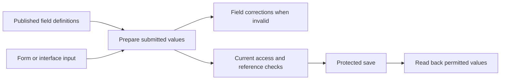

# Record field values — implementation plan

[Task #44](https://github.com/Abzum-NZ/Abzum-Vortex/issues/44) · [Field specification](../specification/05-modules-fields-and-relationships.md) · [Engine-first delivery](engine-first-application-delivery.md)

## Outcome

An application can use the published field definitions to check user-entered
record values, explain which field needs correction and preserve valid values.
The runtime is generic: example application names and rules remain in fixtures.

The catalogue and Definition publication pipeline already exist. Reuse them and
preserve V1 rather than recreating the engine. Add the explicit Module V2
source/canonical contracts required by the value-format decision below, then
implement their runtime use in `@vortex/record` and actual protected saves/reads.

## First implementation: value preparation

- Consume the existing canonical record-type and field definitions. Validate all
  twenty-two field types and their declared settings; use one implementation for
  form and non-browser callers.
- Distinguish a create payload from an update patch. Apply valid declared defaults
  only when creating an omitted value; never reset omitted fields on update.
  Explicit clearing must respect required fields. Preserve valid values without
  guessing a currency, time zone, relationship target or implicit type coercion.
- Check unknown fields, required values, declared choice options, text/numeric/date
  settings, reference shapes and repeating-table column/row constraints. Do not
  accept nested tables, links or attachments inside table columns.
- Refuse user-supplied reference numbers, calculations and totals. Their values
  come from their owning generation/calculation operations, not a browser claim.
- Report stable, field-located reasons without echoing submitted personal values.
- Keep structural validation distinct from current access and database facts.
  A correctly shaped reference does not prove its record exists or is readable;
  a declared gated choice does not prove the caller holds its permission.

Before coding, compare the actual canonical contracts and complete application
fixtures for the representation of money, dates, references, formatted content,
table cells and defaults. Resolve contradictions at their owning specification or
contract instead of inventing an incompatible value format in this runtime.

### Concrete preparation boundary

Use one `prepareRecordFieldValuesV2` operation with canonical field-identifier maps,
the trusted V2 record-type definition, create/update mode and existing values for
an update. Never accept mutable field keys as record-value identities. Return only
the prepared set patch and cleared field identifiers, not a rewritten full row.
Check required presence against the existing values plus the patch; omitted update
fields are not cleared or reset. Required generated fields are completed by their
owning operation, not demanded from the caller before generation.

An explicit request-level `null` clears an optional field. On create it leaves the
field absent; on update it becomes a clear instruction. It is not a persisted V2
field value. Required writable fields cannot be cleared. Supplied generated-field
values, including a clear instruction, are refused. Existing field settings retain
their meaning; do not add a blanket rule treating every empty string, table or
formatted document as a request to clear it. Required attachments cannot be emptied.
An explicitly submitted table replaces that field value; it is not an implicit
per-row patch protocol.

Reuse the owning leaf and field-setting schemas and exact decimal codec rather
than maintain a second validation catalogue. Structural preparation returns the
specific permission and record/person/file references needing protected checks;
it does not claim those checks passed. Current field access, reference existence,
uniqueness and file eligibility remain in the owning protected operation.

Resolve the trusted organisation currency only when an omitted create default
needs it, including an amount-only money cell in a table default. Explicit money
input always contains amount and currency. For `organisation_default` retain that
currency without comparing it with today's organisation setting; for `fixed`,
require the declared currency. This follows the
[money-value specification](../specification/05-modules-fields-and-relationships.md#record-value-formats)
and needs no conversion approval or table-row history mechanism.

## Files and proportionate verification

Use `runtime/record/src/field-values.ts`, its public export and focused tests in
`runtime/record/test/`. Reuse existing compiled fixtures and test tooling. Add
source-contract or specification corrections only when a concrete inconsistency
requires them; do not introduce a second schema system or an application handler.

Verify representative valid and invalid values for every type, create/update
omission versus clearing, derived-field input refusal and nested table locations.
Exercise actual compiled module definitions used by the application fixtures as
well as focused field cases.
Run the Record package typecheck and existing package-boundary checks, then obtain
an independent review of the actual implementation against this plan.

## What remains before closing the whole task

- [Save lifecycle #47](https://github.com/Abzum-NZ/Abzum-Vortex/issues/47) owns the
  round-trip of every writable type except attachment through real protected
  adapters, and the direct refusal of a gated choice at save; both need the
  protected save. This cannot be replaced by an in-memory validator roundtrip.
- [Row enforcement #35](https://github.com/Abzum-NZ/Abzum-Vortex/issues/35) and
  [field access #37](https://github.com/Abzum-NZ/Abzum-Vortex/issues/37) are closed.
  Hiding a permission-gated option from a caller without the permission is owned by
  [#68](https://github.com/Abzum-NZ/Abzum-Vortex/issues/68).
- [Database exact-value parity #399](https://github.com/Abzum-NZ/Abzum-Vortex/issues/399)
  owns V2 decimal and money exact-value parity in saved conditions.
- A missing personal-data declaration is located by the versioned definition
  validation contract (`validateDefinitionSource`), which the draft store and
  the module designer use; the store and publication themselves fail closed
  with a coarse code and no location, by design.
- Attachments remain file references here; real upload/download and file access
  belong to the File engine. Derived values remain owned by their relevant engines.

The pure value-preparation slice does not require the whole Phase 3 epic to close.
Full save and presentation integration remains with #47 and #68. #399's database
parity implementation is merged to Testing; its exact hosted verification and
issue closure remain pending.

## Root-cause gaps confirmed before runtime implementation

The repository review found that a few declarations cannot yet express their
promised behavior. Resolve these in the existing owning contracts, not through
guesses or special cases in Record:

- **Table columns:** the existing column shape names a type but has no settings.
  Actual fixture choice columns therefore have no allowed options, and money
  columns have no currency. Add corresponding type-specific settings using the
  existing field settings and complete the editable module fixtures. Reject
  duplicate column keys and validate the cells of table defaults.
- **Permission-gated options:** the existing option shape has no permission
  reference. Add an optional authored permission reference resolved to its exact
  canonical identity through the ordinary compiler/dependency path. A configured
  gate is not evidence that an invoking person satisfies it; that remains the
  later Access-integrated save and option-read operation.
- **Value representations:** formatted content lacks a declared block/value
  representation; decimal precision settings exceed what a JSON number can
  preserve; money values do not yet retain an explicit resolved currency; and
  single/multiple attachment values lack a uniform wire shape. These need an
  explicit owning value contract and consumer-impact check before their complete
  runtime behavior can be claimed.
- **Reference and format details:** polymorphic links must identify or resolve
  their permitted target unambiguously; at least two declared target types are
  required by the specification. Text formats and numeric step origins need
  defined behavior, not guessed runtime normalization.

Start with the concrete table/option declaration corrections through authored
source, canonical output, compiler validation, version impact and fixtures. Keep
existing published-release meaning explicit; never silently insert settings or
authority into an already published release. This is a prerequisite correction
inside #44, not completion of the Record engine or a new approval gate.

## Value-format architecture decision

The next coordinated representation change uses an explicit Module source and
validation-contract version, following the already implemented Application
contract-version selection. It must not change the meaning of stored V1 releases.
This is required by concrete value differences, not a general compatibility
framework. Complete it through Definition compilation/publication/read/restore
and the affected Rule/value consumers before claiming the new Record path works.

| Value             | Required representation and behavior                                                                                                                                                                                                         |
| ----------------- | -------------------------------------------------------------------------------------------------------------------------------------------------------------------------------------------------------------------------------------------- |
| Decimal           | Exact base-10 text, with matching exact bounds and defaults. Normalize zeroes deliberately at the value boundary; do not convert through a JavaScript number.                                                                                |
| Money             | Exact amount plus an explicit currency code. Resolve an organisation default during creation and retain the resulting currency with the value, so changing the default never changes old amounts.                                            |
| Formatted content | Reuse the existing safe rich-text document primitives from Page composition. Add the required Record table/file blocks without widening the existing Page V2 property whitelist.                                                             |
| Attachment        | An ordered array of file identifiers for both single and multiple fields; the single-file form permits at most one. File ownership, state and detected-content checks remain with File.                                                      |
| Record link       | Explicit record-type and record identifiers; validate the type against the field's compiled target or target list. Existence and access still require the protected service. Person links keep their distinct organisation-account identity. |
| Whole-number step | Use the declared minimum as the origin, otherwise zero. A default or currently edited value cannot change which values satisfy the step.                                                                                                     |
| Text format       | Begin with the existing email-address and HTTPS-address checks plus UUID syntax, under explicit closed format keys. No setting means ordinary text. Do not interpret arbitrary old keys as regular expressions or build a plug-in framework. |

Exact decimal transport is a Vortex design choice addressing the interoperability
limits described in [JSON's number specification](https://www.rfc-editor.org/rfc/rfc8259#section-6).
The later storage adapter uses [PostgreSQL exact numeric storage](https://www.postgresql.org/docs/current/datatype-numeric.html#DATATYPE-NUMERIC-DECIMAL),
not floating-point money. The renderer must align its numeric controls with the
declared origin rather than accidentally using the HTML value attribute as a
different [step base](https://html.spec.whatwg.org/multipage/input.html#attr-input-step).

Money definition defaults are exact amount strings, including table-default money
cells. They inherit the field or column's declared currency policy. Fixed-currency
and organisation-default fields both support defaults; publication never resolves
an installation-specific currency. Record creation resolves it once and produces
the explicit amount-and-currency value used by submitted and persisted records.

Preserve the existing V1 readers and explicit draft restoration. Conversion is
deliberate: an old finite number can preserve only the value already represented,
a formatted string becomes plain paragraph content, and a polymorphic identifier
needs a supplied target rather than a guessed one. No published bytes or currency
meanings are rewritten. Update the editable complete fixtures and prove their
new publication path. Do not build a second obsolete Record execution engine
solely for historical releases that never had an installed record runtime; define
the supported installation version explicitly in the coordinated implementation.

### Coordinated implementation sequence

1. Finish and review the additive table-column and choice-gate corrections above.
   Then extract the existing safe rich-text primitives into a neutral contract
   file. Keep Page V2's accepted blocks unchanged; importing Application composition
   directly into Module would create an existing Application-to-Module cycle.
2. Add explicit Module V2 source, canonical and value schemas and exact version-pair
   selection in the existing Definition contracts. Preserve the current Module V1
   schemas. Existing JSON storage and version columns do not require a new database
   schema merely to store this representation.
3. Extend the existing compiler by definition kind and supported version pair.
   Its current version-field presence check routes to Application V2 and is not
   sufficient for Module V2. Complete source identities/provenance, semantic
   validation, publication, integrity and consumer readback together. Remove the
   current non-Application assumption of validation version `1.0.0` only through
   explicit supported-pair selection, not a permissive version fallback.
4. Complete Module comparison, exact history/read/restore and explicit draft
   conversion. A representation transition is major; same-version changes retain
   their existing classifications. Preserve immutable V1 evidence without building
   a V1 Record executor. Missing polymorphic targets require explicit conversion
   input, and any unresolved currency must be supplied rather than guessed.
5. Implement the supported V2 Record value preparation and the matching Rule
   condition/publication-test semantics. Both use one exact decimal codec, including
   calculation literals. Money comparisons must respect currency. Keep the existing
   V1 Rule evaluator for historical Definition evidence.
6. Convert editable fixtures and prove the real compile/publication/consumer/
   restore/version-impact path before claiming the new runtime. Application
   definitions change only for affected exact module dependencies. Later storage,
   calculations, totals and Query reuse these representations; File still owns
   actual file eligibility and Access owns current caller authority.

These are cohesive implementation slices inside the existing owning tasks, not
new services, registries or release-approval mechanisms. A schema-only slice may
be tested independently but does not advertise Module V2 as publishable/installable
until its corresponding full pipeline is operational.

### Draft conversion without another approval workflow

Use a pure Module V1-to-V2 source converter, followed by the existing
revision-checked draft save. Return converted source or field-path diagnostics
for meaning that the old source did not retain. Decimal/money bounds and
amount-only defaults convert mechanically to exact text. A polymorphic record
identifier requires its allowed target; a currency-bearing record-value literal
using an organisation-default field requires its currency. Definition money
defaults do not require a currency selection because they retain the field policy.

Conversion reads no current organisation currency or mutable external catalogue.
It therefore needs no separate prepare/confirm command, approval token or new
fingerprint. Ordinary draft save already validates the supplied V2 source,
derives its fingerprint and refuses a stale expected revision without writing.
Publication retains the existing release validation and major-version assessment;
published bytes and historical V1 reads remain unchanged.

Convert all eight editable Module fixtures and their exact Module dependencies,
then update the two Application fixtures and resolution snapshot only where their
Module references change. Keep Application source versions, component/theme and
connection versions unchanged unless their actual definitions require a change.
The current fixture values need no new target or currency choice. Prove the
converted files through actual V2 compilation/publication/read/restore and the
existing complete-application scenarios; schema parsing alone is insufficient.

Before replacing editable fixture sources, preserve the V1 definition inputs still
used by historical compilation, publication, read/restore and conversion tests in
an explicitly historical test-fixture location. Those suites currently read the
same editable files. Point the historical cases at that fixed baseline and move
the current complete-fixture gate to the supported V2 Module path. Do not reverse-
convert V2 fixtures to invent V1 evidence, silently update historical expectations,
or leave the current application gate validating only its old baseline. This is
test evidence preservation, not a second Record engine or fixture framework.

The complete mixed-version bundle must use explicit checked-in resolution
envelopes for its supported Application V1 and Module V2 request contracts, each
with its own verified fingerprint and matching dependency/identity selections.
Fix any consumer that wrongly requires a dependency's own resolution fingerprint
to equal the parent's: preserve each artifact's own integrity and the exact
parent-to-dependency selection, rather than restamping evidence or converting
the Application just to pass. Prove the legitimate mixed pair succeeds and a
wrong root, version, content or internally inconsistent artifact remains refused.
This correction belongs to the actual compile/publication/readback proof, not a
fixture-only adapter or a relaxation of release integrity.

### Rule consumer handoff

Application-owned consumers must select value semantics from the exact bound
Module that owns each referenced record type. This includes rule conditions and
assignments, action preconditions and field maps, query filters, pipeline gates,
and record-bound workflow conditions/mappings where those contracts consume field
values. An Application format version does not override a Module field format.
Use the existing typed normalization and validation helpers, preserving ordinary
text and historical V1 meanings. An assignment between incompatible declared
formats must fail rather than silently convert or guess a value representation.

The current Application compiler and validator contain V1-only consumer paths.
Correct them together, using actual bound dependency artifacts, and prove the
supported mixed-version cases through compilation, validation and publication.
Cover exact decimal/money literals, target-record references, incompatible maps,
and existing historical V1 behavior. This is Definition compatibility work under
[#44](https://github.com/Abzum-NZ/Abzum-Vortex/issues/44), not a new rule executor.

Preserve the independent meaning of Application-owned action inputs, workflow
inputs/forms and connection shapes. Existing `number` descriptors do not become
exact decimal or money merely because a target field is V2. The versioned node
input/variable extension in [#58](https://github.com/Abzum-NZ/Abzum-Vortex/issues/58)
must provide explicit exact-value descriptors through the full Definition path.
The [interface catalogue #102](https://github.com/Abzum-NZ/Abzum-Vortex/issues/102)
separately owns exact wire types for public operations. Until these capabilities
exist, refuse incompatible mappings honestly rather than silently losing value
or currency. Do not widen legacy schemas by inferring a format from JSON shape.

Select V2 evaluation from the exact Module contract pair, never from a value that
looks like a decimal or money object. Reuse the current condition traversal and
error vocabulary, with explicit V2 value semantics. Decimal-looking text remains
text. Decimal equality, ordering and membership compare exact amounts; authored
values normalize before canonical evaluation. Money equality and membership also
require matching currency; ordering across currencies refuses rather than
returning false that a negation could turn into true.

V2 saved-condition parameters explicitly add `decimal_number` and `money`; the
historical `number` alternative keeps its existing meaning. Calculation and total
fields use their declared result type. Normalize authored calculation literals
through the shared exact codec. Do not add an arithmetic engine merely to validate
these definitions. Verify the real V2 compile/publication-test path and retain the
existing V1 historical evaluator tests unchanged.

The same versioned semantics must reach the database-backed saved-condition path
before Module V2 is activated for records. The earlier V1 implementation mapped
decimal and money fields to `number` and used double-precision comparisons.
[Row enforcement #35](https://github.com/Abzum-NZ/Abzum-Vortex/issues/35) must select
the supported Module pair from trusted definition evidence and use exact numeric
comparison for V2 decimal/money values, with matching currency and parameter
rules. Reuse the existing evaluator boundary and parity tests; do not infer a
version from a JSON value or reinterpret historical V1 evidence. This is an
integration prerequisite, not delivered by the schema-only slice. Database
parity is now delivered by [#399](https://github.com/Abzum-NZ/Abzum-Vortex/issues/399):
the fixed record adapter carries each source record type's pinned Module
`validationContractVersion`, the saved-condition evaluator selects V1 only for
`1.0.0` and exact semantics for `2.0.0`/`3.0.0`, and request-role adapter tests
cover matching and non-matching stored money values without weakening the V1
corpus or the existing evaluator boundary.

