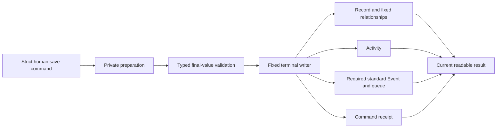

# Protected base Record save

[Save pipeline #47](https://github.com/Abzum-NZ/Abzum-Vortex/issues/47) ·
[Save sequence](../specification/06-records-and-lifecycle.md#save-sequence) ·
[Record save contract](../specification/appendices/data-contracts.md#record-save-command-and-result) ·
[Event boundary](module-record-provisioning.md#save-and-event-integration)

## Current delivery boundary

This slice provides the first protected ordinary-human create/update path over a
real, actively installed Record definition. The local implementation is awaiting
independent review and hosted Testing verification; this page does not claim that
it is merged or production-ready.

Forms, imports, Frontend Flows and future MCP adapters use the same strict V2
command. The command contains its stable command identifier, operation, Record
type, sparse submitted field values, and the existing Record identifier/revision
for update. Create may additionally select one active Group the person currently
belongs to when the Record type uses Group ownership. It never accepts an actor,
arbitrary owner account, organisation, Application, Module, table, permission,
generated value, validation claim or database operation name.

Omission and explicit clear remain different: an omitted update field keeps its
stored value, while `null` requests a clear that must be valid for the installed
field. Private stored values needed to preserve omitted fields remain inside one
server operation and are never returned unless the current Access projection
permits them.

## One owning transaction

The existing request transaction owns preparation, validation, mutation and
response. Preparation and the terminal writer are executable only by the trusted
server runtime; request and Data API roles cannot call them or read generated
Record tables, Activity, Event outbox or receipt storage.

Before any mutation, the operation rechecks the active installed definition,
organisation/Application/account scope, current Access, expected Record revision,
submitted-field bounds, Group eligibility and fixed relationship targets. Update
authority is evaluated against the complete proposed scalar values and supported
fixed relationship facts. A permitted relationship replacement proceeds; a final
relationship state that removes update authority refuses before any mutation.
Any later relationship, Activity, Event, queue or receipt failure aborts the same
transaction, so partial saves cannot commit.

A verified clean Access denial records exactly one content-free refusal Activity
inside the owning database operation. Its only subject is the verified
organisation; it contains no submitted Record identifier, field identifier or
value. Malformed, stale or unverified-scope requests remain silent. The server
recognises the recorded outcome and does not call a second refusal or terminal
path.

## Retry and projection

Command identity is scoped to the trusted organisation, Application and acting
organisation account, then fingerprinted from the exact normalized command
content. A completed exact retry resolves its receipt before stale-revision
preparation and creates no new Record, Activity, Event or queue effect. Reusing
the same command identity with different content refuses as a conflict.

Receipts store only the minimum result identity and revision. Replay always runs
the current Record reader again: it returns only fields currently readable and
returns no prior values after access is withdrawn. Receipt retention remains an
operational policy and is not invented here.

## Supported now and later owners

The base path supports installed writable value fields and fixed to-one
relationships already supported by the delivered Record primitives. Required
standard created/updated Events are always appended. Merely declaring an unused
named action or custom Event does not block an ordinary save; invoking named
actions and emitting their custom effects remain
[#50](https://github.com/Abzum-NZ/Abzum-Vortex/issues/50).

The base path safely refuses a save that actually requires an undeployed
immediate Rule or a calculated/total value. Their integrations remain:

- immediate before-save Rule execution and final candidate integration:
  [#58](https://github.com/Abzum-NZ/Abzum-Vortex/issues/58) with this save owner;
- calculations and relationship totals:
  [#48](https://github.com/Abzum-NZ/Abzum-Vortex/issues/48);
- named action execution and custom action/Event effects:
  [#50](https://github.com/Abzum-NZ/Abzum-Vortex/issues/50);
- broader relationship shapes:
  [#49](https://github.com/Abzum-NZ/Abzum-Vortex/issues/49);
- System or specified-account execution:
  [#322](https://github.com/Abzum-NZ/Abzum-Vortex/issues/322);
- Event dispatch, delivery retry and consumers:
  [#60](https://github.com/Abzum-NZ/Abzum-Vortex/issues/60).

No UI, AI, retention default, Kestra infrastructure, dispatcher, second save
engine, generic privileged callback or public mutation wrapper belongs here.

## Verification and exit

The local proof must use compiler-produced, published, provisioned and ACTIVE
neutral definitions through the real restricted runtime transaction. It covers:

- ordinary create/update, Group create eligibility, omission/clear and field
  validation without hidden-field disclosure;
- allowed and forbidden proposed fixed-relationship replacements;
- one content-free clean Access refusal;
- atomic Record, Activity, standard Event, queue and receipt commit/rollback;
- exact response-lost replay, changed-payload conflict and current projection
  after access withdrawal;
- a real two-session same-revision save race that serializes to one winner and
  one stale conflict without partial effects;
- ACL proof that request, runtime and Data API roles have no raw content,
  Activity, outbox, queue or receipt access.

Local checks and independent review are necessary but not sufficient. Keep #47
open until the exact reviewed revision passes hosted Testing verification.

## Later final-candidate integration

The existing field preparation remains the compatibility entry point. When the
immediate Rule and derived-value owners join the save, preserve one pipeline:

1. decode submitted values and merge unchanged stored values/create defaults;
2. run eligible immediate Rules in memory;
3. generate references, calculations and totals in declared dependency order;
4. validate the complete final candidate and its live references/files;
5. pass only the trusted final mutation to the same protected writer.

Do not add caller-selected validation phases, success flags, another receipt
store or a preliminary save engine. Generated changes must match their exact
installed declarations; submitted changes remain bounded by current changeable
fields.
