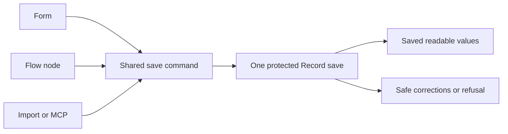

# One record-save command for every caller

[Save pipeline #47](https://github.com/Abzum-NZ/Abzum-Vortex/issues/47) ·
[Save sequence](../specification/06-records-and-lifecycle.md#save-sequence) ·
[Protected save integration](module-record-provisioning.md#save-and-event-integration)

## Purpose and boundary

Forms, configured flow nodes, imports and MCP submit the same create/update
request and receive the same readable result or corrections. Define this shared
contract now, using the existing Record contracts. It is a prerequisite to the
real protected save, not a second preliminary save engine or proof of a database
write. Existing field preparation, rules, calculations and totals remain their
owning engines and run in the actual save sequence.

## Request

The strict V2 command contains contract version `2.0.0`, a command identifier,
record-type identifier, operation and a sparse map of submitted field values.
Create has no existing record identifier or expected concurrency number. Update
requires both the record identifier and a positive JavaScript-safe expected
concurrency number. Reuse the existing branded identifiers and JSON value shape.

An omitted field is untouched on update; explicit null means a requested clear.
An empty map remains valid because defaults or configured rules may produce
changes. Exact decimal text remains text. To-one relationship fields use their
existing value contracts; this command does not invent a caller-authored edge
graph. Separate relationship operations retain their owning contracts.

Organisation, Application, Module, storage mappings, actor, permissions, installed
definition evidence, generated values and successful-validation claims are not
command properties. The server derives them from the verified request and exact
installed definition. A JSON field map alone cannot tell whether a field is
generated or writable; the protected operation must check that definition and
current Access before accepting its values.

## Response

Every variant carries the explicit V2 contract version:

| Outcome             | Content and meaning                                                                                                                                                                                                                     |
| ------------------- | --------------------------------------------------------------------------------------------------------------------------------------------------------------------------------------------------------------------------------------- |
| Saved               | Record identifier, new safe concurrency number, current readable field values, correlation identifier, and background delivery `none` or `pending` according to actual queued work. Never the complete private stored row.              |
| Correction required | Correlation identifier and a nonempty list of safe field corrections: `invalid_value`, `required_value` or `field_refused`, with a field identifier and optional nested value location. Return all safely reportable problems together. |
| Refused             | The existing safe operation-error response. An optional current readable record projection is permitted only for a conflict, and only when current access permits disclosure.                                                           |

Nested correction locations contain only declared value keys and row indices,
not an internal definition path, permission name, submitted content or foreign
record details. The protected service maps detailed engine failures to these
three public correction meanings; operation/configuration failures use the
existing safe operation error. No new translation engine or free-text diagnostic
channel is introduced. A valid response shape is not itself proof that its fields
are safe to disclose.

Exact retries use the existing thirty-day command receipt during real save
implementation. That internal receipt is separate from the public response:
current Access and field projection still apply, so replay cannot reveal an old
response after permission removal. The pure contracts do not implement a receipt,
background dispatch, authorization or persistence.

## Implementation and verification

Use `contracts/src/records.ts` and its focused contract tests. Its existing public
export is sufficient; do not change the held index work, totals implementation,
database privileges or migrations. Do not add an unexported partial orchestrator
that runs calculations before the owning rules/totals and then claims provisional
save success. The actual required Event participant stays with the complete
protected save integration, not a dormant interface in this contract slice.

Prove create/update distinctions, missing/null/empty values, exact decimal
preservation, strict rejection of extra scope/authority properties, safe revision
bounds and each response variant, including optional conflict-only projection.
Use a small focused set of table-driven tests and the existing package checks.
An independent Sol reviewer reviews the actual patch. The whole #47 remains open
until its real database, rules, reference, totals, Activity, Event and concurrency
acceptance is complete.

## Candidate preparation and final validation

The existing field-preparation entry point combines normalization, field policy,
requiredness and pending reference checks. Calling it unchanged before Rule
would reject a missing required field that a configured node intends to supply.
It would also reject an intermediate choice/currency/range value before a later
node can correct it. This is a demonstrated integration gap, not a reason to add
a second save engine.

Reuse the existing Record normalization internals in two owning-engine stages:

1. Build the initial candidate from typed submitted values, unchanged stored
   values and create defaults. Refuse unknown fields, malformed typed data and
   caller-supplied generated fields. Defer requiredness and owning field policy.
2. Run the [shared Rule interpreter](issue-58-shared-rule-graph-foundation.md).
   Apply its proposed changes only in memory and accumulate requirements/warnings;
   an explicit refusal exposes no applicable write patch.
3. Run authoritative reference numbering, calculations and totals in their
   existing dependency order. Callers and Set-field nodes cannot provide these
   generated values.
4. Validate the complete final candidate against field policy and requiredness,
   including accumulated Rule requirements. Derive final changes and perform the
   live choice, reference, person and file checks for those changes. Failure
   prevents Record, Activity and Event writes together.

Keep the existing public `prepareRecordFieldValuesV2` behavior and tests as a
compatibility wrapper. Do not add caller-selected validation phases, successful
validation flags, a second validator, or a preliminary save orchestrator. Pure
candidate preparation remains distinct from the protected database operation.
Named package helpers are acceptable; they are not public request operations and
their inputs must be supplied by the owning protected service. Do not move the
whole codec implementation solely to hide an internal engine helper from a barrel
export.

Prove missing-then-supplied required values, invalid-then-corrected intermediate
values, omission versus clear-then-set, generated requirement targets, and final
live checks on the final changed references rather than overwritten intermediates.
Actual commit/rollback with Activity/Event remains this task's integrated
acceptance, not a claim made by pure tests.
