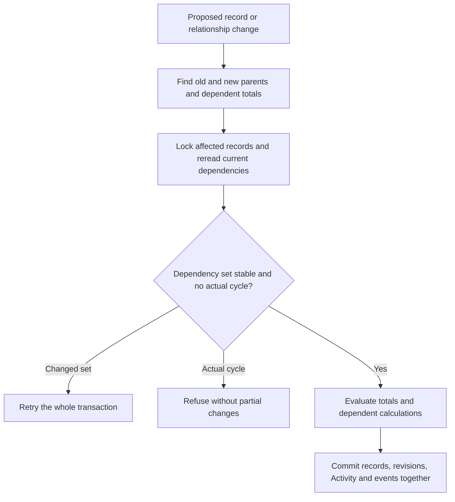

# Calculated values and totals

[Calculations #48](https://github.com/Abzum-NZ/Abzum-Vortex/issues/48) ·
[Save pipeline #47](https://github.com/Abzum-NZ/Abzum-Vortex/issues/47) ·
[Field specification](../specification/05-modules-fields-and-relationships.md#calculations-and-totals)

## First delivery

Implement the existing six closed calculation forms in Record, independently of
the App Designer. Reuse the existing exact-decimal representation, persisted-field
validation and typed Rule condition evaluator. There is no script language,
custom-expression registry or second condition evaluator.

The first executable slice targets Module V2 values. Historical V1 source and
published representations remain unchanged; do not reinterpret number-only money
as currency-bearing V2 money. Preserve immutable published bytes, including older
V2 definitions; missing newly required execution settings require an explicit new
definition release, not an in-place rewrite or a guessed value.

Keep the new precision property optional in existing V2 read/history schemas.
Require it at new publication and installation/execution eligibility for the
affected decimal/money calculation or average. Older published releases remain
readable/restorable but cannot activate that evaluator without a new edited
release containing precision. Compiler, consumer reads, Record and storage never
supply fallback precision. This is an explicit compatibility path, not a new
history mechanism.

## Selected arithmetic behavior

- Evaluate numeric operands in authored order. Subtraction and division are
  left-associative. Use exact rational intermediates, not JavaScript floating-point
  arithmetic, and round only the final result.
- Add the smallest explicit `decimalPlaces` result setting (`0..12`) for
  decimal/money calculations and average totals. Round half-even at that precision.
  It is calculation precision, not display formatting. Ordinary `1 / 3` is valid
  and rounds at the configured precision; division by zero is refused.
- Whole-number results must be exact safe integers, never rounded fractions.
- Addition/subtraction requires either all dimensionless numeric operands or
  all money operands of one currency. Multiplication permits one money operand
  anywhere among dimensionless operands. Division permits money only as the
  leftmost dividend, with dimensionless divisors. Retain that currency; refuse
  undefined money dimensions or mixed currencies, never convert currencies or
  assume two decimal places.
- Percentage subtraction is `amount - (amount × percentage / 100)`, with one
  final rounding step. It preserves the amount's type/currency and uses a
  dimensionless percentage. Field constraints govern acceptable percentages.
- Canonical decimal text removes insignificant zeroes after final rounding.

Do not add a migration framework for arithmetic that has not yet executed. Keep
historical read/restore support explicit, require precision before activating the
new evaluator, and update editable fixtures before their next publication. After
execution is available, a precision or arithmetic-meaning change requires a major
definition release because it can change stored values.

## Other closed forms

- Join text in declared order with the exact separator; missing operands propagate
  absence, while an empty string remains present.
- Evaluate condition expressions through the existing typed Rule evaluator and
  its existing empty-value meaning.
- Date offsets use whole units, preserve date versus date-time type, and clamp
  month/year overflow to the last valid day. Date-time offsets use UTC calendar
  arithmetic and preserve supported precision; do not infer a business timezone
  from display settings.
- Deadline evaluation receives one explicit operation clock: the instant and
  organisation-local date. A date deadline remains usable throughout its due day;
  an instant deadline is reached at that instant. Declared terminal status values
  return false. The evaluator does not call the wall clock independently.
- Missing numeric, join-text, date-offset or deadline-due operands yield an
  absent optional result; condition expressions retain Rule's explicit empty/null
  semantics. Final required
  field validation refuses a required result that cannot be calculated. Invalid
  values yield safe field-located issues, never coercion or guessed values.

## Computation and disclosure

The protected owning save calculates universal stored values from the complete
authoritative dependency set declared by the exact published definition. It does
not calculate from a caller-filtered subset or clear a result merely because an
input is hidden from the caller. Caller-supplied changes remain limited to writable
fields; derived values remain non-submittable.

Internal reads remain within the operation's declared record/relationship scope.
They are not a generic privileged query capability. Return values are projected
through the caller's access policy afterward, including the dependency visibility
of calculated values. Hidden inputs cannot escape through derived responses,
errors, Activity, event payloads, diagnostics or MCP. A permitted input edit is
not automatically refused just because maintaining an internal calculated value
requires a hidden input.

A calculated value is disclosed only when both its own field and its recursive
dependency closure are readable to that viewer. Apply that rule to query
projection, filtering, ordering, grouping/aggregation, search, event/Activity
output, interfaces and MCP as well as direct responses. No declassification
contract currently permits a derived field to expose hidden inputs independently.
Compute then omit disallowed results; do not compute from redacted inputs or
refuse the save merely to enforce presentation access.

## Integration and evidence

1. Extend the V2 authored/canonical precision settings and Definition checks for
   valid numeric/money dimensions, date input/result compatibility and dependency
   closure. Preserve historical immutable representations.
2. Add one pure Record evaluator and a small private arithmetic helper. Derive
   the dependency order from the closed expressions, ignore stale submitted or
   stored derived values, and return typed sets/clears or safe issues.
3. Prove all six forms, dependency ordering, optional/required absence, explicit
   time, exact large values, non-terminating division, half-even ties, currency
   handling and the existing application fixtures. Independent review checks the
   implementation against this plan.
4. Co-deliver actual totals, authoritative dependency reads, final revalidation
   and concurrent saves with [#47](https://github.com/Abzum-NZ/Abzum-Vortex/issues/47)
   on [protected storage #45](https://github.com/Abzum-NZ/Abzum-Vortex/issues/45).
   A pure calculation result is not proof of this integrated path.

Empty count is zero. Empty minimum, maximum and average are absent. An empty money
sum is absent unless the definition supplies its currency unambiguously. Query
aggregates filtered for a viewer remain viewer-specific and are not persisted as
universal totals. The existing mixed-currency and access/concurrency acceptance
remains required before the whole task closes.

## Next delivery: relationship totals

Implement one pure Record evaluator over the existing exact total definition,
source relationship and source record type, and selected related record values.
These values are ordinary inputs, not proof of access or authoritative selection.
The protected save owns that selection using the exact installed definition and
current transaction. There is no new query service, callback registry or
caller-supplied `verified` flag.

- Count includes each related record that passes the declared typed filter.
  Field operations exclude absent/null values, but refuse invalid present values.
  Reuse the Rule evaluator; do not create a second filter language.
- Empty count and dimensionless sum are zero. Empty minimum, maximum and average
  are absent. Empty money sum is zero in an explicitly declared currency, or
  absent without one. A required absent total fails final value validation.
- Sum remains exact. Average divides the exact sum by the included value count
  and rounds once, half-even, at its declared precision. Whole-number results
  must remain safe exact integers.
- Minimum/maximum compare numeric amounts exactly, text by Unicode code-point
  order, dates chronologically and date-times by their exact instant. For the
  already supported yes/no type, `false` sorts before `true`. This ordering is
  deterministic and does not depend on browser language or display formatting.
- Money values must have one currency; an explicit sum currency must match it.
  Derived money fields support the same declared currency as ordinary money
  fields. Reuse their declared result type rather than restricting this to a
  physical money input field.
- Internal mixed-currency diagnostics may identify sorted currency codes. The
  protected operation must omit those codes from caller-visible errors when
  they could reveal hidden inputs. Universal totals are not computed from a
  caller-filtered subset. Disclosure requires readable aggregate/filter inputs
  and related source records as well as the total field itself.

First deliver the evaluator, the minimal derived-money publication correction and
focused tests using the existing arithmetic and value-validation helpers. No
database or contract-shape change is needed for this pure slice. Integration in
#47 must prove actual related-record selection, updates to affected old/new
parents, derived recalculation, current revisions and atomic Activity/Event
effects. Supplied related-record fixtures are not evidence of that integration.

### Integrated totals: dependency and transaction rules

Independent Sol review approved the pure choices above and the following save
integration model. Keep the existing same-record calculation-cycle publication
check. Do not reject a total merely because its related record type points back
to itself or another type: a valid finite hierarchy can have a cyclic type-level
diagram. Reject actual cyclic record/field dependencies during the protected
save, not every potentially recursive definition.

The owning save discovers the union of the old and proposed dependency sets.
It includes old/new parents when a relationship moves, create/delete/restore
membership, aggregate and filter dependencies, dependent calculations and
upstream totals. Use concrete organisation/storage/application-scoped record
identity plus field identity, not record-type identity alone.

Lock the discovered source and affected record rows in canonical identity order,
then re-read revisions, relationships and the dependency set. Every writer that
changes relationship membership or contributing values follows the same
source/parent locking protocol. Use a fresh post-wait `READ COMMITTED` snapshot.
If the dependency set changes, abort/retry the transaction rather than taking
new locks out of order or calculating from the earlier read. This uses existing
record revisions and transactions, not an aggregate counter or lock framework.

Then apply the proposed row/relationship changes, read the final transaction-visible
related sets, calculate in dependency order and validate the final values. Each
changed parent receives its own revision and matching Activity/Event effects in
the same command transaction. A failure rolls back the source and parents
together. Concurrent child changes serialize through the common parent, and a
response-lost retry reuses the existing command receipt.

Actual save proofs must cover valid self-type hierarchies, an actual refused
record-level cycle, a relationship move updating both parents, concurrent child
changes and rollback without partial totals or events. These are #47 integration
requirements; this pure evaluator does not implement them.

## Approved deadline refresh — 12 September 2026

Implement [scheduled time-based calculations](../specification/appendices/record-ownership-and-lifecycle.md#scheduled-time-based-calculations) in the existing engine: next due time, protected revision-checked refresh, cancellation/rescheduling, bounded catch-up and retry-safe effects. [#62](https://github.com/Abzum-NZ/Abzum-Vortex/issues/62) consumes this operation for scheduled delivery; [#54](https://github.com/Abzum-NZ/Abzum-Vortex/issues/54) ensures overdue values cannot silently determine reads, filters, sorting or totals. Test a passed deadline with no user save, a changed deadline, deleted record, duplicate job, concurrent edit and scheduler downtime. Do not deploy a workflow per record or build another formula engine.
