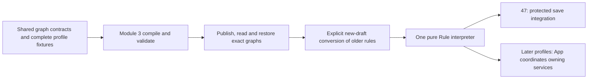

# Shared Rule graph foundation

[Task #58](https://github.com/Abzum-NZ/Abzum-Vortex/issues/58) ·
[Flow specification](../specification/appendices/frontend-rule-designer.md) ·
[Save lifecycle #47](https://github.com/Abzum-NZ/Abzum-Vortex/issues/47)

## Outcome and reviewed scope

Deliver the first executable profile of the one shared node-based Rule engine:
rules that inspect and adjust a proposed record before its owning save commits.
This is not a second save-rule engine or the complete interactive flow feature.
The App Designer is not a prerequisite.

Independent Sol architecture review approved this sequence. Complete definitions,
fixtures and the Definition lifecycle for every supported node before writing
the interpreter. Do not publish speculative effectful nodes whose owning service
adapters are unavailable. Full interactive, query, form, action, identity and
background functionality remains required by [#58](https://github.com/Abzum-NZ/Abzum-Vortex/issues/58)
and its existing dependencies.

## Delivery sequence

1. Define source and canonical graph contracts with an explicit graph version,
   stable identities, typed inputs/variables, node settings and labelled edges.
   The first supported execution profile is `before_save`.
2. Add an explicit Module source/validation pair `3.0.0`, composed from the V2
   field contracts and the new graph type. Do not copy a whole field catalogue or
   reinterpret published V1/V2 rules. Later Application embedding must reuse the
   same canonical graph type and interpreter.
3. Carry graphs through source identity resolution, compilation, provenance,
   reference validation, version impact, publication, consumer reads and restore.
   Complete authored/canonical fixtures cover every supported node and outcome.
   The real Definition identity store must accept the same node/input/variable
   kinds. Prove the existing draft allocator persists those identities; service
   tests with in-memory repositories do not establish database compatibility.
4. Convert supported V1/V2 rules into a new Module 3 draft, preserving the original
   trigger, condition and effect. Report unsupported behavior at its source path;
   never silently discard a rule or rewrite an immutable release. Reuse the
   existing V1-to-V2 field conversion and request only genuinely missing value or
   message information. The author can edit an unsupported draft explicitly.
5. Only after that proof passes, add the pure shared Rule interpreter. It consumes
   the published canonical graph and trusted record definitions/candidate values.
   It has no database, network, Access, App, Page or generic service callback.
6. Integrate the same interpreter inside [#47](https://github.com/Abzum-NZ/Abzum-Vortex/issues/47)'s
   short owning transaction. Revalidate resulting candidate fields before writing.
   A pure graph result alone is not a successful protected save.

## Complete first profile

| Node          | Meaning and outcomes                                                         |
| ------------- | ---------------------------------------------------------------------------- |
| Start         | Declares before-save trigger and create/update applicability; one next edge. |
| Condition     | Typed condition with explicit true and false edges.                          |
| Set variable  | Assigns a declared typed run-local variable; one next edge.                  |
| Set field     | Sets or clears a declared candidate field; one next edge.                    |
| Require field | Adds a required-field check on the candidate; one next edge.                 |
| Warn          | Accumulates a safe configured warning without refusing; one next edge.       |
| Refuse        | Terminal safe refusal, optionally located at a declared field.               |
| Finish        | Terminal evaluation result; never a database commit.                         |

Require field records a requirement returned to the owning Record save for
checking against its final candidate, after all graphs and owning generators:
a later Set field or generated value may satisfy it. It is not an early refusal
of a value that the same configured operation is about to supply. Explicit Refuse remains terminal. Previous
field values are unavailable during creation, not invented null values.

Exactly one Start and one active path; all nodes must be reachable. Refuse and
Finish have no outgoing edges. No cycles, implicit fallthrough, duplicate outcome
edges, parallel branches or runtime child-flow calls. Canvas positions do not
affect execution. Sequential assignments are deliberate: the last executed
assignment wins and later nodes see the current candidate.

For several applicable before-save graphs, the shared Rule entry point evaluates
ascending priority, then permanent rule ID in canonical lexical order. Each graph
receives the preceding graph's candidate; requirements and warnings accumulate.
A refusal stops the sequence without an applicable write patch. This explicit
order also resolves repeated writes; no second ordering counter is needed.

## Values and field behavior

Inputs and variables have explicit types, including exact decimal text,
amount-and-currency money and typed references. Reuse the existing Module V2
value codecs. Values come from a literal, declared input/variable, current field
or explicitly available previous field. No arbitrary JSON expression or script.
Keep a missing optional value distinct from explicit clearing; required reads
need a default, assignment on every incoming path or an explicit absence branch.

Table inputs, variables and standalone literals declare columns with key, V2
cell type and required status. This minimal data shape lets compilation normalize
decimal and money cells without guessing from text or requiring a record field.
Canonical columns sort by key; row order is preserved. Undeclared columns,
missing required cells and wrong cell types refuse. It does not copy storage
settings: owning field validation still enforces row limits, precision, choice
options and currency policy when a flow proposes a field change.

The new graph condition operands explicitly represent input/variable/previous
sources and adapt resolved typed values to the existing shared condition
evaluator. Do not silently expand the meaning of the old condition contract.

Set field uses the owning Module's permanent field identity and exact value
contract. Ordinary writable candidate fields are eligible; platform-generated
reference numbers, calculations and totals remain owned by their existing
generators. This profile cannot grant permission to change a field. A clear is
explicit, not a guessed empty string or null stored as a field value.

Publication checks value shape and declared reference targets, including variable
defaults. Field-specific choice, currency, precision and row policies apply to
the final candidate in the owning Record save, not independently after every
node: a later configured node can correct an intermediate value. Publication
acceptance alone never proves that a particular run can save its final values.

Publication resolves the complete read/write sets, field targets, variable types,
node versions and branch initialization. Unknown references, incompatible values
or unsupported contexts refuse before execution. Execution-affecting changes
receive the existing major version-impact classification after activation.

## Results and acceptance

### Definition integration responsibilities

| Part                          | Required behavior before the interpreter starts                                                                                                                                           |
| ----------------------------- | ----------------------------------------------------------------------------------------------------------------------------------------------------------------------------------------- |
| Source identities             | Allocate rule-node, input and variable identities inside their permanent rule owner. Add the exact V3 resolution format; do not widen historical V1/V2 snapshots.                         |
| Compilation                   | Resolve aliases and dependency record types, normalize existing exact-value formats, retain provenance, and produce one deterministic canonical graph.                                    |
| Semantic validation           | Prove legal ports, reachability, finite paths, field ownership/write eligibility, compatible operands and values, and variables available on every path that reads them.                  |
| Publication and consumers     | Carry the exact 3.0.0 pair through ordinary draft, publication, history, read and restore operations. Distinguish contract-version selection from reuse of the V2 field model.            |
| Version impact and conversion | Treat execution-affecting changes as major; preserve historical releases. Convert supported old rules into new graphs explicitly, reporting unsupported behavior rather than dropping it. |
| Complete proof                | Compile, publish, read and restore the complete example through the real Definition API. Reordering graph presentation must not alter execution or canonical fingerprints.                |

Canonical declarations and nodes sort by permanent identity; edges sort by source
node, port and destination node; operation and reference-target sets sort
lexically. Rules use priority then permanent rule ID. Do not sort meaningful
ordered values such as table rows, attachments or condition operands. Canonical
semantic validation checks these same rules; the structural schema is not a
substitute for reference and execution validation.

### Execution results

Return completed candidate set/clear changes, required-field checks and safe
warnings, or a terminal refusal with safe field issues. A refused run exposes no
applicable write patch. Messages are configured safe text/codes, not submitted
values echoed into errors. The owning Record operation applies nothing unless
the whole operation passes; no caller authority flag is introduced.

The initial candidate contains decoded typed values, not a claim that required
fields and all field-specific policies already pass. Record owns the engine's
initial/final preparation stages and evaluates returned requirements after its
generators; Rule never imports Record or duplicates final field validation. See
the [candidate integration plan](issue-47-save-command.md#candidate-preparation-and-final-validation).

- Complete source/canonical fixtures and all eight nodes before runtime code.
- Prove explicit branch order, field changes observed downstream, variable
  initialization, optional absence, repeated deterministic writes, warning and
  refusal behavior, exact numbers/money/references and safe field corrections.
- Prove malformed ports, cycles, unreachable nodes, unsupported node versions
  and incompatible field/variable mappings refuse.
- Prove compile → publish → consumer read → restore, including historical V1/V2
  preservation and explicit new-draft conversion without rewriting releases.
- Prove graph node/input/variable identities through the existing database draft
  allocator. Extend its supported-kind constraint only; keep existing ownership,
  alias history, organisation isolation and privileges unchanged.
- Prove the interpreter against actual Definition-returned graphs, not an
  invented standalone runtime shape.
- Independent Sol review covers the actual patch before delivery. Keep full
  [#58](https://github.com/Abzum-NZ/Abzum-Vortex/issues/58) and
  [#47](https://github.com/Abzum-NZ/Abzum-Vortex/issues/47) open until their real
  integrated acceptance is met.
