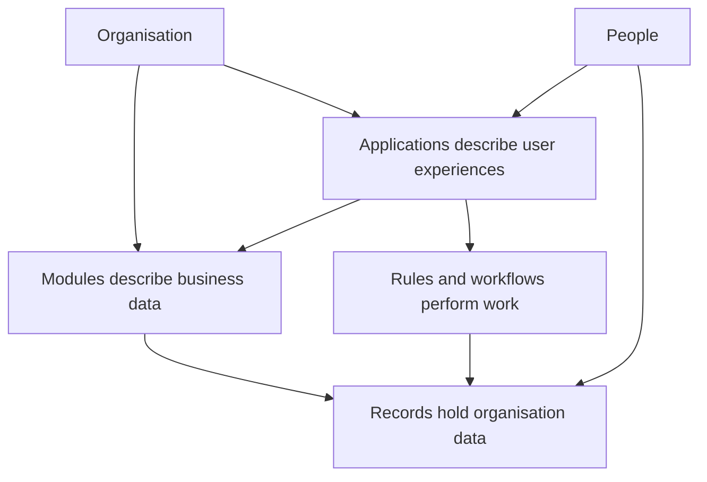

# 1. Purpose, scope and product boundaries

[Specification index](README.md) · Next: [People, organisations and sign-in](02-people-organisations-and-sign-in.md)

## Purpose

[Abzum Vortex](https://github.com/Abzum-NZ/Abzum-Vortex) lets a tenant operate one or more organisations, describe their business data, build working applications around that data, and automate work without creating a separate software product for every application.

The platform separates three concerns:

- A [module](05-modules-fields-and-relationships.md) describes shared business meaning and data.
- An [application](07-applications-pages-and-themes.md) describes what a group of people sees and does.
- A [record](06-records-and-lifecycle.md) is an organisation's saved business information.

## Product outcomes

An organisation can:

1. Define reusable business objects such as organisations, people, products, deals, cases, or assets through [modules](05-modules-fields-and-relationships.md).
2. Compose those modules into focused [applications](07-applications-pages-and-themes.md).
3. Control who can discover, read, create, change, delete, export, or administer information through [access and permissions](04-access-and-permissions.md).
4. Guide work through [forms, rules and events](08-forms-actions-rules-and-events.md) and [workflows and process pipelines](09-workflows-and-pipelines.md).
5. Read information through [queries, reports, search and live updates](10-queries-reports-search.md).
6. Exchange information through [files](11-files-and-attachments.md), [connections and programmable interfaces](12-connections-and-interfaces.md), and explicit [sharing, import, and export](16-copying-sharing-import-export.md).
7. Meet operational obligations through [privacy and retention](14-activity-privacy-and-retention.md), [delivery and testing](18-delivery-and-testing.md), and [backup and recovery](19-operations-backup-and-recovery.md).

## Product boundaries

The first complete release includes:

- A shared platform serving multiple organisations while keeping each organisation's information separate.
- Tenant administration for one or more organisations arranged in a hierarchy, without automatic access to their business data.
- A builder for modules, applications, pages, forms, rules, workflows, reports, connections, and access roles.
- Published versions so people use a known, validated configuration.
- Web experiences that work on desktop and phone.
- Public pages and programmable interfaces where an organisation explicitly enables them.
- Generic entitlement decisions, resource metering, export, retention, activity history, and recovery.
- Governed cross-organisation record sharing with the same product behaviour whether the organisations are in one cluster or different clusters.

The first complete release does not include:

- Customer-supplied executable code running inside the platform.
- A general-purpose website hosting product.
- Direct customer access to platform databases or infrastructure accounts.
- Automatic sharing of records, definitions, files, or learned information between organisations.
- Replicating shared records into recipient-cluster storage or directly connecting customer databases. Cross-cluster access uses the approved [Vortex Federation API](17-runtime-storage-and-caching.md#vortex-federation-between-clusters).
- A marketplace in which unreviewed packages become automatically trusted.
- Artificial-intelligence assistants, model-generated work, autonomous agents, and model-assisted workflow steps.
- Privileged business domains. Commercial billing, ordinary approvals, tasks, comments, notices, business calendars and operational case management are built as ordinary applications under the [core contract boundary](appendices/core-contract-boundary.md).

## Product principles

1. **Organisation separation comes first.** Every storage and request path is tested for separation through [access tests](20-quality-and-acceptance.md).
2. **Nothing hidden becomes live.** Builders work on a draft, validate it, and deliberately publish it through [publication](03-composition-and-publication.md).
3. **One place owns each decision.** Identity, access, data, files, workflows, and entitlements each have one named owning service in [runtime services](17-runtime-storage-and-caching.md).
4. **The server rechecks every request.** Page visibility never substitutes for [access enforcement](04-access-and-permissions.md).
5. **Unsafe requests fail closed.** When the platform cannot prove an operation is allowed, it refuses the operation and records why.
6. **Business choices are visible.** An undecided policy is listed in the [decision register](appendices/decisions.md), not embedded as an implementation assumption.
7. **Core knows primitives, not business domains.** Every privileged contract must pass the [core contract admission test](appendices/core-contract-boundary.md#admission-test).

## Acceptance examples

- A builder can explain whether a requirement belongs to a [module](05-modules-fields-and-relationships.md), an [application](07-applications-pages-and-themes.md), or organisation data in [records](06-records-and-lifecycle.md).
- A developer can follow links from a product requirement to its [data contract](appendices/data-contracts.md), [acceptance test](20-quality-and-acceptance.md), and [build phase](../build-plan/README.md).
- No core feature automatically shares one organisation's private state with another. Every cross-organisation grant is explicit, limited, approved by both organisations, revocable, independently testable, and enforced by the source organisation's cluster.
