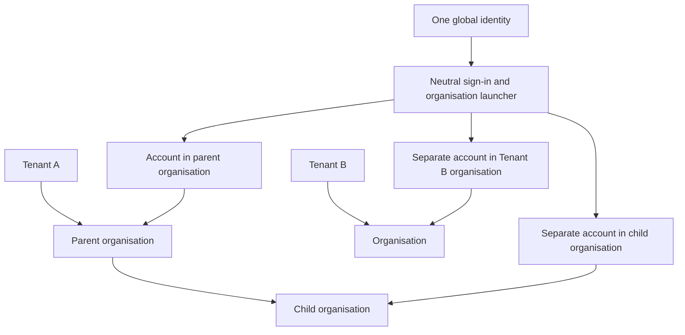
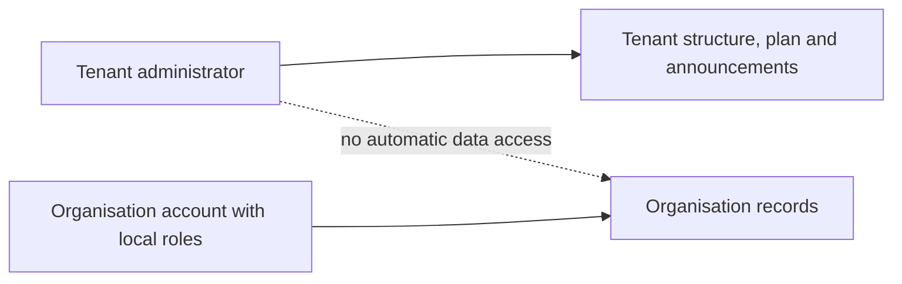

# 2. Tenants, organisations, people and sign-in

[Previous: Purpose and scope](01-purpose-and-scope.md) · [Specification index](README.md) · Next: [Platform composition and publication](03-composition-and-publication.md)

## Concepts

A **tenant** is the customer-level administration and billing boundary. One tenant owns one or more **organisations**. Organisations are private workspaces and may form a hierarchy inside their tenant. An **identity** is one human sign-in. An **organisation account** is that identity's separate account inside one organisation.

One identity may have accounts in several organisations, including organisations in different tenants, but may have only one account in the same organisation. Each organisation account has its own state, profile, roles, teams, application access, preferences, and activity. No role or team membership carries from one organisation account to another.

## Tenant and organisation hierarchy

- Every organisation belongs to exactly one tenant.
- An organisation may have one parent organisation in the same tenant. The hierarchy cannot contain a cycle.
- Moving an organisation moves its complete subtree and is refused if the destination is another tenant, the move would create a cycle, or an active policy prevents it.
- Archiving or removing a parent is refused until every child is moved, archived through an explicit subtree operation, or otherwise resolved.
- Records, files, connections, roles, teams, applications, search, workflow work, and activity remain owned by an organisation. A parent organisation does not inherit access to a child organisation's data.
- The tenant owns the commercial plan, subscription, and customer-wide administrative settings. Usage is attributed to the organisation that caused it and then rolled up to its tenant.

## Tenant administration

A tenant can have several **tenant administrators**. They may create, move, suspend, restore, and view the administrative status of organisations in that tenant; manage the tenant plan and billing contacts; and publish tenant-wide announcements.

Tenant administration does not grant record access. A tenant administrator who needs to use an organisation's applications or data must also have an active organisation account with the required organisation and application roles. This separation prevents customer-wide administration from becoming silent access to every workspace.

## Identity and organisation-account lifecycle

1. A person proves control of a supported sign-in method.
2. The platform loads the identity's active organisation accounts and tenant-administrator assignments.
3. If exactly one organisation account is active, the platform may open it directly. Otherwise it shows the organisation launcher.
4. After an organisation is chosen, every request carries the global identity, tenant, organisation, and organisation-account identifiers.
5. Leaving or suspending an organisation account affects only that organisation. Suspending the global identity prevents every sign-in.
6. Removing access takes effect on the next request. Existing requests do not gain a grace period, and cached permission results are invalidated by the organisation's access version.

## Identity across clusters

Each environment has one **Vortex Identity Authority** shared by all Vortex clusters in that environment. It proves the global identity and issues a short-lived, asymmetrically signed identity token. Every cluster verifies the token from published public keys, then loads only the tenant assignment and organisation account stored in its own cluster. [Supabase supports verifying third-party and custom JWTs from published keys](https://supabase.com/docs/guides/auth/jwts).

The identity token proves the person; it does not grant tenant administration, organisation membership, or data access. A [cross-cluster shared-record request](17-runtime-storage-and-caching.md#cross-cluster-request) carries a short-lived assertion signed by the recipient cluster and is still evaluated by the source organisation.

## Invitations and teams

- An invitation names one organisation, one email address, an expiry, and proposed local roles or teams.
- Accepting it requires control of that address and creates or reactivates the single organisation account for that identity and organisation.
- An invitation can be used once, can be revoked, and cannot grant more authority than the inviter may assign.
- One organisation account may belong to several teams. Teams belong to one organisation and may receive roles, application access, and direct record shares.
- Team membership changes affect the next request and appear in [activity history](14-activity-privacy-and-retention.md).

## Organisation launcher and sign-in experience

The neutral launcher shows only organisations the identity may enter. It may group them by tenant and organisation hierarchy, and show approved names, logos, and discoverable applications. It never reveals private data, other accounts, billing details, or the existence of organisations the identity cannot enter.

An organisation-branded address may start a branded sign-in journey, but the address and branding never determine access. Switching organisations creates a new request context and clears organisation-specific browser and server state.

## Application access

An organisation account does not automatically grant every [application](07-applications-pages-and-themes.md). Application access comes from an application role or explicit application assignment under [access and permissions](04-access-and-permissions.md). A person-link field that requires application access checks the linked organisation account in the current organisation, never the global identity alone.

## Administrative portals

The protected **Tenant Portal** covers tenant administrators, organisation hierarchy, plan and billing, usage roll-up, and tenant announcements. The protected **Organisation Portal** covers local profile, people, invitations, teams, roles, applications, connections, preferences, business calendar, sharing approvals, and organisation announcements. Neither application can be removed.

## Required records

The platform stores the tenant, tenant-administrator assignment, organisation and hierarchy, global identity, organisation account, team and membership, invitation, application access assignment, profiles and preferences, business calendar, and sign-in session described in the [data contracts](appendices/data-contracts.md#tenant-identity-and-organisation-account-records).

## Acceptance examples

- One identity uses separate accounts in several organisations without mixed roles, profiles, teams, search, files, pages, notifications, or cached values.
- One organisation account belongs to several teams and receives the union of their currently valid non-conflicting grants.
- A tenant administrator creates a child organisation but cannot read its records without a local organisation account and local roles.
- A hierarchy move across tenants and a move that creates a cycle are both refused.
- Suspending one organisation account removes its access on the next request without affecting the identity's other accounts.
- Two clusters verify the same identity token while keeping their organisation accounts and access decisions local.
