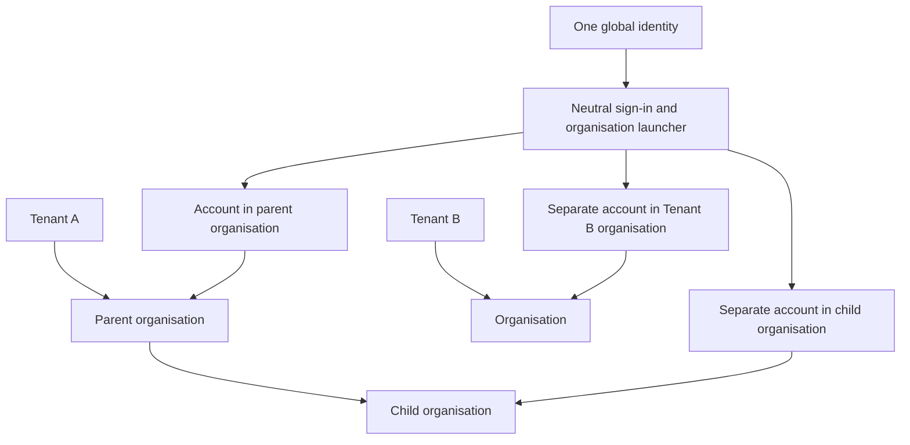
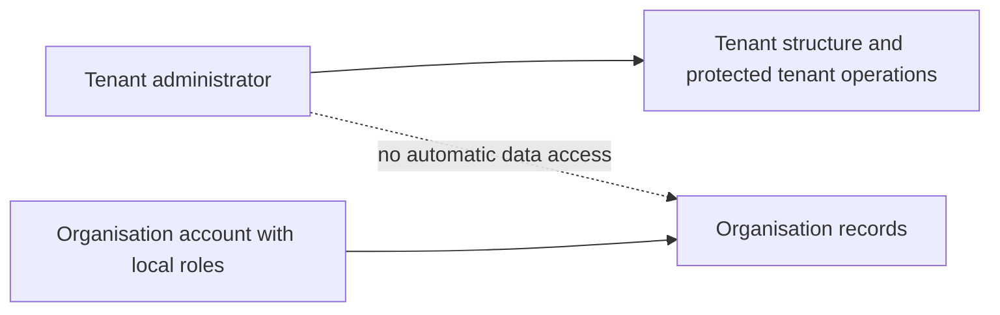
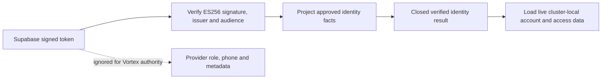

# 2. Tenants, organisations, people and sign-in

[Previous: Purpose and scope](01-purpose-and-scope.md) · [Specification index](README.md) · Next: [Platform composition and publication](03-composition-and-publication.md)

## Concepts

A **tenant** is the customer-level governance and security boundary. One tenant owns one or more **organisations**. Organisations are private workspaces and may form a hierarchy inside their tenant. An **identity** is one human sign-in. An **organisation account** is that identity's separate account inside one organisation.

One identity may have accounts in several organisations, including organisations in different tenants, but may have only one account in the same organisation. Each organisation account has its own state, profile, roles, teams, application access, preferences, and activity. No role or team membership carries from one organisation account to another.

## Tenant and organisation hierarchy

- Every organisation belongs to exactly one tenant.
- An organisation may have one parent organisation in the same tenant. The hierarchy cannot contain a cycle.
- Moving an organisation moves its complete subtree and is refused if the destination is another tenant, the move would create a cycle, or an active policy prevents it.
- Archiving or removing a parent is refused until every child is moved, archived through an explicit subtree operation, or otherwise resolved.
- Records, files, connections, roles, teams, applications, search, workflow work, and activity remain owned by an organisation. A parent organisation does not inherit access to a child organisation's data.
- The tenant owns customer-wide hierarchy, lifecycle and [entitlement](15-entitlements-and-metering.md) scope. Metering is attributed to the organisation that caused it where meaningful and can be rolled up to its tenant.

## Tenant administration

A tenant can have several **tenant administrators**. They may create, move, suspend, restore, and view the administrative status of organisations in that tenant and invoke explicitly granted protected tenant operations.

Tenant administration does not grant record access. A tenant administrator who needs to use an organisation's applications or data must also have an active organisation account with the required organisation and application roles. This separation prevents customer-wide administration from becoming silent access to every workspace.

## Identity and organisation-account lifecycle

1. A person proves control of a supported sign-in method.
2. The platform loads the identity's active organisation accounts and tenant-administrator assignments.
3. If exactly one organisation account is active, the platform may open it directly. Otherwise it shows the organisation launcher.
4. After an organisation is chosen, every request carries the global identity, tenant, organisation, and organisation-account identifiers.
5. Leaving or suspending an organisation account affects only that organisation. Suspending the global identity prevents every sign-in.
6. Removing access takes effect on the next request. Existing requests do not gain a grace period, and cached permission results are invalidated by the organisation's access version.

## Identity across clusters

Each environment has one **Vortex Identity Authority** shared by all Vortex clusters in that environment. It is implemented with [Supabase Auth](https://supabase.com/docs/guides/auth) and issues short-lived identity tokens using the managed P-256 `ES256` [asymmetric signing key and published key set](https://supabase.com/docs/guides/auth/signing-keys). A cluster verifies a token through the authority's standard JWKS endpoint, then loads only the tenant assignment and organisation account stored in its own cluster. Testing proves this boundary with two independently configured verifier instances; it does not pretend that a second physical Testing cluster exists.

Supabase tokens retain the provider's [required standard claims](https://supabase.com/docs/guides/auth/jwt-fields). After signature verification, the Identity service validates the configured issuer, `authenticated` audience, issue time, not-before time and expiry. It allows no more than 60 seconds of clock difference between systems. It converts only `sub`, `email`, `session_id`, `aal`, `iat`, `exp`, issuer, audience, and the verified JWT key identifier into a closed Vortex result. `sub` becomes the permanent global identity identifier. The `email` claim is accepted only from a non-anonymous authenticated session issued while mandatory email confirmation is enforced; the token itself has no separate email-confirmed claim. The result never contains the Supabase `role`, phone, application metadata, user-editable metadata, tenant-administrator assignments, organisation roles, teams, application access, sharing grants, MCP capability approvals, or an access decision.

No custom access-token hook is used for ordinary identity tokens because Supabase's standard claims contain every fact this result requires. A later owning issue may introduce a hook only after demonstrating that the deployed standard cannot express a required platform invariant. A delegated [MCP OAuth token](12-connections-and-interfaces.md#identity-consent-and-access) may identify its registered client and MCP-server audience under the Phase 9 interface work, but those values still cannot carry organisation or application authority.

The identity token proves the person; it does not grant tenant administration, organisation membership, or data access. A [cross-cluster shared-record request](17-runtime-storage-and-caching.md#cross-cluster-request) carries a short-lived assertion signed by the recipient cluster and is still evaluated by the source organisation.

### First-release sign-in methods

The first release supports verified email address and password, email verification, and password recovery. Anonymous, SMS, social-provider, passkey, and Web3 sign-in are disabled in the authority. Supabase's email provider also implements magic-link and email-code endpoints, so Vortex does not claim a provider switch that Supabase does not offer: the platform exposes no passwordless sign-in journey and does not call those endpoints. Adding an exposed sign-in method later requires an explicit identity/security change; an application definition cannot change how the environment-wide Identity Authority proves a person.

Local captures verification and recovery messages in the Supabase CLI's [Mailpit service](https://supabase.com/docs/guides/local-development/cli/testing-and-linting). Testing uses a Mailtrap Email Testing inbox through Supabase [custom SMTP](https://supabase.com/docs/guides/auth/auth-smtp), following Supabase's recommendation to use an email-testing tool for test projects. Confirmation and recovery messages stay in that test inbox rather than being delivered to a person. Its dedicated test-only address and credentials are supplied through [Doppler](19-operations-backup-and-recovery.md#secrets). Production SMTP credentials, verified sender domain, monitoring and delivery proof are provisioned before release under [Phase 13](../build-plan/README.md#phase-13--operational-readiness-and-release) and [issue #171](https://github.com/Abzum-NZ/Abzum-Vortex/issues/171); Phase 2 sends no Production email.

The environment addresses are explicit. Local uses `http://127.0.0.1:3000`, Testing uses `https://abzum-vortex-git-testing-abzumdevteam.vercel.app`, and Production uses `https://abzum-vortex.vercel.app`. Each authority allows only its own site address and the `/auth/confirm` and `/auth/update-password` paths below that address. Wildcards and customer-controlled redirect addresses are not allowed.

The neutral Next.js App Router journeys live under `apps/web`. Registration, sign-in and recovery requests use server actions; browser code receives no private key or service-role authority. Confirmation and recovery messages put Supabase's server-verifiable `token_hash` in the link fragment, which browsers do not send in an HTTP request, access log or referrer. A small browser bridge reads the fragment and submits the token to a server action in the request body. The server uses `verifyOtp`, completes the immediate confirmation or password update, discards the returned Supabase session, and redirects to a token-free result address. Durable cookies, refresh, sign-out and revocation begin only in the session work.

Supabase alone owns and migrates `auth.*`, including `auth.identities`. Vortex uses the supported Auth APIs, may fail closed when the managed Auth schema is unavailable, and never creates, repairs, writes migration history for, or directly depends on a Supabase-managed Auth table.

Testing key rotation follows the [Supabase rotation and cache windows](https://supabase.com/docs/guides/auth/signing-keys): wait at least 20 minutes after a standby key becomes discoverable before activating it; with one-hour access tokens, keep the previous key trusted for at least one hour and 15 minutes before revocation. Old and new tokens must verify during the overlap, and the private key never leaves Supabase.

The Identity Authority produces the verified identity result. Safe failures are deliberately grouped into stable classes such as missing token, malformed token, verification failure, untrusted issuer, untrusted audience, inactive token, invalid identity claims, anonymous identity, unsupported authentication strength, and authority unavailable. They do not reveal whether the signature, key lookup, account or other provider detail caused the refusal. The organisation-account work consumes the verified identity identifier and email; the session work consumes the same result and owns durable cookies, refresh, sign-out, revocation and session lifecycle. Neither consumer reimplements token verification.

## Invitations and teams

- An invitation names one organisation, one email address, an expiry, and proposed local roles or teams.
- Accepting it requires control of that address and creates or reactivates the single organisation account for that identity and organisation.
- An invitation can be used once, can be revoked, and cannot grant more authority than the inviter may assign.
- One organisation account may belong to several teams. Teams belong to one organisation and may receive roles, application access, and direct record shares.
- Team membership changes affect the next request and appear in [activity history](14-activity-privacy-and-retention.md).

## Organisation launcher and sign-in experience

The neutral launcher shows only organisations the identity may enter. It may group them by tenant and organisation hierarchy, and show approved names, logos, and discoverable applications. It never reveals private data, other accounts, commercial details, or the existence of organisations the identity cannot enter.

An organisation-branded address may start a branded sign-in journey, but the address and branding never determine access. Switching organisations creates a new request context and clears organisation-specific browser and server state.

## Application access

An organisation account does not automatically grant every [application](07-applications-pages-and-themes.md). Application access comes from an application role or explicit application assignment under [access and permissions](04-access-and-permissions.md). A person-link field that requires application access checks the linked organisation account in the current organisation, never the global identity alone.

## Administrative portals

Tenant Administration and Organisation Administration are locked, system-installed Vortex applications. They use ordinary modules, records, pages, roles and workflows while calling narrowly protected identity, hierarchy, access, entitlement and data-handling operations. The engine does not contain special portal page logic.

Legal details, contacts, branding, business calendars, notices and privacy request cases are ordinary records in administration applications. The identity service retains only the organisation's stable identity, hierarchy, lifecycle, display name and minimum [runtime localisation settings](appendices/data-contracts.md#tenant-identity-and-organisation-account-records) needed before an application loads.

## Required records

The platform stores the tenant, tenant-administrator assignment, organisation and hierarchy, global identity, organisation account, team and membership, invitation, application access assignment, minimum runtime localisation settings, and sign-in session described in the [data contracts](appendices/data-contracts.md#tenant-identity-and-organisation-account-records). Other administrative data is stored as ordinary application records.

## Acceptance examples

- One identity uses separate accounts in several organisations without mixed roles, profiles, teams, search, files, pages, notifications, or cached values.
- One organisation account belongs to several teams and receives the union of their currently valid non-conflicting grants.
- A tenant administrator creates a child organisation but cannot read its records without a local organisation account and local roles.
- A hierarchy move across tenants and a move that creates a cycle are both refused.
- Suspending one organisation account removes its access on the next request without affecting the identity's other accounts.
- Two independently configured verifier instances accept the same Testing identity token and produce the same closed identity result without requiring a second physical Testing cluster.
- Rotating the Supabase signing key keeps the current and next public keys available through the overlap window, and neither key contains organisation authority.
