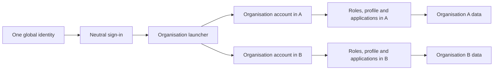
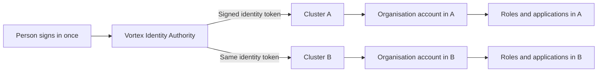

# 2. People, organisations and sign-in

[Previous: Purpose and scope](01-purpose-and-scope.md) · [Specification index](README.md) · Next: [Platform composition and publication](03-composition-and-publication.md)

## Concepts

An **identity** represents one human sign-in. An **organisation** is a customer's private workspace. An **organisation account** is that identity's separate account inside one organisation.

One identity may have an organisation account in several organisations, but no more than one in the same organisation. Each organisation account has its own state, profile, roles, teams, application access, preferences, and activity. Records, files, connections, usage, and billing also remain organisation-specific.

## Identity and organisation-account lifecycle

1. A person proves control of a supported sign-in method.
2. The platform loads the identity's active organisation accounts.
3. If exactly one organisation account is active, the platform may open that organisation directly.
4. If several organisation accounts are active, the platform shows the organisation launcher.
5. After an organisation is chosen, every request carries the global identity, organisation identifier, and organisation-account identifier.
6. Leaving an organisation closes only that organisation account. It does not delete the identity or accounts in other organisations.
7. Suspending the global identity prevents every sign-in. Suspending one organisation account prevents access only to that organisation.

## Identity across clusters

Each environment has one **Vortex Identity Authority** shared by all Vortex clusters in that environment. It proves the global identity and issues a short-lived, asymmetrically signed identity token. Every cluster verifies that token from published public keys, then loads only the organisation account stored in its own cluster. [Supabase supports verifying third-party and custom JWTs from published keys](https://supabase.com/docs/guides/auth/jwts), so clusters do not need the authority's private signing key. Production, Testing, and Local identity authorities remain separate under [delivery environments](18-delivery-and-testing.md#environments).

The token identifies the person but does not grant access to an organisation. Each cluster still requires an active local organisation account, roles, application access, and current access version. A [cross-cluster shared-record request](17-runtime-storage-and-caching.md#cross-cluster-request) carries a short-lived assertion signed by the recipient cluster; it never sends an identity-provider private key or database credential to the source cluster.

## Invitations

- An invitation names one organisation, one email address, an expiry time, and the organisation roles to grant after acceptance.
- Accepting an invitation requires control of the invited email address unless an authorised administrator explicitly changes the invitation first.
- An invitation can be used once, revoked before use, and cannot grant permissions beyond those held by the inviter.
- Accepting an invitation links the proven identity to a new organisation account, or reactivates the same organisation account through an explicit recovery process. It never creates a second organisation account for the same identity and organisation.
- Expired, revoked, and accepted invitations remain visible in [activity history](14-activity-privacy-and-retention.md).

## Organisation launcher

The launcher shows only active organisation accounts. For each organisation it may show the organisation name, approved logo, and the applications the person is allowed to discover. It must not reveal record counts, other accounts, plan details, or private branding from an organisation the person cannot enter.

## Sign-in experience

The platform has one neutral entry address for initial sign-in and account recovery. An organisation may also have a recognised address that starts an organisation-branded sign-in journey. Branding affects presentation only; it never determines access.

After identity is proven, the selected organisation comes from an active organisation account, not from the address alone. One global identity may have one separate account in each organisation it belongs to.

## Application access

An organisation account does not automatically grant access to every [application](07-applications-pages-and-themes.md). Application access comes from an application role or an explicit application assignment described in [access and permissions](04-access-and-permissions.md).

This distinction also defines “must have application access” for a [person-link field](05-modules-fields-and-relationships.md): the linked organisation account must have current access to the application in which the field is being used. Reusable modules cannot enforce application access without an application-level field binding.

## Organisation Portal

Every organisation receives one protected platform application called the **Organisation Portal**. It cannot be removed. Its areas are:

- Company profile: legal and trading names, registration details, industry, addresses, and contact details.
- People and access: invitations, organisation accounts, teams/groups, organisation roles, application access, sign-in policy, and protected sharing approvals requiring one authorised source approval and one authorised recipient acceptance for every cross-organisation grant.
- Applications: installed applications, available updates, publication state, and gallery access.
- Connected services: organisation-owned [connections](12-connections-and-interfaces.md).
- Billing: selected plan, seat use, payment state, invoices, and current [usage](15-plans-billing-and-usage.md).
- Preferences: approved logo and icon, language, time zone, currency, financial-year start, and date and number formats.
- Business calendar: working days, working hours, and public or organisation holidays used by [workflows and pipeline targets](09-workflows-and-pipelines.md).
- Sharing identity: a copyable organisation sharing code and signed invitation links; exact lookup reveals only the approved organisation name and region, never people, applications, roles, records, or billing state.

An organisation account's language and time-zone preference overrides the organisation default for that person's display in that organisation. An application does not silently override language, time zone, currency, financial year, or business calendar; where an application needs a deliberate alternative, that setting is explicit in its definition and states which calculations it changes.

## Required records

The platform stores:

- Global identity.
- Sign-in method and recovery state.
- Organisation.
- Organisation account.
- Invitation.
- Application access assignment.
- Organisation profile, preferences, and business calendar.
- Sign-in session and revocation time.

Exact fields and ownership appear in the [data contracts](appendices/data-contracts.md#identity-and-organisation-account-records).

## Safety requirements

- A session is bound to one identity and, after selection, one organisation account.
- Switching organisations creates a new organisation context and clears organisation-specific cached information.
- A suspended or closed organisation account stops new requests immediately and invalidates its active organisation sessions within the limit chosen in [Decision D17](appendices/decisions.md#d17-access-change-speed).
- Account recovery cannot reveal whether an email address belongs to a particular organisation.
- Organisation branding cannot insert scripts or unsafe markup into the sign-in page.
- A token issued for Local or Testing is refused by Production, and a token's global identity never substitutes for an active organisation account in the current cluster.

## Acceptance examples

- One identity with accounts in two organisations can switch between them without seeing mixed roles, profiles, search results, pages, files, notifications, or cached values.
- Closing a person's account in one organisation does not change the same identity's account in another organisation.
- Entering an organisation's address without an active organisation account never grants or implies access.
- A reusable module can link to a person, while an application binding can additionally require that person to have application access.
- The same global identity can use organisation accounts hosted in two clusters without either cluster copying the other account's roles or profile.
