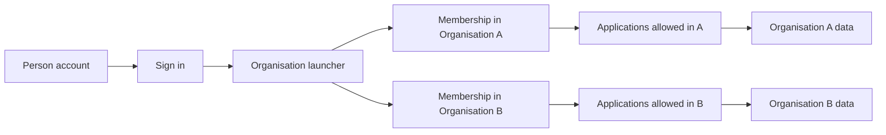

# 2. People, organisations and sign-in

[Previous: Purpose and scope](01-purpose-and-scope.md) · [Specification index](README.md) · Next: [Platform composition and publication](03-composition-and-publication.md)

## Concepts

A **person account** represents one human sign-in. An **organisation** is a customer's private workspace. An **organisation membership** connects a person account to an organisation and records whether that membership is active.

A person may belong to more than one organisation. Organisation-specific roles, application access, records, files, activity, connections, usage, and billing remain separate.

## Account and membership lifecycle

1. A person proves control of a supported sign-in method.
2. The platform loads the person's active organisation memberships.
3. If exactly one membership is active, the platform may open that organisation directly.
4. If several memberships are active, the platform shows the organisation launcher.
5. After an organisation is chosen, every request carries that organisation's identifier and active membership.
6. Leaving an organisation ends access to that organisation without deleting the person's account or memberships in other organisations.
7. Suspending an account prevents all sign-ins. Suspending one membership prevents access only to that organisation.

## Invitations

- An invitation names one organisation, one email address, an expiry time, and the organisation roles to grant after acceptance.
- Accepting an invitation requires control of the invited email address unless an authorised administrator explicitly changes the invitation first.
- An invitation can be used once, revoked before use, and cannot grant permissions beyond those held by the inviter.
- Expired, revoked, and accepted invitations remain visible in [activity history](14-activity-privacy-and-retention.md).

## Organisation launcher

The launcher shows only active memberships. For each organisation it may show the organisation name, approved logo, and the applications the person is allowed to discover. It must not reveal record counts, other members, plan details, or private branding from an organisation the person cannot enter.

## Sign-in experience

The platform has one neutral entry address for initial sign-in and account recovery. An organisation may also have a recognised address that starts an organisation-branded sign-in journey. Branding affects presentation only; it never determines access.

After identity is proven, the selected organisation comes from an active membership, not from the address alone. This resolves the earlier conflict between a global sign-in and tenant-address lookup, subject to [Decision D01](appendices/decisions.md#d01-account-and-sign-in-model).

## Application access

Organisation membership does not automatically grant access to every [application](07-applications-pages-and-themes.md). Application access comes from an application role or an explicit application assignment described in [access and permissions](04-access-and-permissions.md).

This distinction also defines “must be an application member” for a [person-link field](05-modules-fields-and-relationships.md): the linked person must have current access to the application in which the field is being used. Reusable modules cannot enforce application membership without an application-level field binding.

## Organisation Portal

Every organisation receives one protected platform application called the **Organisation Portal**. It cannot be removed. Its areas are:

- Company profile: legal and trading names, registration details, industry, addresses, and contact details.
- People and access: invitations, memberships, teams/groups, organisation roles, application access, and sign-in policy.
- Applications: installed applications, available updates, publication state, and gallery access.
- Connected services: organisation-owned [connections](12-connections-and-interfaces.md).
- Billing: selected plan, seat use, payment state, invoices, and current [usage](15-plans-billing-and-usage.md).
- Preferences: approved logo and icon, language, time zone, currency, financial-year start, and date and number formats.
- Business calendar: working days, working hours, and public or organisation holidays used by [workflows and pipeline targets](09-workflows-and-pipelines.md).

A person's language and time-zone preference overrides the organisation default for their own display. An application does not silently override language, time zone, currency, financial year, or business calendar; where an application needs a deliberate alternative, that setting is explicit in its definition and states which calculations it changes.

## Required records

The platform stores:

- Person account.
- Sign-in method and recovery state.
- Organisation.
- Organisation membership.
- Invitation.
- Application access assignment.
- Organisation profile, preferences, and business calendar.
- Sign-in session and revocation time.

Exact fields and ownership appear in the [data contracts](appendices/data-contracts.md#identity-and-membership-records).

## Safety requirements

- A session is bound to one person and, after selection, one organisation.
- Switching organisations creates a new organisation context and clears organisation-specific cached information.
- A removed membership stops new requests immediately and invalidates active organisation sessions within the limit chosen in [Decision D17](appendices/decisions.md#d17-access-change-speed).
- Account recovery cannot reveal whether an email address belongs to a particular organisation.
- Organisation branding cannot insert scripts or unsafe markup into the sign-in page.

## Acceptance examples

- A person belonging to two organisations can switch between them without seeing mixed search results, pages, files, notifications, or cached values.
- A person removed from one organisation keeps access to another organisation where their membership remains active.
- Entering an organisation's address without membership never grants or implies access.
- A reusable module can link to a person, while an application binding can additionally require that person to have application access.
