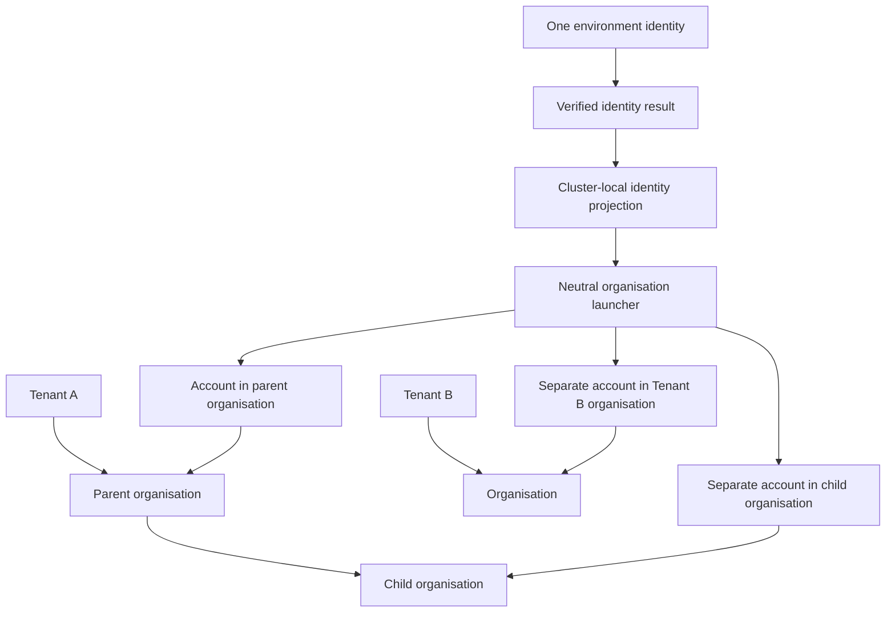
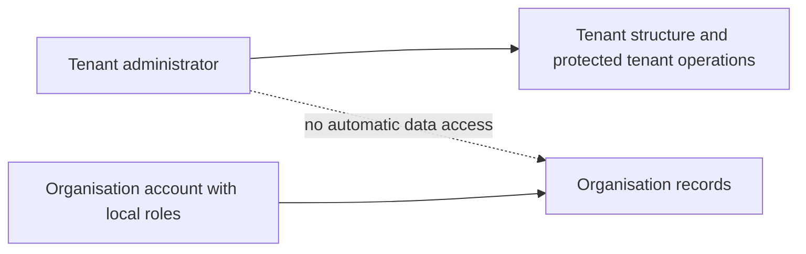
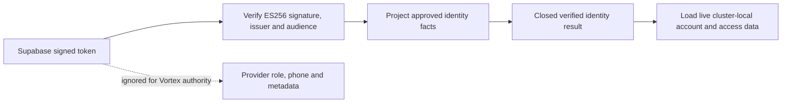
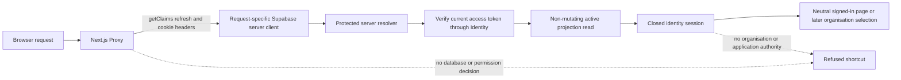
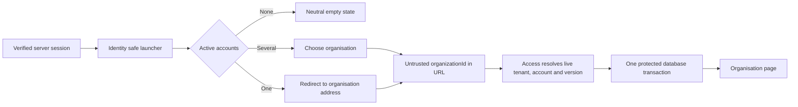

# 2. Tenants, organisations, people and sign-in

[Previous: Purpose and scope](01-purpose-and-scope.md) · [Specification index](README.md) · Next: [Platform composition and publication](03-composition-and-publication.md)

## Concepts

A **tenant** is the customer-level governance and security boundary. One tenant owns one or more **organisations**. Organisations are private workspaces and may form a hierarchy inside their tenant. An **identity** is one human sign-in. An **organisation account** is that identity's separate account inside one organisation.

One identity may have accounts in several organisations, including organisations in different tenants, but may have only one account in the same organisation. Each organisation account has its own state, profile, roles, groups, application access, preferences, and activity. No role or group membership carries from one organisation account to another.

## Tenant and organisation hierarchy

- Every organisation belongs to exactly one tenant.
- Tenant identifiers and short names are permanent and unique within one cluster. Organisation identifiers, owning tenants, and short names are permanent; an organisation short name is unique only inside its tenant. Display names may change and need not be unique.
- An organisation may have one parent organisation in the same tenant. The database stores only that parent link; it does not duplicate the hierarchy in a path, closure table, depth column, or `ltree`. The hierarchy cannot contain a cycle.
- Moving an organisation changes its parent link. Its descendants retain their links and therefore move as the same subtree. The move is refused if the destination is another tenant, it would create a cycle, or an active policy prevents it.
- Archiving or marking a tenant or parent organisation for removal is refused while it retains an active or suspended child. A caller may complete an explicitly ordered subtree transition in one transaction; the database validates the final committed state.
- Suspension does not rewrite descendant lifecycle states. Request-context establishment checks the selected tenant, organisation, and organisation account independently, so suspending a parent or tenant still prevents new entry where required without hiding descendant state changes.
- Records, files, connections, roles, groups, applications, search, workflow work, and activity remain owned by an organisation. A parent organisation does not inherit access to a child organisation's data.
- The tenant owns customer-wide hierarchy, lifecycle and [entitlement](15-entitlements-and-metering.md) scope. Metering is attributed to the organisation that caused it where meaningful and can be rolled up to its tenant.

## Tenant administration

A tenant can have several **tenant administrators**. They may create, move, suspend, restore, and view the administrative status of organisations in that tenant and invoke explicitly granted protected tenant operations.

The private tenant and organisation tables contain structural identity and lifecycle facts only. Protected provisioning, hierarchy commands, tenant-administrator assignments, runtime localisation settings, safe administrative read models, expected-revision command concurrency, duplicate protection, and activity evidence sit above those tables in the Identity service. Neither layer introduces a hardcoded administration page.

Tenant administration does not grant record access. A tenant administrator who needs to use an organisation's applications or data must also have an active organisation account with the required organisation and application roles. This separation prevents customer-wide administration from becoming silent access to every workspace.

The [IAM application](appendices/iam-application.md) manages role grants, user-linked requests, reviews and assignment views. Tenant-governance assignments and organisation assignments remain separately checked even when presented by the same application. Invitations carrying intended roles follow IAM's governed assignment path; account activation alone does not grant a role. Guided initial-steward setup uses the explicit trusted appointment boundary rather than inferring authority from sign-in order.

Protected tenant-governance operations use a server-resolved verified identity and current tenant-administrator assignment; they do not require an active account inside the target organisation. Otherwise an administrator could not create the first organisation or restore a suspended organisation. The Identity service validates the selected tenant and target, the current assignment, expected revision and each lifecycle transition inside its protected transaction. This narrow tenant context cannot read organisation records or be used as an organisation request context. System-only first provisioning remains separate and idempotent. Organisation-local settings, application data and account operations still require their documented organisation authorization path. [Issue #30](https://github.com/Abzum-NZ/Abzum-Vortex/issues/30) owns this distinction; it does not weaken [#27](https://github.com/Abzum-NZ/Abzum-Vortex/issues/27)'s active-account entry checks.

## Identity and organisation-account lifecycle

1. A person proves control of a supported sign-in method.
2. The platform loads the identity's active organisation accounts and tenant-administrator assignments.
3. If exactly one organisation account is active, the platform may open it directly. Otherwise it shows the organisation launcher.
4. After an organisation is chosen, its permanent identifier appears in the tab's `/organizations/[organizationId]` address. That browser value is only an untrusted selection candidate. The server derives the identity, Identity Authority, tenant, organisation account, Access version, session times, and correlation identifier from live trusted state before protected work begins.
5. Leaving, suspending, or closing an organisation account affects only that organisation. Suspending or closing the cluster-local identity projection prevents entry to every account in that cluster. Environment-wide identity disablement and session revocation are protected Identity Authority operations delivered by [operational readiness](https://github.com/Abzum-NZ/Abzum-Vortex/issues/171), not a meaning assigned to a cluster row.
6. Removing access takes effect on the next request. Existing requests do not gain a grace period, and cached permission results are invalidated by the Access service's one live version for that organisation. Account activation, reactivation, suspension and closure change Identity state and that version together or change neither.

## Identity across clusters

Each environment has one **Vortex Identity Authority** shared by all Vortex clusters in that environment. It is implemented with [Supabase Auth](https://supabase.com/docs/guides/auth) and issues short-lived identity tokens using the managed P-256 `ES256` [asymmetric signing key and published key set](https://supabase.com/docs/guides/auth/signing-keys). A cluster verifies a token through the authority's standard JWKS endpoint, ensures or loads its minimal cluster-local identity projection, and then loads only active organisation accounts stored in that cluster. Testing proves this boundary with two independently configured verifier instances; it does not pretend that a second physical Testing cluster exists.

Supabase tokens retain the provider's [required standard claims](https://supabase.com/docs/guides/auth/jwt-fields). After signature verification, the Identity service validates the configured issuer, `authenticated` audience, issue time, not-before time and expiry. It allows no more than 60 seconds of clock difference between systems. It converts only `sub`, `email`, `session_id`, `aal`, `iat`, `exp`, issuer, audience, and the verified JWT key identifier into a closed Vortex result. `sub` becomes the permanent global identity identifier. The `email` claim is accepted only from a non-anonymous authenticated session issued while mandatory email confirmation is enforced; the token itself has no separate email-confirmed claim. The result never contains the Supabase `role`, phone, application metadata, user-editable metadata, tenant-administrator assignments, organisation roles, groups, application access, sharing grants, MCP capability approvals, or an access decision.

No custom access-token hook is used for identity tokens. Supabase's standard claims contain every identity fact Vortex needs, while tenant, organisation, application and capability authority must remain live platform data. A delegated [MCP OAuth token](12-connections-and-interfaces.md#identity-consent-and-access) may identify its registered client and MCP-server audience under the Phase 9 interface work, but those values still cannot carry organisation or application authority.

The identity token proves the person; it does not grant tenant administration, organisation membership, or data access. A [cross-cluster shared-record request](17-runtime-storage-and-caching.md#cross-cluster-request) carries a short-lived assertion signed by the recipient cluster and is still evaluated by the source organisation.

### First-release sign-in methods

The first release supports verified email address and password, email verification, and password recovery. New and replacement passwords require at least 8 characters including a letter and a number. Sign-in still passes a provider-valid existing password to the authority, so a later stronger creation policy does not silently lock out an existing identity. Anonymous, SMS, social-provider, passkey, and Web3 sign-in are disabled in the authority. Supabase's email provider also implements magic-link and email-code endpoints, so Vortex does not claim a provider switch that Supabase does not offer: the platform exposes no passwordless sign-in journey and does not call those endpoints. Adding an exposed sign-in method later requires an explicit identity/security change; an application definition cannot change how the environment-wide Identity Authority proves a person.

Local captures verification and recovery messages in the Supabase CLI's [Mailpit service](https://supabase.com/docs/guides/local-development/cli/testing-and-linting). Testing uses a Mailtrap Email Testing inbox through Supabase [custom SMTP](https://supabase.com/docs/guides/auth/auth-smtp), following Supabase's recommendation to use an email-testing tool for test projects. Confirmation and recovery messages stay in that test inbox rather than being delivered to a person. Its dedicated test-only address and credentials are supplied through [Doppler](19-operations-backup-and-recovery.md#secrets). Production SMTP credentials, verified sender domain, monitoring and delivery proof are provisioned before release under [Phase 13](../build-plan/README.md#phase-13--operational-readiness-and-release) and [issue #171](https://github.com/Abzum-NZ/Abzum-Vortex/issues/171); Phase 2 sends no Production email.

The environment addresses are explicit. Local uses `http://127.0.0.1:3000`, Testing uses the stable owned address `https://vortex-testing.abzum.com`, and Production uses the stable owned address `https://vortex.abzum.com`. Provider-generated deployment aliases are not identity redirect addresses. Each authority allows only its own site address and the `/auth/confirm` and `/auth/update-password` paths below that address. Wildcards and customer-controlled redirect addresses are not allowed.

Testing remains protected by [Vercel Deployment Protection](https://vercel.com/docs/deployment-protection). Operated browser automation uses Vercel's [Protection Bypass for Automation](https://vercel.com/docs/deployment-protection/methods-to-bypass-deployment-protection/protection-bypass-automation): the runner supplies the protected value only in the `x-vercel-protection-bypass` request header. It is never placed in an address, browser bundle, screenshot, fixture or log, and it grants no Vortex identity or application authority.

The neutral Next.js App Router journeys live under `apps/web`. Registration, sign-in and recovery requests use server actions; browser code receives no private key or service-role authority. Email templates use Supabase's supported `ConfirmationURL`. Supabase verifies the single-use email link and redirects only to the exact allowlisted Vortex route using its documented implicit-flow session fragment. The fragment is not sent in the HTTP request URL, access log or referrer. The callback has no third-party script: its small browser bridge copies the fragment in memory, immediately replaces the visible address and history entry with the fragment-free route, refuses provider-error, missing-token and wrong-purpose fragments, and sends only the minimum request-local credential in a same-origin server-action body.

For confirmation, the server validates the short-lived access token with Supabase `getUser` and never receives the refresh token. For recovery, the server establishes a non-persisted Supabase client session from the access/refresh pair solely to perform the immediate password update. Both paths discard request-local credentials and redirect to a token-free result. They set no application cookie or browser storage, enable no automatic refresh, and create no durable Vortex session. Durable cookies, refresh, sign-out and revocation begin only in [identity sessions](https://github.com/Abzum-NZ/Abzum-Vortex/issues/26). The later Production email-readiness work must also prove that automated email-link scanners cannot consume a customer's one-time confirmation or recovery action before release.

Supabase alone owns and migrates `auth.*`, including `auth.identities`. Vortex uses the supported Auth APIs, may fail closed when the managed Auth schema is unavailable, and never creates, repairs, writes migration history for, or directly depends on a Supabase-managed Auth table.

Every key rotation follows the [Supabase rotation and cache windows](https://supabase.com/docs/guides/auth/signing-keys): wait at least 20 minutes after a standby key becomes discoverable before activating it; with one-hour access tokens, keep the previous key trusted for at least one hour and 15 minutes before revocation. Old and new tokens must verify during the overlap, and the private key never leaves Supabase. Phase 2 records that Testing already uses a managed P-256 `ES256` current key, that its public JWKS contains no private material, and that generated-key tests prove overlap behaviour. The operated standby-to-current rotation and revocation drill is a release-readiness control owned by [issue #171](https://github.com/Abzum-NZ/Abzum-Vortex/issues/171); it is not repeated merely to close the identity-code task.

The Identity Authority produces the verified identity result. Safe failures are deliberately grouped into stable classes such as missing token, malformed token, verification failure, untrusted issuer, untrusted audience, inactive token, invalid identity claims, anonymous identity, unsupported authentication strength, and authority unavailable. They do not reveal whether the signature, key lookup, account or other provider detail caused the refusal. The organisation-account work consumes the verified identity identifier and email; the session work consumes the same result and owns durable cookies, refresh, sign-out, revocation and session lifecycle. Neither consumer reimplements token verification.

### Server-only identity sessions

A successful sign-in creates one Supabase Auth session. Vortex does not add a session table, copy refresh credentials into PostgreSQL, sign a second token, or trust the provider `user` object. The request-local sign-in pair enters a staged server-cookie adapter, the access token is verified through the same Identity Authority boundary, and the cluster projection is ensured and required to be active before the staged cookies are committed. If bootstrap fails, the new pair is not committed and its provider session is revoked where possible; a valid session that existed before that attempt is left alone.

No Supabase Auth client runs in the browser. Every request creates its own `@supabase/ssr` server client and cookie adapter. This deliberate server-only profile uses `HttpOnly` cookies. Testing and Production use one host-only `__Host-vortex-session` family with `Secure`, `SameSite=Lax`, `Path=/`, high priority and no `Domain`. Exact HTTP loopback uses the separate non-prefixed `vortex-local-session` family, because a `__Host-` cookie without `Secure` is invalid. The supported Local command binds Next.js to `127.0.0.1`, and Proxy refuses a request origin that differs from the configured site origin, so the non-Secure Local cookie cannot be issued through a LAN hostname. Set, rotation and removal use identical scope. An unchunked base cookie or one gap-free decimal `.0` to `.N` sequence is valid; mixed, gapped, malformed, duplicate-generation or oversized state is refused.

The Next.js 16 [Proxy](https://nextjs.org/docs/app/api-reference/file-conventions/proxy) at `apps/web/proxy.ts` follows Supabase's request-specific server-side pattern and calls `getClaims()` for supported refresh and optimistic cryptographic checking. It performs no database read and makes no final access decision. Proxy replaces any caller-supplied internal state marker and forwards its own closed result. A protected resolver retries no provider operation after Proxy reports a temporary failure, preventing a second refresh whose rotated pair could not be returned from a Server Component. After a verified Proxy result, each protected server operation obtains the current post-Proxy credentials inside the server boundary, verifies the access token through Identity, and uses a narrow non-mutating Identity read to require an active cluster projection. It returns only identity identifier, provider session identifier, authentication strength, access-token issue time and a still-future access-token expiry. Tenant, organisation, account, Access version, application and permissions begin later in the [request context](appendices/data-contracts.md#session-context).

Supabase remains the durable session authority. Vortex checks provider liveness at sign-in, refresh, sign-out and later explicitly sensitive operations instead of making a repeated Auth-server call from every repository method. A remote provider revocation therefore takes effect at refresh or access-token expiry unless the operation performs an earlier live check; the operated environment-wide policy and proof belong to [issue #171](https://github.com/Abzum-NZ/Abzum-Vortex/issues/171). Provider credentials are bearer credentials, not device-bound. Supabase owns refresh-token lineage, rotation and reuse handling. Vortex verifies every resulting current or refreshed access token, but does not claim it can compare a pre-refresh token after the official client has rotated it or detect an attacker-spliced pair before refresh without adding forbidden duplicate parsing or durable binding state.

Cookie mutations are staged. Same-request removal mutations delete stale request cookies instead of forwarding empty family members. Proxy removes the complete family for conclusive provider-invalid or corrupt state; a protected verifier's conclusive invalid or expired result passes through one fixed, private, cookie-writable cleanup route before returning to sign-in. Temporary provider, projection-store and cluster-inactive results preserve the original jar. A successfully verified provider rotation is committed even if the following local projection read is temporarily unavailable, so the valid rotated credential is not lost. Vortex accepts only a complete canonical mutation set from the official client; Supabase's single-use refresh tokens and configured reuse interval own parallel-refresh convergence. Local characterization proves that an ordinary refresh retains the verified identity and session identifier and that simultaneous use leaves at least one usable provider result. It does not claim control over browser response arrival order. Ordinary sign-out uses local scope, clears this browser even after a remote error, and does not end another browser session.

### Recent-authentication evidence

The delivered session result above identifies authentication strength and token lifetime, not when the person last confirmed their identity. [Identity follow-up #276](https://github.com/Abzum-NZ/Abzum-Vortex/issues/276) adds the minimum verified method/time evidence to that existing server session and organisation-context handoff. [Supabase's JWT reference](https://supabase.com/docs/guides/auth/jwt-fields) distinguishes token issuance (`iat`) from optional authentication-method timestamps (`amr`); the [MFA guidance](https://supabase.com/docs/guides/auth/auth-mfa) describes assurance strength. Identity interprets verified provider evidence; Access does not parse provider claims.

Recent sign-in and recent MFA are distinct. A token refresh, request-context timestamp or an old multi-factor session cannot manufacture a recent confirmation. Missing or unsuitable evidence refuses only operations that require it, without inventing assurance or rejecting an otherwise valid ordinary session. No full authentication history, MFA enrollment details or extra durable session store is copied into Vortex. Operation-specific strength and maximum age remain part of [the central access requirement](04-access-and-permissions.md#where-access-is-enforced).

## Invitations and groups

- An invitation names one organisation, one normalised verified email address, and an expiry. Phase 2 stores no proposed role or Group assignment; [roles and groups](https://github.com/Abzum-NZ/Abzum-Vortex/issues/33) add authorised assignment handling later.
- The raw invitation secret is generated from 32 cryptographically secure random bytes and is returned only to the trusted delivery caller. The database stores only its SHA-256 fingerprint and never stores or returns the raw secret.
- Accepting requires a current verified Identity Authority result with exactly the invited normalised email. It creates the one organisation account for that identity and organisation, or reactivates an inactive account only when the invitation was issued after that account became inactive.
- A pending invitation creates no placeholder account. First acceptance is single-use, expiry-bound, and concurrency-safe. An exact replay by the identity that already accepted it may return the same still-active account after expiry without another mutation; it is no longer a grant operation. Wrong-address, wrong-identity, revoked, expired-first-use, inactive-account, and inactive-organisation or tenant attempts return the same unavailable result. Only the matching verified identity may receive the separate `identity_inactive` outcome for its own inactive cluster projection.
- One organisation account may belong to several groups. Groups belong to one organisation and may receive roles, application access, and direct record shares.
- Group membership changes affect the next request and appear in [activity history](14-activity-privacy-and-retention.md).

## Organisation launcher and sign-in experience

The neutral launcher is a minimum safe projection of the organisations the current verified identity may enter. Each entry contains only the tenant and organisation display names and permanent organisation identifier, plus the organisation-account display name when one exists. It does not expose tenant or account identifiers, hierarchy, lifecycle state, logos, applications, roles, groups, permissions, commercial details, or another identity's account. Entries use display-name ordering with permanent identifiers as stable tie-breakers.

No active account shows a neutral empty state; one active account redirects directly to its organisation address; several active accounts show the launcher. Identity or storage unavailability shows a retryable neutral state and does not pretend the account list is empty. An unknown, foreign, suspended, closed, or otherwise unavailable selection has one indistinguishable unavailable result.

Organisation selection is address-scoped rather than stored as mutable global browser state. Two tabs may therefore hold two different organisation addresses for the same signed-in identity. Every protected request resolves its address candidate again and cannot inherit the other tab's organisation. Switching follows another organisation address and causes a new independently derived request context; organisation-specific caches and server state are never reused across it.

An organisation-branded address may start a branded sign-in journey, but the address and branding never determine access. Switching organisations creates a new request context and clears organisation-specific browser and server state.

## Application access

An organisation account does not automatically grant every [application](07-applications-pages-and-themes.md). Application access comes from an application role or explicit application assignment under [access and permissions](04-access-and-permissions.md). A person-link field that requires application access checks the linked organisation account in the current organisation, never the global identity alone.

The organisation manages its complete role and permission catalogue, including application-role registrations and custom roles spanning selected applications. Registering an application contributes templates and declared permissions, not automatic assignments. The [explicit initial organisation steward](04-access-and-permissions.md#initial-organisation-stewardship) can manage who receives access without receiving business-data access personally; tenant administration remains separately scoped. Existing organisations require deliberate steward adoption, not a migration that guesses the first account or tenant administrator.

## Administrative portals

Tenant Administration and Organisation Administration are locked, system-installed Vortex applications. They use ordinary modules, records, pages, roles and workflows while calling narrowly protected identity, hierarchy, access, entitlement and data-handling operations. The engine does not contain special portal page logic.

Legal details, contacts, branding, business calendars, notices and privacy request cases are ordinary records in administration applications. The identity service retains only the organisation's stable identity, hierarchy, lifecycle, display name and minimum [runtime localisation settings](appendices/data-contracts.md#tenant-identity-and-organisation-account-records) needed before an application loads.

## Required records

The platform stores the tenant, tenant-administrator assignment, organisation and hierarchy, minimal cluster-local identity projection, organisation account, group and membership, invitation, application access assignment, and minimum runtime localisation settings described in the [data contracts](appendices/data-contracts.md#tenant-identity-and-organisation-account-records). Supabase Auth stores the durable sign-in session. Vortex keeps only the current provider credentials in server-managed browser cookies and does not add a session relation or copy provider credentials, profiles, MFA enrolment, or sign-in history. Other administrative data is stored as ordinary application records.

## Acceptance examples

- One identity uses separate accounts in several organisations without mixed roles, profiles, groups, search, files, pages, notifications, or cached values.
- One organisation account belongs to several groups and receives the union of their currently valid non-conflicting grants.
- A tenant administrator creates a child organisation but cannot read its records without a local organisation account and local roles.
- A hierarchy move across tenants and a move that creates a cycle are both refused.
- Suspending one organisation account removes its access on the next request without affecting the identity's other accounts.
- Suspending a cluster-local identity projection removes every organisation from that cluster's launcher without changing the person's authority record or accounts in another cluster.
- A forged, foreign, inactive, or unknown organisation address returns the same neutral unavailable state and never reveals which check failed.
- Two tabs selecting two different organisations resolve independent live request contexts; neither tab changes or lends authority to the other.
- An invitation with a different current verified email cannot be accepted, and two concurrent acceptances create exactly one organisation account.
- Two independently configured verifier instances accept the same Testing identity token and produce the same closed identity result without requiring a second physical Testing cluster.
- Rotating the Supabase signing key keeps the current and next public keys available through the overlap window, and neither key contains organisation authority.
