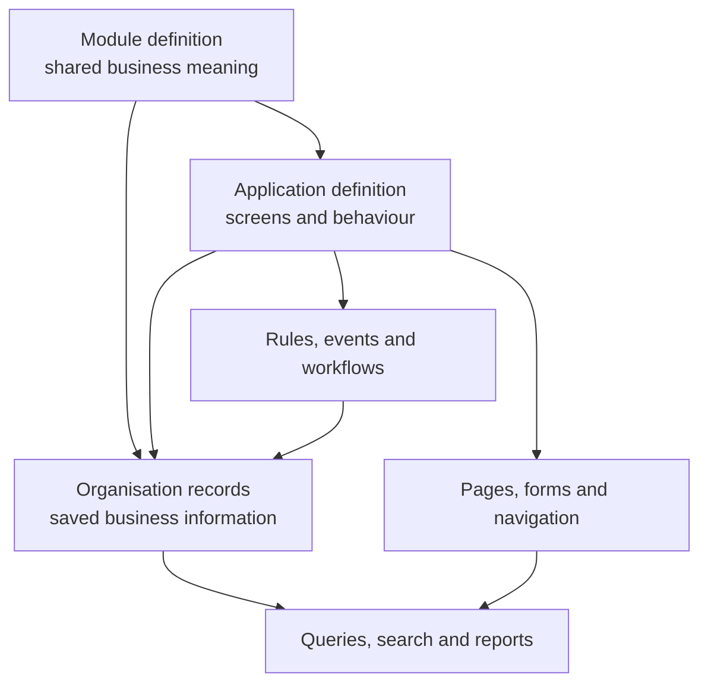
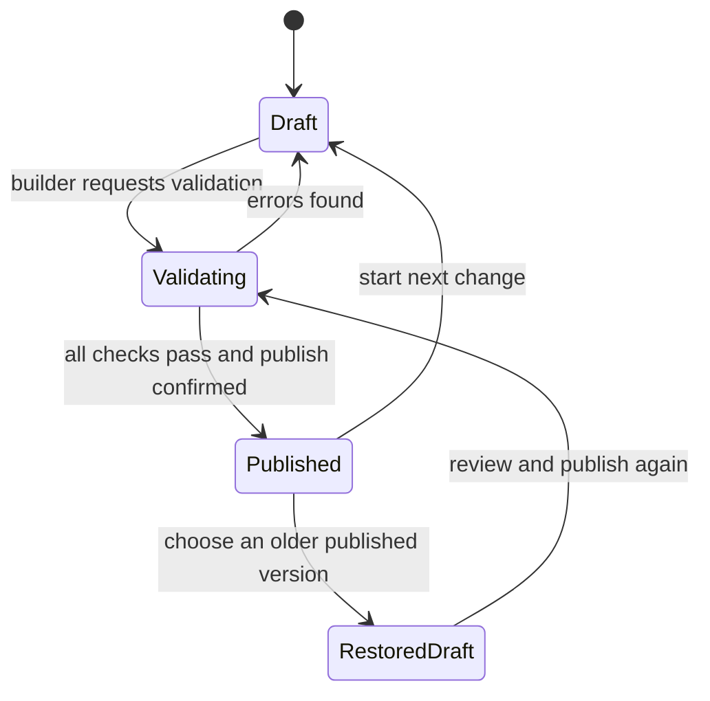
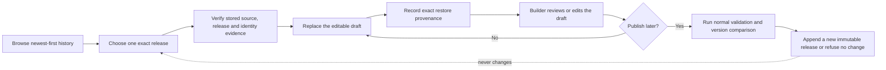
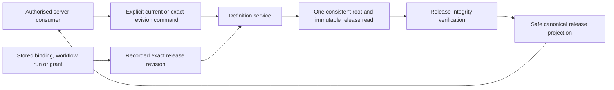
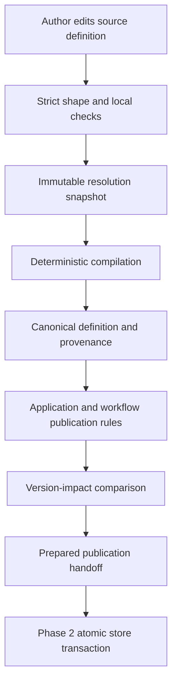
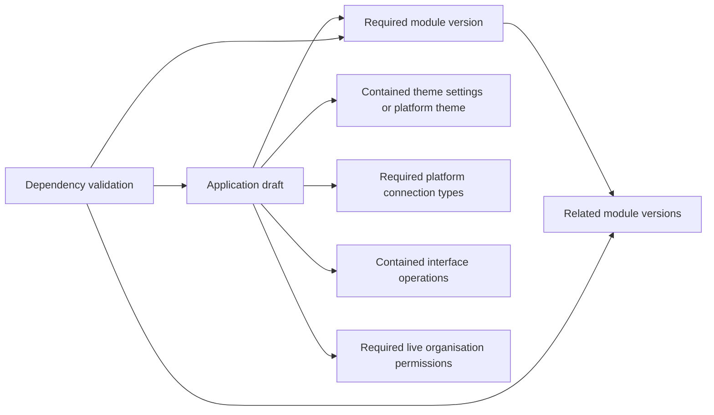

# 3. Platform composition and publication

[Previous: People, organisations and sign-in](02-people-organisations-and-sign-in.md) · [Specification index](README.md) · Next: [Access and permissions](04-access-and-permissions.md)

## The three composition layers

[Abzum Vortex](https://github.com/Abzum-NZ/Abzum-Vortex) separates reusable meaning, user experience, and saved information.

### Module layer

A [module](05-modules-fields-and-relationships.md) owns reusable business meaning: record types, fields, relationships, standard actions, and extension points. It does not own navigation, pages, branding, or an application-specific workflow.

### Application layer

An [application](07-applications-pages-and-themes.md) selects exact compatible module versions and adds the user experience: navigation, pages, forms, application roles, application actions, rules, events, workflows, pipelines, and themes.

### Organisation-data layer

[Records](06-records-and-lifecycle.md), files, organisation accounts, saved views, activity entries, workflow references, and organisation-attributed metering events belong to one organisation. Tenant-level entitlements and metering events belong to the tenant. None is part of a reusable definition.

## Definition ownership and versions

There are exactly two customer-managed publishable definitions. Each has its own independent version:

| Publishable definition | Components contained by it |
|---|---|
| Module | Record types, fields, relationships, module actions, business events, and extension points |
| Application | Module/version bindings, navigation, pages, forms, application roles, rules, events, workflows, pipelines, application actions, theme settings, connection bindings, and interfaces |

A module can be reused by several applications and therefore must evolve independently. An application pins an exact module version or an allowed range written with the standard [npm semantic-version range grammar](https://github.com/npm/node-semver#ranges), and publishing the application records the exact module versions that passed validation.

Themes, pages, workflows, rules, interfaces, and application roles do not publish independently: they are versioned as part of their application. Connection **types** and platform themes are platform catalogue items shipped with a platform release. Organisation roles, teams, connection instances, and tenant settings are live administrative data with activity history and access-version invalidation; they are not definition packages. Every contained component still has a stable identifier inside its owner so references survive label changes.

## Draft and published versions

Each module or application has one editable draft and zero or more immutable published versions.

- Editing changes only the draft.
- Publishing creates a numbered, immutable snapshot of the whole module or application and its contained components.
- The root's current published revision is only the discovery/default pointer used when preparing a new consumer. It is not a global live pointer; advancing it never changes a consumer's exact recorded release.
- A published snapshot records its complete immutable authored source and source-contract version as well as its canonical runtime content, author, time, source draft revision, validation result, and both source and canonical-content fingerprints.
- Restoring an older version creates a new draft. It never rewrites publication history.
- A live request resolves one published module/application version set and uses it for the full request.
- An application-to-module reference uses a stable module identifier plus an allowed version range or an explicitly pinned version. Publication records the exact resolved module version.

The platform calculates whether a proposed revision is patch, minor, or major from its stable identifiers and contract changes. Vortex assigns the minimum valid next release version. The builder reviews every reason for that calculated impact and either confirms publication or cancels it; the builder does not enter or override the release number. This keeps module and application histories consistent and prevents an accidental compatibility claim.

The complete classification, identity, ordering, history-integrity, and stale-confirmation rules are normative in the [module and application version-impact policy](appendices/version-impact-policy.md). First publication is `1.0.0`; semantically unchanged content cannot create a new release.

## Publication history and draft restoration

A trusted server caller can browse the immutable publication history of one Module or Application, inspect one exact history entry, and restore the authored source preserved in that release into the definition's one editable draft. History and restore use the same validated request context as other Phase 2 Definition operations. They expose no browser, public API or MCP route in this phase.

History listing is bounded and newest first. The caller chooses a page size from 1 through 100 and may continue before an exact positive release revision. A continuation returns only lower revisions, so a release added after page one does not duplicate, omit or reorder entries in that traversal. A fresh traversal sees the newer release. The service also provides an exact-revision metadata read.

Each history entry contains only the release revision and version, source and content fingerprints, required release note, publication actor and time, and whether that revision is the root's current discovery release. The enclosing result identifies the definition kind, organisation, key and permanent root, carries the current discovery revision when one exists, supplies a continuation only when more entries exist, and copies the request correlation identifier. The pointer and `isCurrent` values come from the same database statement. History does not return authored source, canonical content, compilation output, a resolution snapshot, dependency details or draft state.

Restore follows these rules:

- The command names the definition kind, matching permanent root, target release revision and expected current draft revision. It cannot supply source content, fingerprints, identities, actor, time, correlation evidence or release metadata.
- The service reads the selected release's stored authored source and evidence. It verifies the organisation, kind, root, permanent key, source-contract version, source fingerprint, canonical compilation, exact resolution snapshot and dependency evidence before changing the draft.
- The service derives the restored draft's current identity requirements from the verified authored source. Every required permanent identity and current alias must already exist, belong to the same source owner and agree with the immutable release snapshot. Restore never creates or repairs an identity or alias.
- One conditional draft update copies the stored source, increments the draft revision once and records the selected release revision and source fingerprint together with the validated actor, database time and request correlation identifier. A stale or missing draft changes nothing.
- The five restore-provenance values are all present or all absent and are bound by the database to that root's exact immutable source snapshot. A later successful ordinary draft save clears them together; a refused or stale save leaves them unchanged.
- Restore never creates a release, moves the current pointer, changes immutable history or retargets a consumer. A consumer already bound to an exact release remains bound to it.
- Later publication follows the ordinary publication rules. Content equal to the latest immutable release is refused as `no_change`; changed content receives the next governed version. Historical version, dependencies, publisher and time are not copied into the new release.

The first implementation restores the existing `1.0.0` authored-source contract. Before a future source-contract version can publish, its retained reader or explicit migration must keep older releases restorable. Vortex does not build a speculative source-migration framework or a second history, activity or cache store for this operation.

## Consumer reads of published definitions

Every server-side platform service reads a published Module or Application through one Definition-service operation. Its strict command names the definition kind, the matching permanent root, and exactly one selector: `current`, or `revision` with a JavaScript-safe positive immutable release revision. There is no implicit selector.

- `current` is discovery-only: an owning operation may use it when deliberately preparing a new binding. An installed application, saved binding, workflow run, grant, or in-flight request uses its recorded exact revision.
- A current read selects the root's current pointer and its immutable release together. An exact read selects only the named root and immutable revision; it never follows a dependency's current pointer or resolves a version range again.
- The request context's organisation, root kind, root, stored key and release evidence must agree before content is returned. Unknown, foreign, wrong-kind, unpublished-current and unknown-revision selections have one indistinguishable release-not-found outcome.
- The safe result contains only the kind, organisation, key, root, exact release revision and stable release version, validation-contract version, content and resolution fingerprints, complete canonical content, sorted complete exact dependency manifest, and copied correlation identifier. It excludes authored source, drafts, publication preparation, provenance, resolution-snapshot content, comparison evidence, notes, publisher information, times, cache state and persistence details.
- The Definition service verifies the stored canonical envelope, compiled artifact, release row, content fingerprint, resolution fingerprint, own snapshot entry and exact dependency manifest before returning a result. A dependency remains pinned to its stored exact root, revision, version and fingerprints. Each platform-catalogue evidence fingerprint belongs to that exact connection-type or theme release, so adding an unrelated catalogue release cannot invalidate it; a missing exact release is unavailable rather than substituted.
- Consumer reads are server-only and use the existing request transaction boundary. They implement no cache, browser or HTTP endpoint, token parsing, session creation, access decision, installation, upgrade, publication or consumer-specific rewriting.

## Validation before publication

Shape and rule failures use one [generic, versioned safe validation-error contract](appendices/data-contracts.md#definition-validation-errors). Installed application, module, record-type, field, workflow, connection, and fixture names never appear in the catalogue or translator. A builder-visible key appears only when the authorised caller explicitly maps an internal path to that safe location; deeper evidence remains protected under the same correlation identifier.

### Authored definition compilation

Authored JSON first passes the exported strict source contract. Publication then supplies an immutable resolution snapshot containing permanent identifiers, the exact available module, application and connection-type versions, and the operation keys of each connection type. Every contained identity assignment names its exact component owner, and the compiler verifies that owner from the parsed source component before trusting it. One global identifier-owner registry covers roots and contained components; aliases may share an identifier only when they name that same source-derived component, so changing both a sibling's identifier and claimed owner cannot hide a collision. The snapshot fingerprint covers the contract version, definitions and identity assignments; compilation refuses a mismatch and binds the same fingerprint into its output. The database-free compiler may resolve only values present in that snapshot, apply the documented [workflow execution defaults](09-workflows-and-pipelines.md), and add system-owned draft metadata supplied by its caller. It cannot allocate an identifier, select an undeclared version, infer a label, permission, layout, interface route, public exposure, data shape, or business rule.

The private Definition store derives those identity requirements from the same parsed-source catalogue used by the compiler and stores the exact requirements with the current draft. A component's authored `id` is its permanent owner; its readable key or public path is an alias. Identity rows and historical alias rows are append-only, but publication preparation exposes only aliases required by the current draft. Removing a component does not remove its historical rows, and a later reintroduction by the same owner receives the same platform identifier. A former alias can never be assigned to another owner. Nested components additionally retain a stable parent-owner scope based on the parent's authored `id`, while the current key-based scope remains the compiler lookup scope. Renaming a record type, page, workflow, or interface therefore adds new lookup aliases without changing the permanent identifiers of its fields, guided steps, workflow nodes, or interface operations, and an obsolete alias does not become a requirement for later compilation.

Saved sharing-condition revisions are derived from that permanent condition identifier and the complete immutable Module-release history; no mutable counter and no caller-supplied source alias is authoritative. The first appearance is revision `1`. An unchanged resolved contract keeps its revision, while any contract change increments it once. Removing a condition creates no new condition row, but its last revision remains in release history. Reintroducing the same permanent condition after an absence increments the revision even when its contract text is unchanged, so a grant pinned to the removed revision cannot silently begin matching again. The Definition service derives the revision before final compilation, and the compiler then recomputes the condition and Module fingerprints.

Every source leaf receives an exact source path in the returned provenance. Every canonical leaf maps back to an exact source leaf, an approved fixed default, a resolved value, or system metadata. The compiler maps source paths forward into canonical paths; it does not search backwards by value or choose a similarly named sibling. A source value may differ from its canonical leaf or map to a canonical component only when its exact source-path shape is in the compiler's closed transformation catalogue. Any newly accepted but unmapped source property therefore refuses compilation. When several approved source values produce a derived canonical leaf, provenance records every deepest mapped source leaf in that leaf's owning component and marks the mapping with the semantic-transformation or immutable-resolution rule. Publication verifies both sides of this coverage.

The publication caller supplies one strict [publication context contract](../../contracts/src/definition-compilation-contracts.ts): existing immutable compiled dependencies and the full prior published history for each module or application being published. Every compiled artifact binds its kind, definition key, permanent root, exact version, canonical-content fingerprint, and resolution-snapshot fingerprint. The artifact's exact version must equal the version assigned by the governed version-impact comparison; unchanged content and a snapshot prepared for another candidate version are refused. Each module dependency records its exact resolved version. An application or module accepts a dependency only when its kind, key, root, exact version, content fingerprint, resolution fingerprint, declared requirement, and snapshot entry all agree, and both the dependency artifact and dependency output must carry the requesting definition's resolution fingerprint. Matching a key or root, or presenting an internally consistent artifact from another snapshot, is insufficient.

Each immutable release stores its complete canonical compilation output and the exact resolution snapshot that produced it. This is required evidence, not a cache: a later component alias, dependency release, or catalogue update must not change how an older release is read or validated. The stored snapshot fingerprint, compilation-output fingerprints, release row and exact dependency manifest must agree before the release can be returned or used as a dependency.

Validation runs the governed version-impact comparison and assigns the minimum valid next version. Publication appends that release as inert immutable content and advances only its own definition root; it does not inspect, retarget, rewrite, or invalidate an existing application, installation, workflow, or sharing grant. Each existing consumer remains pinned to the exact release already recorded. Compatibility with a newer release is checked only when that consumer's owning operation deliberately prepares an application binding, installation upgrade, storage migration, or grant migration. Each application compilation result records an exact, one-for-one dependency manifest for its module and connection bindings. Publication rejects missing, duplicate, extra, differently resolved, or foreign-snapshot manifest entries, and confirms that every dependency selected for the new release satisfies that release's own declared requirement. Publishing one definition is therefore atomic without creating a dependency deadlock.

Edit/save validation performs strict shape, local identity, and local reference checks before publication resolution is available. Module definitions also check condition and action-value compatibility at edit/save because their fields and actions are local to the same source document. Application actions and workflows refer to bound module definitions, so their cross-definition types are checked at publication against the exact compiled dependencies rather than guessed during an isolated edit. Publication adds immutable-resolution, provenance, dependency, application, workflow, connection, and compatibility checks. Each validation engine is registered once under an honest aggregate owner and declares the closed failure codes it can emit; no cached wrapper pretends that one aggregate is several independent rules. Compiler refusals also come from one closed typed catalogue. A missing nested field, action, workflow node, or dependency identifies that authorised builder-visible component and never includes a submitted value or raw path.

Publication is refused unless:

1. Every referenced module, application component, and platform catalogue item exists.
2. Cross-definition version requirements are compatible.
3. Every field, page, filter, rule, action, workflow step, permission, cache tag, and connection setting matches its [data contract](appendices/data-contracts.md).
4. No circular dependency would prevent loading or publication.
5. Public pages expose only fields explicitly approved for public display under [access and permissions](04-access-and-permissions.md).
6. Every workflow path has an end state or a documented long-running wait.
7. Required translation, accessibility, and phone-layout checks pass under [quality and acceptance](20-quality-and-acceptance.md).
8. Any change affecting stored [records](06-records-and-lifecycle.md) is classified as breaking. Migration feasibility is checked only when an installation or application binding deliberately adopts that release.
9. Every dependency selected for this new immutable release satisfies the new release's declared requirement. Existing sharing grants remain pinned and are checked only by an explicit grant migration or revocation operation.
10. A record-scoped page has a primary subject and matching main form commit action. Each related panel, query, row and action resolves against its explicit typed binding context under [page builder contracts](appendices/page-builder-contracts.md#data-context-and-related-records). Public pages additionally restrict every selected, filtered, grouped, aggregated and sorted field, permission, action subject and action effect to the approved public surface.

## Dependency graph

Before publication, the platform builds a dependency graph for the candidate release from its selected module/application versions and contained-component references.

The candidate graph validates the release being created. Separate consumer graphs load live applications, prepare installations and upgrades, validate grant migrations, calculate cache invalidation, and explain why an installed or bound consumer cannot move to another release.

## Change compatibility

- Adding an optional field or component is compatible.
- Removing, renaming, narrowing, or changing meaning is classified as a breaking change. The new major release may publish, while each existing dependant remains pinned until its owner deliberately migrates it.
- Field type changes follow the explicit rules in [modules, fields and relationships](05-modules-fields-and-relationships.md).
- Interface version compatibility follows [connections and programmable interfaces](12-connections-and-interfaces.md).
- The platform never guesses that two differently identified definitions mean the same thing.

## Definition distribution is not record access

Copying or installing a published definition never grants access to the publisher's records. It creates a draft or installed definition owned by the receiving organisation, as described in [copying, sharing, import and export](16-copying-sharing-import-export.md#definition-packages).

A record-sharing grant is live access state owned by the [Access service](04-access-and-permissions.md#shared-record-access). It is not a definition, does not publish with an application, and does not change the definition dependency graph. A target application can use shared records only when it has a compatible binding to the source module; a grant never substitutes for the record-type definition needed to validate and display those records.

Cross-organisation sharing uses the same product behaviour for same-cluster and cross-cluster recipients. The detailed product behaviour is specified in [record sharing](16-copying-sharing-import-export.md#record-sharing).

The source and recipient application bindings must use a compatible published record contract. Installing a definition package records its source lineage, content fingerprint, and stable source-to-local component mapping. A recipient binding created from that lineage can prove how source record types and fields map to the local display definition. A separately authored module is not treated as compatible merely because its labels or database columns happen to look the same.

## Acceptance examples

- Publishing an application produces one consistent snapshot containing its pages, rules, workflows, and roles.
- Editing a page changes only the draft. Publication creates a new immutable application release; the live installation changes only through deliberate activation of that release.
- Removing a field referenced by content inside the same candidate release is refused. A breaking release may remove a field used by an older external dependant; that dependant remains on its prior exact release until a compatible migration is prepared.
- Restoring a prior published version creates a reviewable draft and does not erase later history.
- Installing or copying an application does not grant access to the publisher's records.
- A module and an application each retain their own release history; changing one never silently republishes the other.
- A target application without a compatible module binding cannot use a record grant.
- A cross-organisation grant does not copy records into the target organisation's storage.
- Revoking a sharing grant immediately removes the target's ability to query shared records.
- A cross-organisation grant never exposes fields classified as sensitive.
- Removing or changing a field used by an active grant creates a breaking release without changing that grant. Moving the grant to the new release requires a separately approved grant migration or revocation.
