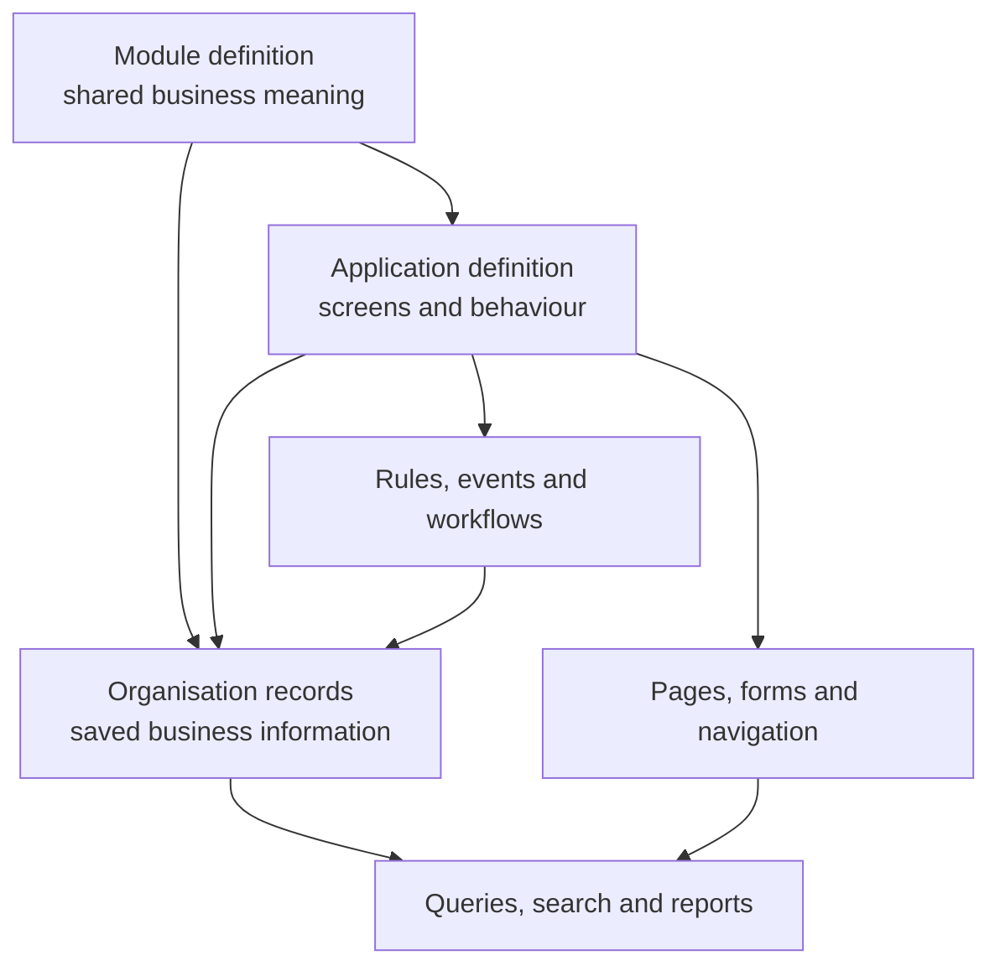
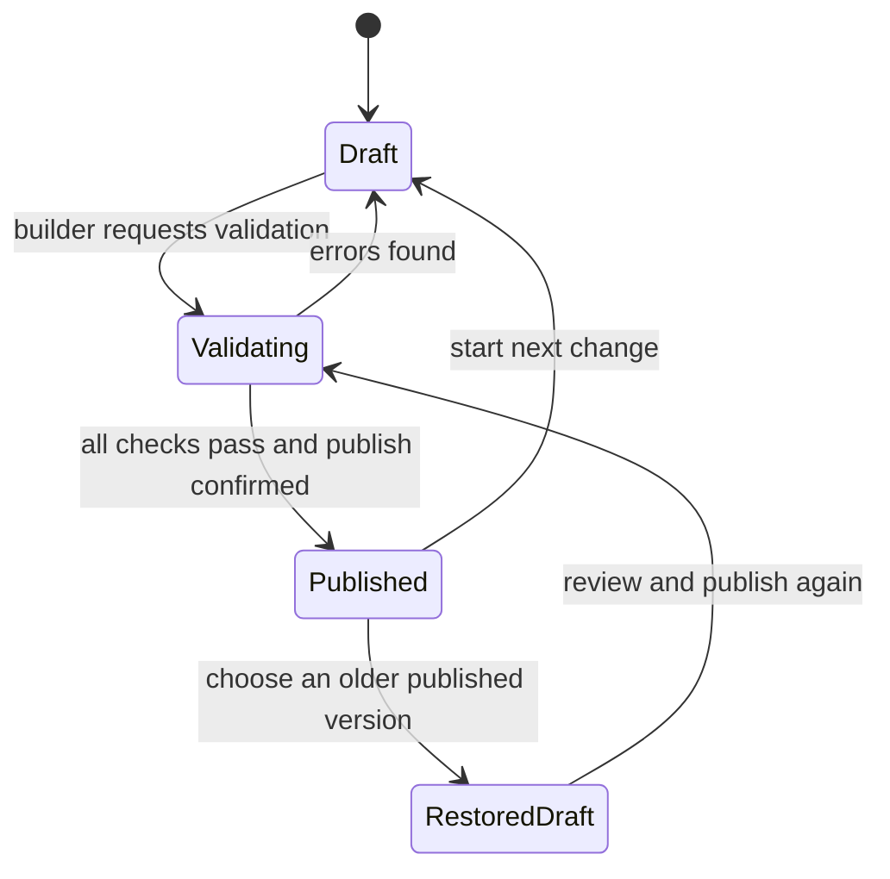
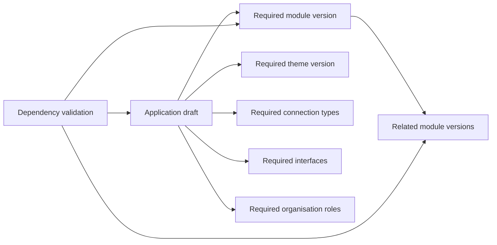

# 3. Platform composition and publication

[Previous: People, organisations and sign-in](02-people-organisations-and-sign-in.md) · [Specification index](README.md) · Next: [Access and permissions](04-access-and-permissions.md)

## The three composition layers

[Abzum Vortex](https://github.com/Abzum-NZ/Abzum-Vortex) separates reusable meaning, user experience, and saved information.

### Module layer

A [module](05-modules-fields-and-relationships.md) owns reusable business meaning: record types, fields, relationships, standard actions, and extension points. It does not own navigation, pages, branding, or an application-specific workflow.

### Application layer

An [application](07-applications-pages-and-themes.md) selects modules and adds the user experience: navigation, pages, forms, application roles, application actions, rules, events, workflows, pipelines, themes, and application-level field bindings.

### Organisation-data layer

[Records](06-records-and-lifecycle.md), files, organisation accounts, saved views, activity entries, workflow runs, usage, and billing belong to one organisation. They are not part of a reusable definition.

## Definition ownership

Every independently reusable item has one **root definition**. Components that have meaning only inside that root are contained by it.

| Root definition | Components contained by it |
|---|---|
| Module | Record types, fields, relationships, module actions, extension points |
| Application | Module bindings, navigation, pages, forms, application roles, rules, events, workflows, pipelines, application actions, theme binding |
| Theme | Design tokens and approved assets |
| Connection type | Connection settings, secret fields, allowed operations, retry and safety policy |
| Interface | Operations, input and output shapes, authentication policy, served versions |
| Organisation role | Organisation-wide permissions |

This table is the canonical resolution of the earlier envelope disagreement. A contained component has a stable identifier inside its root but does not have an independent publication lifecycle. See [Decision D02](appendices/decisions.md#d02-publication-boundaries) before treating this resolution as final.

## Draft and published versions

Each root definition has one editable draft and zero or more immutable published versions.

- Editing changes only the draft.
- Publishing creates a numbered, immutable snapshot of the whole root definition and its contained components.
- A published snapshot records its author, time, source draft revision, validation result, and content fingerprint.
- Restoring an older version creates a new draft. It never rewrites publication history.
- A live request resolves one published root version and uses it for the full request.
- References to other roots use a stable identifier plus an allowed version range or an explicitly pinned version.

## Validation before publication

Publication is refused unless:

1. Every referenced root and contained component exists.
2. Cross-definition version requirements are compatible.
3. Every field, page, filter, rule, action, workflow step, permission, cache tag, and connection setting matches its [data contract](appendices/data-contracts.md).
4. No circular dependency would prevent loading or publication.
5. Public pages expose only fields explicitly approved for public display under [access and permissions](04-access-and-permissions.md).
6. Every workflow path has an end state or a documented long-running wait.
7. Required translation, accessibility, and phone-layout checks pass under [quality and acceptance](20-quality-and-acceptance.md).
8. A migration plan exists for any change affecting stored [records](06-records-and-lifecycle.md).
9. An active sharing grant remains compatible with every referenced scope, action, field, condition, and contract fingerprint, or the publication includes an explicitly approved grant migration or revocation.

## Dependency graph

Before publication, the platform builds a dependency graph from root definitions and contained-component references.

The graph is used to validate publication, load the live application, copy definitions, calculate cache invalidation, and explain why a definition cannot be changed or removed.

## Change compatibility

- Adding an optional field or component is compatible.
- Removing, renaming, narrowing, or changing the meaning of something used elsewhere is incompatible until all dependants are updated.
- Field type changes follow the explicit rules in [modules, fields and relationships](05-modules-fields-and-relationships.md).
- Interface version compatibility follows [connections and programmable interfaces](12-connections-and-interfaces.md).
- The platform never guesses that two differently identified definitions mean the same thing.

## Definition distribution is not record access

Copying or installing a published definition never grants access to the publisher's records. It creates a draft or installed definition owned by the receiving organisation, as described in [copying, sharing, import and export](16-copying-sharing-import-export.md#definition-packages).

A record-sharing grant is live access state owned by the [Access service](04-access-and-permissions.md#shared-record-access). It is not a definition, does not publish with an application, and does not change the definition dependency graph. A target application can use shared records only when it has a compatible binding to the source module; a grant never substitutes for the record-type definition needed to validate and display those records.

Cross-organisation sharing is included with the same product behaviour for same-cluster and cross-cluster recipients under approved [Decision D31](appendices/decisions.md#d31-cross-organisation-sharing-release-scope). The detailed product behaviour is specified in [record sharing](16-copying-sharing-import-export.md#record-sharing).

The source and recipient application bindings must use a compatible published record contract. Installing a definition package records its source lineage, content fingerprint, and stable source-to-local component mapping. A recipient binding created from that lineage can prove how source record types and fields map to the local display definition. A separately authored module is not treated as compatible merely because its labels or database columns happen to look the same.

## Acceptance examples

- Publishing an application produces one consistent snapshot containing its pages, rules, workflows, and roles.
- Editing a page after publication does not change the live application until the application is published again.
- Removing a field referenced by a report, rule, page, or interface is refused with links to every dependant.
- Restoring a prior published version creates a reviewable draft and does not erase later history.
- Installing or copying an application does not grant access to the publisher's records.
- A target application without a compatible module binding cannot use a record grant.
- A cross-organisation grant does not copy records into the target organisation's storage.
- Revoking a sharing grant immediately removes the target's ability to query shared records.
- A cross-organisation grant never exposes fields classified as sensitive.
- Removing or changing a field used by an active grant is refused until the grant is safely revised or revoked.
