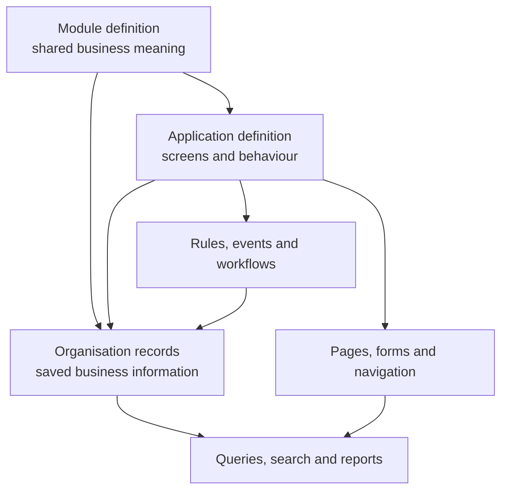
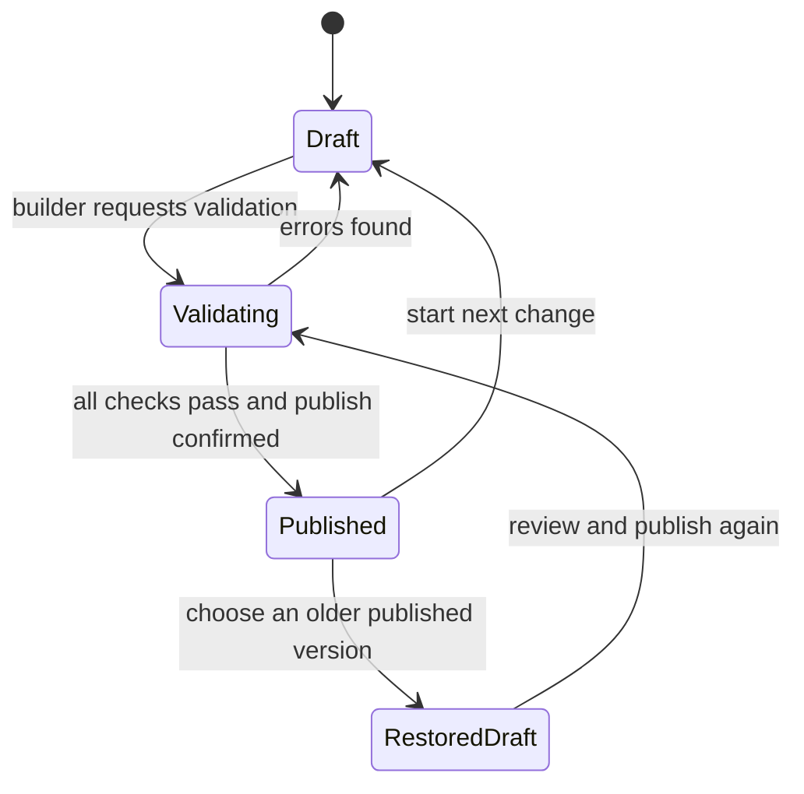
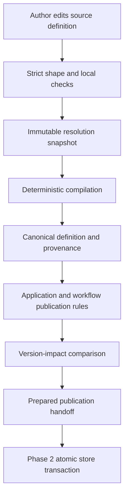
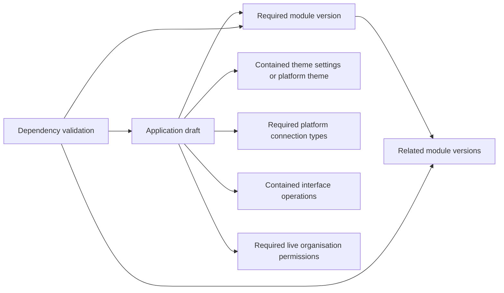

# 3. Platform composition and publication

[Previous: People, organisations and sign-in](02-people-organisations-and-sign-in.md) · [Specification index](README.md) · Next: [Access and permissions](04-access-and-permissions.md)

## The three composition layers

[Abzum Vortex](https://github.com/Abzum-NZ/Abzum-Vortex) separates reusable meaning, user experience, and saved information.

### Module layer

A [module](05-modules-fields-and-relationships.md) owns reusable business meaning: record types, fields, relationships, standard actions, and extension points. It does not own navigation, pages, branding, or an application-specific workflow.

### Application layer

An [application](07-applications-pages-and-themes.md) selects exact compatible module versions and adds the user experience: navigation, pages, forms, application roles, application actions, rules, events, workflows, pipelines, and themes.

### Organisation-data layer

[Records](06-records-and-lifecycle.md), files, organisation accounts, saved views, activity entries, workflow references, and organisation-attributed metering events belong to one organisation. Tenant-level entitlements and metering events belong to the tenant. None is part of a reusable definition.

## Definition ownership and versions

There are exactly two customer-managed publishable definitions. Each has its own independent version:

| Publishable definition | Components contained by it |
|---|---|
| Module | Record types, fields, relationships, module actions, business events, and extension points |
| Application | Module/version bindings, navigation, pages, forms, application roles, rules, events, workflows, pipelines, application actions, theme settings, connection bindings, and interfaces |

A module can be reused by several applications and therefore must evolve independently. An application pins an exact module version or an allowed range written with the standard [npm semantic-version range grammar](https://github.com/npm/node-semver#ranges), and publishing the application records the exact module versions that passed validation.

Themes, pages, workflows, rules, interfaces, and application roles do not publish independently: they are versioned as part of their application. Connection **types** and platform themes are platform catalogue items shipped with a platform release. Organisation roles, teams, connection instances, and tenant settings are live administrative data with activity history and access-version invalidation; they are not definition packages. Every contained component still has a stable identifier inside its owner so references survive label changes.

## Draft and published versions

Each module or application has one editable draft and zero or more immutable published versions.

- Editing changes only the draft.
- Publishing creates a numbered, immutable snapshot of the whole module or application and its contained components.
- A published snapshot records its complete immutable authored source and source-contract version as well as its canonical runtime content, author, time, source draft revision, validation result, and both source and canonical-content fingerprints.
- Restoring an older version creates a new draft. It never rewrites publication history.
- A live request resolves one published module/application version set and uses it for the full request.
- An application-to-module reference uses a stable module identifier plus an allowed version range or an explicitly pinned version. Publication records the exact resolved module version.

The platform calculates whether a proposed revision is patch, minor, or major from its stable identifiers and contract changes. Vortex assigns the minimum valid next release version. The builder reviews every reason for that calculated impact and either confirms publication or cancels it; the builder does not enter or override the release number. This keeps module and application histories consistent and prevents an accidental compatibility claim.

The complete classification, identity, ordering, history-integrity, and stale-confirmation rules are normative in the [module and application version-impact policy](appendices/version-impact-policy.md). First publication is `1.0.0`; semantically unchanged content cannot create a new release.

## Validation before publication

Shape and rule failures use one [generic, versioned safe validation-error contract](appendices/data-contracts.md#definition-validation-errors). Installed application, module, record-type, field, workflow, connection, and fixture names never appear in the catalogue or translator. A builder-visible key appears only when the authorised caller explicitly maps an internal path to that safe location; deeper evidence remains protected under the same correlation identifier.

### Authored definition compilation

Authored JSON first passes the exported strict source contract. Publication then supplies an immutable resolution snapshot containing permanent identifiers, the exact available module, application and connection-type versions, and the operation keys of each connection type. Every contained identity assignment names its exact component owner, and the compiler verifies that owner from the parsed source component before trusting it. One global identifier-owner registry covers roots and contained components; aliases may share an identifier only when they name that same source-derived component, so changing both a sibling's identifier and claimed owner cannot hide a collision. The snapshot fingerprint covers the contract version, definitions and identity assignments; compilation refuses a mismatch and binds the same fingerprint into its output. The database-free compiler may resolve only values present in that snapshot, apply the documented [workflow execution defaults](09-workflows-and-pipelines.md), and add system-owned draft metadata supplied by its caller. It cannot allocate an identifier, select an undeclared version, infer a label, permission, layout, interface route, public exposure, data shape, or business rule.

Every source leaf receives an exact source path in the returned provenance. Every canonical leaf maps back to an exact source leaf, an approved fixed default, a resolved value, or system metadata. The compiler maps source paths forward into canonical paths; it does not search backwards by value or choose a similarly named sibling. A source value may differ from its canonical leaf or map to a canonical component only when its exact source-path shape is in the compiler's closed transformation catalogue. Any newly accepted but unmapped source property therefore refuses compilation. When several approved source values produce a derived canonical leaf, provenance records every deepest mapped source leaf in that leaf's owning component and marks the mapping with the semantic-transformation or immutable-resolution rule. Publication verifies both sides of this coverage.

The publication caller supplies one strict [publication context contract](../../contracts/src/definition-compilation-contracts.ts): existing immutable compiled dependencies, the full prior published history for each module or application being published, and every active dependant or sharing reference. Every compiled artifact binds its kind, definition key, permanent root, exact version, canonical-content fingerprint, and resolution-snapshot fingerprint. The artifact's exact version must equal the version assigned by the governed version-impact comparison; unchanged content and a snapshot prepared for another candidate version are refused. Each module dependency records its exact resolved version. An application or module accepts a dependency only when its kind, key, root, exact version, content fingerprint, resolution fingerprint, declared requirement, and snapshot entry all agree, and both the dependency artifact and dependency output must carry the requesting definition's resolution fingerprint. Matching a key or root, or presenting an internally consistent artifact from another snapshot, is insufficient.

Validation runs the governed version-impact comparison and refuses publication when the assigned version falls outside an active dependant's declared range or a referenced component would become invalid. An active-dependant result carries the candidate and dependant identities, exact versions and content fingerprints, the comparison fingerprint, and a fingerprint over the reference-check result. Changing `references valid`, substituting another compiled definition, or replaying a result from another comparison therefore invalidates the publication context. Each application compilation result records an exact, one-for-one dependency manifest for its module and connection bindings. Publication rejects missing, duplicate, extra, differently resolved, or foreign-snapshot manifest entries, and confirms that every declared version requirement accepts its exact resolved version. Publishing one definition is therefore as strict as publishing a complete batch.

Edit/save validation performs strict shape, local identity, and local reference checks before publication resolution is available. Module definitions also check condition and action-value compatibility at edit/save because their fields and actions are local to the same source document. Application actions and workflows refer to bound module definitions, so their cross-definition types are checked at publication against the exact compiled dependencies rather than guessed during an isolated edit. Publication adds immutable-resolution, provenance, dependency, application, workflow, connection, and compatibility checks. Each validation engine is registered once under an honest aggregate owner and declares the closed failure codes it can emit; no cached wrapper pretends that one aggregate is several independent rules. Compiler refusals also come from one closed typed catalogue. A missing nested field, action, workflow node, or dependency identifies that authorised builder-visible component and never includes a submitted value or raw path.

Publication is refused unless:

1. Every referenced module, application component, and platform catalogue item exists.
2. Cross-definition version requirements are compatible.
3. Every field, page, filter, rule, action, workflow step, permission, cache tag, and connection setting matches its [data contract](appendices/data-contracts.md).
4. No circular dependency would prevent loading or publication.
5. Public pages expose only fields explicitly approved for public display under [access and permissions](04-access-and-permissions.md).
6. Every workflow path has an end state or a documented long-running wait.
7. Required translation, accessibility, and phone-layout checks pass under [quality and acceptance](20-quality-and-acceptance.md).
8. A migration plan exists for any change affecting stored [records](06-records-and-lifecycle.md).
9. An active sharing grant remains compatible with every referenced scope, action, field, condition, and contract fingerprint, or the publication includes an explicitly approved grant migration or revocation.
10. A record-scoped page, its query, commit action, replacement, blocks, and typed block references all target that page record; public pages additionally restrict every selected, filtered, grouped, aggregated, and sorted field, permission, action subject, and action effect to the approved public surface.

## Dependency graph

Before publication, the platform builds a dependency graph from module/application versions and contained-component references.

The graph is used to validate publication, load the live application, copy definitions, calculate cache invalidation, and explain why a definition cannot be changed or removed.

## Change compatibility

- Adding an optional field or component is compatible.
- Removing, renaming, narrowing, or changing the meaning of something used elsewhere is incompatible until all dependants are updated.
- Field type changes follow the explicit rules in [modules, fields and relationships](05-modules-fields-and-relationships.md).
- Interface version compatibility follows [connections and programmable interfaces](12-connections-and-interfaces.md).
- The platform never guesses that two differently identified definitions mean the same thing.

## Definition distribution is not record access

Copying or installing a published definition never grants access to the publisher's records. It creates a draft or installed definition owned by the receiving organisation, as described in [copying, sharing, import and export](16-copying-sharing-import-export.md#definition-packages).

A record-sharing grant is live access state owned by the [Access service](04-access-and-permissions.md#shared-record-access). It is not a definition, does not publish with an application, and does not change the definition dependency graph. A target application can use shared records only when it has a compatible binding to the source module; a grant never substitutes for the record-type definition needed to validate and display those records.

Cross-organisation sharing uses the same product behaviour for same-cluster and cross-cluster recipients. The detailed product behaviour is specified in [record sharing](16-copying-sharing-import-export.md#record-sharing).

The source and recipient application bindings must use a compatible published record contract. Installing a definition package records its source lineage, content fingerprint, and stable source-to-local component mapping. A recipient binding created from that lineage can prove how source record types and fields map to the local display definition. A separately authored module is not treated as compatible merely because its labels or database columns happen to look the same.

## Acceptance examples

- Publishing an application produces one consistent snapshot containing its pages, rules, workflows, and roles.
- Editing a page after publication does not change the live application until the application is published again.
- Removing a field referenced by a report, rule, page, or interface is refused with links to every dependant.
- Restoring a prior published version creates a reviewable draft and does not erase later history.
- Installing or copying an application does not grant access to the publisher's records.
- A module and an application each retain their own release history; changing one never silently republishes the other.
- A target application without a compatible module binding cannot use a record grant.
- A cross-organisation grant does not copy records into the target organisation's storage.
- Revoking a sharing grant immediately removes the target's ability to query shared records.
- A cross-organisation grant never exposes fields classified as sensitive.
- Removing or changing a field used by an active grant is refused until the grant is safely revised or revoked.
