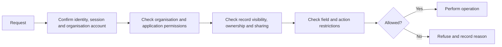
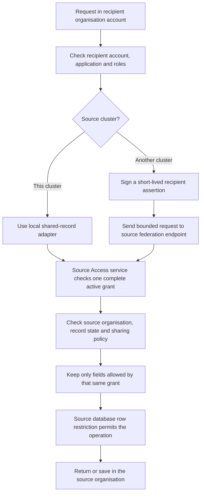

# 4. Access and permissions

[Previous: Platform composition and publication](03-composition-and-publication.md) · [Specification index](README.md) · Next: [Modules, fields and relationships](05-modules-fields-and-relationships.md)

## One access decision

Every protected operation asks one question: **May this person perform this action on this thing in this organisation?**

The decision receives:

- The global identity and active organisation account from [people, organisations and sign-in](02-people-organisations-and-sign-in.md).
- The requested action.
- The target definition, record, field, file, workflow, connection, or administration function.
- The current [application](07-applications-pages-and-themes.md), when the operation occurs inside an application.
- Record ownership, team, explicit sharing, and lifecycle state when a [record](06-records-and-lifecycle.md) is involved.

The result is either **allowed** or **refused**, with a stable reason code suitable for [activity history](14-activity-privacy-and-retention.md). An error, missing value, unknown permission, or unavailable access service produces **refused**.

## Where access is enforced

The same rules are expressed through two coordinated implementations:

1. A database decision function is the final protection for organisation-owned database rows.
2. A server access library calls the database decision for row operations and applies the same permission vocabulary to files, caches, search, workflows, connections, programmable interfaces, and the governed MCP surface.

The database function, permission vocabulary, and shared test cases are canonical. The system does not claim that one TypeScript function runs inside PostgreSQL. Parity is proved by the [access test suite](20-quality-and-acceptance.md#organisation-separation-suite).

## Roles

### Organisation roles

An organisation role grants permissions that apply across one organisation, such as managing members, definitions, connections, protected data handling, or all records of a named module. Tenant structure and entitlement administration use separate tenant permissions and never arrive through an organisation role.

### Application roles

An application role grants permissions inside one [application](07-applications-pages-and-themes.md), such as discovering the application, opening particular pages, performing named actions, or reading a record scope.

### Assignment

An organisation account may have several organisation roles and several application roles. The effective permission set is the union of active role grants, followed by field restrictions and record-scope restrictions. There is no hidden default administrator permission.

## Permission names

Permissions use permanent names, not display labels. A name identifies the area, resource, and action. Examples:

- `organisation.members.read`
- `organisation.members.manage`
- `module.example.record.read`
- `module.example.record.update`
- `application.example.open`
- `application.example.action.complete`

Unknown names are refused at publication and at runtime. An application role may use the single entry `*` to mean all non-administrative permissions declared by that exact published application version. It cannot be combined with another permission entry, cannot include permissions from a bound module, and cannot cover tenant or organisation administration, security, entitlements, protected data handling, export, or sharing administration. Module-scoped and trailing wildcards are not supported.

Publishing an application role resolves `*` against that application's permission catalogue and records the catalogue fingerprint and expanded permission identifiers. A permission added later is not silently granted; the role must be reviewed and published again.

## Record visibility

Permission to perform an action and visibility of a particular record are separate checks.

A record scope may include:

- All records the role can access.
- Records owned by the person.
- Records owned by a named team to which the person belongs.
- Records explicitly shared with the organisation account or any of its teams.
- Records reachable through an approved relationship from another visible record.
- A saved, validated condition defined by the application.

The scope is translated into database conditions. Records outside it must not be fetched and then hidden afterward.

### Direct record sharing inside one organisation

An authorised person may share one record directly with one organisation account or one team in the same organisation. The share has explicit readable and changeable field allowlists, optional expiry, grantor, recipient, reason, state, and activity history. A changeable field must also be readable.

The grantor must hold `record.share`, must be able to read every shared field, and must be able to change every changeable field. A direct share cannot grant delete, restore, export, re-share, ownership, role administration, or any permission the grantor does not hold. Team membership is evaluated on every request. Revocation, expiry, suspension, or team removal takes effect on the next request. Directly shared records appear in ordinary lists and search only where the receiving account also has application access and the page supports that record type.

## Field access

A role can allow or refuse reading or changing named fields. A response omits unreadable fields; it does not return them with blank or masked values unless a specific masking policy is later added to the [decision register](appendices/decisions.md).

Fields marked `sensitive` in [modules, fields and relationships](05-modules-fields-and-relationships.md) require an explicit read grant and are never copied to general search.

## Shared-record access

Sharing is an additional restriction, never a replacement for ordinary access. A recipient must pass both its own organisation/application checks and a source-issued grant. Missing, invalid, expired, or undecided information refuses access.

### Between applications in one organisation

For `organisation_shared` storage, each application must bind the module and grant its own roles the required permissions; a separate sharing grant is unnecessary. For `application_contained` storage, another application also needs an active inter-application grant. The recipient application must bind a compatible version of the module so it can validate and display the records.

An inter-application grant may provide collaborative access when the use case requires it. The grant names the readable fields, the smaller or equal set of changeable fields, and any published shareable actions. The recipient uses ordinary record components, but those components expose only the granted capabilities. The record remains owned and saved by its source application; collaboration does not create a recipient copy or permit ownership, deletion, restoration, permission administration, or re-sharing.

### Between organisations

A source organisation may grant limited access to a recipient organisation. The business checks and screens do not change when the organisations are in different clusters. The shared-record gateway chooses a local adapter inside one cluster or a signed request to the source cluster through the [Vortex Federation API](17-runtime-storage-and-caching.md#vortex-federation-between-clusters).

The request acts through the person's active organisation account in the recipient organisation. It never uses roles from another account held by the same global identity. For a cross-cluster request, the recipient cluster verifies that local account and signs a short-lived assertion of its identity, application, roles, and access version. The source accepts that assertion only from the registered recipient cluster and still makes the authoritative grant and record decision itself.

The access decision confirms all of the following:

1. The global identity, recipient organisation account, recipient organisation, and recipient application are active.
2. The recipient account can enter the one named recipient application and currently holds at least one of the recipient application roles named by the grant.
3. One active grant independently covers the source record, requested action, and requested fields.
4. The record still matches the grant's approved scope. A changing set uses only a version-pinned published saved sharing condition with approved parameter values; a grant never supplies an inline condition.
5. The source organisation, record lifecycle, retention, and legal-hold rules permit the operation.
6. For a cross-cluster request, the recipient cluster signature, intended source audience, issue and expiry times, one-use nonce, protocol version, content fingerprint, and approved recipient region are valid.

Two grants cannot be combined to manufacture permission: the scope from one grant cannot be joined to the action or fields of another. If several grants independently permit the same request, the request is allowed and the activity entry records the grant identifiers used.

### Shared actions, fields, and export

Cross-organisation grants use explicit readable-field, changeable-field, and allowed-action lists. They do not use broad levels such as `collaborative` or `full_edit`. A changeable field must also be readable, and an action must be published by the source definition as shareable before a grant may name it. Fields classified as `sensitive` are unavailable in the first release. Omitted fields are not returned as blank or masked values; they are absent.

Export is an independent boolean approval, defaults to refused, and is included in the exact proposal approved by both organisations. When allowed, the source produces only the grant's readable fields from records that still match the grant. Ownership changes, deletion, restoration, permission administration, and re-sharing are never implied by a field or action allowlist.

### Protected grant consent

An editable record or ordinary workflow cannot activate a cross-organisation grant. Every cross-organisation grant requires one authorised source consent and one authorised recipient consent for the same complete proposal fingerprint. The source side confirms the records, condition and parameters, actions, fields, export choice, recipient region, start, and expiry. The recipient side confirms the named application, roles, responsibility, region, start, and expiry.

Changing any fingerprinted value withdraws the earlier decisions and requires both sides to review the new proposal. The Access service owns the grant and activates it only after verifying both immutable consent decisions. An ordinary business approval record has no security effect on a grant.

A consent decision is not later rewritten as revoked. Ending access revokes the grant through a new authorised source action, preserving both original decisions and recording the revocation separately.

For a cross-cluster grant, each cluster stores its own protected consent evidence. The source grant is authoritative. The recipient stores only a routing and user-interface mirror plus the source's signed activation receipt. A missed receipt is repaired through [grant reconciliation](17-runtime-storage-and-caching.md#grant-activation-and-reconciliation), not by a distributed database transaction.

## Public access

Public access is not a role shortcut. A [public page or interface](12-connections-and-interfaces.md) has a narrowly published operation and explicit field list.

- A field is unavailable publicly unless its definition sets `public_display` to `allowed`.
- `public_display` defaults to `refused`.
- A sensitive field can never be public.
- Public create and update operations accept only explicitly listed fields and run validation, rules, rate limits, file checks, and abuse protection.
- Public operations do not reveal whether a private record exists unless the published operation requires that result.

Public create and update field lists are checked against the same `public_display` choice; an operation cannot make a field public by naming it alone.

## Access-change speed

Role, organisation-account, team, sharing, and public-policy changes increase an organisation access version. Every cached access answer includes that version. A request with an old version is recalculated.

The Access service stores exactly one positive, monotonically increasing counter per organisation. The counter begins at `1`, is not an Identity or organisation-account field, and can be read or incremented only through narrow server-side Access operations. An access-affecting change and its increment commit in one transaction; a refused, rolled-back, or duplicate change does not advance it. Concurrent changes use an atomic database increment so neither update is lost. The request-context boundary reads the live value after it has verified the selected active organisation account; it never accepts a browser-supplied version.

Access removal takes effect on the next request. Long-running work rechecks access before every protected side effect, and subscriptions close or re-authorise when their access version changes.

The recipient interface must remove previously displayed shared values when that next check is refused. It may retain non-content routing and activity references, but it cannot keep a visible snapshot, stale search result, component cache, or offline copy after the grant ends. A completed, separately approved export is the only exception because a downloaded file cannot be recalled.

## Administration safeguards

- A person cannot grant a permission they do not hold unless a separately authorised owner-recovery process is used.
- The last active tenant administrator and the last active organisation administrator cannot remove or demote themselves until a replacement is active.
- High-impact changes require recent sign-in confirmation.
- Tenant-administrator, hierarchy, role, organisation-account, team, direct-share, public-access, connection-secret, export, retention, entitlement and grant-consent changes are written to [activity history](14-activity-privacy-and-retention.md).

## Acceptance examples

- A person who can open a list but lacks record visibility never receives the hidden rows from the database.
- A direct share to any one of an account's teams grants only the named fields, and removing the account from that team removes access on the next request.
- A tenant administrator without a local organisation account and local role cannot read that organisation's records.
- Removing a role makes previously cached permission answers unusable.
- A page hidden in navigation remains protected when its address is entered directly.
- A public page cannot display a field merely because the field is not classified as personal data.
- Database tests and end-to-end tests use the same access examples but are run at the layer each example actually tests.
- A read-only cross-organisation grant does not allow creating, changing, deleting, exporting, commenting on, or attaching files to records.
- A sensitive field is never included in cross-organisation query results even when the grant does not specify a field mask.
- Revoking a cross-organisation grant makes previously cached permission answers for that grant unusable.
- Revoking an inter-application grant removes the shared values from the recipient component on its next access check; navigating back or using a client cache cannot reveal them.
- A collaborative inter-application grant changes only its named fields and runs only its named shareable actions against the source record.
- A person with accounts in both organisations cannot use roles from the source account while acting through the recipient account.
- Directly changing an ordinary approval record cannot activate a sharing grant.
- A cross-organisation grant with only one side's consent remains inactive.
- Adding an action, field, role, application, condition parameter, region, or later expiry invalidates both earlier approvals.
- Assigning a named role to another active account deliberately adds that account to the approved audience; removing the role removes access on the next request.
- Moving either organisation to another cluster in an already approved region does not change the grant's business meaning; the gateway changes route after the protected directory and grant routing state are updated and verified. Moving the recipient to a different region suspends the grant until the source approves that destination.
- A forged, expired, replayed, version-incompatible, or incorrectly addressed cross-cluster request is refused before any source record is queried.
