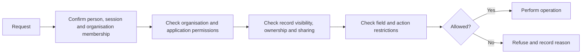

# 4. Access and permissions

[Previous: Platform composition and publication](03-composition-and-publication.md) · [Specification index](README.md) · Next: [Modules, fields and relationships](05-modules-fields-and-relationships.md)

## One access decision

Every protected operation asks one question: **May this person perform this action on this thing in this organisation?**

The decision receives:

- The person account and active organisation membership from [people, organisations and sign-in](02-people-organisations-and-sign-in.md).
- The requested action.
- The target definition, record, field, file, workflow, connection, or administration function.
- The current [application](07-applications-pages-and-themes.md), when the operation occurs inside an application.
- Record ownership, team, explicit sharing, and lifecycle state when a [record](06-records-and-lifecycle.md) is involved.

The result is either **allowed** or **refused**, with a stable reason code suitable for [activity history](14-activity-privacy-and-retention.md). An error, missing value, unknown permission, or unavailable access service produces **refused**.

## Where access is enforced

The same rules are expressed through two coordinated implementations:

1. A database decision function is the final protection for organisation-owned database rows.
2. A server access library calls the database decision for row operations and applies the same permission vocabulary to files, caches, search, workflows, connections, and programmable interfaces.

The database function, permission vocabulary, and shared test cases are canonical. The system does not claim that one TypeScript function runs inside PostgreSQL. Parity is proved by the [access test suite](20-quality-and-acceptance.md#organisation-separation-suite).

## Roles

### Organisation roles

An organisation role grants permissions that apply across the organisation, such as managing members, billing, definitions, connections, privacy work, or all records of a named module.

### Application roles

An application role grants permissions inside one [application](07-applications-pages-and-themes.md), such as discovering the application, opening particular pages, performing named actions, or reading a record scope.

### Assignment

A membership may have several organisation roles and several application roles. The effective permission set is the union of active role grants, followed by field restrictions and record-scope restrictions. There is no hidden default administrator permission.

## Permission names

Permissions use permanent names, not display labels. A name identifies the area, resource, and action. Examples:

- `organisation.members.read`
- `organisation.members.manage`
- `module.crm.contact.read`
- `module.crm.contact.update`
- `application.sales-hub.open`
- `application.sales-hub.action.convert-lead`

Unknown names are refused at publication and at runtime. Whether controlled wildcard grants are allowed remains [Decision D03](appendices/decisions.md#d03-permission-wildcards).

## Record visibility

Permission to perform an action and visibility of a particular record are separate checks.

A record scope may include:

- All records the role can access.
- Records owned by the person.
- Records owned by a named team to which the person belongs.
- Records explicitly shared with the person or one of their teams.
- Records reachable through an approved relationship from another visible record.
- A saved, validated condition defined by the application.

The scope is translated into database conditions. Records outside it must not be fetched and then hidden afterward.

## Field access

A role can allow or refuse reading or changing named fields. A response omits unreadable fields; it does not return them with blank or masked values unless a specific masking policy is later added to the [decision register](appendices/decisions.md).

Fields marked `sensitive` in [modules, fields and relationships](05-modules-fields-and-relationships.md) require an explicit read grant and are never copied to general search.

## Public access

Public access is not a role shortcut. A [public page or interface](12-connections-and-interfaces.md) has a narrowly published operation and explicit field list.

- A field is unavailable publicly unless its definition sets `public_display` to `allowed`.
- `public_display` defaults to `refused`.
- A sensitive field can never be public.
- Public create and update operations accept only explicitly listed fields and run validation, rules, rate limits, file checks, and abuse protection.
- Public operations do not reveal whether a private record exists unless the published operation requires that result.

The final business policy for public fields is [Decision D04](appendices/decisions.md#d04-public-field-approval).

## Access-change speed

Role, membership, team, sharing, and public-policy changes increase an organisation access version. Every cached access answer includes that version. A request with an old version is recalculated.

The platform must define and test the maximum time before a removal takes effect. The options are in [Decision D17](appendices/decisions.md#d17-access-change-speed).

## Administration safeguards

- A person cannot grant a permission they do not hold unless a separately authorised owner-recovery process is used.
- The last active organisation owner cannot remove or demote themselves until another owner is active.
- High-impact changes require recent sign-in confirmation.
- Role, membership, public-access, connection-secret, export, retention, and billing changes are written to [activity history](14-activity-privacy-and-retention.md).

## Acceptance examples

- A person who can open a list but lacks record visibility never receives the hidden rows from the database.
- Removing a role makes previously cached permission answers unusable.
- A page hidden in navigation remains protected when its address is entered directly.
- A public page cannot display a field merely because the field is not classified as personal data.
- Database tests and end-to-end tests use the same access examples but are run at the layer each example actually tests.
