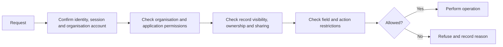
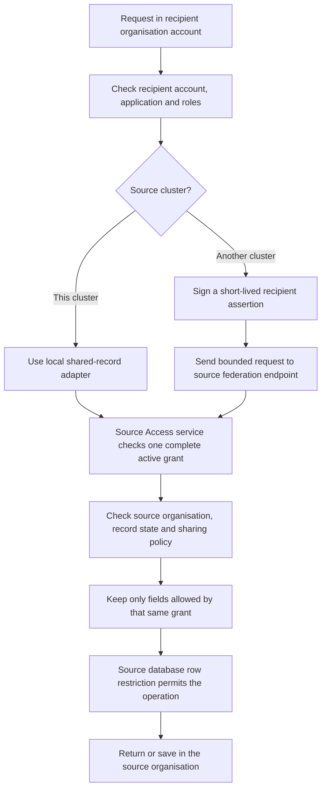

# 4. Access and permissions

[Previous: Platform composition and publication](03-composition-and-publication.md) · [Specification index](README.md) · Next: [Modules, fields and relationships](05-modules-fields-and-relationships.md)

## One access decision

Every protected operation asks one question: **May this person perform this action on this thing in this organisation?**

The decision receives:

- The global identity and active organisation account from [people, organisations and sign-in](02-people-organisations-and-sign-in.md).
- The requested action.
- The target definition, record, field, file, workflow, connection, or administration function.
- The current [application](07-applications-pages-and-themes.md), when the operation occurs inside an application.
- Record ownership, team, explicit sharing, and lifecycle state when a [record](06-records-and-lifecycle.md) is involved.

The result is either **allowed** or **refused**, with a stable reason code suitable for [activity history](14-activity-privacy-and-retention.md). An error, missing value, unknown permission, or unavailable access service produces **refused**.

## Where access is enforced

The same rules are expressed through two coordinated implementations:

1. A database decision function is the final protection for organisation-owned database rows.
2. A server access library calls the database decision for row operations and applies the same permission vocabulary to files, caches, search, workflows, connections, and programmable interfaces.

The database function, permission vocabulary, and shared test cases are canonical. The system does not claim that one TypeScript function runs inside PostgreSQL. Parity is proved by the [access test suite](20-quality-and-acceptance.md#organisation-separation-suite).

## Roles

### Organisation roles

An organisation role grants permissions that apply across the organisation, such as managing members, billing, definitions, connections, privacy work, or all records of a named module.

### Application roles

An application role grants permissions inside one [application](07-applications-pages-and-themes.md), such as discovering the application, opening particular pages, performing named actions, or reading a record scope.

### Assignment

An organisation account may have several organisation roles and several application roles. The effective permission set is the union of active role grants, followed by field restrictions and record-scope restrictions. There is no hidden default administrator permission.

## Permission names

Permissions use permanent names, not display labels. A name identifies the area, resource, and action. Examples:

- `organisation.members.read`
- `organisation.members.manage`
- `module.crm.contact.read`
- `module.crm.contact.update`
- `application.sales-hub.open`
- `application.sales-hub.action.convert-lead`

Unknown names are refused at publication and at runtime. Whether controlled wildcard grants are allowed remains [Decision D03](appendices/decisions.md#d03-permission-wildcards).

## Record visibility

Permission to perform an action and visibility of a particular record are separate checks.

A record scope may include:

- All records the role can access.
- Records owned by the person.
- Records owned by a named team to which the person belongs.
- Records explicitly shared with the organisation account or one of its teams only if [D24](appendices/decisions.md#d24-individual-record-sharing) includes direct record sharing.
- Records reachable through an approved relationship from another visible record.
- A saved, validated condition defined by the application.

The scope is translated into database conditions. Records outside it must not be fetched and then hidden afterward.

## Field access

A role can allow or refuse reading or changing named fields. A response omits unreadable fields; it does not return them with blank or masked values unless a specific masking policy is later added to the [decision register](appendices/decisions.md).

Fields marked `sensitive` in [modules, fields and relationships](05-modules-fields-and-relationships.md) require an explicit read grant and are never copied to general search.

## Shared-record access

Sharing is an additional restriction, never a replacement for ordinary access. A recipient must pass both its own organisation/application checks and a source-issued grant. Missing, invalid, expired, or undecided information refuses access.

### Between applications in one organisation

For `organisation_shared` storage, each application must bind the module and grant its own roles the required permissions; a separate sharing grant is unnecessary. For `application_contained` storage, another application also needs an active inter-application grant. The recipient application must bind a compatible version of the module so it can validate and display the records.

### Between organisations

A source organisation may grant limited access to a recipient organisation under approved [D31](appendices/decisions.md#d31-cross-organisation-sharing-release-scope). The business checks and screens do not change when the organisations are in different clusters. The shared-record gateway chooses a local adapter inside one cluster or a signed request to the source cluster through the [Vortex Federation API](17-runtime-storage-and-caching.md#vortex-federation-between-clusters).

The request acts through the person's active organisation account in the recipient organisation. It never uses roles from another account held by the same global identity. For a cross-cluster request, the recipient cluster verifies that local account and signs a short-lived assertion of its identity, application, roles, and access version. The source accepts that assertion only from the registered recipient cluster and still makes the authoritative grant and record decision itself.

The access decision confirms all of the following:

1. The global identity, recipient organisation account, recipient organisation, and recipient application are active.
2. The recipient account has a role allowed by the grant under [D32](appendices/decisions.md#d32-recipient-audience).
3. One active grant independently covers the source record, requested action, and requested fields.
4. The record still matches the grant's approved scope under [D27](appendices/decisions.md#d27-filter-grant-condition-complexity).
5. The source organisation, record lifecycle, retention, and legal-hold rules permit the operation.
6. For a cross-cluster request, the recipient cluster signature, intended source audience, issue and expiry times, one-use nonce, protocol version, content fingerprint, and approved recipient region are valid.

Two grants cannot be combined to manufacture permission: the scope from one grant cannot be joined to the action or fields of another. If several grants independently permit the same request, the request is allowed and the activity entry records the grant identifiers used.

### Shared actions, fields, and export

Cross-organisation grants use explicit readable-field and allowed-action lists. They do not use the ambiguous `full_edit` shortcut. Fields classified as `sensitive` are unavailable in the first release. Omitted fields are not returned at all. Export is a separate permission and is refused unless the grant explicitly allows it. The final collaboration policy is [Decision D33](appendices/decisions.md#d33-shared-actions-fields-and-export).

### Protected approvals

The platform-owned `vortex.approvals` capability presents approval requests in the Organisation Portal, but an editable record or workflow cannot activate a grant. The Access service owns the grant and activates it only after verifying the required immutable approval decisions. Changing a displayed approval record directly has no security effect.

An approval decision is not later rewritten as revoked. Ending access revokes the grant through a new authorised action, preserving the original decision and recording the revocation separately. Approval ownership remains [Decision D26](appendices/decisions.md#d26-cross-organisation-sharing-approval).

For a cross-cluster grant, each cluster stores its own protected approval evidence. The source grant is authoritative. The recipient stores only a routing and user-interface mirror plus the source's signed activation receipt. A missed receipt is repaired through [grant reconciliation](17-runtime-storage-and-caching.md#grant-activation-and-reconciliation), not by a distributed database transaction.

## Public access

Public access is not a role shortcut. A [public page or interface](12-connections-and-interfaces.md) has a narrowly published operation and explicit field list.

- A field is unavailable publicly unless its definition sets `public_display` to `allowed`.
- `public_display` defaults to `refused`.
- A sensitive field can never be public.
- Public create and update operations accept only explicitly listed fields and run validation, rules, rate limits, file checks, and abuse protection.
- Public operations do not reveal whether a private record exists unless the published operation requires that result.

The final business policy for public fields is [Decision D04](appendices/decisions.md#d04-public-field-approval).

## Access-change speed

Role, organisation-account, team, sharing, and public-policy changes increase an organisation access version. Every cached access answer includes that version. A request with an old version is recalculated.

The platform must define and test the maximum time before a removal takes effect. The options are in [Decision D17](appendices/decisions.md#d17-access-change-speed).

## Administration safeguards

- A person cannot grant a permission they do not hold unless a separately authorised owner-recovery process is used.
- The last active organisation owner cannot remove or demote themselves until another owner is active.
- High-impact changes require recent sign-in confirmation.
- Role, organisation-account, public-access, connection-secret, export, retention, and billing changes are written to [activity history](14-activity-privacy-and-retention.md).

## Acceptance examples

- A person who can open a list but lacks record visibility never receives the hidden rows from the database.
- Removing a role makes previously cached permission answers unusable.
- A page hidden in navigation remains protected when its address is entered directly.
- A public page cannot display a field merely because the field is not classified as personal data.
- Database tests and end-to-end tests use the same access examples but are run at the layer each example actually tests.
- A read-only cross-organisation grant does not allow creating, changing, deleting, exporting, commenting on, or attaching files to records.
- A sensitive field is never included in cross-organisation query results even when the grant does not specify a field mask.
- Revoking a cross-organisation grant makes previously cached permission answers for that grant unusable.
- A person with accounts in both organisations cannot use roles from the source account while acting through the recipient account.
- Directly changing an approval record cannot activate a sharing grant.
- Moving either organisation to another cluster in an already approved region does not change the grant's business meaning; the gateway changes route after the protected directory and grant routing state are updated and verified. Moving the recipient to a different region suspends the grant until the source approves that destination.
- A forged, expired, replayed, version-incompatible, or incorrectly addressed cross-cluster request is refused before any source record is queried.
