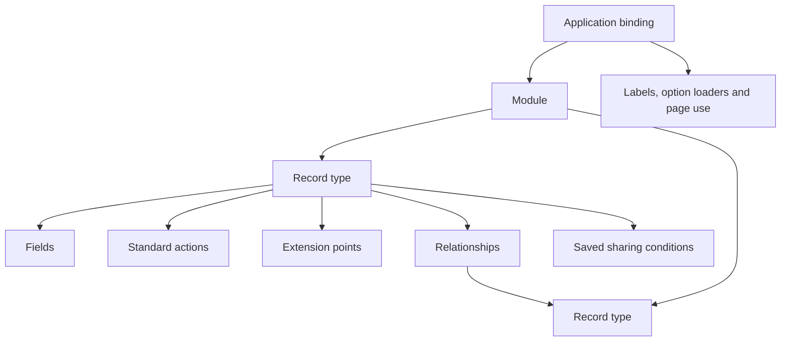
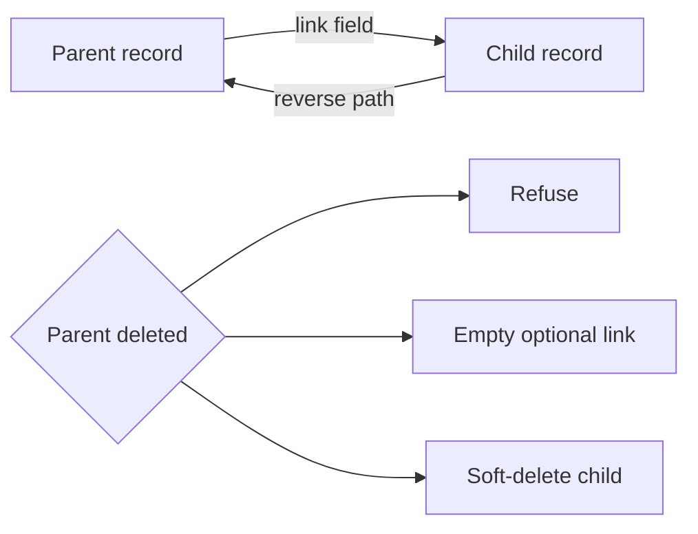

# 5. Modules, fields and relationships

[Previous: Access and permissions](04-access-and-permissions.md) · [Specification index](README.md) · Next: [Records and their lifecycle](06-records-and-lifecycle.md)

## Module composition

A **module** is a reusable description of related business information. It owns record types, fields, relationships, standard actions, and named extension points. It does not own pages, navigation, branding, or application-specific workflows.

Examples are provided in the [CRM and Service Desk worked examples](appendices/worked-examples.md).

## Module requirements

A module definition records:

- A permanent key, display name, description, and owning publisher.
- Its [published versions](03-composition-and-publication.md).
- Its record types and the relationships between them.
- Dependencies on other modules and allowed versions. A dependency is required when a link field targets a record type in another module.
- Standard record actions and extension points.
- Whether its records are shared across applications in an organisation or kept within one application.
- Import, export, search, retention, and activity defaults that applications may narrow but not silently weaken.

## Record types

Each record type has:

- A permanent key and a singular and plural label.
- One required title field used when a record is linked or shown in a compact result.
- A stable storage identity.
- A field collection.
- An ownership mode.
- Supported standard actions such as create, read, update, soft-delete, restore, and export.
- Optional custom actions declared by the module.
- Optional saved sharing conditions with permanent identifiers, typed parameter contracts, closed condition trees, and publication tests. Grants pin one published revision and cannot supply their own condition.
- Relationships and reverse relationships.
- An organisation-shared or application-contained storage scope.

## Common field properties

Every field carries the following properties. Properties marked “optional” have the listed default.

| Property | Requirement |
|---|---|
| `key` | Required permanent name, 1–40 characters, unique in the record type. |
| `type` | Required field type from the list below. |
| `label` | Required user-facing text, 1–60 characters. |
| `help_text` | Optional explanation, at most 200 characters. |
| `required` | Optional; defaults to false. |
| `default` | Optional valid starting value or approved calculation. |
| `unique` | Optional; defaults to false and applies within the record type's storage scope. |
| `filterable` | Optional; defaults to false. |
| `sortable` | Optional; defaults to false. |
| `search` | Optional search priority: `first`, `normal`, or `last`. |
| `personal_data` | Required: `none`, `personal`, or `sensitive`. |
| `public_display` | Required: `refused` or `allowed`; defaults to `refused`, and a public operation must separately allowlist the field. |
| `settings` | The settings allowed for the selected field type. |

Unknown properties are refused. Type-specific properties belong inside `settings`.

## Field types

The platform supports these twenty-two types:

| Type key | Meaning | Main settings |
|---|---|---|
| `text` | One line of text | Maximum length and optional format |
| `long_text` | Several lines of plain text | Maximum length |
| `formatted_text` | Restricted formatted content | Allowed formatting and maximum length |
| `whole_number` | Integer | Minimum, maximum, and step |
| `decimal_number` | Decimal value | Digits before and after the decimal point, minimum, maximum |
| `money` | Monetary value | Currency, minimum, maximum |
| `yes_no` | Boolean value | None |
| `date` | Calendar date | Earliest and latest date |
| `date_time` | Time-zone-aware instant | Display time zone policy |
| `choice` | One defined option | Options |
| `several_choices` | Several defined options | Options and maximum selections |
| `reference_number` | Platform-issued sequence | Digits, prefix, suffix, starting number |
| `email_address` | Email address | None |
| `phone_number` | Telephone number | Default country |
| `web_address` | Web address | None |
| `table` | Repeating structured rows | Columns and minimum/maximum rows |
| `link` | Link to one record type | Target, delete behaviour, reverse name |
| `link_to_one_of_several` | Link to one of several record types | Allowed targets |
| `link_to_person` | Link to an organisation account | Optional application-access requirement through an application binding |
| `calculation` | Value calculated from the record | Expression and result type |
| `total` | Aggregate across a relationship | Relationship, operation, field, filter |
| `attachment` | One or more files | The canonical settings in [files and attachments](11-files-and-attachments.md) |

There is no separate duration type in this release. Each calendar page explicitly selects either start and end date-time fields, or a start date-time plus a whole-number duration field and unit. Missing or invalid inputs are shown as invalid data; the platform never guesses an end time or unit.

## Calculations and totals

- A calculation is deterministic and cannot perform network calls, change records, or read data the current operation is not allowed to read.
- Calculation dependencies are known at publication and cycles are refused.
- A total names one relationship, operation, optional source field, and optional safe filter.
- Supported operations are count, sum, minimum, maximum, and average where the source type permits them.
- A money total is valid only when every included non-empty value uses one currency. A mixed-currency total is refused with a stable error that identifies the currency codes present. Vortex never silently converts or splits the total.

## Relationships

A relationship has one owning field and a generated or explicitly named reverse path.

Allowed parent-deletion behaviour is:

- Refuse deletion while active children exist.
- Empty an optional link.
- Soft-delete dependent children.

Emptying a required link is invalid. Deleting a referenced parent is refused while required links remain. A relationship may explicitly declare dependent ownership; only then may deleting the parent soft-delete its dependent children in the same protected operation.

Many-to-many relationships use an explicit joining record type so ownership, permissions, activity, fields, and deletion behaviour remain visible.

### Cross-module relationships

A link field may target a record type in another module. The owning module declares a dependency on the target module with an allowed version range. In builder-facing contracts, the link uses the declared dependency key followed by the target record-type key. Published contracts resolve both to stable platform identifiers; a text key is never treated as sufficient identity by itself.

Cross-module links follow the same relationship rules as intra-module links: one owning field, a generated or named reverse path, and a declared parent-deletion behaviour. The dependency graph built during [publication](03-composition-and-publication.md#dependency-graph) validates that the target module exists, the version is compatible, and the target record type is present.

Removing a record type that is the target of a cross-module link is an incompatible change and is refused with links to every dependent module.

A relationship still joins records owned by the same organisation. Viewing a source organisation's record through a cross-organisation grant does not permit creating a stored relationship from a recipient-owned record to that source record. A separately designed federation-reference field would be required for that future behaviour.

## Application-level bindings

When reusable module meaning depends on an application, the application creates a binding rather than changing the module definition. Bindings may provide:

- An application-specific label or help text.
- A workflow-backed option loader.
- A requirement that a linked person has access to the application.
- Page-specific default values or display choices.
- A narrower list of allowed actions or visible fields.

A binding cannot weaken module validation, personal-data classification, or [access rules](04-access-and-permissions.md).

## Extension points

A module may open named extension points on selected record types for additional fields and actions.

- A contributing module adds a field or action under its own namespace, so two contributors cannot collide.
- An organisation may add its own field or action through the same declared extension point.
- Contributions are additive. They cannot remove, retype, reorder, or weaken the target module's own fields, actions, relationships, or permissions.
- Pages and choice options are not module contributions; pages belong to an [application](07-applications-pages-and-themes.md), and options belong to the field or an [application binding](#application-level-bindings).
- Removing an extension point is a breaking module change.
- Uninstalling a contributor hides its fields and actions but preserves stored values through the ordinary [retention](14-activity-privacy-and-retention.md) policy so reinstall can restore them.
- A target-module upgrade is refused when it would break an installed contribution, and the refusal links every affected organisation definition.

When several allowed sources provide presentation defaults, the resolution order is module, publisher contribution, application binding, then organisation contribution. A later source may add or narrow presentation but cannot weaken access, validation, privacy, or required business meaning.

## Field changes after publication

Compatible changes include labels, help text, and adding an optional field. Widening a text length or a permitted numeric range is compatible when storage and dependants remain valid.

Changing stored meaning is never an arbitrary in-place retype. Only a proven widening change may update a field in place. Every other type change uses add, migrate, switch, and retire: add a new field, migrate values through an explicit [database change](18-delivery-and-testing.md), switch every dependant after validation, and retire the old field only when no published dependency or retained workflow run uses it.

## Acceptance examples

- A module can be used by two applications without inheriting either application's pages or workflows.
- A field with an unknown property or unsupported setting cannot be published.
- A required relationship cannot be configured to become empty on parent deletion.
- A workflow-backed choice belongs to an application binding, not to the reusable module.
- Every reference in the [CRM and Service Desk examples](appendices/worked-examples.md) resolves to a published module, application component, or documented platform definition.
- A link field targeting a record type in another module requires a declared module dependency.
- Removing a record type targeted by a cross-module link is refused with links to every dependent module.
- A cross-organisation grant does not bypass the same-organisation rule for stored relationships.
