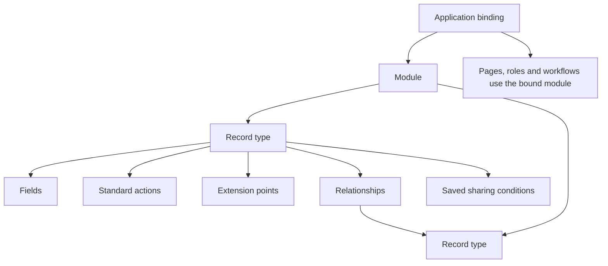
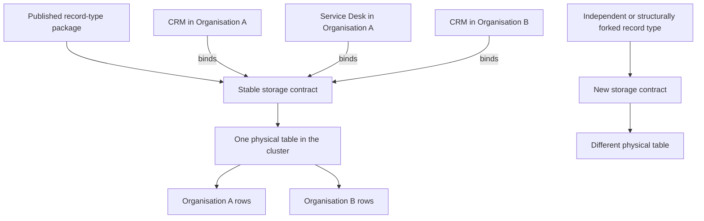
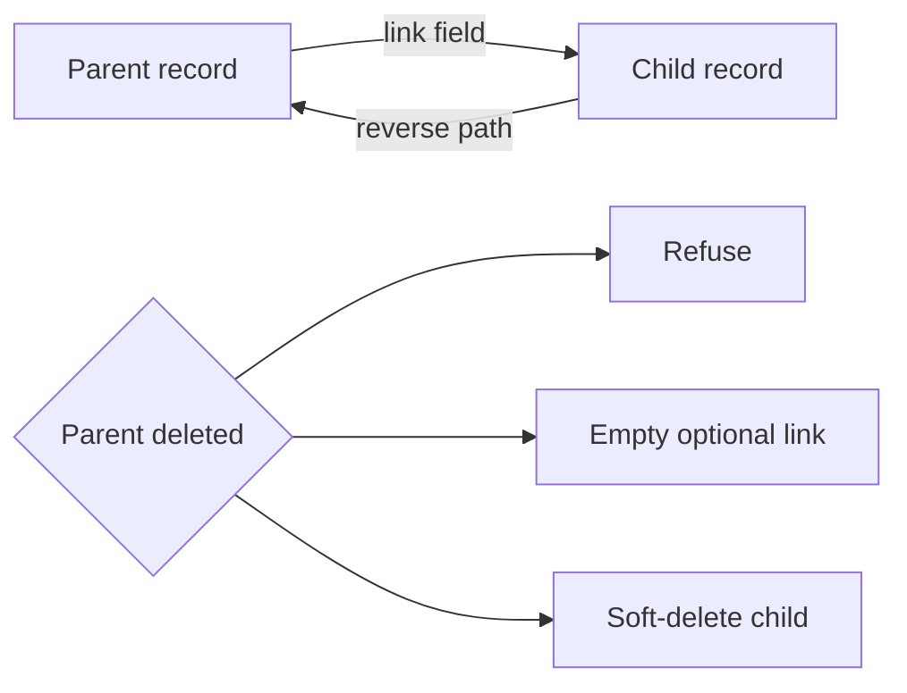

# 5. Modules, fields and relationships

[Previous: Access and permissions](04-access-and-permissions.md) · [Specification index](README.md) · Next: [Records and their lifecycle](06-records-and-lifecycle.md)

## Module composition

A **module** is a reusable description of related business information. It owns record types, fields, relationships, standard actions, and named extension points. It does not own pages, navigation, branding, or application-specific workflows.

Examples are provided in the [CRM and Service Desk worked examples](appendices/worked-examples.md).

## Module requirements

A module definition records:

- A permanent key, display name, description, and owning publisher.
- Its [published versions](03-composition-and-publication.md).
- Its record types and the relationships between them.
- Dependencies on other modules and allowed versions. A dependency is required when a link field targets a record type in another module.
- Standard record actions and extension points.
- Whether its records are shared across applications in an organisation or kept within one application.
- Import, export, search, retention, and activity defaults that applications may narrow but not silently weaken.

A module may expose a versioned, named query for application flows. That contract fixes its record source, typed inputs, projection, filters, ordering, grouping and bounded result shape through the ordinary [Query service](10-queries-reports-search.md); it is not raw SQL or a label-selected handler. An application flow binds the exact installed module release and query identity, and every execution still applies current tenant, application, record, field and sharing access.

## Record types

Each record type has:

- A permanent key and a singular and plural label.
- One required title field used when a record is linked or shown in a compact result.
- A stable storage identity.
- A field collection.
- An ownership mode.
- Supported standard actions such as create, read, update, soft-delete, restore, and export.
- Optional custom actions declared by the module.
- Optional saved sharing conditions with permanent identifiers, typed parameter contracts, closed condition trees, and publication tests. Grants pin one published revision and cannot supply their own condition.
- Relationships and reverse relationships.
- An organisation-shared or application-contained storage scope.

## Storage identity and application use

Applications do not own database table shapes. Modules own record types, and each record type names one permanent `storage_contract_id`. That identifier represents the compatible physical-storage lineage of the record type independently of its display name, builder key, owning organisation, application, or published version.

The rules are:

- Installing the same signed definition package in several organisations preserves its storage-contract identities. The installations use the same physical tables, while `organisation_id` separates their rows.
- Binding the same record type into several applications does not create another table. For `organisation_shared` storage, authorised applications in the same organisation can use the same record. For `application_contained` storage, `application_root_id` separates each application's records inside the table.
- Two independently created definitions never share storage merely because their application, module, record type, or field names match. They have different root and storage-contract identities and therefore different tables.
- Copying or editing presentation, pages, roles, workflows, and application bindings does not fork storage. A definition change that creates independently evolving stored meaning creates a new storage-contract lineage before publication.
- Compatible releases in one storage lineage use the same table and an explicit migration. Incompatible stored meaning uses add, migrate, switch, and retire or a new lineage; it never silently reuses a similar-looking table.
- A physical table name is allocated from the permanent storage-contract identity and a business-field column name from the permanent field identity. Mutable labels, keys, organisation names, application names, and module names never form SQL identifiers.
- The Record service catalog is the authoritative mapping from definition identities to physical tables and columns. It refuses duplicate physical names, missing mappings, a field mapped twice in one table, or a mapping to a table owned by another service.

This keeps the number of tables proportional to genuinely different record-type structures rather than organisations multiplied by applications multiplied by record types. Exact row keys and physical-name requirements are defined in the [record storage contract](appendices/data-contracts.md#record-storage-contract), and the cluster rules are defined in [runtime storage](17-runtime-storage-and-caching.md#record-table-allocation).

## Common field properties

Every field carries the following properties. Properties marked “optional” have the listed default.

| Property         | Requirement                                                                                                          |
| ---------------- | -------------------------------------------------------------------------------------------------------------------- |
| `key`            | Required permanent name, 1–40 characters, unique in the record type.                                                 |
| `type`           | Required field type from the list below.                                                                             |
| `label`          | Required user-facing text, 1–60 characters.                                                                          |
| `help_text`      | Optional explanation, at most 200 characters.                                                                        |
| `required`       | Optional; defaults to false.                                                                                         |
| `default`        | Optional valid starting value or approved calculation.                                                               |
| `unique`         | Optional; defaults to false and applies within the record type's storage scope.                                      |
| `filterable`     | Optional; defaults to false.                                                                                         |
| `sortable`       | Optional; defaults to false.                                                                                         |
| `search`         | Optional search priority: `first`, `normal`, or `last`.                                                              |
| `personal_data`  | Required: `none`, `personal`, or `sensitive`.                                                                        |
| `public_display` | Required: `refused` or `allowed`; defaults to `refused`, and a public operation must separately allowlist the field. |
| `settings`       | The settings allowed for the selected field type.                                                                    |

Unknown properties are refused. Type-specific properties belong inside `settings`.

## Field types

The platform supports these twenty-two types:

| Type key                 | Meaning                             | Main settings                                                                            |
| ------------------------ | ----------------------------------- | ---------------------------------------------------------------------------------------- |
| `text`                   | One line of text                    | Maximum length and optional format                                                       |
| `long_text`              | Several lines of plain text         | Maximum length                                                                           |
| `formatted_text`         | Restricted formatted content        | Allowed paragraph, heading, list, table, link and attachment blocks, plus maximum length |
| `whole_number`           | Integer                             | Minimum, maximum, and step                                                               |
| `decimal_number`         | Decimal value                       | Digits before and after the decimal point, minimum, maximum                              |
| `money`                  | Monetary value                      | Currency, minimum, maximum                                                               |
| `yes_no`                 | Boolean value                       | None                                                                                     |
| `date`                   | Calendar date                       | Earliest and latest date                                                                 |
| `date_time`              | Time-zone-aware instant             | Display time zone policy                                                                 |
| `choice`                 | One defined option                  | Options                                                                                  |
| `several_choices`        | Several defined options             | Options and maximum selections                                                           |
| `reference_number`       | Platform-issued sequence            | Digits, prefix, suffix, starting number                                                  |
| `email_address`          | Email address                       | None                                                                                     |
| `phone_number`           | Telephone number                    | Default country                                                                          |
| `web_address`            | Web address                         | HTTPS only, no embedded credentials, at most 2,048 characters                            |
| `table`                  | Repeating structured rows           | Columns and minimum/maximum rows                                                         |
| `link`                   | Link to one record type             | Target, delete behaviour, reverse name                                                   |
| `link_to_one_of_several` | Link to one of several record types | Allowed targets                                                                          |
| `link_to_person`         | Link to an organisation account     | Optional application-access requirement through an application binding                   |
| `calculation`            | Value calculated from the record    | Expression and result type                                                               |
| `total`                  | Aggregate across a relationship     | Relationship, operation, field, filter                                                   |
| `attachment`             | One or more files                   | The canonical settings in [files and attachments](11-files-and-attachments.md)           |

There is no separate duration type in this release. Each calendar page explicitly selects either start and end date-time fields, or a start date-time plus a whole-number duration field and unit. Missing or invalid inputs are shown as invalid data; the platform never guesses an end time or unit.

## Record value formats

The Record engine must preserve the meaning of values from form entry through
save, read, conditions, calculations and queries. A display format is not the
stored value. The [field-runtime plan](../build-plan/issue-44-record-field-values.md#value-format-architecture-decision)
records the coordinated contract and consumer changes; these requirements do not
claim that Record execution is already delivered.

- Decimal values use exact base-10 text at the service boundary, including bounds
  and defaults; their storage uses an exact numeric type. No conversion through
  floating-point numbers may discard declared precision.
- Money carries an exact amount and explicit currency. An organisation-default
  currency is resolved when creating the value and stored with it. Later default
  changes do not reinterpret existing money; conversions require an explicit
  operation, never a display preference.
  A money field's definition default is an exact amount string, using the currency
  policy already declared in its settings. Both fixed-currency and organisation-
  default fields may declare an amount default. Publication does not bind that
  default to an installation's currency; record creation resolves and stores the
  currency once. The same rule applies to money cells in table defaults. Submitted
  and persisted money values carry both amount and currency.
  `organisation_default` supplies the currency for an omitted amount-only default;
  it is not a permanent restriction to today's organisation currency. Explicitly
  submitted amount-and-currency pairs retain their stated currency on create and
  update. Fixed-currency fields require their declared currency. Editing an old
  amount therefore does not force a currency change after the organisation default
  changes. A submitted replacement pair does not cause an automatic exchange-rate
  calculation or relabel any other stored value. Table money cells follow the same
  rule; replacing a table supplies explicit pairs, while an omitted update leaves
  the stored table unchanged.
- Formatted content uses the same safe structured text primitives as page
  properties, with Record-specific table and attachment blocks where allowed by
  the field. It is not executable HTML. Allowed-block and visible-text length
  checks apply to the document; file references still require File access.
- Attachment fields use ordered file-identifier arrays, including single-file
  fields. A single-file field permits at most one entry; clearing remains subject
  to whether the field is required.
- A record link carries its target record-type identifier and record identifier.
  Its target must match the compiled field targets. A person link instead names
  an organisation account. Correct identifier shapes alone prove neither
  existence nor access.
- A whole-number step is measured from the declared minimum, otherwise zero.
  Neither the field default nor an edited value changes that origin.
- Text format keys initially are `email_address`, `web_address` and `uuid`. They
  select the same email-address or HTTPS-address validation used by those field
  types (HTTPS scheme, no embedded credentials, at most 2,048 characters), or
  UUID syntax. Omission means ordinary
  text. Unknown keys are not executable patterns or guessed validation rules.

Every table column has settings for its declared scalar type, using the same
meaning as an ordinary field. Choice columns therefore declare their options,
and money columns declare their currency policy. Column keys are unique. Table
defaults and submitted rows must satisfy the same closed column, required-value,
cell-value and row-count rules; nested tables, links and attachment columns remain
outside the allowed table-column types.

A choice option may name a required permission. Authored references resolve to
exact registered permission identities through the owning module and declared
dependencies. Options without a gate remain ordinary choices. The current Access
decision controls both option visibility and direct server saves; a definition
reference or submitted permission claim does not grant access.

These value-representation changes use an explicit Module source/validation
contract version. That technical format version is separate from the module's own
published business version. Historical V1 definitions keep their stored bytes and
remain readable/restorable. A new-format draft conversion and published upgrade
must be explicit; they cannot infer a polymorphic target, reinterpret a currency
or recover precision already lost in a historical number.

## Calculations and totals

Deadline-based stored calculations refresh automatically at their next transition, not only at save time. [Scheduled calculations](appendices/record-ownership-and-lifecycle.md#scheduled-time-based-calculations) defines rescheduling, catch-up and consistent read/filter/sort freshness through the same calculation engine.

The [calculation-engine plan](../build-plan/issue-48-calculation-engine.md) defines
the first executable arithmetic and missing-value meanings. Decimal/money
calculations and average totals declare result precision from zero to twelve
decimal places and use half-even rounding once at the final result. Ordinary
non-terminating division is supported at that precision; division by zero is not.
This is calculation precision, separate from display formatting. Preserve money
currency and reject mixed currencies or undefined money dimensions.

For universal stored values, the protected Record operation uses the complete
declared authoritative dependency set, not a caller-filtered subset. A hidden
dependency does not by itself invalidate an otherwise permitted edit. The caller
still cannot submit derived values or change unwritable inputs, and readable
projection must not disclose hidden dependencies through calculated results,
errors, events or activity. Internal dependency reads are confined to the owning
operation's declared scope, not a general permission bypass.

A calculated field is disclosed only when that field and its recursive input
dependencies are readable to the viewer. Apply the same restriction to query
filters, sorting, grouping/aggregation, search, event/activity output, interfaces
and MCP. Computing from authoritative inputs and omitting disallowed output is
different from computing from a redacted subset or refusing a permitted save.

- A calculation is deterministic and cannot perform network calls, change records, or read data the current operation is not allowed to read.
- The first release uses only six closed calculation forms: join named text fields, apply one of four numeric operations to named field/literal operands, subtract a named percentage field from a named amount field, evaluate a typed condition, offset a named date/date-time field by a named/literal amount, or determine whether a named deadline has passed while excluding explicitly listed terminal status values. The declared result type must match that form. Arbitrary objects, scripts, and user-defined expressions are refused.
- Calculation dependencies are known at publication and cycles are refused.
- A total names the relationship with its exact `module:record_type.relationship` owner, plus an operation, explicit result type, optional aggregate-source field, and optional aggregate-source filter expressed through the same closed typed condition tree used by rules. The relationship must point from its source records to the record that owns the total. This makes reverse totals unambiguous, resolves fields and filters in the related source record rather than the total-owning record, and refuses unrelated outgoing relationships and arbitrary filter objects.
- Supported operations are count, sum, minimum, maximum, and average where the source type permits them. Count produces a whole number; sum, minimum, and maximum preserve the compatible source-field type; average produces a decimal number, or money when averaging money. Publication checks the declared result against the referenced field instead of treating every calculated or total value as a number.
- A money total is valid only when every included non-empty value uses one currency. A mixed-currency total is refused with a stable internal diagnostic identifying the currency codes present; caller-visible errors must not reveal hidden inputs. Vortex never silently converts or splits the total.

The [relationship-total delivery plan](../build-plan/issue-48-calculation-engine.md#next-delivery-relationship-totals)
defines the executable meanings. Count counts filtered related records; field
operations ignore absent/null inputs but do not silently ignore invalid values.
Empty count and dimensionless sum are zero; empty minimum, maximum and average
are absent. An empty money sum needs an explicit currency to produce zero.
Minimum/maximum use exact numeric/instant comparison, Unicode code-point text
ordering, and `false` before `true` for yes/no values. Money's declared currency
rules apply equally to derived money fields. Internal currency diagnostics must
not expose hidden related inputs through caller-visible errors. Persisted totals
use the complete authoritative related set; readable output is separately limited
by both input-field and related-record visibility.

Related totals may form valid finite hierarchies even when their record types
refer back to themselves. A type-level cycle is not automatically a forbidden
record-level cycle. The protected save checks the actual record/field dependency
graph, updates affected old/new parents and dependent totals atomically, and
refuses a real cycle without partial changes. Follow the reviewed
[integrated totals rules](../build-plan/issue-48-calculation-engine.md#integrated-totals-dependency-and-transaction-rules).

## Relationships

A relationship has one owning field and a generated or explicitly named reverse path. It names either one target record type or an explicit list of at least two possible target record types. A polymorphic relationship remains one relationship with one stable identity; it is not expanded into unrelated relationships during compilation.

Allowed parent-deletion behaviour is:

- Refuse deletion while active children exist.
- Empty an optional link.
- Soft-delete dependent children.

Emptying a required link is invalid. Deleting a referenced parent is refused while required links remain. A relationship may explicitly declare dependent ownership; only then may deleting the parent soft-delete its dependent children in the same protected operation.

Many-to-many relationships use an explicit joining record type so ownership, permissions, activity, fields, and deletion behaviour remain visible.

### Cross-module relationships

A link field may target a record type in another module. The owning module declares a dependency on the target module with an exact version or an allowed [npm semantic-version range](https://github.com/npm/node-semver#ranges). In builder-facing contracts, the link uses the target module's full namespaced key followed by a colon and the target record-type key, for example `vortex.example.people:contact`. The declared dependency key remains the local identity of the dependency entry; it is not substituted into a record-type reference. Published contracts resolve the module and record type to stable platform identifiers, so a text key is never sufficient identity by itself.

Cross-module links follow the same relationship rules as intra-module links: one owning field, a generated or named reverse path, and a declared parent-deletion behaviour. The dependency graph built during [publication](03-composition-and-publication.md#dependency-graph) validates that the target module exists, the version is compatible, and the target record type is present.

Removing a record type from a new release is an incompatible change, but does not by itself prevent publishing an inert breaking release. Existing external consumers keep their exact older dependency pins. Publication refuses a dangling link inside the candidate release's own resolved dependency set; an explicit upgrade refuses adoption where that consumer's required target would be missing. See [publication and adoption](03-composition-and-publication.md).

A relationship still joins records owned by the same organisation. Viewing a source organisation's record through a cross-organisation grant does not permit creating a stored relationship from a recipient-owned record to that source record. A separately designed federation-reference field would be required for that future behaviour.

## Extension points

A module may open named extension points on selected record types for additional fields and actions.

- A contributing module adds a field or action under its own namespace, so two contributors cannot collide.
- An organisation may add its own field or action through the same declared extension point.
- Contributions are additive. They cannot remove, retype, reorder, or weaken the target module's own fields, actions, relationships, or permissions.
- Pages and choice options are not module contributions; pages belong to an [application](07-applications-pages-and-themes.md), and options belong to the field definition.
- Removing an extension point is a breaking module change.
- Uninstalling a contributor hides its fields and actions but preserves stored values through the ordinary [retention](14-activity-privacy-and-retention.md) policy so reinstall can restore them.
- A target-module upgrade is refused when it would break an installed contribution, and the refusal links every affected organisation definition.

When several allowed sources provide presentation defaults, the resolution order is module, publisher contribution, application binding, then organisation contribution. A later source may add or narrow presentation but cannot weaken access, validation, privacy, or required business meaning.

## Field changes after publication

Compatible changes include labels, help text, and adding an optional field. Widening a text length or a permitted numeric range is compatible when storage and dependants remain valid.

Changing stored meaning is never an arbitrary in-place retype. Only a proven widening change may update a field in place. Every other type change uses add, migrate, switch, and retire: add a new field, migrate values through an explicit [database change](18-delivery-and-testing.md), switch every dependant after validation, and retire the old field only when no published dependency or retained workflow run uses it.

## Acceptance examples

- A module can be used by two applications without inheriting either application's pages or workflows.
- A field with an unknown property or unsupported setting cannot be published.
- A required relationship cannot be configured to become empty on parent deletion.
- A workflow-backed choice belongs to an application binding, not to the reusable module.
- Every reference in the [CRM and Service Desk examples](appendices/worked-examples.md) resolves to a published module, application component, or documented platform definition.
- A link field targeting a record type in another module requires a declared module dependency.
- A breaking release may omit a record type while existing external consumers remain pinned. A dangling link in the candidate's own dependency set or in an explicitly proposed consumer upgrade is refused with the affected reference; publication never silently retargets consumers.
- A cross-organisation grant does not bypass the same-organisation rule for stored relationships.
