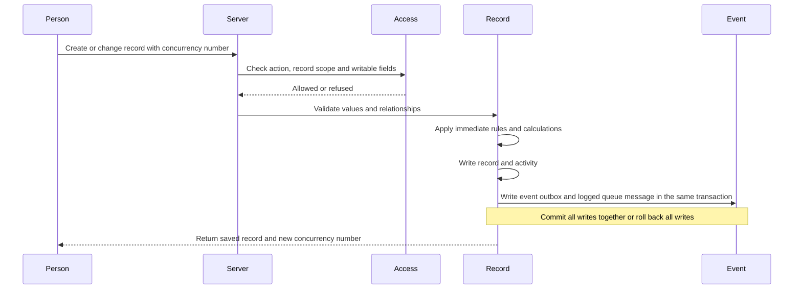
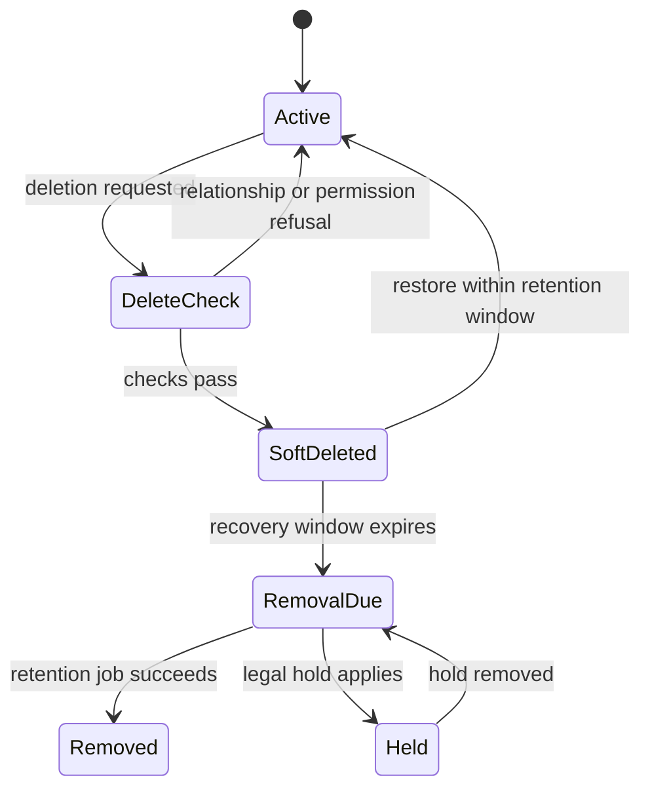

# 6. Records and their lifecycle

[Previous: Modules, fields and relationships](05-modules-fields-and-relationships.md) · [Specification index](README.md) · Next: [Applications, navigation, pages and themes](07-applications-pages-and-themes.md)

## Record identity

A **record** is one organisation-owned instance of a [record type](05-modules-fields-and-relationships.md). Its permanent identifier does not change when its title, owner, application use, or lifecycle state changes.

Every record stores or exposes through one joined system record:

- Organisation identifier.
- Module-root, record-type, and storage-contract identifiers plus the published module version used for validation.
- Permanent record identifier.
- Application-root identifier when the record type is application-contained; it is absent for organisation-shared records.
- Created time and creator.
- Last-changed time, changer, and concurrency number.
- Owner where ownership is enabled.
- Lifecycle state: active, deleted, or pending permanent removal.

Exact columns are defined in the [data contracts](appendices/data-contracts.md#record-storage-contract).

Initial account ownership is the creator; initial Group ownership requires a
selected current membership Group. Protected ownership transfer, account
offboarding, per-record-type lifecycle limits and automatic deadline calculations
follow [record ownership and lifecycle policies](appendices/record-ownership-and-lifecycle.md).
These are required engine behaviours, not ordinary editable system fields.

The record's physical table follows its storage contract, not the name of the organisation, application, module, or record type. Consequently, two organisations can each own an application named CRM without colliding, and CRM and Service Desk can use one organisation-owned Company record without copying it. The complete allocation rule is in [runtime storage](17-runtime-storage-and-caching.md#record-table-allocation).

## Save sequence

The diagram describes runtime collaboration, not a reverse package import.
Record owns this operation; Event implements a required transaction-local
participant, defined by Record and wired by the higher-level application
composition, never an arbitrary callback supplied by a request. Both use the
same existing request transaction. Event cannot commit separately, and a missing
participant cannot be replaced with a successful no-op. The concrete delivery
sequence is recorded in the [installation and save plan](../build-plan/module-record-provisioning.md#package-wiring-and-bounded-delivery).

The save transaction performs these steps in order:

1. Confirm session, organisation account, and [access](04-access-and-permissions.md).
2. Load one published definition set for the full request.
3. Refuse unknown or unwritable fields.
4. Decode and normalize submitted values using their declared types, merge unchanged values and create defaults, and reject malformed or ineligible inputs. Do not reject missing required fields or field-specific value policy before configured rules can supply or correct them.
5. Compare the submitted concurrency number with the current number.
6. Run eligible immediate [rules](08-forms-actions-rules-and-events.md).
7. Run the owning reference-number, calculation and total generators in their declared dependency order. Validate the complete final candidate, including required fields and accumulated rule requirements, choices, currency/precision/row settings, live reference and file eligibility, uniqueness and application bindings. Refuse all writes if final validation fails.
8. Save the record, affected parent totals and revisions, relationship changes, reference number, and matching [activity entries](14-activity-privacy-and-retention.md) in one database transaction. Include both old and new parents when a relationship moves, following the [concrete dependency and locking rules](../build-plan/issue-48-calculation-engine.md). A failed calculation or total refuses the operation without partial changes.
9. Write [events](08-forms-actions-rules-and-events.md#delivery-guarantees) to the outbox and logged queue in that same transaction. Dispatch and external work begin only after commit.
10. Return the fields the person may read and the new concurrency number.

Initial typed decoding and final field-policy validation are two internal stages
of the same Record value handling, not different validators or caller-selectable
validation modes. Only final changed references, choices and files need the
corresponding live checks; intermediate values overwritten by later rules are
not saved. A Require-field node accumulates a check until the final candidate
exists, including any generated value. Explicit Refuse still stops immediately.
See the [save integration plan](../build-plan/issue-47-save-command.md).

This sequence defines one protected Record operation, not a transaction around an entire [Frontend Flow](appendices/frontend-rule-designer.md). A configured flow may run several queries and changes in order. Each protected change opens its own short owning-service transaction and either commits or refuses atomically; a later node failure does not roll back an earlier committed operation. Collecting all inputs before one save remains an available authoring pattern when one atomic Record operation is intended, but it is not mandatory for every journey. [#47](https://github.com/Abzum-NZ/Abzum-Vortex/issues/47) delivered the base ordinary-human create/update implementation over active installed definitions with [hosted Testing acceptance](https://github.com/Abzum-NZ/Abzum-Vortex/issues/47#issuecomment-5656036501). Subsequent #48 stages integrated calculations and relationship totals into the same protected operation. Immediate Rules, deadline-driven recalculation, named-action execution and broader relationships retain their existing owners in the [save plan](../build-plan/issue-47-save-command.md).

### Private recalculation scope

The existing human `SaveRecordCommandV2` remains the closed input for an
ordinary create or update. It deliberately contains no actor, organisation,
Application, installed binding, row-scope, authority declaration or generated
parent mutation. Parsing a valid command is therefore not authority to use it:
it cannot construct private Record scope or private recalculation authority.

The trusted human request boundary resolves the session and selected
organisation/Application into the transaction context before the private Record
adapter runs. Private preparation derives the active installation, concrete
record closure, current Access and RLS-visible rows from that context and locked
database facts; it does not accept a caller-built context, selected parent set,
or caller assertion that a recalculation is authorised. The narrow runtime-role
to request-role setting read occurs only after that private preparation; the
runtime role is restored in a `finally` path before persistence. Any future
factoring must preserve that ordering and restoration.

A missing, stale, foreign, mismatched, or forged context/setting must fail
closed before a private snapshot, relationship source, parent mutation, or
settings-derived calculation is used. In particular, a request role cannot
install trusted context, and an untrusted setting that names another
organisation, account, or Application must not widen RLS scope. These are
scope-construction and ACL/RLS requirements, not an invitation to add another
system-context mechanism.

The focused [#466](https://github.com/Abzum-NZ/Abzum-Vortex/issues/466)
regression retains those existing private seams and proves that a stale Access
version is refused by the composed relationship-total save before it can reach
the locked parent route; no Record, Activity, Event, queue or receipt effect is
created. It adds no System or specified-account execution capability or
attribution. Its independently reviewed Testing revision remains subject to
normal hosted verification before the delivery is closed.

This currently describes ordinary-human attribution only. The Record save
service does not yet invoke a private recalculation as a System or
specified-account actor, and it must not relabel a human context as system or
invent system attribution. A distinct trusted execution identity and its
attribution rules must be designed before any such caller is introduced; they
are not implicit in the current human save path.

The affected private seams are kept explicit: base preparation and save are
[`prepare_base_record_save`](../../supabase/migrations/20260913120000_enable_same_record_calculation_saves.sql#L117-L317)
and [`save_base_record`](../../supabase/migrations/20260913115000_base_protected_record_save.sql#L376-L1008);
the active installation is resolved by
[`read_current_active_installation`](../../supabase/migrations/20260911090000_resolve_reachable_module_dependencies.sql#L944-L1066);
the transaction context is stored and read through
[`request_contexts`](../../supabase/migrations/20260911063404_request_context_transaction_store.sql#L6-L74)
and scope accessors that read the context established once by the owner-only
transaction store, whose initializer refuses replacement:
[`organization_id`](../../supabase/migrations/20260903115546_database_scope_request_role.sql#L334-L342)
and [`application_root_id`](../../supabase/migrations/20260903115546_database_scope_request_role.sql#L344-L352);
and generated record tables enforce their policy at
[`record_storage_provisioning`](../../supabase/migrations/20260908122641_record_storage_provisioning.sql#L638-L663).
Relationship-total preparation, closure and application remain in
[`20260914013000_transactional_relationship_totals.sql`](../../supabase/migrations/20260914013000_transactional_relationship_totals.sql#L11-L818),
while the private Event append retains the human-context boundary in
[`20260913060000_first_private_transactional_event_append.sql`](../../supabase/migrations/20260913060000_first_private_transactional_event_append.sql#L232-L262).
Activity append is
[`append_base_save_activity_internal`](../../supabase/migrations/20260913115000_base_protected_record_save.sql#L71-L179);
the private total catalogue, snapshot, closure and parent application are at
[`20260914013000_transactional_relationship_totals.sql`](../../supabase/migrations/20260914013000_transactional_relationship_totals.sql#L11-L738);
and the two organization-runtime-settings readers are
[`read_current_organization_runtime_settings_internal`](../../supabase/migrations/20260913110000_organization_runtime_settings.sql#L349-L382)
and [`read_current_organization_runtime_settings_for_application`](../../supabase/migrations/20260913110000_organization_runtime_settings.sql#L384-L445).

The present Event `organizationAccountId` UUID, Record receipts, and generated
attribution all assume an account identity. A time-based caller therefore needs
a deliberately defined trusted identity and compatible attribution before it
can exist. This is a prerequisite for [#48](https://github.com/Abzum-NZ/Abzum-Vortex/issues/48),
not a reason to invent a System context in an ordinary-human save.

## Concurrent changes

Every update request includes the last concurrency number the person received; a create request has no existing concurrency number. If the stored number differs, the save is refused as a conflict. Current values may be returned only when current access permits disclosure. The platform never silently overwrites a later change. The exact request and response boundary is the [record save contract](appendices/data-contracts.md#record-save-command-and-result).

Clients may present a comparison and allow the person to reapply their changes. That creates a new request against the current concurrency number.

## Reference numbers

Reference numbers are issued inside the owning record transaction from one
locked counter per organisation, storage contract, field, and application root
when the storage is application-contained. Organisation-shared storage uses a
real application-less scope; it does not substitute a sentinel application.
An omitted published `startingNumber` means `1`, while an explicit positive
integer overrides it. `digits` is a minimum zero-padding width and never
truncates a larger value; published prefix and suffix text are preserved.
Rolled-back allocation rolls back with the record, while a committed transaction
may leave a gap after later permanent removal. Numbers are unique but are not
promised to be continuous.

## Uniqueness

Uniqueness applies within the record type's storage scope. Normalised comparison rules are defined by field type. A database constraint or equivalent transaction-safe mechanism is required; a pre-save query alone is insufficient.

A soft-deleted record continues to reserve every unique value so it can be restored without stealing a value from a newer record. The reservation is released only after permanent removal. A new create or change that tries to use a reserved value is refused with a safe explanation that an archived record holds it; the response does not reveal hidden record content.

## Deletion and restoration

Deletion is initially recoverable.

- Soft-deleted records are excluded from ordinary reads, search, totals, choices, and relationship navigation.
- A deleted record and its directly owned files remain recoverable for the configured recovery period.
- Relationship deletion behaviour from [modules, fields and relationships](05-modules-fields-and-relationships.md) is applied in a deterministic order. Refuse needs no child mutation permission; emptying an optional child link requires current update access to that child, and soft-deleting an exact inherited-owner dependent requires current delete access to that child. Parent delete authority is still required.
- Restore revalidates current restore access and the current published record definition. Before reactivation, every currently required non-link value must still be present, non-null and canonical for its storage type, and every currently required fixed-target link must agree with exactly one retained edge to a locked, active target the person may read. Complete settings and live-reference validation of the final record remains part of the [protected save command](../build-plan/issue-47-save-command.md), not this private lifecycle primitive. Its unique values remain reserved throughout recovery, so restoration cannot conflict with a value accepted during the recovery window.
- Permanent removal follows [privacy and retention](14-activity-privacy-and-retention.md) and records an irreversible-removal receipt without retaining the removed business content.

The private create/delete/restore primitives delivered before the full save
pipeline retain the row and recovery facts but do not decide whether a recovery
window is still open. That policy belongs to the organisation and record-type
lifecycle integration in [#408](https://github.com/Abzum-NZ/Abzum-Vortex/issues/408)
and [#117](https://github.com/Abzum-NZ/Abzum-Vortex/issues/117); their absence is
not treated as an unlimited-retention default.

## Bulk changes

Bulk create, update, delete, restore, import, and export use the same validation and [access](04-access-and-permissions.md) as single-record operations. They process records in bounded batches, return a result per record, can be safely retried, and do not turn one invalid record into an unbounded transaction.

## Sharing lifecycle

A record may become visible to another application or organisation through an [access grant](04-access-and-permissions.md#shared-record-access). The sharing lifecycle does not duplicate or transfer ownership of the record, including when the recipient uses another cluster.

### Grant activation

A cross-organisation access grant becomes active only after the source Access service verifies authorised source and recipient consent over the same complete proposal fingerprint. No editable application record or ordinary workflow can activate it. Activation changes no record fields. In one cluster, both organisations' access versions change in the protected activation transaction. Across clusters, each cluster changes its local access version while exchanging signed consent and activation receipts through the retry-safe [grant reconciliation](17-runtime-storage-and-caching.md#grant-activation-and-reconciliation) contract.

### Grant revocation and expiry

Revoking or expiring a grant removes the recipient's ability to query shared records on its next request. The source grant is authoritative, so a stale recipient mirror cannot preserve access. The recipient removes already rendered values when that check is refused and shows that access ended; it does not preserve a visible or offline snapshot. Source and recipient administrators receive one grant-level notification; the platform does not send one notification per affected record. Activity entries created while the grant was active remain in the source organisation's history and record the acting identity, recipient organisation account, recipient organisation, recipient cluster, and grant.

### Collaborative access

The grant lists each allowed action and readable or changeable field. If it permits a comment, attachment, or field update, that operation follows the same [save sequence](#save-sequence), validation, file checks, activity rules, and source-organisation retention as an owner operation. The recipient cannot create relationships to its own organisation's records, change ownership, delete, restore, administer permissions, or re-share. Export is possible only through the separately approved [shared export](16-copying-sharing-import-export.md#record-export), not as a record mutation.

For the CRM and Service Desk fixture, CRM receives a limited presentation of a Service Desk case rather than the complete case. The grant may allow CRM collaborators to change only `status` and `priority` and to run the shareable public-comment action. Internal notes, attachments, service-level calculations, ownership, deletion, restoration, and sharing administration remain unavailable. Every permitted change saves against the source Service Desk case and is immediately visible in both applications; no summary copy is created.

### Record deletion and shared visibility

Soft-deleting a shared record removes it from recipient queries through the normal lifecycle-state check. Restoring it restores visibility only if the grant is still active and the record still matches its scope. Permanent removal follows the source organisation's [retention](14-activity-privacy-and-retention.md) policy regardless of active grants.

## Acceptance examples

- Two people changing the same version cannot silently overwrite one another.
- A failed save produces neither a changed record nor a committed event.
- A record outside the person's visibility scope is never fetched for display or export.
- A soft-deleted record's unique value cannot be reused until permanent removal releases it.
- A bulk operation reports allowed, refused, invalid, conflict, and completed results separately.
- Approving a sharing grant does not create a copy of the shared records in the target organisation.
- A soft-deleted record is not visible through a cross-organisation grant.
- Activity created by a cross-organisation collaborator records the global identity, recipient organisation account, recipient organisation, source organisation, and grant.
- Revoking a grant preserves its earlier consent decisions and creates a separate revocation record.
- CRM collaboration changes only the fields and actions named by the active Service Desk grant, and the source case remains the single record.
