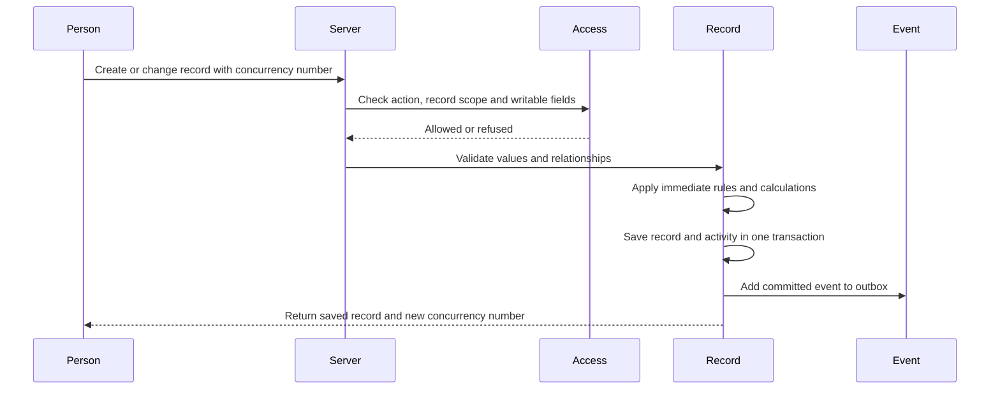
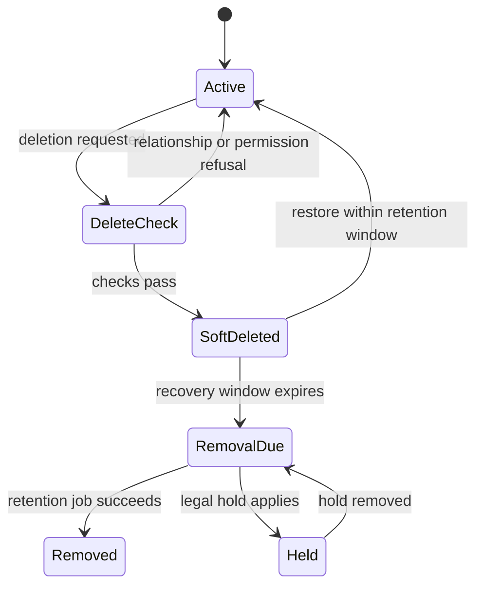

# 6. Records and their lifecycle

[Previous: Modules, fields and relationships](05-modules-fields-and-relationships.md) · [Specification index](README.md) · Next: [Applications, navigation, pages and themes](07-applications-pages-and-themes.md)

## Record identity

A **record** is one organisation-owned instance of a [record type](05-modules-fields-and-relationships.md). Its permanent identifier does not change when its title, owner, application use, or lifecycle state changes.

Every record stores or exposes through one joined system record:

- Organisation identifier.
- Record-type identifier and published module version used for validation.
- Permanent record identifier.
- Storage scope when the record type is application-contained.
- Created time and creator.
- Last-changed time, changer, and concurrency number.
- Owner where ownership is enabled.
- Lifecycle state: active, deleted, or pending permanent removal.

Exact columns are defined in the [data contracts](appendices/data-contracts.md#record-storage-contract).

## Save sequence

The save transaction performs these steps in order:

1. Confirm session, organisation account, and [access](04-access-and-permissions.md).
2. Load one published definition set for the full request.
3. Refuse unknown or unwritable fields.
4. Validate required values, formats, choices, relationships, uniqueness, and application bindings.
5. Compare the submitted concurrency number with the current number.
6. Run eligible immediate [rules](08-forms-actions-rules-and-events.md).
7. Revalidate any values changed by rules.
8. Save the record, relationship changes, reference number, and [activity entry](14-activity-privacy-and-retention.md) in one database transaction.
9. Add committed [events](08-forms-actions-rules-and-events.md) to an outbox in that same transaction.
10. Return the fields the person may read and the new concurrency number.

## Concurrent changes

Every change request includes the last concurrency number the person received. If the stored number differs, the save is refused as a conflict and returns the current readable values. The platform never silently overwrites a later change.

Clients may present a comparison and allow the person to reapply their changes. That creates a new request against the current concurrency number.

## Reference numbers

Reference numbers are issued inside the save transaction from an organisation-and-record-type sequence. A rolled-back transaction may leave a gap. Numbers are unique but are not promised to be continuous.

## Uniqueness

Uniqueness applies within the record type's storage scope. Normalised comparison rules are defined by field type. A database constraint or equivalent transaction-safe mechanism is required; a pre-save query alone is insufficient.

A soft-deleted record continues to reserve every unique value so it can be restored without stealing a value from a newer record. The reservation is released only after permanent removal. A new create or change that tries to use a reserved value is refused with a safe explanation that an archived record holds it; the response does not reveal hidden record content.

## Deletion and restoration

Deletion is initially recoverable.

- Soft-deleted records are excluded from ordinary reads, search, totals, choices, and relationship navigation.
- A deleted record and its directly owned files remain recoverable for the configured recovery period.
- Relationship deletion behaviour from [modules, fields and relationships](05-modules-fields-and-relationships.md) is applied in a deterministic order.
- Restore revalidates required relationships, access, and the current published record definition. Its unique values remain reserved throughout recovery, so restoration cannot conflict with a value accepted during the recovery window.
- Permanent removal follows [privacy and retention](14-activity-privacy-and-retention.md) and records an irreversible-removal receipt without retaining the removed business content.

## Bulk changes

Bulk create, update, delete, restore, import, and export use the same validation and [access](04-access-and-permissions.md) as single-record operations. They process records in bounded batches, return a result per record, can be safely retried, and do not turn one invalid record into an unbounded transaction.

## Sharing lifecycle

A record may become visible to another application or organisation through an [access grant](04-access-and-permissions.md#shared-record-access). The sharing lifecycle does not duplicate or transfer ownership of the record, including when the recipient uses another cluster.

### Grant activation

A cross-organisation access grant becomes active only after the source Access service verifies one authorised source approval and one authorised recipient acceptance over the same complete proposal fingerprint. No editable approval record or ordinary workflow can activate it. Activation changes no record fields. In one cluster, both organisations' access versions change in the protected activation transaction. Across clusters, each cluster changes its local access version while exchanging signed acceptance and activation receipts through the retry-safe [grant reconciliation](17-runtime-storage-and-caching.md#grant-activation-and-reconciliation) contract.

### Grant revocation and expiry

Revoking or expiring a grant removes the recipient's ability to query shared records on its next request. The source grant is authoritative, so a stale recipient mirror cannot preserve access. Source and recipient administrators receive one grant-level notification; the platform does not send one notification per affected record. Activity entries created while the grant was active remain in the source organisation's history and record the acting identity, recipient organisation account, recipient organisation, recipient cluster, and grant.

### Collaborative access

The grant lists each allowed action and readable or changeable field. If it permits a comment, attachment, or field update, that operation follows the same [save sequence](#save-sequence), validation, file checks, activity rules, and source-organisation retention as an owner operation. The recipient cannot create relationships to its own organisation's records, change ownership, delete, restore, administer permissions, or re-share. Export is possible only through the separately approved [shared export](16-copying-sharing-import-export.md#record-export), not as a record mutation.

### Record deletion and shared visibility

Soft-deleting a shared record removes it from recipient queries through the normal lifecycle-state check. Restoring it restores visibility only if the grant is still active and the record still matches its scope. Permanent removal follows the source organisation's [retention](14-activity-privacy-and-retention.md) policy regardless of active grants.

## Acceptance examples

- Two people changing the same version cannot silently overwrite one another.
- A failed save produces neither a changed record nor a committed event.
- A record outside the person's visibility scope is never fetched for display or export.
- A soft-deleted record's unique value cannot be reused until permanent removal releases it.
- A bulk operation reports allowed, refused, invalid, conflict, and completed results separately.
- Approving a sharing grant does not create a copy of the shared records in the target organisation.
- A soft-deleted record is not visible through a cross-organisation grant.
- Activity created by a cross-organisation collaborator records the global identity, recipient organisation account, recipient organisation, source organisation, and grant.
- Revoking a grant preserves its earlier approval decisions and creates a separate revocation record.
