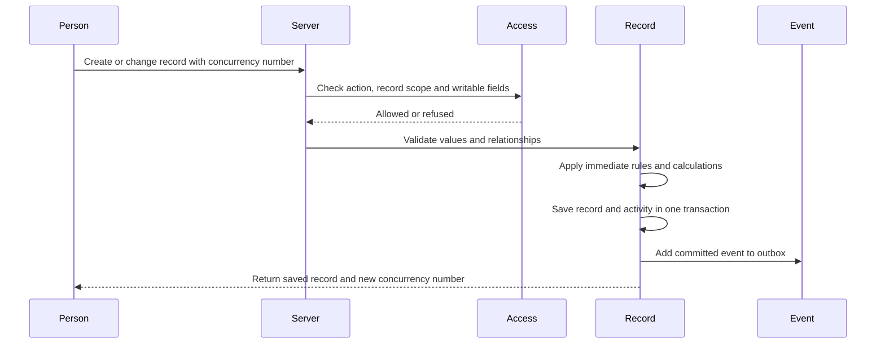
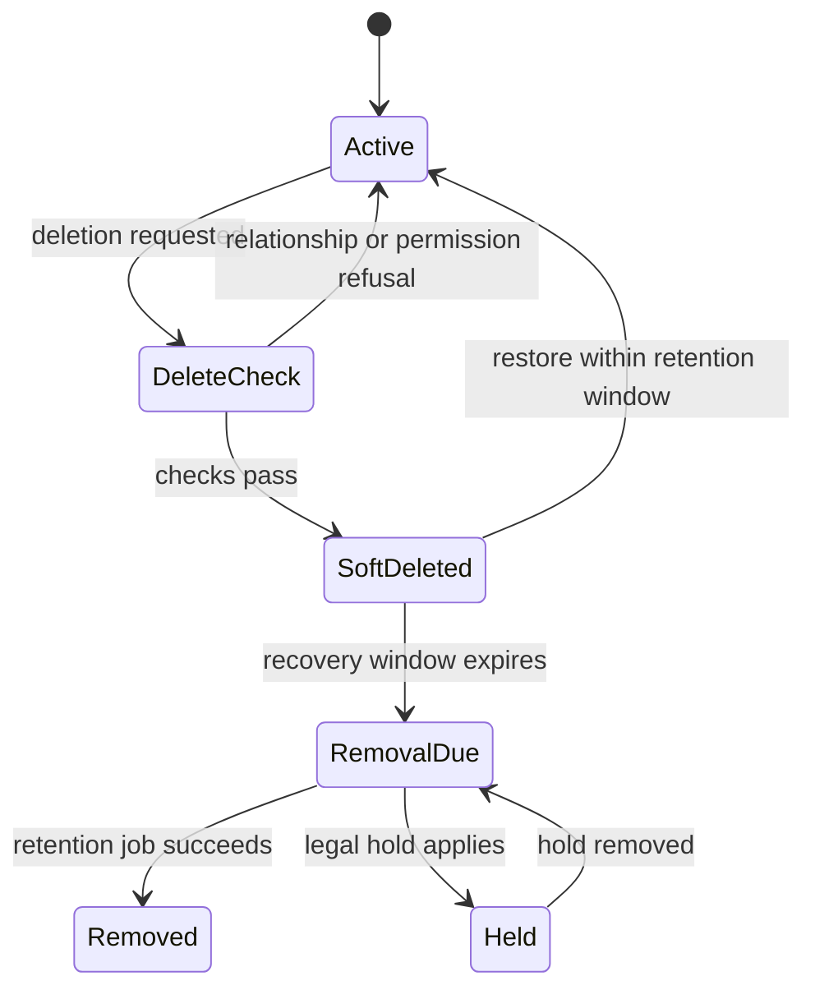

# 6. Records and their lifecycle

[Previous: Modules, fields and relationships](05-modules-fields-and-relationships.md) · [Specification index](README.md) · Next: [Applications, navigation, pages and themes](07-applications-pages-and-themes.md)

## Record identity

A **record** is one organisation-owned instance of a [record type](05-modules-fields-and-relationships.md). Its permanent identifier does not change when its title, owner, application use, or lifecycle state changes.

Every record stores or exposes through one joined system record:

- Organisation identifier.
- Record-type identifier and published module version used for validation.
- Permanent record identifier.
- Storage scope when the record type is application-contained.
- Created time and creator.
- Last-changed time, changer, and concurrency number.
- Owner where ownership is enabled.
- Lifecycle state: active, deleted, or pending permanent removal.

Exact columns are defined in the [data contracts](appendices/data-contracts.md#record-storage-contract).

## Save sequence

The save transaction performs these steps in order:

1. Confirm session, organisation, membership, and [access](04-access-and-permissions.md).
2. Load one published definition set for the full request.
3. Refuse unknown or unwritable fields.
4. Validate required values, formats, choices, relationships, uniqueness, and application bindings.
5. Compare the submitted concurrency number with the current number.
6. Run eligible immediate [rules](08-forms-actions-rules-and-events.md).
7. Revalidate any values changed by rules.
8. Save the record, relationship changes, reference number, and [activity entry](14-activity-privacy-and-retention.md) in one database transaction.
9. Add committed [events](08-forms-actions-rules-and-events.md) to an outbox in that same transaction.
10. Return the fields the person may read and the new concurrency number.

## Concurrent changes

Every change request includes the last concurrency number the person received. If the stored number differs, the save is refused as a conflict and returns the current readable values. The platform never silently overwrites a later change.

Clients may present a comparison and allow the person to reapply their changes. That creates a new request against the current concurrency number.

## Reference numbers

Reference numbers are issued inside the save transaction from an organisation-and-record-type sequence. A rolled-back transaction may leave a gap. Numbers are unique but are not promised to be continuous.

## Uniqueness

Uniqueness applies within the record type's storage scope. Normalised comparison rules are defined by field type. A database constraint or equivalent transaction-safe mechanism is required; a pre-save query alone is insufficient.

The treatment of soft-deleted values and restoration conflicts is [Decision D10](appendices/decisions.md#d10-uniqueness-and-restoration).

## Deletion and restoration

Deletion is initially recoverable.

- Soft-deleted records are excluded from ordinary reads, search, totals, choices, and relationship navigation.
- A deleted record and its directly owned files remain recoverable for the configured recovery period.
- Relationship deletion behaviour from [modules, fields and relationships](05-modules-fields-and-relationships.md) is applied in a deterministic order.
- Restore revalidates uniqueness, required relationships, access, and the current published record definition.
- Permanent removal follows [privacy and retention](14-activity-privacy-and-retention.md) and records an irreversible-removal receipt without retaining the removed business content.

## Bulk changes

Bulk create, update, delete, restore, import, and export use the same validation and [access](04-access-and-permissions.md) as single-record operations. They process records in bounded batches, return a result per record, can be safely retried, and do not turn one invalid record into an unbounded transaction.

## Acceptance examples

- Two people changing the same version cannot silently overwrite one another.
- A failed save produces neither a changed record nor a committed event.
- A record outside the person's visibility scope is never fetched for display or export.
- Restoring a record that conflicts with a current unique value follows the selected [restoration policy](appendices/decisions.md#d10-uniqueness-and-restoration).
- A bulk operation reports allowed, refused, invalid, conflict, and completed results separately.
